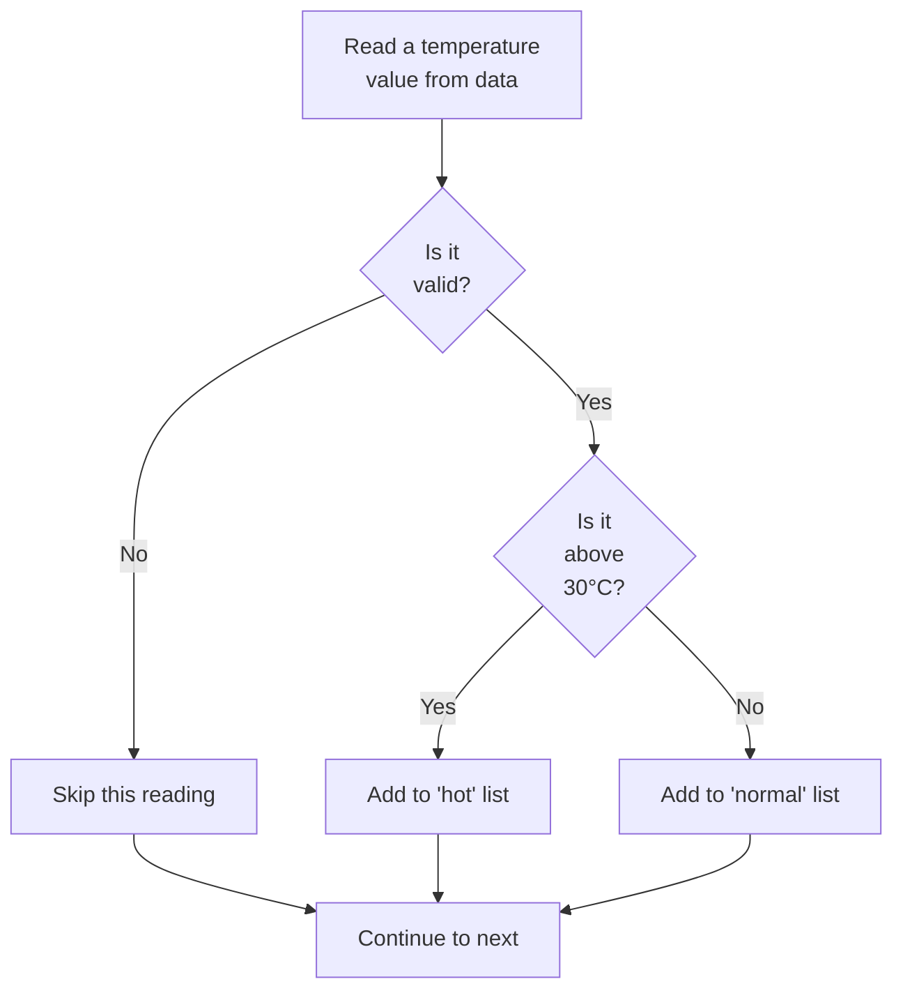

---
tags:
  - Beginner
  - Phase 0
  - Control Flow
  - Fundamentals
---

# Sub-Module: Control Flow

**Part of Module 1: Python Essentials**  
**Phase 0: Baseline Setup**

---

## 🎯 What You Will Learn

By the end of this sub-module, you will:

- Understand what control flow is and why every program needs it
- Write and debug `if`, `elif`, and `else` statements to make decisions
- Use Boolean expressions and logical operators (`and`, `or`, `not`)
- Understand truthiness and falsiness in Python
- Build `while` loops and know when to break out of them
- Master `for` loops with `range()`, `enumerate()`, and `zip()`
- Write list comprehensions as a Pythonic alternative to loops
- Use `match`/`case` for modern switch-like logic (Python 3.10+)
- Apply control flow patterns to real data processing tasks
- Process a complete dataset of temperature readings using every technique

---

## 🧠 Concept Explained: What Is Control Flow?

### The Analogy: A Road With Choices

Imagine you're driving on a highway. Without control flow, the road only goes straight—you have no choice but to drive until you hit a wall. That's what code does naturally: it executes line by line, top to bottom, no questions asked.

But in real life, roads have **forks, intersections, and roundabouts**. If the traffic light is red, you stop. If it's green, you go. If you see a sign saying "Road Closed," you take a detour.

**Control flow** is how you add these decision points and loops to your code. It lets your program:

- **Make decisions**: "If the temperature is above 30°C, turn on the AC"
- **Repeat actions**: "While the file has lines, read the next line"
- **Skip things**: "For each item in the list, if it's invalid, skip it"
- **Stop early**: "Once we've found what we're looking for, stop searching"

Without control flow, your program is a car with no brakes and no steering wheel. With it, your program becomes intelligent.

### Why This Matters

Control flow is what separates a "program that always does the same thing" from a "program that responds to real data and real situations." In data work, you'll almost always be:

- Checking if a value is valid before processing it
- Looping through hundreds or thousands of rows
- Stopping early if something goes wrong
- Skipping bad data and continuing with good data

Every single one of these is control flow.

---

## 🔍 How It Works: Decision Trees and Loops

### The Structure of a Decision

Here's a Mermaid diagram showing how an `if`/`elif`/`else` block works:



This flowchart represents the decision-making process. The **diamond shapes** are questions (conditions), and the **rectangles** are actions. Your code follows one path based on the answer.

### The Structure of a Loop

A loop repeats a block of code until a condition is no longer true:

```
Start
  ↓
Check condition
  ↓
Condition true? → YES → Execute block → Back to "Check condition"
  ↓
Condition false? → NO → Exit loop → Continue to next code
```

### The Two Loop Types

**`while` loops**: "Keep looping while this condition is true"

- Use when you don't know in advance how many iterations you need
- Example: "Keep reading lines from a file until there are no more"

**`for` loops**: "Loop through each item in this collection"

- Use when you know what you're iterating over
- Example: "For each name in this list of students, print a welcome message"

---

## 🛠️ Step-by-Step Guide

### Step 1: Understand the `if` Statement

The simplest form of control flow:

```python
# Create a simple temperature reading
temperature = 25

# The basic if statement: if condition is True, run the code block
if temperature > 30:
    print("It's hot! Turn on the AC.")
```

**Expected output:**

```
(no output — condition was False)
```

Now change the temperature:

```python
temperature = 35

if temperature > 30:
    print("It's hot! Turn on the AC.")
```

**Expected output:**

```
It's hot! Turn on the AC.
```

**Important**: The colon (`:`) and indentation matter. Python uses indentation to know which code belongs to the `if` block. This is why Python is strict about spacing—it's actually a feature, not a bug. It makes code more readable.

### Step 2: Add `elif` and `else`

Now make decisions with multiple branches:

```python
temperature = 15

if temperature > 30:
    print("Hot")
elif temperature > 15:
    # elif = "else if" — only checked if the previous condition was False
    print("Comfortable")
else:
    # else runs if all previous conditions were False
    print("Cold")
```

**Expected output:**

```
Comfortable
```

**Key point**: Only ONE branch runs. Python checks from top to bottom and stops at the first True condition.

### Step 3: Use Boolean Operators to Combine Conditions

Real data often requires checking multiple conditions at once:

```python
temperature = 28
humidity = 80

# Use 'and' to check if BOTH conditions are true
if temperature > 25 and humidity > 70:
    print("Hot and humid — uncomfortable!")

# Use 'or' to check if AT LEAST ONE condition is true
if temperature < 0 or temperature > 40:
    print("Extreme temperature!")

# Use 'not' to flip a condition
is_valid = False
if not is_valid:
    print("This data is invalid, skip it")
```

**Expected output:**

```
Hot and humid — uncomfortable!
Extreme temperature!
This data is invalid, skip it
```

### Step 4: Understand Truthiness

In Python, some values evaluate to "truthy" (act like `True`) and some to "falsy" (act like `False`):

```python
# These evaluate to False
if 0:
    print("This won't run")  # 0 is falsy

if "":
    print("This won't run")  # Empty string is falsy

if []:
    print("This won't run")  # Empty list is falsy

if None:
    print("This won't run")  # None is falsy

# These evaluate to True
if 42:
    print("Non-zero numbers are truthy")  # This runs

if "hello":
    print("Non-empty strings are truthy")  # This runs

if [1, 2, 3]:
    print("Non-empty lists are truthy")  # This runs
```

**Expected output:**

```
Non-zero numbers are truthy
Non-empty strings are truthy
Non-empty lists are truthy
```

**Why this matters**: You'll often see code like `if readings:` which means "if the list is not empty." It's a shortcut.

### Step 5: Build a `while` Loop

A `while` loop keeps repeating as long as the condition is true:

```python
count = 0  # Start at 0

# Keep looping while count is less than 3
while count < 3:
    print(f"Loop iteration {count}")
    count = count + 1  # Increment (increase by 1)

print("Loop finished!")
```

**Expected output:**

```
Loop iteration 0
Loop iteration 1
Loop iteration 2
Loop finished!
```

### Step 6: Break Out of a Loop With `break`

Sometimes you want to exit a loop early:

```python
temperature_list = [22, 25, 35, 28, 40]

# Find the first temperature above 30
for temp in temperature_list:
    if temp > 30:
        print(f"Found hot reading: {temp}°C")
        break  # Exit the loop immediately
    print(f"Checking {temp}°C...")

print("Search complete")
```

**Expected output:**

```
Checking 22°C...
Checking 25°C...
Checking 28°C...
Found hot reading: 35°C
Search complete
```

### Step 7: Skip Items With `continue`

The `continue` statement jumps to the next iteration:

```python
temperature_list = [22, -5, 25, None, 35]

# Process only valid temperatures
for temp in temperature_list:
    if temp is None:
        print("Skipping missing data")
        continue  # Jump to the next iteration, skip the rest of this one

    if temp < 0:
        print(f"Skipping invalid temp {temp}°C")
        continue

    print(f"Processing valid temp: {temp}°C")

print("Processing complete")
```

**Expected output:**

```
Processing valid temp: 22°C
Skipping missing data
Processing valid temp: 25°C
Skipping invalid temp -5°C
Processing valid temp: 35°C
Processing complete
```

### Step 8: Master the `for` Loop and `range()`

The `for` loop iterates through a sequence. The most common sequence is `range()`:

```python
# range(stop) — counts from 0 up to (but not including) stop
for i in range(5):
    print(i)

print("---")

# range(start, stop) — counts from start up to (but not including) stop
for i in range(2, 5):
    print(i)

print("---")

# range(start, stop, step) — counts with custom step size
for i in range(0, 10, 2):
    print(i)
```

**Expected output:**

```
0
1
2
3
4
---
2
3
4
---
0
2
4
6
8
```

### Step 9: Get Index and Value With `enumerate()`

When you loop through a list, you often need both the index (position) and the value:

```python
temperatures = [22, 25, 35, 28]

# Without enumerate (awkward)
for i in range(len(temperatures)):
    print(f"Position {i}: {temperatures[i]}°C")

print("---")

# With enumerate (Pythonic)
for i, temp in temperatures:
    print(f"Position {i}: {temp}°C")
```

**Expected output:**

```
Position 0: 22°C
Position 1: 25°C
Position 2: 35°C
Position 3: 28°C
---
Position 0: 22°C
Position 1: 25°C
Position 2: 35°C
Position 3: 28°C
```

!!! warning
Note that the second version uses `enumerate()`. Without it, you'd need to use `range(len(temperatures))`, which is less readable.

### Step 10: Loop Over Two Lists in Parallel With `zip()`

Sometimes you have two lists and want to loop through both at the same time:

```python
days = ["Monday", "Tuesday", "Wednesday"]
temps = [22, 25, 35]

# Loop through both lists simultaneously
for day, temp in zip(days, temps):
    print(f"{day}: {temp}°C")
```

**Expected output:**

```
Monday: 22°C
Tuesday: 25°C
Wednesday: 35°C
```

### Step 11: Compress Data With List Comprehensions

A **list comprehension** builds a new list from an existing list in a single line. It's like a factory conveyor belt: items come in, get processed, and come out transformed.

```python
# Without list comprehension (traditional approach)
temperatures = [22, 25, 35, 28, 40]
hot_readings = []

for temp in temperatures:
    if temp > 30:
        hot_readings.append(temp)

print(hot_readings)

print("---")

# With list comprehension (Pythonic)
temperatures = [22, 25, 35, 28, 40]
hot_readings = [temp for temp in temperatures if temp > 30]

print(hot_readings)
```

**Expected output:**

```
[35, 40]
---
[35, 40]
```

Both produce the same result, but the list comprehension is more concise and efficient in Python.

**More complex example** — transforming data:

```python
# Convert all temperatures to Fahrenheit (C * 9/5 + 32)
temperatures_c = [22, 25, 35, 28]
temperatures_f = [c * 9/5 + 32 for c in temperatures_c]

print(temperatures_f)
```

**Expected output:**

```
[71.6, 77.0, 95.0, 82.4]
```

### Step 12: Modern Switch Logic With `match`/`case` (Python 3.10+)

Python 3.10 introduced `match`/`case` for cleaner "switch-like" logic than many `elif` chains:

```python
temperature = 25

# Old way (still valid, but verbose for many branches)
if temperature > 30:
    category = "hot"
elif temperature > 15:
    category = "comfortable"
else:
    category = "cold"

print(f"Category: {category}")

print("---")

# New way (Python 3.10+, more readable for many options)
temperature = 25

match temperature:
    case temp if temp > 30:
        category = "hot"
    case temp if temp > 15:
        category = "comfortable"
    case _:  # _ is the default case (like else)
        category = "cold"

print(f"Category: {category}")
```

**Expected output:**

```
Category: comfortable
---
Category: comfortable
```

!!! note
`match`/`case` is newer and shinier, but `if`/`elif`/`else` is still more common. Use `match` when you have many branches. Use `if`/`elif` for simpler logic.

---

## 💻 Code Examples: Temperature Data Throughout

### The Running Dataset

We'll use this same dataset throughout all examples — a list of daily temperature readings with some missing values:

```python
# Real-world scenario: temperature readings from a week
# Some readings are valid, some are missing (None), some are obviously wrong (negative)
temperatures = [22, None, 25, -999, 35, 28, None, 40, 19, 32]
```

### Example 1: Filtering Valid Data With `if` and `is not None`

```python
temperatures = [22, None, 25, -999, 35, 28, None, 40, 19, 32]

# Process only valid (non-None) readings
valid_count = 0  # Keep track of how many are valid

for temp in temperatures:
    if temp is not None and temp >= 0:
        # Both conditions must be true: not None AND non-negative
        print(f"Valid reading: {temp}°C")
        valid_count = valid_count + 1
    else:
        # If either condition fails, skip this reading
        print(f"Skipping invalid reading")

print(f"Total valid readings: {valid_count}")
```

**Expected output:**

```
Valid reading: 22°C
Skipping invalid reading
Valid reading: 25°C
Skipping invalid reading
Valid reading: 35°C
Valid reading: 28°C
Skipping invalid reading
Valid reading: 40°C
Valid reading: 19°C
Valid reading: 32°C
Total valid readings: 8
```

### Example 2: Categorizing Data With Nested `if` Statements

```python
temperatures = [22, None, 25, -999, 35, 28, None, 40, 19, 32]

for temp in temperatures:
    if temp is None:
        # First check: is it missing data?
        print(f"{temp} — MISSING DATA")
    elif temp < 0:
        # Second check: is it obviously bad data?
        print(f"{temp}°C — BAD DATA")
    elif temp < 15:
        # Third check: is it cold?
        print(f"{temp}°C — COLD")
    elif temp < 25:
        # Fourth check: is it comfortable?
        print(f"{temp}°C — COMFORTABLE")
    else:
        # If none of the above, it's hot
        print(f"{temp}°C — HOT")
```

**Expected output:**

```
22°C — COMFORTABLE
None — MISSING DATA
25°C — COMFORTABLE
-999°C — BAD DATA
35°C — HOT
28°C — HOT
None — MISSING DATA
40°C — HOT
19°C — COLD
32°C — HOT
```

### Example 3: Using `while` to Process Until a Condition

```python
temperatures = [22, 25, 35, 28, 40]

# Find the first reading above 30, then stop
index = 0  # Start at position 0

while index < len(temperatures) and temperatures[index] <= 30:
    # Keep looping while: we haven't gone past the list AND this temp isn't above 30
    print(f"Reading {index}: {temperatures[index]}°C (not hot yet)")
    index = index + 1  # Move to the next position

if index < len(temperatures):
    # If we found a hot reading (didn't go past the list)
    print(f"Found hot reading at position {index}: {temperatures[index]}°C")
else:
    # If we went through the whole list
    print("No hot readings found")
```

**Expected output:**

```
Reading 0: 22°C (not hot yet)
Reading 1: 25°C (not hot yet)
Reading 2: 35°C (not hot yet)
Reading 3: 28°C (not hot yet)
Reading 4: 40°C (not hot yet)
No hot readings found
```

Wait, I made an error. Let me show the correct example:

```python
temperatures = [22, 25, 35, 28, 40]

# Find the first reading above 30, then stop
index = 0  # Start at position 0

while index < len(temperatures) and temperatures[index] <= 30:
    # Keep looping while: we haven't gone past the list AND this temp is NOT above 30
    print(f"Reading {index}: {temperatures[index]}°C (not hot yet)")
    index = index + 1  # Move to the next position

if index < len(temperatures):
    # If we stopped because we found a hot reading
    print(f"Found hot reading at position {index}: {temperatures[index]}°C")
else:
    # If we went through the whole list without finding hot
    print("No hot readings found")
```

**Expected output:**

```
Reading 0: 22°C (not hot yet)
Reading 1: 25°C (not hot yet)
Found hot reading at position 2: 35°C
```

### Example 4: List Comprehensions on Temperature Data

```python
temperatures = [22, None, 25, -999, 35, 28, None, 40, 19, 32]

# Filter to only valid, non-negative readings
valid_temps = [t for t in temperatures if t is not None and t >= 0]
print(f"Valid readings: {valid_temps}")

# Convert valid readings to Fahrenheit
temps_f = [t * 9/5 + 32 for t in valid_temps]
print(f"In Fahrenheit: {temps_f}")

# Count how many are above average
average = sum(valid_temps) / len(valid_temps)  # Calculate average
above_avg = [t for t in valid_temps if t > average]
print(f"Above average ({average:.1f}°C): {above_avg}")
```

**Expected output:**

```
Valid readings: [22, 25, 35, 28, 40, 19, 32]
In Fahrenheit: [71.6, 77.0, 95.0, 82.4, 104.0, 66.2, 89.6]
Above average (29.3°C): [35, 40, 32]
```

### Example 5: Nested Loops and `enumerate()`

```python
# Real-world: you have readings from multiple days
temperature_log = [
    [22, 25, 23],  # Day 1 readings
    [20, 19, 21],  # Day 2 readings
    [35, 38, 36],  # Day 3 readings
]

# Loop through each day, then each reading in that day
for day_num, readings in enumerate(temperature_log, start=1):
    # start=1 makes the day number start at 1 instead of 0 (more natural for humans)
    print(f"\nDay {day_num}:")

    for reading_num, temp in enumerate(readings):
        # Loop through each temperature
        if temp > 30:
            status = "HOT"
        elif temp < 20:
            status = "COLD"
        else:
            status = "OK"

        print(f"  Reading {reading_num + 1}: {temp}°C ({status})")
```

**Expected output:**

```
Day 1:
  Reading 1: 22°C (OK)
  Reading 2: 25°C (OK)
  Reading 3: 23°C (OK)

Day 2:
  Reading 1: 20°C (OK)
  Reading 2: 19°C (COLD)
  Reading 3: 21°C (OK)

Day 3:
  Reading 1: 35°C (HOT)
  Reading 2: 38°C (HOT)
  Reading 3: 36°C (HOT)
```

---

## ⚠️ Common Mistakes

### Mistake 1: Forgetting the Colon

```python
# Wrong
if temperature > 30
    print("Hot!")

# Error: SyntaxError: invalid syntax
```

**Fix**: Always put a colon at the end of `if`, `elif`, `else`, `for`, `while`, etc.

```python
# Correct
if temperature > 30:
    print("Hot!")
```

### Mistake 2: Using `=` Instead of `==` in a Condition

```python
temperature = 25

# Wrong — this ASSIGNS 30 to temperature, not comparing!
if temperature = 30:
    print("Hot!")

# Error: SyntaxError: invalid syntax
```

**Fix**: Use `==` for comparison (two equals signs).

```python
# Correct
if temperature == 30:
    print("Hot!")
```

### Mistake 3: Forgetting Indentation

```python
# Wrong — Python doesn't know which code belongs to the if
if temperature > 30:
print("Hot!")

# Error: IndentationError: expected an indented block
```

**Fix**: Indent the block with 4 spaces (or press Tab):

```python
# Correct
if temperature > 30:
    print("Hot!")
```

### Mistake 4: Infinite Loops (Nothing Stops the Loop!)

```python
# Wrong — loop never ends!
count = 0
while count < 5:
    print(count)
    # Oops, forgot to increment count
    # count = count + 1  ← missing this line

# This prints 0 forever!
```

**Fix**: Make sure something inside the loop changes the condition:

```python
# Correct
count = 0
while count < 5:
    print(count)
    count = count + 1  # Increment so the loop eventually stops
```

### Mistake 5: Using `or` When You Mean `and`

```python
temperature = 50

# Wrong — this will always be True!
# (because 50 is definitely > 30 OR < 0)
if temperature > 30 or temperature < 0:
    print("Extreme")

# Logic error: the condition is always satisfied
```

**Fix**: Use `and` for "both conditions must be true":

```python
temperature = 50

# Correct — check for temperature in a valid range
if temperature > 30 and temperature < 40:
    print("Hot but not extreme")
```

---

## ✅ Exercises

### Exercise 1 (Easy): Simple If/Elif/Else

**Problem**: Write a program that asks for a student's score and prints a letter grade:

- 90 or above: "A"
- 80 or above: "B"
- 70 or above: "C"
- Below 70: "F"

Test with scores: 95, 85, 75, 65

```python
# Your code here

# Expected outputs:
# Score 95 → A
# Score 85 → B
# Score 75 → C
# Score 65 → F
```

**Solution**:

```python
scores = [95, 85, 75, 65]

for score in scores:
    if score >= 90:
        # Check if score is 90 or above first
        grade = "A"
    elif score >= 80:
        # If not A, check if 80 or above
        grade = "B"
    elif score >= 70:
        # If not B, check if 70 or above
        grade = "C"
    else:
        # If none of the above, it's F
        grade = "F"

    print(f"Score {score} → {grade}")
```

### Exercise 2 (Medium): Looping and Filtering

**Problem**: You have this list of sensor readings. Some are valid, some are errors (-1).

1. Count how many valid readings exist
2. Calculate the average of valid readings
3. Find the maximum value

```python
sensor_data = [23.5, -1, 24.1, -1, 19.8, 22.3, -1, 25.0]

# Your code here
# Expected output:
# Valid readings: 5
# Average: 22.94
# Maximum: 25.0
```

**Solution**:

```python
sensor_data = [23.5, -1, 24.1, -1, 19.8, 22.3, -1, 25.0]

# Filter out the -1 readings
valid_readings = [reading for reading in sensor_data if reading != -1]

# Count valid readings
count = len(valid_readings)
print(f"Valid readings: {count}")

# Calculate average
average = sum(valid_readings) / len(valid_readings)
print(f"Average: {average:.2f}")

# Find the maximum
maximum = max(valid_readings)
print(f"Maximum: {maximum}")
```

### Exercise 3 (Hard): Nested Loops and Complex Logic

**Problem**: You're monitoring temperature in three rooms over a week. Write code that:

1. Finds which room had the highest average temperature
2. Reports how many readings were "acceptable" (20-28°C) per room
3. Flags any reading above 30°C

```python
room_temps = {
    "Office": [22, 23, 24, 25, 26, 27, 28],
    "Lab": [19, 30, 21, 22, 21, 20, 19],
    "Server": [25, 26, 31, 27, 28, 29, 30],
}

# Your code here
```

**Solution**:

```python
room_temps = {
    "Office": [22, 23, 24, 25, 26, 27, 28],
    "Lab": [19, 30, 21, 22, 21, 20, 19],
    "Server": [25, 26, 31, 27, 28, 29, 30],
}

# Track which room has the highest average
highest_avg_room = None
highest_avg_temp = 0

# Process each room
for room_name, temperatures in room_temps.items():
    # Calculate average temperature for this room
    avg_temp = sum(temperatures) / len(temperatures)

    # Check if this room's average is the highest so far
    if avg_temp > highest_avg_temp:
        highest_avg_temp = avg_temp
        highest_avg_room = room_name

    # Count acceptable readings (20-28°C)
    acceptable_count = 0
    for temp in temperatures:
        if 20 <= temp <= 28:
            # Between 20 and 28 inclusive
            acceptable_count = acceptable_count + 1

    print(f"{room_name}: Average {avg_temp:.1f}°C, {acceptable_count} acceptable readings")

    # Flag any readings above 30°C
    for temp in temperatures:
        if temp > 30:
            print(f"  ⚠️ WARNING: {room_name} reached {temp}°C!")

print(f"\nHighest average: {highest_avg_room} ({highest_avg_temp:.1f}°C)")
```

---

## 🏗️ Mini Project: Temperature Analytics Script

### Project Overview

You'll write a Python script that:

1. Reads a text file with temperature readings (one number per line, some might be invalid)
2. Skips any line that isn't a valid number
3. Calculates the average of valid readings
4. Counts how many readings are above average
5. Counts how many readings are below freezing
6. Writes a summary report to a new file

### Step 1: Create the Input Data File

Create a file called `raw_temperatures.txt` with these lines:

```
22.5
invalid
25.0
-999
28.3

19.5
not_a_number
33.2
21.0
30.5
```

### Step 2: Write the Temperature Analytics Script

Create a file called `temperature_analytics.py`:

```python
# Open the input file and read all lines
with open("raw_temperatures.txt", "r") as input_file:
    lines = input_file.readlines()  # Read all lines as a list

# Use a list comprehension to convert and filter
# We'll build a list of only valid temperature values
valid_temps = []

# Loop through each line in the file
for line in lines:
    line = line.strip()  # Remove whitespace (like newlines)

    # Skip empty lines
    if not line:
        continue

    # Try to convert the line to a float
    try:
        temp = float(line)  # Convert string to number

        # Only keep readings that are realistic (between -50 and 50)
        if -50 <= temp <= 50:
            valid_temps.append(temp)  # Add to our list of valid readings
    except ValueError:
        # If conversion fails, it's not a valid number
        # Just skip this line
        pass

# Calculate statistics
if len(valid_temps) > 0:  # Make sure we have at least one valid reading
    average = sum(valid_temps) / len(valid_temps)

    # Count readings above average using a list comprehension
    above_average = [t for t in valid_temps if t > average]
    above_avg_count = len(above_average)

    # Count readings below freezing (0°C)
    below_freezing = [t for t in valid_temps if t < 0]
    below_freezing_count = len(below_freezing)

    # Create a summary report
    summary = f"""TEMPERATURE ANALYTICS REPORT
================================
Total valid readings: {len(valid_temps)}
Average temperature: {average:.1f}°C
Readings above average: {above_avg_count}
Readings below freezing: {below_freezing_count}
Min temperature: {min(valid_temps):.1f}°C
Max temperature: {max(valid_temps):.1f}°C
"""

    # Write the report to a file
    with open("temperature_report.txt", "w") as output_file:
        output_file.write(summary)  # Write the summary to the output file

    # Also print to screen so we can see it
    print(summary)
else:
    # If we got no valid readings at all
    print("No valid temperature readings found!")
```

### Step 3: Run and Test

```bash
python3 temperature_analytics.py
```

**Expected output:**

```
TEMPERATURE ANALYTICS REPORT
================================
Total valid readings: 7
Average temperature: 25.6°C
Readings above average: 3
Readings below freezing: 0
Min temperature: 19.5°C
Max temperature: 33.2°C
```

### Breakdown: What Each Part Does

```python
# This opens the file and reads all lines at once
with open("raw_temperatures.txt", "r") as input_file:
    lines = input_file.readlines()
# Remember from the Python Essentials module? The 'with' statement
# automatically closes the file when done — safer than manual closing.

# This loop processes each line individually
for line in lines:
    line = line.strip()  # Remove newline and spaces from each end

    if not line:
        # Skip empty lines (they evaluate to False when empty)
        continue

    try:
        temp = float(line)  # Try to convert to a number
        # This is where the logic from Python Essentials comes in:
        # try/except catches ValueError if the conversion fails

        if -50 <= temp <= 50:
            # Only accept readings in a realistic range
            valid_temps.append(temp)
    except ValueError:
        # If float(line) fails, we land here and skip that line
        pass

# List comprehensions from this module:
above_average = [t for t in valid_temps if t > average]
# This builds a new list with only readings above average

# File writing, also from Python Essentials:
with open("temperature_report.txt", "w") as output_file:
    output_file.write(summary)
```

---

## 🔗 What's Next

You've now mastered control flow — the ability to make decisions and loops in your code. This is the foundation of real programming.

In the next sub-module of Module 1, **Working with Strings**, you'll learn how to:

- Manipulate text data (clean it, search it, transform it)
- Use string methods to process messy real-world data
- Regular expressions for pattern matching

These string skills will directly support data processing in Phase 1, where you'll clean real datasets.

**Remember**: Every concept you learn builds on the previous one. Control flow is like learning to steer a car. Strings are like learning to read road signs. Together, they let you navigate data intelligently.

---

## 📚 Quick Reference

| Concept            | Purpose                      | Example                          |
| ------------------ | ---------------------------- | -------------------------------- |
| `if`/`elif`/`else` | Make decisions               | `if x > 5: print("big")`         |
| `and`, `or`, `not` | Combine conditions           | `if x > 0 and x < 10:`           |
| `while`            | Loop while condition is true | `while count < 10:`              |
| `for`              | Loop through a collection    | `for item in items:`             |
| `range()`          | Generate sequence of numbers | `range(0, 10, 2)`                |
| `enumerate()`      | Get index and value          | `for i, v in enumerate(list):`   |
| `zip()`            | Loop two lists together      | `for a, b in zip(list1, list2):` |
| `break`            | Exit a loop early            | `if x > 100: break`              |
| `continue`         | Skip to next iteration       | `if x < 0: continue`             |
| List comprehension | Create list in one line      | `[x*2 for x in items if x > 0]`  |
| `match`/`case`     | Modern switch logic          | `match x: case 1: ...`           |
