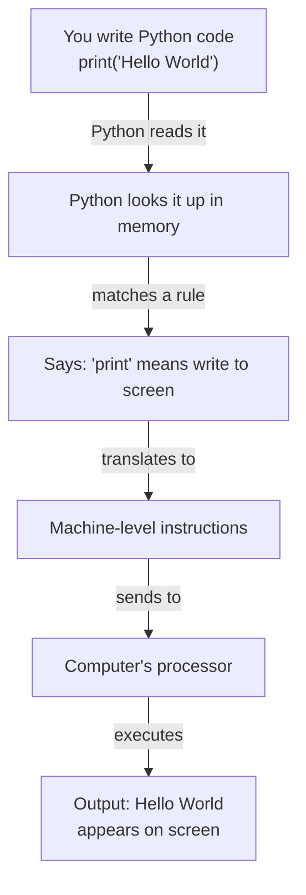

---
tags:
  - Beginner
  - Phase 0
---

# Module 1: Python Essentials

Welcome! You're about to start your journey into Python programming. This module assumes you've never written a line of code before, and that's perfectly okay. We'll take everything step-by-step, with lots of reminders and real-world comparisons. Let's get started.

---

## 🎯 What You Will Learn

By the end of this module, you will:

- Understand what Python is, why it exists, and why it's perfect for data and AI work
- Install Python on your computer and verify it's working
- Write and run your first Python program in two different ways (interactive and files)
- Store and manipulate data using variables, strings, numbers, lists, and dictionaries
- Create reusable code by writing functions with parameters and return values
- Use modules (pre-written code) to solve problems faster
- Set up isolated environments to keep your projects organized
- Read from and write to files on your computer
- Handle errors gracefully without your program crashing
- Combine all these skills in a complete, working script

---

## 🧠 Concept Explained: What Is Python?

### The Analogy: Python as a Universal Translator

Imagine you're at an international airport. You have lots of different machines (computers) that only understand their own language. Your job is to get all these machines to work together and do useful things.

Python is like a **universal translator**. It lets you speak to computers in a language that's much closer to how humans actually think and talk, rather than forcing you to learn weird computer-speak. Python then translates what you wrote into instructions the computer can understand.

### Why Python for Data and AI?

There are many programming languages (Java, C++, JavaScript, Go), but Python has become the #1 choice for:

- **Data Science**: Working with numbers, statistics, and datasets
- **Machine Learning & AI**: Building smart systems that learn
- **Automation**: Making repetitive tasks automatic
- **Scientific Computing**: Solving complex math and physics problems
- **Web Development**: Building websites and APIs

Why? Because:

1. **It reads like English**: Your code looks more like instructions you'd give a friend than weird symbols
2. **It has huge libraries**: Thousands of people have already written code for common problems (data analysis, AI models, etc.) and shared it for free
3. **It's forgiving**: If you make a mistake, Python usually tells you clearly what went wrong, not just crashing mysteriously
4. **Fast to learn**: You can write useful programs in days, not weeks

### What Actually Is a Program?

A program is just a set of instructions you give a computer, in order, to solve a problem.

For example:

- "Add these two numbers together" → an instruction
- "If the temperature is above 30, turn on the air conditioner" → an instruction
- "Read every line in this file and count the words" → a set of instructions

Python lets you write these instructions in a way that humans can actually read and understand.

---

## 🔍 How It Works: The Layers Between You and the Computer

When you write Python code and run it, here's what actually happens:

```
Your Python Code (you write this)
        ↓
Python Interpreter (reads your code)
        ↓
Python translates it to machine code (0s and 1s the computer understands)
        ↓
Computer executes the instructions
        ↓
Output appears on your screen
```

Let me show you this with a diagram:



### The Two Ways to Run Python

Python can run in two modes, and as a beginner, you'll use both:

**Mode 1: Interactive (REPL mode)**

- You type one line at a time into a Python prompt
- Python executes that line immediately
- You see the result right away
- Perfect for experimenting and learning
- REPL = "Read, Evaluate, Print, Loop" (it reads what you type, evaluates it, prints the result, and loops back for the next line)

**Mode 2: Script mode**

- You write code in a file (like `myprogram.py`)
- Python reads the whole file from top to bottom
- Executes all the instructions
- You run it when you're ready
- Perfect for actual programs that do real work

Think of it like cooking:

- **Interactive mode**: You're experimenting in a test kitchen, trying one recipe step at a time, seeing what happens
- **Script mode**: You've written down your final recipe and cook the whole meal from start to finish

---

## 🛠️ Step-by-Step Guide

### Step 1: Install Python

**On Ubuntu/Linux (Terminal commands):**

```bash
# Check if Python is already installed
python3 --version

# If not installed (or you want the latest version), install it
sudo apt update          # Update package list
sudo apt install python3 # Install Python 3

# Verify installation worked
python3 --version       # Should show version number like 3.10.0 or higher
```

!!! warning
Always use `python3`, not `python`. On older Linux systems, `python` refers to Python 2, which is outdated. `python3` is the modern version.

**On macOS:**

```bash
# If you have Homebrew installed:
brew install python3

# Then verify:
python3 --version
```

**On Windows:**

- Go to [python.org](https://www.python.org)
- Download the latest Python 3.x installer
- Run it and **CHECK THE BOX** that says "Add Python to PATH"
- Verify by opening Command Prompt and typing: `python --version`

### Step 2: Run Your First Python Code (Interactive Mode)

Open your terminal and type:

```bash
python3
```

You should see something like:

```
Python 3.10.12 (main, Sep 10 2024, 11:00:00)
>>>
```

The `>>>` is the Python prompt—it's waiting for you to type commands. Type this:

```python
print("Hello, world!")
```

Press Enter. You should see:

```
Hello, world!
>>>
```

Congratulations! You just ran Python code.

Now try these one at a time (press Enter after each):

```python
2 + 2                    # Do math
10 - 3                   # More math
"Hello" + " " + "Python"  # Connect strings together
5 > 3                    # Ask a true/false question
```

To exit interactive mode, type:

```python
exit()
```

Or press `Ctrl+D` on Linux/Mac, or `Ctrl+Z` then Enter on Windows.

!!! tip
Interactive mode is perfect for learning. When you want to experiment with something, jump into the Python prompt and try it. It's like a safe sandbox for testing ideas.

### Step 3: Run Python Code from a File

Now let's create a file instead of typing one line at a time.

Open your favorite text editor (VS Code, Gedit, Notepad, etc.) and create a new file. Type:

```python
# This is a comment—it explains code but Python ignores it
print("This is my first Python program!")
print("I'm learning to code!")

# Do some math
result = 5 + 3
print(result)
```

Save this file as `first_program.py` (the `.py` is important—it tells the computer this is Python code).

Now open your terminal, navigate to the folder where you saved the file, and type:

```bash
python3 first_program.py
```

You should see:

```
This is my first Python program!
I'm learning to code!
8
```

Perfect! You've now run Python in both modes.

### Step 4: Understand Variables

A **variable** is like a labeled box in your computer's memory where you store a value so you can use it later.

Real-world analogy: Imagine you have a shelf in your kitchen. You put a box on it labeled "sugar" and put some sugar inside. Later, when you need sugar, you grab the box labeled "sugar"—you don't need to go to the store again.

```python
# Create a variable named "name" and store "Alice" in it
name = "Alice"

# Create a variable named "age" and store 25 in it
age = 25

# Use these variables
print(name)        # Output: Alice
print(age)         # Output: 25
print(name, "is", age, "years old")  # Output: Alice is 25 years old
```

**The `=` sign means assignment**: "Store the value on the right into the variable on the left."

### Step 5: Learn Data Types

There are different types of data you can store. Each type works differently.

**String (str)**: Text. Anything in quotes.

```python
message = "Hello"
name = 'Alice'  # Single or double quotes both work
sentence = "I have 5 apples"  # Numbers in a string are still just text
```

**Integer (int)**: Whole numbers with no decimal point.

```python
age = 25
temperature = -10
count = 0
```

**Float (float)**: Numbers with decimal points (for precise measurements).

```python
height = 5.9
price = 19.99
pi = 3.14159
```

**Boolean (bool)**: True or False (used for yes/no questions).

```python
is_raining = True
is_sunny = False
```

**List**: A collection of items in order (like a grocery list).

```python
fruits = ["apple", "banana", "orange"]
numbers = [1, 2, 3, 4, 5]
mixed = ["Alice", 25, True, 3.14]  # Can have different types
```

**Dictionary (dict)**: A collection of key-value pairs (like a phone book: name → phone number).

```python
person = {
    "name": "Alice",
    "age": 25,
    "city": "New York"
}
```

!!! note
In Python, you don't need to declare what type a variable is. Python figures it out automatically based on what you assign to it. This is called "dynamic typing" and it makes Python very beginner-friendly.

### Step 6: Work with Lists

Lists let you store multiple items together.

```python
# Create a list of fruits
fruits = ["apple", "banana", "orange"]

# Access items by position (starting from 0)
print(fruits[0])     # Output: apple (first item)
print(fruits[1])     # Output: banana (second item)
print(fruits[2])     # Output: orange (third item)

# Add an item
fruits.append("grape")
print(fruits)        # Output: ['apple', 'banana', 'orange', 'grape']

# Remove an item
fruits.remove("banana")
print(fruits)        # Output: ['apple', 'orange', 'grape']

# Count items
print(len(fruits))   # Output: 3

# Check if something is in the list
if "apple" in fruits:
    print("Yes, we have apples")
```

!!! warning
**Indexing starts at 0, not 1!** The first item is at position 0, not position 1. This confuses every beginner. Remember: position 0 is the first item.

### Step 7: Work with Dictionaries

Dictionaries store data as pairs: a key and a value.

```python
# Create a dictionary about a person
person = {
    "name": "Alice",
    "age": 25,
    "city": "New York"
}

# Access values using their key
print(person["name"])   # Output: Alice
print(person["age"])    # Output: 25

# Add a new key-value pair
person["job"] = "Engineer"

# Change a value
person["age"] = 26

# Remove a key-value pair
del person["city"]

# See all keys
print(person.keys())    # Output: dict_keys(['name', 'age', 'job'])

# See all values
print(person.values())  # Output: dict_values(['Alice', 26, 'Engineer'])
```

Dictionaries are perfect when you want to associate labels with values. Instead of remembering "position 0 is age, position 1 is name", you just remember the keys: "age" and "name".

### Step 8: Write Your First Function

A **function** is reusable code. Instead of writing the same instructions over and over, you write them once in a function, then use that function many times.

**Real-world analogy**: A function is like a recipe. You write down the steps once. Then, whenever you want to make that dish, you follow the recipe instead of figuring it out again from scratch.

```python
# Define a function named 'greet'
def greet(name):
    # This is the function body - what it does
    message = "Hello, " + name + "!"
    return message  # Send back a result

# Call the function (use it)
result = greet("Alice")
print(result)       # Output: Hello, Alice!

# You can call it as many times as you want
print(greet("Bob"))       # Output: Hello, Bob!
print(greet("Charlie"))   # Output: Hello, Charlie!
```

**Breaking down a function:**

- `def`: Keyword that means "I'm defining a function"
- `greet`: The function's name (you choose this)
- `(name)`: The parameter—the information the function needs to do its job (like ingredients in a recipe)
- `return`: Send a result back to whoever called the function
- Everything indented under `def` is the function's body

Functions can have multiple parameters:

```python
def add(number1, number2):
    # Add the two numbers together
    result = number1 + number2
    # Give the result back
    return result

total = add(5, 3)
print(total)         # Output: 8
```

Functions can return nothing (they just do something):

```python
def celebrate(name):
    # Just print something, don't return anything
    print(name, "did an amazing job!")

celebrate("Alice")   # Output: Alice did an amazing job!
```

### Step 9: Import Modules

A **module** is a file containing code that someone else wrote (or you wrote earlier). Instead of rewriting common code, you import it and use it.

**Real-world analogy**: Instead of building everything from scratch, a module is like using a ready-made part. You don't build your own engine for a car—you use an engine someone else made.

```python
# Import a module
import math

# Use something from that module
print(math.pi)       # Output: 3.141592653589793
print(math.sqrt(16)) # Output: 4.0
```

You can also import specific things from a module:

```python
# Only import what you need
from math import pi, sqrt

print(pi)            # Output: 3.141592653589793
print(sqrt(16))      # Output: 4.0
```

Or import with a shorter name:

```python
import math as m

print(m.pi)          # Output: 3.141592653589793
```

Some modules are built into Python (like `math`, `random`, `os`). Others you need to install separately.

### Step 10: Set Up a Virtual Environment

A **virtual environment** is an isolated Python workspace. Each project gets its own environment so different projects' tools don't interfere with each other.

**Real-world analogy**: Imagine you're a mechanic with multiple cars in your shop. Instead of sharing one toolbox for all cars (tools get mixed up, versions conflict), each car gets its own labeled toolbox with exactly the tools it needs.

**On Ubuntu/Linux:**

```bash
# Navigate to where you want your project
cd /path/to/my/project

# Create a virtual environment named 'venv'
python3 -m venv venv

# Activate it (this changes your terminal)
source venv/bin/activate

# When activated, your terminal shows (venv) at the start
# Now any Python packages you install are isolated to this project

# Later, when you're done, deactivate it:
deactivate
```

After activating, your terminal looks like:

```
(venv) user@computer:~/my/project$
```

The `(venv)` part shows you're inside the virtual environment.

!!! tip
Always create a virtual environment for each project. This prevents version conflicts. If project A needs version 1.0 of a library and project B needs version 2.0, they each get their own copy.

### Step 11: Read Files

```python
# Open a file for reading
file = open("myfile.txt", "r")  # "r" means read mode

# Read the entire file as one string
content = file.read()
print(content)

# Close the file when done
file.close()
```

But there's a better way using the `with` statement (it automatically closes the file):

```python
# The with statement handles opening and closing for you
with open("myfile.txt", "r") as file:
    content = file.read()
    print(content)
# File is automatically closed here, no need to call close()
```

Read line by line instead of all at once:

```python
with open("myfile.txt", "r") as file:
    for line in file:
        print(line)  # Print each line
```

### Step 12: Write Files

```python
# Open a file for writing (creates it if it doesn't exist, overwrites if it does)
with open("output.txt", "w") as file:
    file.write("Hello, world!")
    file.write("\n")  # Add a newline character
    file.write("This is line 2")
```

Append to a file (add to the end) using "a" mode:

```python
# Open for appending (doesn't erase, just adds to the end)
with open("output.txt", "a") as file:
    file.write("\n")
    file.write("This is a new line at the end!")
```

### Step 13: Handle Errors with Try/Except

Things go wrong. A file might not exist. Someone might type invalid data. Your code crashes. Unless... you handle it gracefully.

**Real-world analogy**: It's like having a plan B. If your main plan fails, you have backup instructions on what to do instead.

```python
# Try to do something that might fail
try:
    age = int(input("Enter your age: "))  # User types "hello" instead of a number
    print(f"You are {age} years old")
except ValueError:  # Catch the specific error type
    print("That's not a valid number! Please enter digits.")
```

If the user types "hello" instead of a number, instead of crashing, the program prints the helpful message.

You can catch multiple types of errors:

```python
try:
    file = open("data.txt", "r")
    age = int(file.read())
except FileNotFoundError:
    print("The file doesn't exist!")
except ValueError:
    print("The file doesn't contain a valid number!")
```

You can also use a generic `except` for any error:

```python
try:
    result = 10 / 0  # This will cause an error (can't divide by zero)
except:
    print("Something went wrong!")
```

!!! warning
Avoid using bare `except:` in real code (catching everything). It's better to catch specific errors so you know what went wrong. But for now, it's okay as you're learning.

---

## 💻 Code Examples

### Example 1: Basic Data Types in Action

Create a file called `data_types_demo.py`:

```python
# This script demonstrates all the basic data types in Python

# STRING: Text data
name = "Alice"  # Store a person's name
message = "Welcome to Python!"  # Store a message
print(f"Name: {name}")  # Use f-string to embed variables in text
print(f"Message: {message}")  # f-strings use {curly braces} for variables

# INTEGER: Whole numbers
age = 25  # Store an age
count = 0  # Store a count
difference = 10 - 3  # Store math result
print(f"Age: {age}")
print(f"Count: {count}")
print(f"Difference: {difference}")

# FLOAT: Numbers with decimals
height = 5.9  # Store height in feet
price = 19.99  # Store a price
pi_value = 3.14159  # Store an approximation of pi
print(f"Height: {height}")
print(f"Price: ${price}")
print(f"Pi: {pi_value}")

# BOOLEAN: True or False
is_student = True  # A true/false statement
is_raining = False  # Another true/false statement
print(f"Is student: {is_student}")  # Print the boolean value
print(f"Is raining: {is_raining}")

# LIST: Multiple items in order
fruits = ["apple", "banana", "orange"]  # Create a list of fruits
print(f"Fruits: {fruits}")
print(f"First fruit: {fruits[0]}")  # Access by position (index)
print(f"Number of fruits: {len(fruits)}")  # Get list length

# DICTIONARY: Key-value pairs (like labels and values)
person = {
    "name": "Bob",  # Key: "name", Value: "Bob"
    "age": 30,      # Key: "age", Value: 30
    "city": "New York"  # Key: "city", Value: "New York"
}
print(f"Person: {person}")
print(f"Person's name: {person['name']}")  # Access by key name
print(f"Person's age: {person['age']}")    # Access another key
```

**Expected output:**

```
Name: Alice
Message: Welcome to Python!
Age: 25
Count: 0
Difference: 7
Height: 5.9
Price: $19.99
Pi: 3.14159
Is student: True
Is raining: False
Fruits: ['apple', 'banana', 'orange']
First fruit: apple
Number of fruits: 3
Person: {'name': 'Bob', 'age': 30, 'city': 'New York'}
Person's name: Bob
Person's age: 30
```

### Example 2: Functions with Parameters and Return Values

Create a file called `functions_demo.py`:

```python
# This script demonstrates how to write and use functions

# FUNCTION 1: A simple greeting function
def greet(name):
    # Create a greeting message using the name parameter
    greeting = "Hello, " + name + "! Welcome to Python!"
    # Return the greeting so the caller gets the result
    return greeting

# Call the function and store the result
result = greet("Alice")
# Print the result that came back from the function
print(result)

# FUNCTION 2: A function that does math
def add_numbers(num1, num2):
    # Add the two parameters together
    total = num1 + num2
    # Send the total back to whoever called this function
    return total

# Call the function with two numbers
sum_result = add_numbers(5, 3)
# Print the result
print(f"5 + 3 = {sum_result}")

# FUNCTION 3: A function that checks if someone is an adult
def is_adult(age):
    # Check if the age is 18 or older
    if age >= 18:
        # If yes, return True
        return True
    else:
        # If no, return False
        return False

# Call the function and use the result
if is_adult(25):
    # The function returned True, so print this message
    print("Alice is an adult!")
else:
    # The function returned False, so print this message
    print("Alice is not an adult!")

# FUNCTION 4: A function that doesn't return anything
def print_multiplied(number, times):
    # Loop 'times' times (we'll learn loops later, just know this repeats)
    for i in range(times):
        # Calculate number times the loop counter
        result = number * (i + 1)
        # Print the result (don't return it, just print)
        print(f"{number} × {i + 1} = {result}")

# Call the function (it prints directly, doesn't return anything)
print_multiplied(3, 4)
```

**Expected output:**

```
Hello, Alice! Welcome to Python!
5 + 3 = 8
Alice is an adult!
3 × 1 = 3
3 × 2 = 6
3 × 3 = 9
3 × 4 = 12
```

### Example 3: Lists and Dictionaries

Create a file called `collections_demo.py`:

```python
# This script demonstrates lists and dictionaries

# LISTS: Ordered collections of items
colors = ["red", "green", "blue"]  # Create a list of colors
print(f"All colors: {colors}")
print(f"First color: {colors[0]}")  # Access by position (0 is first)
print(f"Second color: {colors[1]}")  # 1 is second
print(f"Third color: {colors[2]}")  # 2 is third

# Add a new color to the list
colors.append("yellow")
print(f"After adding yellow: {colors}")

# Remove a color from the list
colors.remove("green")
print(f"After removing green: {colors}")

# Check how many colors are in the list
color_count = len(colors)
print(f"Number of colors: {color_count}")

# Loop through the list and print each color
print("Colors in order:")
for color in colors:
    # 'color' becomes each item in the list, one at a time
    print(f"  - {color}")

# DICTIONARIES: Key-value pairs (labeled storage)
student = {
    "name": "Charlie",  # Key "name" has value "Charlie"
    "age": 20,          # Key "age" has value 20
    "grade": "A",       # Key "grade" has value "A"
    "courses": ["Math", "English", "Science"]  # Value can even be a list!
}

print(f"\nStudent info: {student}")
print(f"Name: {student['name']}")  # Look up by key name
print(f"Age: {student['age']}")    # Look up by key age
print(f"Courses: {student['courses']}")  # Look up courses (which is a list)

# Check if a key exists in the dictionary
if "age" in student:
    # If "age" key exists, print it
    print(f"Student's age is: {student['age']}")

# Add a new key-value pair
student["email"] = "charlie@school.edu"  # Add email information
print(f"After adding email: {student}")

# Update an existing value
student["grade"] = "A+"  # Change grade from A to A+
print(f"After updating grade: {student}")

# Loop through dictionary keys and values
print("\nStudent details:")
for key in student:
    # For each key in the dictionary
    value = student[key]  # Get the value for that key
    # Print the key and its value
    print(f"  {key}: {value}")
```

**Expected output:**

```
All colors: ['red', 'green', 'blue']
First color: red
Second color: green
Third color: blue
After adding yellow: ['red', 'blue', 'yellow']
After removing green: ['red', 'blue', 'yellow']
Number of colors: 3
Colors in order:
  - red
  - blue
  - yellow

Student info: {'name': 'Charlie', 'age': 20, 'grade': 'A', 'courses': ['Math', 'English', 'Science']}
Name: Charlie
Age: 20
Courses: ['Math', 'English', 'Science']
Student's age is: 20
After adding email: {'name': 'Charlie', 'age': 20, 'grade': 'A', 'courses': ['Math', 'English', 'Science'], 'email': 'charlie@school.edu'}
After updating grade: {'name': 'Charlie', 'age': 20, 'grade': 'A+', 'courses': ['Math', 'English', 'Science'], 'email': 'charlie@school.edu'}

Student details:
  name: Charlie
  age: 20
  grade: A
  courses: ['Math', 'English', 'Science']
  email: charlie@school.edu
```

### Example 4: File Reading and Writing

First, create a file called `sample.txt` with this content:

```
The quick brown fox jumps over the lazy dog
Python is amazing
This is a test file
```

Then create a file called `file_operations_demo.py`:

```python
# This script demonstrates reading and writing files

# READ A FILE
print("=== READING A FILE ===")

# Open the file for reading and store it in a variable
with open("sample.txt", "r") as file:
    # Read the entire file as one long string
    content = file.read()
    # Print what we read
    print("Full content:")
    print(content)

# READ A FILE LINE BY LINE
print("\n=== READING LINE BY LINE ===")

# Open the file again and read line by line
with open("sample.txt", "r") as file:
    # 'line' becomes each line in the file, one at a time
    for line in file:
        # Remove the newline character at the end and print
        print(f"Line: {line.strip()}")

# WRITE TO A FILE
print("\n=== WRITING TO A FILE ===")

# Open a new file for writing (creates it if it doesn't exist)
with open("output.txt", "w") as file:
    # Write the first line
    file.write("This is the first line.\n")
    # Write the second line (the \n creates a new line)
    file.write("This is the second line.\n")
    # Write a blank line
    file.write("\n")
    # Write the third line
    file.write("This is the third line.\n")

print("Wrote to output.txt")

# READ WHAT WE JUST WROTE
print("\n=== READING WHAT WE WROTE ===")

# Open the file we just created and read it
with open("output.txt", "r") as file:
    # Read all content
    content = file.read()
    # Print it
    print(content)

# APPEND TO A FILE
print("=== APPENDING TO A FILE ===")

# Open the file in append mode (add to the end)
with open("output.txt", "a") as file:
    # Add a new line at the end
    file.write("This line was added later!\n")

# Read the file one more time to see the addition
with open("output.txt", "r") as file:
    # Read everything again
    content = file.read()
    # Print what we have now
    print("After appending:")
    print(content)
```

**Expected output:**

```
=== READING A FILE ===
Full content:
The quick brown fox jumps over the lazy dog
Python is amazing
This is a test file

=== READING LINE BY LINE ===
Line: The quick brown fox jumps over the lazy dog
Line: Python is amazing
Line: This is a test file

=== WRITING TO A FILE ===
Wrote to output.txt

=== READING WHAT WE WROTE ===
This is the first line.
This is the second line.

This is the third line.

=== APPENDING TO A FILE ===
After appending:
This is the first line.
This is the second line.

This is the third line.
This line was added later!
```

### Example 5: Error Handling with Try/Except

Create a file called `error_handling_demo.py`:

```python
# This script demonstrates how to handle errors gracefully

# EXAMPLE 1: Handle division by zero
print("=== EXAMPLE 1: Division by Zero ===")

try:
    # Try to divide two numbers
    numerator = 10
    denominator = 0  # This will cause an error!
    result = numerator / denominator  # This line will fail
    # If we get here, the math worked
    print(f"{numerator} / {denominator} = {result}")
except ZeroDivisionError:
    # If the error happens, do this instead
    print("ERROR: You can't divide by zero!")
    # Let's try with a valid denominator instead
    denominator = 2
    result = numerator / denominator
    print(f"Instead: {numerator} / {denominator} = {result}")

# EXAMPLE 2: Handle invalid input
print("\n=== EXAMPLE 2: Invalid Input ===")

try:
    # Ask the user for a number
    user_input = input("Enter a number: ")
    # Convert the input to an integer (this might fail if they type letters)
    number = int(user_input)
    # If we get here, the conversion worked
    print(f"You entered the number: {number}")
    print(f"Doubled: {number * 2}")
except ValueError:
    # If the user didn't enter a valid number, do this
    print("ERROR: That's not a valid number!")
    print("You need to enter only digits.")

# EXAMPLE 3: Handle file not found
print("\n=== EXAMPLE 3: File Not Found ===")

try:
    # Try to open a file that might not exist
    filename = "nonexistent_file.txt"
    with open(filename, "r") as file:
        # If the file exists, read it
        content = file.read()
        print(content)
except FileNotFoundError:
    # If the file doesn't exist, do this instead
    print(f"ERROR: The file '{filename}' does not exist!")
    print("Please create the file first.")

# EXAMPLE 4: Handle multiple types of errors
print("\n=== EXAMPLE 4: Multiple Error Types ===")

try:
    # Try to do something complicated
    numbers = [1, 2, 3]  # A list of numbers
    index = 10  # Try to access position 10 (doesn't exist, only 0-2)
    number = numbers[index]  # This will cause an error
    print(number)
except IndexError:
    # If we try to access a position that doesn't exist
    print("ERROR: That position doesn't exist in the list!")
except ValueError:
    # If we have a value error (different problem)
    print("ERROR: Invalid value!")

# EXAMPLE 5: Generic error handling (catch anything)
print("\n=== EXAMPLE 5: Generic Error Handling ===")

try:
    # Do something that might fail
    result = 10 + "hello"  # Can't add number to text!
except:
    # This catches ANY error
    print("ERROR: Something went wrong, but I'm not sure what!")
    print("That's why we shouldn't use bare except in real code.")
```

**Expected output:**

```
=== EXAMPLE 1: Division by Zero ===
ERROR: You can't divide by zero!
Instead: 10 / 2 = 5.0

=== EXAMPLE 2: Invalid Input ===
Enter a number: [user types something]
ERROR: That's not a valid number!
You need to enter only digits.

=== EXAMPLE 3: File Not Found ===
ERROR: The file 'nonexistent_file.txt' does not exist!
Please create the file first.

=== EXAMPLE 4: Multiple Error Types ===
ERROR: That position doesn't exist in the list!

=== EXAMPLE 5: Generic Error Handling ===
ERROR: Something went wrong, but I'm not sure what!
That's why we shouldn't use bare except in real code.
```

---

## ⚠️ Common Mistakes

### Mistake 1: Off-by-One Error in Lists (The Index Confusion)

**What Most Beginners Do:**

```python
fruits = ["apple", "banana", "orange"]

# WRONG: Trying to get the third item by using index 3
third_fruit = fruits[3]  # This causes an IndexError!
```

**The Problem:**
Lists start counting at 0, not 1. So the third item is at position 2, not 3.

```
fruits = ["apple",  "banana",  "orange"]
Position:    0         1          2     ← Positions always start at 0
Item #:      1         2          3     ← But we might think 1, 2, 3
```

**The Right Way:**

```python
fruits = ["apple", "banana", "orange"]

# CORRECT: Use the right position
first_fruit = fruits[0]      # Position 0 is the first item
second_fruit = fruits[1]     # Position 1 is the second item
third_fruit = fruits[2]      # Position 2 is the third item
```

!!! tip
If you need the 5th item, use index 4. If you need the nth item, use index n-1. Always subtract 1 from the position.

### Mistake 2: Forgetting to Close Files (Or Not Using `with`)

**What Most Beginners Do:**

```python
# WRONG: Not using 'with' statement
file = open("myfile.txt", "r")
content = file.read()
print(content)
# Forgot to close the file! The file stays open until the program ends.
```

**The Problem:**
Files are like gates. If you open too many without closing them, the computer runs out of file gates. Also, if your program crashes before you close the file, you lose any unsaved data.

**The Right Way:**

```python
# CORRECT: Use the 'with' statement
with open("myfile.txt", "r") as file:
    # Do stuff with the file
    content = file.read()
    print(content)
# The file is automatically closed here, no need to call close()
```

The `with` statement automatically closes the file when done, even if an error happens.

### Mistake 3: Using Bare `except` Without Understanding Errors

**What Most Beginners Do:**

```python
# WRONG: Catching any error without knowing what went wrong
try:
    age = int(input("Enter age: "))
    print(f"You are {age} years old")
except:
    # This catches EVERYTHING - even things we didn't expect!
    print("Something went wrong")
```

**The Problem:**
If you catch every error the same way, you can't tell what actually broke. Maybe the file didn't exist. Maybe the user input was invalid. Maybe something else. You print "Something went wrong" but you don't know what!

**The Right Way:**

```python
# CORRECT: Catch specific errors
try:
    age = int(input("Enter age: "))
    print(f"You are {age} years old")
except ValueError:
    # This only catches ValueError (invalid number)
    print("ERROR: Please enter a valid number!")
except Exception as e:
    # Only use a generic catch if you absolutely have to
    print(f"Unexpected error: {e}")
```

Specific error catching helps you debug and handle problems correctly.

### Mistake 4: Not Understanding Variable Assignment vs. Comparison

**What Most Beginners Do:**

```python
# WRONG: Using = when you meant to compare (==)
if age = 18:
    print("You are 18")
```

**The Problem:**
Python gets confused. Are you assigning age to 18 or comparing age to 18? The program crashes with a syntax error.

**The Right Way:**

```python
# CORRECT: Use == to compare, = to assign
age = 18              # Assign: store 18 in age
if age == 18:         # Compare: is age equal to 18?
    print("You are 18")
```

Remember:

- `=` means assignment (store a value)
- `==` means comparison (is it equal?)

### Mistake 5: Modifying a List While Looping Over It

**What Most Beginners Do:**

```python
# WRONG: Removing items while looping
fruits = ["apple", "banana", "orange"]
for fruit in fruits:
    # If the fruit has 5 letters
    if len(fruit) == 5:
        # Remove it from the list
        fruits.remove(fruit)  # This causes unpredictable behavior!
```

**The Problem:**
When you add or remove items from a list while looping through it, the loop gets confused. It might skip items or behave unpredictably.

**The Right Way:**

```python
# CORRECT: Create a new list with what you want to keep
fruits = ["apple", "banana", "orange"]
# Create a new list with only fruits that don't have 5 letters
long_fruits = [fruit for fruit in fruits if len(fruit) != 5]
print(long_fruits)  # Output: ['banana', 'orange']

# Or: Loop once and make a separate list of what to remove
fruits = ["apple", "banana", "orange"]
to_remove = []
for fruit in fruits:
    # Collect the fruits to remove
    if len(fruit) == 5:
        to_remove.append(fruit)

# Then remove them after looping
for fruit in to_remove:
    fruits.remove(fruit)
```

### Mistake 6: Forgetting to Return from a Function

**What Most Beginners Do:**

```python
# WRONG: Forgot the return statement
def add(a, b):
    # Do the math
    result = a + b
    # Print it instead of returning it
    print(result)  # This prints but doesn't send back the value

# Try to use the result
sum_value = add(5, 3)
print(sum_value)  # Output: None (nothing was returned!)
# You got None instead of 8!
```

**The Problem:**
The function printed 8, but didn't _return_ 8. So `sum_value` is empty (None).

**The Right Way:**

```python
# CORRECT: Return the value
def add(a, b):
    # Do the math
    result = a + b
    # Return the result to the caller
    return result

# Use the result
sum_value = add(5, 3)
print(sum_value)  # Output: 8 (this is what was returned)
```

!!! note
Printing and returning are different. Printing shows something on the screen for humans to see. Returning sends a value back to the code that called the function.

---

## ✅ Exercises

### Easy: Temperature Converter

Write a Python script that:

1. Asks the user to enter a temperature in Celsius
2. Converts it to Fahrenheit using the formula: `F = (C × 9/5) + 32`
3. Prints the result

Your script should handle the case where the user enters invalid input (not a number).

**Hint:** You'll need `input()`, `int()` or `float()`, try/except, and math.

### Medium: Contact Book

Write a Python script that creates a contact book (dictionary):

1. Create a dictionary with at least 3 contacts, each with:
   - Name
   - Phone number
   - Email

2. Write functions to:
   - Add a new contact
   - Display all contacts
   - Look up a contact by name

3. Your program should be able to call these functions and show the results.

**Hint:** You'll need dictionaries, functions with parameters, and loops.

### Hard: Word Counter

Write a Python script that:

1. Creates a text file with some paragraph of text
2. Reads the file
3. Counts:
   - Total number of words
   - Total number of lines
   - Number of times a specific word appears (case-insensitive)
   - Average word length

4. Displays all the statistics

5. Saves a summary to a new file

**Hint:** You'll need file I/O, loops, string methods like `.split()` and `.lower()`, and error handling.

---

## 🏗️ Mini Project: Word and Line Counter

Create a Python script called `word_counter.py` that reads a text file, counts words and lines, and generates a summary report.

### What Your Program Should Do

1. **Read a text file** (create a sample file first)
2. **Count statistics:**
   - Number of lines
   - Number of words
   - Number of characters
   - Average word length
3. **Write results to a new file** with a nicely formatted report
4. **Handle errors:** If the file doesn't exist, tell the user
5. **Show the report** on the screen too

### Step-by-Step Implementation

**Step 1: Create a sample text file**

Create a file called `sample_text.txt`:

```
Python is a powerful programming language.
It is used for data analysis, web development, and artificial intelligence.
Python's simplicity makes it perfect for beginners.
With Python, you can build amazing things!
```

**Step 2: Write the word counter script**

Create a file called `word_counter.py`:

```python
# This is our mini project: a word and line counter
# It reads a text file and generates a report about its contents

# Function to count words and lines in a file
def analyze_text_file(filename):
    # We'll store our results in a dictionary
    # Keys are stat names, values are the results
    results = {
        "filename": filename,  # Store the filename
        "lines": 0,            # Will count total lines
        "words": 0,            # Will count total words
        "characters": 0,       # Will count total characters
    }

    try:
        # Open the file for reading
        with open(filename, "r") as file:
            # Loop through each line in the file
            for line in file:
                # Increment line count (we've read one more line)
                results["lines"] += 1

                # Count characters in this line (including spaces and newlines)
                results["characters"] += len(line)

                # Strip whitespace and split by spaces to get words
                words_in_line = line.strip().split()
                # Add the word count from this line to the total
                results["words"] += len(words_in_line)

        # Calculate average word length (only if we have words)
        if results["words"] > 0:
            # Divide total characters by total words
            results["avg_word_length"] = results["characters"] / results["words"]
            # Round to 2 decimal places for readability
            results["avg_word_length"] = round(results["avg_word_length"], 2)
        else:
            # If no words, average is 0
            results["avg_word_length"] = 0

        # Open a file for writing the report
        with open("analysis_report.txt", "w") as report_file:
            # Write a title for the report
            report_file.write("=" * 50 + "\n")
            report_file.write("TEXT FILE ANALYSIS REPORT\n")
            report_file.write("=" * 50 + "\n\n")

            # Write each statistic to the report file
            report_file.write(f"File: {results['filename']}\n")
            report_file.write(f"Lines: {results['lines']}\n")
            report_file.write(f"Words: {results['words']}\n")
            report_file.write(f"Characters: {results['characters']}\n")
            report_file.write(f"Average word length: {results['avg_word_length']} characters\n")
            report_file.write("\n" + "=" * 50 + "\n")

        # Return the results so the caller can use them
        return results

    except FileNotFoundError:
        # If the file doesn't exist, tell the user
        print(f"ERROR: The file '{filename}' was not found!")
        print("Please make sure the file exists and you have the correct filename.")
        # Return None to indicate failure
        return None


# Function to display the results nicely
def display_results(results):
    # Check if we got valid results
    if results is None:
        # If results is None, something went wrong
        return

    # Print a header
    print("\n" + "=" * 50)
    print("ANALYSIS RESULTS")
    print("=" * 50)

    # Print each statistic
    print(f"File analyzed: {results['filename']}")
    print(f"Total lines: {results['lines']}")
    print(f"Total words: {results['words']}")
    print(f"Total characters: {results['characters']}")
    print(f"Average word length: {results['avg_word_length']} characters")

    # Print footer
    print("=" * 50)
    print("Report saved to: analysis_report.txt")
    print("=" * 50 + "\n")


# MAIN PROGRAM: This is where everything happens

# Ask the user for the filename
filename = input("Enter the text file to analyze: ")

# Analyze the file
results = analyze_text_file(filename)

# Display the results
display_results(results)
```

**Expected output (if file exists):**

```
Enter the text file to analyze: sample_text.txt

==================================================
ANALYSIS RESULTS
==================================================
File analyzed: sample_text.txt
Total lines: 4
Total words: 35
Total characters: 173
Average word length: 4.94 characters
==================================================
Report saved to: analysis_report.txt
==================================================
```

**Expected output (if file doesn't exist):**

```
Enter the text file to analyze: nonexistent.txt
ERROR: The file 'nonexistent.txt' was not found!
Please make sure the file exists and you have the correct filename.
```

**The report file (analysis_report.txt) will contain:**

```
==================================================
TEXT FILE ANALYSIS REPORT
==================================================

File: sample_text.txt
Lines: 4
Words: 35
Characters: 173
Average word length: 4.94 characters

==================================================
```

### How This Project Uses Everything You Learned

- **Variables**: Store filenames and statistics
- **Data Types**: Use strings, integers, floats, and dictionaries
- **Functions**: Create reusable functions for analysis and display
- **File Handling**: Read from one file, write to another using `with` statements
- **Error Handling**: Use try/except to handle missing files gracefully
- **Loops**: Loop through lines and words
- **String Methods**: Use `.strip()` and `.split()` to process text
- **Logic**: Use if/else to handle edge cases (like when there are no words)

---

## 🔗 What's Next

You've just completed the foundational module for Python! You now have all the core knowledge you need. Here's what comes next in your learning journey:

### Immediate Next Steps (Same Phase)

1. **Module 2: Control Flow** – Learn about if/else statements, loops, and making decisions in code
2. **Module 3: Working with Strings** – Deep dive into text manipulation, formatting, and string methods
3. **Module 4: Lists and Loops** – Master lists, tuples, and iteration patterns
4. **Module 5: Debugging and Best Practices** – Learn how to find and fix bugs, write clean code

### What You'll Build With These Skills

After Phase 0, you'll be ready to:

- Automate repetitive tasks on your computer
- Process and analyze data from files
- Build command-line tools
- Work with real-world datasets

### A Quick Sneak Peek Ahead

The concepts you learned here (variables, functions, files) are the **foundation for everything** in Python. Module 2 will teach you how to make decisions:

```python
# This is a preview of what's coming
age = int(input("How old are you? "))
if age >= 18:
    print("You can vote!")
else:
    print("You'll be able to vote soon!")
```

This is control flow—telling your program to do different things based on conditions.

---

## 📚 Summary

In this module, you learned:

1. ✅ **Python is a universal translator** between human thinking and computer instructions
2. ✅ **Installation and setup** – Python is now on your computer
3. ✅ **Two ways to run code** – Interactive (REPL) for learning, files for real programs
4. ✅ **Data types** – Strings, numbers, booleans, lists, and dictionaries
5. ✅ **Variables** – Labeled boxes that store values
6. ✅ **Functions** – Reusable recipes that take inputs and produce outputs
7. ✅ **Modules** – Using code others wrote instead of writing everything from scratch
8. ✅ **Virtual environments** – Keeping each project isolated
9. ✅ **File operations** – Reading and writing files programmatically
10. ✅ **Error handling** – Making your code survive problems with try/except

You're now ready to write real Python programs! Keep practicing, make mistakes (that's how you learn), and don't hesitate to experiment.

**Happy coding! 🚀**
