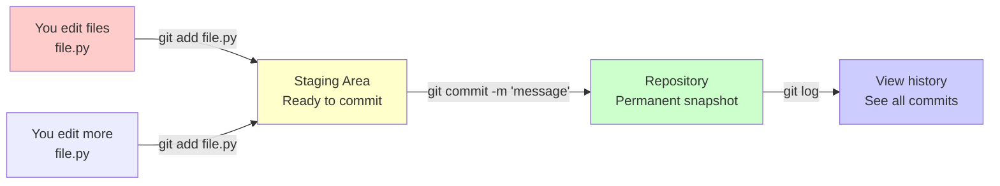

---
tags:
  - Beginner
  - Phase 0
---

# Module 2: Git & Version Control

Welcome to the most important developer skill you'll learn: version control. Whether you're working alone or with 100 people, Git saves your bacon. It's how every professional developer tracks changes, prevents disasters, and collaborates with their team. Let's learn it from the ground up.

---

## 🎯 What You Will Learn

By the end of this module, you will:

- Understand what version control is and why every developer needs it
- Know the key Git concepts: repositories, commits, branches, merges, remotes
- Install and set up Git on your computer
- Create your first local Git repository
- Understand the three stages of Git: Working Directory, Staging Area, and Repository
- Use core Git commands confidently (`status`, `add`, `commit`, `log`, `diff`, `branch`, `merge`)
- Connect your project to GitHub and push/pull code
- Create a `.gitignore` file to keep junk out of your repository
- Follow a clean Git workflow as a solo developer
- Know what a good commit history looks like
- Initialize version control for real projects

---

## 🧠 Concept Explained: What Is Git and Why Do You Need It?

### The Analogy: Git as Google Docs "Track Changes"

Imagine you're writing a document in Google Docs. Every time you make a change, Google Docs saves a version. You can see the edit history, see who changed what and when, and even go back to an earlier version if you made a mistake.

**Git is exactly that, but for your entire project folder.**

Instead of tracking changes to one document, Git tracks every file in your project. Every time you make meaningful changes, you take a "snapshot" (called a commit). Later, if you break something or want to see what you changed, you can look at the history or revert to an earlier snapshot.

### Why Version Control Matters

Without version control, you end up with files like:

```
my_script.py
my_script_v2.py
my_script_final.py
my_script_final_REAL.py
my_script_for_real_this_time.py  ← Most developers have experienced this nightmare
```

This is chaos. You don't know which version is current. You can't compare versions easily. If you break something, you can't recover.

**With Git:**

- You have ONE current file (`my_script.py`)
- Git stores the entire history of every change
- You can see exactly what changed between versions
- You can revert to any earlier version instantly
- Multiple people can work on the same project without overwriting each other's work

### Git vs. GitHub (They're Different!)

People often confuse these:

- **Git**: Software that runs on your computer. It tracks changes locally. It's like a filing system for your project history.
- **GitHub**: A website service (like Google Docs, but for code). It's where you upload your Git repository to share it online, collaborate with others, and back up your work.

Think of it this way:

- Git = the system that tracks changes
- GitHub = the cloud storage service that hosts your Git repository

---

## 🔍 How It Works: The Three Stages

When you're working with Git, your code moves through three stages. Understanding this is crucial.

### The Three-Stage Flow

```
┌─────────────────────┐
│ Working Directory   │  (Your files on disk right now - the ones you're editing)
│  (Untracked)        │
└──────────┬──────────┘
           │
           │ git add
           ↓
┌──────────────────────┐
│  Staging Area        │  (Files marked "ready to save" - temporary holding area)
│  (Indexed)           │
└──────────┬───────────┘
           │
           │ git commit
           ↓
┌──────────────────────┐
│  Repository          │  (Your official history - all saved snapshots)
│  (Committed)         │
└──────────────────────┘
```

Let me explain each:

**1. Working Directory** – This is your actual project folder with files you're editing. Only you see these changes. Git tracks that they exist, but they're not saved yet.

**2. Staging Area** – When you're happy with some changes, you move them to the staging area by typing `git add`. This says "I'm planning to save these changes in my next snapshot." It's like putting items in a box before you tape it up and ship it.

**3. Repository** – This is your official history. When you run `git commit`, you create a permanent snapshot. This snapshot can never be lost (unless you deliberately delete it) and you can always come back to it.

### Why Three Stages?

This seems complicated, but it's actually brilliant. You can edit lots of files, but only commit some of them. For example:

```
You edited: file1.py, file2.py, file3.py, debug_notes.txt

git add file1.py file2.py file3.py   # Add only the important ones
git commit -m "Fixed bug in calculations"
# debug_notes.txt stays untracked - you can delete it later
```

This keeps your history clean and focused.

### Mermaid Diagram: The Git Workflow



---

## 🛠️ Step-by-Step Guide

### Step 1: Install Git

**On Ubuntu/Linux:**

```bash
# Update package list
sudo apt update

# Install Git
sudo apt install git

# Verify installation
git --version    # Should show something like: git version 2.34.1
```

**On macOS:**

```bash
# If you have Homebrew installed:
brew install git

# If not, you can download from https://git-scm.com
```

**On Windows:**

- Go to [git-scm.com](https://git-scm.com)
- Download the Windows installer
- Run it, accept defaults
- Open Command Prompt or PowerShell and type: `git --version`

!!! note
During Windows installation, when asked about the default editor, choose vim, nano, or Visual Studio Code—whichever you prefer. This is for writing commit messages.

### Step 2: Configure Your Identity

Git needs to know who you are so it can label your commits. Do this once, and it applies to your whole computer.

**On Linux/macOS/Windows (all the same):**

```bash
# Tell Git your name
git config --global user.name "Your Name"

# Tell Git your email
git config --global user.email "your.email@example.com"

# Verify it worked
git config --global --list    # Shows all your Git settings
```

!!! tip
Use a real email address. If you later push to GitHub, they'll match your GitHub account email (though they don't have to be identical).

### Step 3: Create Your First Repository

A **repository** (or "repo") is a folder that Git is tracking. It's where Git stores your history.

Let's create a new project folder and initialize it as a Git repository:

```bash
# Create a folder for your project
mkdir my_first_git_project

# Navigate into that folder
cd my_first_git_project

# Initialize Git in this folder
# This creates a hidden .git subfolder that stores your history
git init

# Verify it worked (you should see "On branch master")
git status
```

You should see:

```
On branch master

No commits yet

nothing to commit (create/files and start tracking)
```

Congratulations! You've created your first Git repository.

!!! note
The `.git` folder is hidden. If you want to see it, use `ls -la` (with the `-a` flag to show hidden files). Don't delete this folder—it contains your entire history!

### Step 4: Create a File and Check Status

Let's create a Python file (remember Module 1?) to track:

```bash
# Create a simple Python file
cat > hello.py << 'EOF'
# This is our first tracked file
print("Hello, Git!")
EOF

# Check the status
git status
```

You should see:

```
On branch master

No commits yet

Untracked files:
  (use "git add <file>..." to include in what will be committed)
        hello.py

nothing added to commit but untracked files present (use "git add" to track)
```

Git sees your file but hasn't tracked it yet. Let's move it to the staging area.

### Step 5: Stage Your Changes

**Staging** means "mark these files to be included in the next snapshot."

```bash
# Stage the hello.py file
git add hello.py

# Check status again
git status
```

Now you'll see:

```
On branch master

No commits yet

Changes to be committed:
  (use "rm --cached <file>..." to unstage)
        new file:   hello.py
```

Green text means it's staged and ready to commit!

!!! tip
You can stage multiple files: `git add file1.py file2.py file3.py`
Or stage everything: `git add .` (the dot means "this folder and everything in it")

### Step 6: Commit Your Changes

**Committing** means "save this snapshot permanently to the repository with a message explaining what changed."

```bash
# Create a commit with a message
git commit -m "Initial commit: add hello.py with greeting"

# Check status
git status
```

You'll see:

```
On branch master
nothing to commit, working tree clean
```

Success! Your changes are now in the repository. Let's see the history:

```bash
# View your commit history
git log

# Or view it in a compact format (cleaner)
git log --oneline
```

You'll see something like:

```
a1f2e3d (HEAD -> master) Initial commit: add hello.py with greeting
```

!!! note
That weird string `a1f2e3d` is the commit ID—a unique identifier for this snapshot. Later, you can refer to any commit by this ID.

### Step 7: Make Changes and Commit Again

Let's edit the file to show how commits track changes:

```bash
# Edit the file
cat > hello.py << 'EOF'
# Improved greeting program
print("Hello, Git!")
print("Version 2.0")
EOF

# Check status
git status
```

You'll see:

```
On branch master
Changes not staged for commit:
  (use "git add <file>..." to update what will be committed)
  (use "git diff" to see what changed")
        modified:   hello.py

no changes added to commit
```

Git knows the file changed, but it's not staged yet. Let's see what changed:

```bash
# View the exact differences
git diff hello.py
```

You'll see:

```
diff --git a/hello.py b/hello.py
index 1234567..abcdefg 100644
--- a/hello.py
+++ b/hello.py
@@ -1,2 +1,3 @@
-# This is our first tracked file
+# Improved greeting program
 print("Hello, Git!")
+print("Version 2.0")
```

Lines starting with `-` are removed. Lines starting with `+` are added. Now let's commit:

```bash
# Stage the change
git add hello.py

# Commit with a descriptive message
git commit -m "Improve greeting program with version 2.0"

# View all commits
git log --oneline
```

You'll see:

```
b2c3d4e (HEAD -> master) Improve greeting program with version 2.0
a1f2e3d Initial commit: add hello.py with greeting
```

Perfect! Now you have a history of two snapshots.

### Step 8: Create and Manage Branches

A **branch** is an independent line of development. Think of it like a parallel universe for your code. You can experiment on a branch without affecting the main code.

```bash
# View all branches (currently just master)
git branch

# Create a new branch named 'experiment'
git branch experiment

# Switch to that branch
git checkout experiment
# Or use the newer syntax:
git switch experiment

# Verify you're on the right branch
git branch    # The asterisk (*) shows your current branch
```

Now let's make changes on this branch:

```bash
# Edit the file
cat > hello.py << 'EOF'
# Experimental version with more features
name = input("What's your name? ")
print(f"Hello, {name}!")
print("Version 3.0")
EOF

# Commit the change
git add hello.py
git commit -m "Add interactive greeting on experiment branch"

# View the commit history
git log --oneline
```

You'll see:

```
c3d4e5f (HEAD -> experiment) Add interactive greeting on experiment branch
b2c3d4e (master) Improve greeting program with version 2.0
a1f2e3d Initial commit: add hello.py with greeting
```

Notice: `experiment` is ahead of `master` by one commit.

### Step 9: Merge Branches

Let's say you liked the experiment and want to merge it back into `master`:

```bash
# Switch back to master
git checkout master

# Merge the experiment branch into master
git merge experiment

# Check the log
git log --oneline
```

You'll see:

```
c3d4e5f (HEAD -> master, experiment) Add interactive greeting on experiment branch
b2c3d4e Improve greeting program with version 2.0
a1f2e3d Initial commit: add hello.py with greeting
```

Now `master` includes the changes from `experiment`. Both branches point to the same commit.

!!! tip
You can delete a branch after merging: `git branch -d experiment`

### Step 10: Connect to GitHub

GitHub is where you store your code online. First, create an account at [github.com](https://github.com).

Then create a new repository on GitHub:

1. Click the **+** icon (top right) → **New repository**
2. Name it `my_first_git_project`
3. Leave it empty (no README yet)
4. Click **Create repository**

GitHub will show you commands to push your local repo there. Let's do it:

```bash
# Add GitHub as a "remote" (a place to push your code)
git remote add origin https://github.com/YOUR_USERNAME/my_first_git_project.git

# Rename your branch to main (GitHub's default)
git branch -M main

# Push your commits to GitHub
git push -u origin main

# The -u flag sets this as the default branch to push to
```

If prompted for credentials, enter your GitHub username and personal access token (create one in GitHub settings under Developer Settings).

!!! note
"origin" is the standard name for your main remote repository. You can have multiple remotes if needed.

### Step 11: Clone a Repository

**Cloning** means downloading a repository from GitHub to your computer. Let's practice:

```bash
# Navigate to a different folder
cd /tmp

# Clone your GitHub repo
git clone https://github.com/YOUR_USERNAME/my_first_git_project.git

# Navigate into the cloned folder
cd my_first_git_project

# View the history
git log --oneline
```

You now have a complete copy with all the history!

### Step 12: Pull and Push Updates

When working with GitHub, you'll do two main operations:

**Push**: Send your local commits to GitHub

```bash
# Make a change locally
echo "# Updated locally" >> README.md

# Stage and commit
git add README.md
git commit -m "Add README"

# Push to GitHub
git push
```

**Pull**: Download updates from GitHub

```bash
# If someone else (or you from another computer) pushed changes
git pull

# This combines two operations: fetch (get updates) and merge
```

### Step 13: Create a .gitignore File

Not everything should go in your repository. You don't want to track:

- Virtual environment folders (`venv/`)
- Cache files (`__pycache__/`)
- IDE settings (`.vscode/`)
- Passwords or API keys
- Generated files

Create a `.gitignore` file in your repo root:

```bash
# Create the file
cat > .gitignore << 'EOF'
# Python virtual environment
venv/
env/

# Python cache files
__pycache__/
*.pyc
*.pyo

# IDE settings
.vscode/
.idea/
*.swp
*.swo

# macOS
.DS_Store

# Environment variables (secrets)
.env
.env.local

# Temporary files
*.tmp
*.log

# OS files
Thumbs.db
EOF

# Commit the .gitignore file
git add .gitignore
git commit -m "Add .gitignore for Python projects"

# Push to GitHub
git push
```

Now, any files matching these patterns will be ignored by Git. You can still delete them manually if they exist, but Git won't track them.

!!! warning
Never commit secret keys, passwords, or API tokens. Use .gitignore to prevent this.

---

## 💻 Code Examples

### Example 1: Complete Git Workflow from Scratch

This script creates a project, makes commits, and shows the history:

```bash
# Create and navigate to project folder
mkdir example_project
cd example_project

# Initialize Git
git init

# Configure your identity (one-time setup, but shown here for completeness)
git config user.name "Your Name"
git config user.email "your.email@example.com"

# Create first file
cat > script.py << 'EOF'
# Simple calculator program
def add(a, b):
    return a + b

print(add(5, 3))
EOF

# Check status (file is untracked)
git status

# Stage the file
git add script.py

# Commit it
git commit -m "Add basic calculator function"

# View history
git log --oneline
```

**Expected output:**

```
On branch master
No commits yet

Untracked files:
  (use "git add <file>..." to include in what will be committed)
        script.py

nothing added to commit but untracked files present

Changes to be committed:
  (use "git add <file>..." to include in what will be committed)
        new file:   script.py

[master (root-commit) a1f2e3d] Add basic calculator function
 1 file changed, 5 insertions(+)
 create mode 100644 script.py

a1f2e3d (HEAD -> master) Add basic calculator function
```

### Example 2: Making Meaningful Commits

Good commit practice—committing at logical checkpoints:

```bash
# Create a Python script that evolves
cat > math_tools.py << 'EOF'
# Version 1: Basic addition
def add(a, b):
    return a + b
EOF

# Commit version 1
git add math_tools.py
git commit -m "Add addition function"

# Improve it (commit 2)
cat > math_tools.py << 'EOF'
# Version 2: Addition and subtraction
def add(a, b):
    return a + b

def subtract(a, b):
    return a - b
EOF

git add math_tools.py
git commit -m "Add subtraction function"

# Improve it (commit 3)
cat > math_tools.py << 'EOF'
# Version 3: Basic arithmetic operations
def add(a, b):
    return a + b

def subtract(a, b):
    return a - b

def multiply(a, b):
    return a * b
EOF

git add math_tools.py
git commit -m "Add multiplication function"

# View the beautiful commit history
git log --oneline
```

**Expected output:**

```
c3d4e5f (HEAD -> master) Add multiplication function
b2c3d4e Add subtraction function
a1f2e3d Add addition function
```

This is a clean, readable history. Each commit represents one logical change.

### Example 3: Using Branches for Experiment

```bash
# You're on master—create a new branch for testing
git branch new_feature

# Switch to it
git checkout new_feature

# Make experimental changes
cat > math_tools.py << 'EOF'
# Experimental: Division with error handling
def add(a, b):
    return a + b

def divide(a, b):
    if b == 0:
        return "Error: Cannot divide by zero"
    return a / b
EOF

# Commit the experiment
git add math_tools.py
git commit -m "Add division with error checking (experimental)"

# Check history
git log --oneline
```

**Expected output:**

```
d4e5f6g (HEAD -> new_feature) Add division with error checking (experimental)
c3d4e5f (master) Add multiplication function
b2c3d4e Add subtraction function
a1f2e3d Add addition function
```

Notice: `new_feature` has a new commit, but `master` is unchanged.

Then merge:

```bash
# Go back to master
git checkout master

# Merge the feature in
git merge new_feature

# View the history (now master includes all commits)
git log --oneline
```

**Expected output:**

```
d4e5f6g (HEAD -> master, new_feature) Add division with error checking (experimental)
c3d4e5f Add multiplication function
b2c3d4e Add subtraction function
a1f2e3d Add addition function
```

### Example 4: The Complete Push/Pull Cycle

```bash
# Create a README file
cat > README.md << 'EOF'
# Math Tools

A simple calculator library with basic operations.

## Features
- Addition
- Subtraction
- Multiplication
- Division (with error handling)
EOF

# Stage and commit
git add README.md
git commit -m "Add comprehensive README documentation"

# Assuming you've already added origin (remote), push to GitHub
git push origin master

# If someone else (or you) made changes on GitHub, pull them
git pull origin master

# View the full history
git log --oneline --all
```

**Example output** (if history is as shown above):

```
d4e5f6g (HEAD -> master, origin/master) Add division with error checking
c3d4e5f Add multiplication function
b2c3d4e Add subtraction function
a1f2e3d Add addition function
```

The `(origin/master)` label shows that GitHub's version matches your local.

---

## ⚠️ Common Mistakes

### Mistake 1: Forgetting to Add Before Committing

**What Most Beginners Do:**

```bash
# Edit a file
echo "new feature" >> script.py

# Try to commit directly (WRONG!)
git commit -m "Add new feature"
```

You'll get:

```
On branch master
nothing to commit, working tree clean
```

Nothing happened! The changes aren't committed because you forgot `git add`.

**The Right Way:**

```bash
# Edit a file
echo "new feature" >> script.py

# Stage the changes
git add script.py

# Now commit
git commit -m "Add new feature"
```

!!! tip
Quick check: Always run `git status` before committing. If nothing's green (staged), you need to add first.

### Mistake 2: Making Huge Commits With Multiple Unrelated Changes

**What Most Beginners Do:**

```bash
# You make many unrelated changes over several days
git add .
git commit -m "bunch of changes"
```

**The Problem:**
Your commit history becomes useless. If a bug appears, you don't know which change caused it. Your commits should be small and focused.

**The Right Way:**

```bash
# Make one logical change
# eg: fix button color
git add button_color_fix.py
git commit -m "Fix button color from red to blue"

# Later: make another logical change
# eg: add new feature
git add new_feature.py
git commit -m "Add search functionality to dashboard"
```

Now your history tells a story: "First we fixed the button, then we added search."

!!! note
A good rule: If you have to use "and" in your commit message ("Fix button AND add search"), you should split it into two commits.

### Mistake 3: Committing Secrets or Node Modules

**What Most Beginners Do:**

```bash
# You accidentally tracked a .env file with passwords
git add .env
git commit -m "Add environment configuration"
git push

# Oops! Your passwords are now on GitHub for everyone to see!
```

**The Problem:**
Anyone can see your passwords, API keys, and secrets. This is a security disaster.

**The Right Way:**

```bash
# BEFORE adding anything, create .gitignore
cat > .gitignore << 'EOF'
.env
secrets.txt
__pycache__/
venv/
EOF

# Commit .gitignore
git add .gitignore
git commit -m "Add .gitignore to prevent tracking secrets"

# Now secrets won't be tracked
echo "SECRET_KEY=123456" > .env
git status    # .env won't appear here
```

!!! danger
If you've already pushed secrets to GitHub, you need to rotate those credentials immediately and remove the commit history. This is serious!

### Mistake 4: Pushing to the Wrong Branch or Remote

**What Most Beginners Do:**

```bash
# You created a new branch and made changes
git checkout experiment
git add changes.py
git commit -m "Experimental code"

# You intended to push to GitHub's 'experiment' branch,
# but accidentally pushed to 'master' (the default)
git push
```

**The Problem:**
Your unfinished code goes to the main branch. Bad for team projects.

**The Right Way:**

```bash
# Always be explicit about where you're pushing
git push origin experiment    # Push to 'experiment' branch on GitHub

# Or check where you're pushing first
git remote -v              # Shows what remotes you have
git branch -a              # Shows all local and remote branches
git push origin main       # Be explicit
```

!!! tip
Before pushing, always check: `git status` shows your current branch.

### Mistake 5: Merging Conflicts and Panicking

**What Most Beginners Do:**

```bash
# You merge a branch and get a conflict
git merge feature_branch
# CONFLICT (content merge): Merge conflict in script.py
# Automatic merge failed; fix conflicts and then commit the result.

# You panic and do something random
git reset --hard            # You just lost your merge attempt!
```

**The Right Way:**

Merge conflicts are normal. Don't panic.

```bash
# View which files have conflicts
git status

# Open the conflicted file and fix it manually
# Git marks conflicts like this:
# <<<<<<< HEAD
# This is what master has
# =======
# This is what the branch has
# >>>>>>> branch_name

# You edit and choose which version to keep, then
git add script.py
git commit -m "Resolve merge conflict in script.py"
```

!!! note
Merge conflicts happen when two branches changed the same lines differently. Git can't automatically decide which is correct—you have to tell it.

---

## ✅ Exercises

### Easy: Git Initialization and Basic Commits

1. Create a new folder called `learning_git`
2. Initialize it as a Git repository
3. Create a Python file called `greeting.py` with a simple function that prints "Hello"
4. Commit it with an appropriate message
5. Modify the file to print "Hello, World!" instead
6. See the diff with `git diff` before committing
7. Commit the changes
8. View your commit history with `git log --oneline`

**What to verify:**

- You have two commits in your history
- Each commit message is clear and descriptive
- `git status` shows "nothing to commit, working tree clean"

### Medium: Branching, Merging, and .gitignore

1. Continue with your `learning_git` repository
2. Create a `.gitignore` file that ignores Python cache files (`__pycache__/`, `*.pyc`)
3. Commit the `.gitignore`
4. Create a new branch called `add_math_functions`
5. On that branch, modify `greeting.py` to include a function that adds two numbers
6. Commit this change on the branch
7. Switch back to `master`
8. Merge the `add_math_functions` branch into `master`
9. View the full history with `git log --oneline`
10. Delete the `add_math_functions` branch

**What to verify:**

- `master` now includes the changes from the feature branch
- Your commit history shows both the original greeting commit and the math function commit
- The branch is successfully deleted

### Hard: GitHub Integration and Remote Workflow

1. Create a GitHub account (free) if you don't have one
2. Push your local `learning_git` repository to GitHub:
   - Create a new empty repository on GitHub named `learning_git`
   - Connect your local repo to GitHub as a remote
   - Push your commits to GitHub
3. Create a new file called `README.md` with a description of your project
4. Commit and push it
5. On GitHub's web interface, edit the README to add a line
6. Pull the changes back to your local machine
7. Verify that your local file now includes the GitHub edit

**What to verify:**

- Your GitHub repository shows all your commits
- You successfully pushed and pulled changes
- Your local and remote repositories are in sync

---

## 🏗️ Mini Project: Version Control for Your Python Script

Now let's apply Git to the `word_counter.py` script from Module 1. We'll create a proper versioned project with meaningful commits and push it to GitHub.

### Project Goals

1. Initialize a Git repository for the word counter project
2. Create meaningful commits at logical points in development
3. Set up `.gitignore` properly for Python projects
4. Push everything to GitHub
5. Create a clean commit history that tells the story of development

### Step-by-Step Implementation

**Step 1: Set Up the Repository**

```bash
# Create a project folder
mkdir word_counter_project
cd word_counter_project

# Initialize Git
git init

# Configure your identity (if not already done globally)
git config user.name "Your Name"
git config user.email "your.email@example.com"

# Verify you're on the right branch
git status
```

**Step 2: Create .gitignore First**

Before adding any code, create a `.gitignore` file so Python cache files don't accidentally get tracked:

```bash
# Create .gitignore for Python projects
cat > .gitignore << 'EOF'
# Python virtual environment
venv/
env/
ENV/

# Python cache and compiled files
__pycache__/
*.py[cod]
*$py.class
*.so

# IDE settings
.vscode/
.idea/
*.swp
*.swo

# macOS
.DS_Store

# Environment variables
.env
.env.local

# Temporary files
*.tmp
*.log
*.txt~

# OS specific
Thumbs.db
EOF

# Commit .gitignore (best practice: always commit this early)
git add .gitignore
git commit -m "Add .gitignore for Python project"

# View first commit
git log --oneline
```

**Expected output:**

```
a1f2e3d (HEAD -> master) Add .gitignore for Python project
```

**Step 3: Add the Core Word Counter Script**

Now add the main script from Module 1:

```bash
# Create the word counter script
cat > word_counter.py << 'EOF'
# This is our word and line counter program
# It reads a text file and analyzes it

# Function to count words and lines in a file
def analyze_text_file(filename):
    # Initialize a dictionary to store results
    results = {
        "filename": filename,
        "lines": 0,
        "words": 0,
        "characters": 0,
    }

    try:
        # Open the file and read it
        with open(filename, "r") as file:
            # Loop through each line
            for line in file:
                # Count the line
                results["lines"] += 1

                # Count characters
                results["characters"] += len(line)

                # Count words by splitting
                words_in_line = line.strip().split()
                results["words"] += len(words_in_line)

        # Calculate average word length
        if results["words"] > 0:
            results["avg_word_length"] = results["characters"] / results["words"]
            results["avg_word_length"] = round(results["avg_word_length"], 2)
        else:
            results["avg_word_length"] = 0

        # Write report to file
        with open("analysis_report.txt", "w") as report_file:
            report_file.write("=" * 50 + "\n")
            report_file.write("TEXT FILE ANALYSIS REPORT\n")
            report_file.write("=" * 50 + "\n\n")
            report_file.write(f"File: {results['filename']}\n")
            report_file.write(f"Lines: {results['lines']}\n")
            report_file.write(f"Words: {results['words']}\n")
            report_file.write(f"Characters: {results['characters']}\n")
            report_file.write(f"Average word length: {results['avg_word_length']}\n")
            report_file.write("\n" + "=" * 50 + "\n")

        return results

    except FileNotFoundError:
        # Handle file not found error
        print(f"ERROR: The file '{filename}' was not found!")
        return None


# Function to display results nicely
def display_results(results):
    # If no results, exit
    if results is None:
        return

    # Print formatted results
    print("\n" + "=" * 50)
    print("ANALYSIS RESULTS")
    print("=" * 50)
    print(f"File: {results['filename']}")
    print(f"Lines: {results['lines']}")
    print(f"Words: {results['words']}")
    print(f"Characters: {results['characters']}")
    print(f"Average word length: {results['avg_word_length']}")
    print("=" * 50)
    print("Report saved to: analysis_report.txt\n")


# Main program
if __name__ == "__main__":
    # Get filename from user
    filename = input("Enter the text file to analyze: ")

    # Analyze it
    results = analyze_text_file(filename)

    # Display results
    display_results(results)
EOF

# Commit the core functionality
git add word_counter.py
git commit -m "Add core word counter functionality with analysis and reporting"

# View commits
git log --oneline
```

**Expected output:**

```
b2c3d4e (HEAD -> master) Add core word counter functionality with analysis and reporting
a1f2e3d Add .gitignore for Python project
```

**Step 4: Add Documentation**

Create a README to explain your project:

````bash
# Create a comprehensive README
cat > README.md << 'EOF'
# Word Counter Analysis Tool

A Python tool for analyzing text files. It counts words, lines, and characters, then generates a detailed report.

## Features

- Counts total lines in a file
- Counts total words
- Counts total characters
- Calculates average word length
- Generates a formatted report and saves it to `analysis_report.txt`
- Handles missing files gracefully with error messages

## Usage

```bash
python3 word_counter.py
````

Then enter the filename when prompted:

```
Enter the text file to analyze: sample.txt
```

The program will output analysis results and save a report to `analysis_report.txt`.

## Project Structure

- `word_counter.py` - Main script with analysis functions
- `analysis_report.txt` - Generated report (created when you run the program)
- `.gitignore` - Prevents tracking of Python cache files

## Example

Input file: `example.txt`

```
The quick brown fox jumps over the lazy dog
This is a test file
```

Output:

```
==================================================
ANALYSIS RESULTS
==================================================
File: example.txt
Lines: 2
Words: 15
Characters: 54
Average word length: 3.6
==================================================
```

## Future Improvements

- Add support for multiple files
- Count sentences
- Find the longest word
- Generate charts or visualizations

EOF

# Commit documentation

git add README.md
git commit -m "Add comprehensive README documentation"

# View commits

git log --oneline

```

**Expected output:**
```

c3d4e5f (HEAD -> master) Add comprehensive README documentation
b2c3d4e Add core word counter functionality with analysis and reporting
a1f2e3d Add .gitignore for Python project

````

**Step 5: Create Sample Data**

Add a sample text file for testing:

```bash
# Create sample data
cat > sample_text.txt << 'EOF'
Python is a powerful programming language.
It is used for data analysis, web development, and artificial intelligence.
Python's simplicity makes it perfect for beginners.
With Python, you can build amazing things!
EOF

# Note: sample_text.txt will NOT be committed because .gitignore
# only excludes .txt files matching certain patterns. For this example,
# we'll commit it so users can run the program:

git add sample_text.txt
git commit -m "Add sample text file for testing"

# View commits
git log --oneline
````

**Expected output:**

```
d4e5f6g (HEAD -> master) Add sample text file for testing
c3d4e5f Add comprehensive README documentation
b2c3d4e Add core word counter functionality with analysis and reporting
a1f2e3d Add .gitignore for Python project
```

**Step 6: Push to GitHub**

Now let's send this to GitHub:

```bash
# Go to GitHub.com, sign in, click + → New Repository
# Name it "word_counter_project"
# Click Create Repository (leave it empty)

# GitHub will show you these commands:
# Copy and paste them into your terminal:

git remote add origin https://github.com/YOUR_USERNAME/word_counter_project.git
git branch -M main
git push -u origin main

# After pushing, verify it worked:
git log --oneline
```

**Expected output:**

```
d4e5f6g (HEAD -> main, origin/main) Add sample text file for testing
c3d4e5f Add comprehensive README documentation
b2c3d4e Add core word counter functionality with analysis and reporting
a1f2e3d Add .gitignore for Python project
```

Notice the `(origin/main)` label—this means GitHub has your code!

**Step 7: Make an Improvement Commit**

Let's add a feature and commit it:

```bash
# Add error handling for empty files
cat > word_counter.py << 'EOF'
# Word counter with improved functionality

def analyze_text_file(filename):
    # Initialize results
    results = {
        "filename": filename,
        "lines": 0,
        "words": 0,
        "characters": 0,
    }

    try:
        # Open and read the file
        with open(filename, "r") as file:
            # Process each line
            for line in file:
                results["lines"] += 1
                results["characters"] += len(line)

                # Count words
                words_in_line = line.strip().split()
                results["words"] += len(words_in_line)

        # Handle empty file
        if results["lines"] == 0:
            print("Warning: The file is empty!")
            return None

        # Calculate average word length
        if results["words"] > 0:
            results["avg_word_length"] = results["characters"] / results["words"]
            results["avg_word_length"] = round(results["avg_word_length"], 2)
        else:
            results["avg_word_length"] = 0

        # Generate report
        with open("analysis_report.txt", "w") as report_file:
            report_file.write("=" * 50 + "\n")
            report_file.write("TEXT FILE ANALYSIS REPORT\n")
            report_file.write("=" * 50 + "\n\n")
            report_file.write(f"File: {results['filename']}\n")
            report_file.write(f"Lines: {results['lines']}\n")
            report_file.write(f"Words: {results['words']}\n")
            report_file.write(f"Characters: {results['characters']}\n")
            report_file.write(f"Average word length: {results['avg_word_length']}\n")
            report_file.write("\n" + "=" * 50 + "\n")

        return results

    except FileNotFoundError:
        print(f"ERROR: The file '{filename}' was not found!")
        return None


def display_results(results):
    if results is None:
        return

    print("\n" + "=" * 50)
    print("ANALYSIS RESULTS")
    print("=" * 50)
    print(f"File: {results['filename']}")
    print(f"Lines: {results['lines']}")
    print(f"Words: {results['words']}")
    print(f"Characters: {results['characters']}")
    print(f"Average word length: {results['avg_word_length']}")
    print("=" * 50)
    print("Report saved to: analysis_report.txt\n")


if __name__ == "__main__":
    filename = input("Enter the text file to analyze: ")
    results = analyze_text_file(filename)
    display_results(results)
EOF

# Commit the improvement
git add word_counter.py
git commit -m "Add empty file validation and warning message"

# Push to GitHub
git push

# View local history
git log --oneline
```

**Expected final output:**

```
e5f6a7h (HEAD -> main, origin/main) Add empty file validation and warning message
d4e5f6g Add sample text file for testing
c3d4e5f Add comprehensive README documentation
b2c3d4e Add core word counter functionality with analysis and reporting
a1f2e3d Add .gitignore for Python project
```

Perfect! You now have a complete Git repository with:

- ✅ Clean commit history
- ✅ Meaningful messages
- ✅ Proper `.gitignore`
- ✅ Documentation
- ✅ Pushed to GitHub
- ✅ Version tracking for improvements

### What This Project Demonstrates

- **Logical commits**: Each commit represents one meaningful change
- **Good documentation**: README explains how to use the project
- **Proper setup**: .gitignore prevents tracking unnecessary files
- **Remote workflow**: Code is backed up on GitHub and shareable
- **Clean history**: Future developers (or you in 6 months) can understand the project evolution

---

## 🔗 What's Next

You've now mastered the essentials of Git and version control. Here's your path forward:

### Immediate Next Steps

1. **Use Git for everything**: From now on, every project should be in a Git repository
2. **Practice commit discipline**: Make small, focused commits with clear messages
3. **Master GitHub**: Explore GitHub features like Issues, Pull Requests (for team projects), and GitHub Pages
4. **Learn advanced Git**: Once comfortable, explore `git rebase`, `git stash`, `git cherry-pick`

### What You Can Do Now

- Initialize version control for all your projects
- Back up your code on GitHub automatically
- Collaborate with team members by pushing/pulling code
- Keep a clean history of every change you make
- Recover from mistakes by reverting to earlier commits
- Share your code publicly and build a portfolio on GitHub

### Next Modules in Phase 0

1. **Module 3: Working with Strings** – Advanced string manipulation in Python
2. **Module 4: Control Flow** – if/else, loops, and decision-making
3. **Module 5: Debugging and Best Practices** – How to find and fix bugs, write clean code

Each of these modules has its own GitHub project you'll version control!

---

## 📚 Summary

In this module, you learned:

1. ✅ **Version control essentials** – What it is and why every developer needs it
2. ✅ **Git concepts** – repositories, commits, branches, merges, remotes
3. ✅ **Installation and configuration** – Git is ready to use
4. ✅ **The three stages** – Working Directory → Staging Area → Repository
5. ✅ **Core commands** – `status`, `add`, `commit`, `log`, `diff`, `branch`, `merge`
6. ✅ **GitHub integration** – Push, pull, clone, and remote workflow
7. ✅ **`.gitignore` files** – Keep junk out of your repository
8. ✅ **Clean workflows** – Make focused commits with clear messages
9. ✅ **Commit history** – Understand what a good history looks like
10. ✅ **Best practices** – How professionals use Git daily

You're now equipped to track every change you make, back up your work safely, and collaborate with others. This is one of the most valuable skills you'll develop as a programmer.

**Happy version controlling! 🚀**
