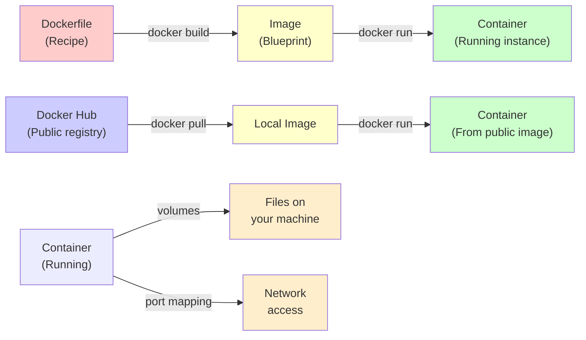

---
tags:
  - Beginner
  - Phase 0
---

# Module 3: Docker Basics

Welcome to Docker, the technology that makes "it works on my machine" finally become true for everyone. Docker solves one of the biggest problems in software development: making sure your code runs the same on your laptop, your coworker's computer, and a cloud server. Let's learn it from scratch.

---

## 🎯 What You Will Learn

By the end of this module, you will:

- Understand what Docker is and the problem it solves
- Know key Docker concepts: images, containers, Dockerfile, Docker Hub
- Install Docker on your Ubuntu machine
- Run your first Docker container from a public image
- Understand how containers differ from virtual machines
- Write a Dockerfile to package a Python application
- Build a Docker image from a Dockerfile
- Run, stop, and manage containers
- Mount volumes to share data between your machine and a container
- Map ports so containers can talk to the outside world
- Container all your Python projects for consistency and portability

---

## 🧠 Concept Explained: What Is Docker?

### The Analogy: Docker as a Shipping Container

Imagine you're a software company shipping your product around the world. The old way was like this:

"Here's our software running on Windows—good luck if you use Mac. Oh, we need libraries X, Y, and Z installed. Version 1.2 of Z, not 1.3, because 1.3 broke something. Also, you need Python 3.9, not 3.10."

Sometimes it worked. Often it didn't. Every machine was different, so code would break in mysterious ways.

**Docker is like a shipping container for software.**

A shipping container is a standardized steel box. It doesn't matter if you're shipping it to Tokyo, New York, or Sydney—the container stays the same. The ship's crane doesn't need to know what's inside. The truck driver doesn't care. It's always the same box.

**Docker containers work the same way:**

You package your application, its code, all its dependencies (Python 3.9, library Z version 1.2, everything), and a description of how to run it—all inside a container. Then that container runs the exact same way on your laptop, your friend's laptop, and a server in the cloud.

### Why We Need Docker

Without Docker, deploying software is a nightmare:

**Developer's machine:**

```
Ubuntu 22.04
Python 3.9
PostgreSQL 12
requests library 2.28
Node.js 16
```

**Coworker's machine:**

```
Windows 11
Python 3.10 (oops, different version!)
PostgreSQL 13 (also different!)
requests library 2.25 (old version!)
```

**Production server:**

```
CentOS 7
Python 3.8 (even older!)
PostgreSQL 10
requests library 2.20
```

The code breaks in different places on each system. Debugging is impossible.

**With Docker, everyone has the same versions:**

```
Container (includes everything):
├── Ubuntu 22.04
├── Python 3.9
├── PostgreSQL 12
├── requests 2.28
└── Your code
```

Run the same container everywhere. Everything works.

### Docker vs. Virtual Machines (They're Different!)

People often confuse Docker with VirtualBox or VMware:

**Virtual Machines (VMs):**

- You install an entire operating system inside your computer
- It includes the full OS, kernel, all system tools
- Very heavy (1-10 GB per VM)
- Slow to start (minutes)
- Use lots of resources

**Docker Containers:**

- You package just your application and its dependencies
- They share the host operating system's kernel
- Very lightweight (MB, not GB)
- Fast to start (seconds)
- Efficient resource use

Think of it this way:

- **VM**: A complete house delivered and assembled in your garage
- **Container**: A standardized closet with just your clothes and personal items that fits in your house

---

## 🔍 How It Works: The Container Journey

Let me show you the complete journey from Dockerfile to running Container:



### The Key Concepts

**Image**: A snapshot/blueprint for a container. It's like a class in programming—a definition. It contains:

- An operating system (or small base system)
- Your application code
- All dependencies and libraries
- Instructions for how to run the app

**Container**: A running instance of an image. It's like an object created from a class. It:

- Actually executes your code
- Has its own filesystem, processes, network
- Can be started, stopped, deleted
- Isolated from other containers

**Dockerfile**: Instructions that tell Docker how to build an image. It's like a recipe:

```
Start with Ubuntu image
Install Python
Copy my code into the container
Install the requirements my code needs
Run this command when the container starts
```

**Docker Hub**: A central registry (like GitHub but for Docker images) where people share images. Pre-made images for Ubuntu, Python, PostgreSQL, etc.

**Volume**: A way to share folders between your machine and a container. It's like a window between two worlds—the container can read and write files on your computer.

**Port Mapping**: A way to access a container's network ports from your machine. If a container has a web server listening on port 8080 inside, you can access it from your browser at `localhost:8000` (or whatever port you choose).

---

## 🛠️ Step-by-Step Guide

### Step 1: Install Docker on Ubuntu

First, let's get Docker running on your machine:

```bash
# Update the package manager
sudo apt update

# Install Docker and its dependencies
sudo apt install docker.io

# Start the Docker service (daemon)
sudo systemctl start docker

# Verify Docker is installed and running
docker --version    # Should show: Docker version X.XX.X
docker ps           # Should show: CONTAINER ID IMAGE COMMAND...
```

If you see an error about permissions, add your user to the docker group:

```bash
# Add your user to docker group so you don't need sudo every time
sudo usermod -aG docker $USER

# Log out and back in, or run this to apply immediately:
newgrp docker

# Now verify you can run docker without sudo:
docker ps
```

!!! warning
Be careful: users in the docker group can run containers that access your entire filesystem. This is a security consideration in shared systems.

### Step 2: Run Your First Container

Let's run a simple "Hello World" container:

```bash
# Run the hello-world container
docker run hello-world

# What Docker does behind the scenes:
# 1. Looks for hello-world image locally (doesn't find it)
# 2. Downloads it from Docker Hub
# 3. Runs the container
# 4. Container prints a message and exits
```

You should see:

```
Unable to find image 'hello-world:latest' locally
latest: Pulling from library/hello-world
2db29710123e: Pull complete
Digest: sha256:abc...
Status: Downloaded newer image for hello-world:latest

Hello from Docker!
...
```

Congratulations! You just ran your first container. That's Docker basics right there.

### Step 3: Run an Interactive Container

Let's run Ubuntu inside a container and interact with it:

```bash
# Run Ubuntu container interactively
# -i = interactive (keep stdin open)
# -t = allocate a terminal
# bash = the shell program to run
docker run -it ubuntu bash

# Now you're inside a container! You can type commands:
ls /                # List files (inside the container)
whoami              # Current user (root)
pwd                 # Current directory
apt update          # Update packages
echo "Hello from inside a container!"

# Exit the container
exit
```

After you exit, the container stops. But it still exists on your machine.

### Step 4: Manage Containers

Let's see what containers exist and manage them:

```bash
# List all running containers
docker ps

# List all containers (running and stopped)
docker ps -a

# You should see the ubuntu container from step 3 in the stopped list:
# CONTAINER ID  IMAGE   COMMAND  STATUS
# abc123        ubuntu  "bash"   Exited (0) 2 minutes ago

# Start that container again (use the CONTAINER ID or NAME)
docker start -i abc123    # The -i makes it interactive again

# Stop a running container
docker stop abc123

# Remove a container completely (after stopping it)
docker rm abc123

# Or remove it while it's running (force remove)
docker rm -f abc123
```

!!! note
Removing a container deletes it, but it doesn't affect the image. You can always create a new container from the same image.

### Step 5: Understand Images vs Containers

Let's explore images:

```bash
# List all images on your machine
docker images

# You should see hello-world and ubuntu from earlier

# Remove an image (only if no containers use it)
docker rmi ubuntu

# Re-download an image from Docker Hub
docker pull python:3.9

# This downloaded the official Python 3.9 image
docker images    # python should appear in the list
```

### Step 6: Write Your First Dockerfile

A Dockerfile is instructions for building an image. Let's create one:

```bash
# Create a directory for your project
mkdir my_docker_app
cd my_docker_app

# Create a Dockerfile (note: capital D, no extension)
cat > Dockerfile << 'EOF'
# Start from the official Python 3.9 image from Docker Hub
FROM python:3.9

# Set the working directory inside the container
# All following commands run here
WORKDIR /app

# Copy all files from current directory (.) to container's /app
COPY . .

# Run a command to install dependencies
# -m pip = run pip module
# install = the command to install packages
# -r requirements.txt = install from requirements file
RUN pip install -r requirements.txt

# Tell Docker which port the app listens on (we'll map this later)
EXPOSE 8000

# CMD specifies the default command when the container starts
# This command runs the Python script
CMD ["python", "app.py"]
EOF
```

Now let's create the app files:

```bash
# Create a simple Python application
cat > app.py << 'EOF'
# This is the application that will run in the container
print("Hello from Docker container!")
print("I'm running Python 3.9")
EOF

# Create a requirements.txt (dependencies list)
cat > requirements.txt << 'EOF'
# For now, no external dependencies needed
# In a real project, this would list things like:
# requests==2.28.0
# numpy==1.23.0
EOF
```

### Step 7: Build Your First Image

Now let's build an image from the Dockerfile:

```bash
# Build the image
# -t = tag/name the image
# . = use Dockerfile in current directory
docker build -t my_first_app .

# Watch Docker:
# 1. Read the Dockerfile
# 2. Execute each command line by line
# 3. Create layers (we'll explain this later)
# 4. Tag the final image as "my_first_app"

# Verify the image was created
docker images    # Should show my_first_app
```

### Step 8: Run Your Custom Image

Let's run a container from your image:

```bash
# Run the container
docker run my_first_app

# Expected output:
# Hello from Docker container!
# I'm running Python 3.9

# The container started, ran the command, and exited
```

### Step 9: Use Volumes to Share Files

Containers are isolated by default. If you want to work with files on your machine, you need volumes:

```bash
# Create a data folder on your machine
mkdir data

# Create a test file
echo "This is test data" > data/test.txt

# Run a container with a volume mount
# -v /path/on/machine:/path/in/container = share a folder
docker run -it -v $(pwd)/data:/app/data ubuntu bash

# Now inside the container:
ls /app/data           # You can see the files from your machine!
cat /app/data/test.txt # Read the file
echo "Modified in container" >> /app/data/test.txt

# Exit the container
exit

# Check on your machine
cat data/test.txt      # The modification is there!
```

The volume created a bridge—changes made in the container persist on your machine.

### Step 10: Map Ports for Network Access

If your container runs a web server, you need to expose it:

```bash
# Create an app that runs a web server
cat > web_app.py << 'EOF'
# Simple HTTP server
# This runs a web server inside the container on port 8000
import http.server
import socketserver
import os

PORT = 8000

# Change to the current directory
os.chdir('/app')

# Create a simple handler
Handler = http.server.SimpleHTTPRequestHandler

# Create the server
with socketserver.TCPServer(("", PORT), Handler) as httpd:
    print(f"Server running on port {PORT}...")
    httpd.serve_forever()
EOF

# Update requirements.txt if needed (for this example, we don't need anything)

# Create a simple HTML file to serve
cat > index.html << 'EOF'
<!DOCTYPE html>
<html>
<head><title>Docker App</title></head>
<body>
  <h1>Hello from Docker!</h1>
  <p>This is running inside a container.</p>
</body>
</html>
EOF

# Update the Dockerfile to run the web app instead
cat > Dockerfile << 'EOF'
FROM python:3.9

WORKDIR /app

COPY . .

RUN pip install -r requirements.txt

EXPOSE 8000

CMD ["python", "web_app.py"]
EOF

# Rebuild the image
docker build -t my_web_app .

# Run it with port mapping
# -p host_port:container_port = map ports
# -d = run in background (detached mode)
docker run -d -p 8000:8000 --name my_web_container my_web_app

# Now visit http://localhost:8000 in your browser!
# You should see "Hello from Docker!"

# View logs from the container
docker logs my_web_container

# Stop the container
docker stop my_web_container

# Remove it
docker rm my_web_container
```

!!! tip
Port mapping lets containers like web servers, databases, and APIs be accessible from your machine or the internet. Without it, the container is isolated from the network.

---

## 💻 Code Examples

### Example 1: Complete Python App Dockerfile

Here's a more realistic example with error handling and structure:

```dockerfile
# Start from official Python 3.9 slim image (smaller than full)
FROM python:3.9-slim

# Avoid writing bytecode and buffering output for better logging
ENV PYTHONDONTWRITEBYTECODE=1
ENV PYTHONUNBUFFERED=1

# Set working directory
WORKDIR /app

# Copy requirements first (better layer caching)
COPY requirements.txt .

# Install dependencies
RUN pip install --no-cache-dir -r requirements.txt

# Copy application code
COPY . .

# Create a non-root user for security (use python as user)
RUN useradd -m appuser && chown -R appuser:appuser /app
USER appuser

# Expose port 8000 (if it's a web app)
EXPOSE 8000

# Default command
CMD ["python", "main.py"]
```

**requirements.txt:**

```
requests==2.28.0
numpy==1.23.0
pandas==1.5.0
```

**Expected behavior:**

- When you `docker build -t myapp .`, it creates an image
- When you `docker run myapp`, it installs packages and runs main.py
- Smaller image size (slim base)
- Better security (non-root user)
- Better logging (unbuffered output)

### Example 2: Multi-Stage Build (Advanced)

This reduces image size by building in one stage and running in another:

```dockerfile
# Stage 1: Build
FROM python:3.9 AS builder

WORKDIR /app

COPY requirements.txt .

# Install to a virtual environment
RUN pip install --user -r requirements.txt

# Stage 2: Runtime
FROM python:3.9-slim

WORKDIR /app

# Copy only what you need from the builder stage
COPY --from=builder /root/.local /root/.local

# Add the installed packages to PATH
ENV PATH=/root/.local/bin:$PATH

# Copy your code
COPY . .

# Run
CMD ["python", "main.py"]
```

This technique creates a much smaller final image because stage 1 (which includes build tools) is discarded.

### Example 3: Working with Data Volumes

A complete example showing how to process files:

```bash
#!/bin/bash
# script_with_volumes.sh

# Create directories
mkdir -p input output

# Create some sample data
cat > input/data.txt << 'EOF'
Line 1 of data
Line 2 of data
Line 3 of data
EOF

# Create a Dockerfile
cat > Dockerfile << 'EOF'
FROM python:3.9

WORKDIR /app

COPY process.py .

# Volumes are specified, but actual mounting happens at runtime
CMD ["python", "process.py"]
EOF

# Create the processing script
cat > process.py << 'EOF'
# Script that reads from /data and writes to /output
import os

# Read input data
with open('/data/data.txt', 'r') as f:
    lines = f.readlines()

# Process it
processed = [f"Processed: {line.strip()}\n" for line in lines]

# Write output
with open('/output/result.txt', 'w') as f:
    f.writelines(processed)

print("Processing complete!")
EOF

# Build image
docker build -t data_processor .

# Run with volumes
docker run \
  -v $(pwd)/input:/data \
  -v $(pwd)/output:/output \
  data_processor

# Check the result on your machine
cat output/result.txt
```

**Expected output:**

```
Processed: Line 1 of data
Processed: Line 2 of data
Processed: Line 3 of data
```

### Example 4: Container Communication

Running multiple containers that talk to each other:

```bash
# Create a Docker network
docker network create mynetwork

# Run a simple "server" container
docker run -d \
  --name server \
  --network mynetwork \
  -p 8000:8000 \
  python:3.9 python -m http.server 8000

# Run a "client" container that talks to the server
docker run -it \
  --network mynetwork \
  python:3.9 bash

# Inside the client container:
apt update && apt install -y curl
curl http://server:8000   # Access the server by name!

# This works because they're on the same network
```

---

## ⚠️ Common Mistakes

### Mistake 1: Building Huge Images

**What Most Beginners Do:**

```dockerfile
# WRONG: Using full Python image with lots of unnecessary stuff
FROM python:3.9

WORKDIR /app

COPY requirements.txt .
RUN pip install -r requirements.txt

COPY . .

CMD ["python", "app.py"]
```

When you build this, the image is 800 MB because you're copying the entire Python installation.

**The Right Way:**

```dockerfile
# CORRECT: Use the slim variant
FROM python:3.9-slim

WORKDIR /app

COPY requirements.txt .

# --no-cache-dir saves space
RUN pip install --no-cache-dir -r requirements.txt

COPY . .

CMD ["python", "app.py"]
```

This is 200 MB. Much better! There are also `alpine` variants (20 MB) if you want even smaller.

!!! tip
Always use the smallest base image that works for your needs. Check Docker Hub for variants like `-slim`, `-alpine`, `-bullseye`.

### Mistake 2: Copying Everything Into the Container

**What Most Beginners Do:**

```dockerfile
FROM python:3.9

WORKDIR /app

# WRONG: Copies everything, including .git, test files, etc.
COPY . .

RUN pip install -r requirements.txt

CMD ["python", "app.py"]
```

This bloats your image with test files, git history, temp files, etc.

**The Right Way:**

```dockerfile
# Create a .dockerignore file (like .gitignore)
# In .dockerignore:
# __pycache__
# .git
# .gitignore
# *.pyc
# test/
# README.md

# Then in Dockerfile
FROM python:3.9

WORKDIR /app

COPY requirements.txt .
RUN pip install -r requirements.txt

# Only copy the code you need
COPY app.py .
COPY src/ src/

CMD ["python", "app.py"]
```

Use `.dockerignore` to exclude files, just like `.gitignore` for Git.

### Mistake 3: Changing Many Layers, Rebuild Wastes Cache

**What Most Beginners Do:**

```dockerfile
# WRONG: Putting COPY before RUN
FROM python:3.9

WORKDIR /app

COPY . .        # Layer A: Copies all your code
RUN pip install -r requirements.txt  # Layer B: Installs dependencies
```

Every time you change one line of code, Docker rebuilds layer A (copying), and then layer B (reinstalling all packages). This wastes time.

**The Right Way:**

```dockerfile
# CORRECT: Stable things first
FROM python:3.9

WORKDIR /app

COPY requirements.txt .                              # Layer A: Rarely changes
RUN pip install --no-cache-dir -r requirements.txt  # Layer B: Rarely changes

COPY . .        # Layer C: Changes frequently
CMD ["python", "app.py"]
```

Now when you change your code, only layer C rebuilds. Layers A and B are cached.

!!! note
Docker uses layer caching.Each line in a Dockerfile is a layer. If a layer hasn't changed, Docker reuses it instead of rebuilding.

### Mistake 4: Running as Root User

**What Most Beginners Do:**

```dockerfile
FROM python:3.9
WORKDIR /app
COPY . .
RUN pip install -r requirements.txt
# No USER specified - container runs as root
CMD ["python", "app.py"]
```

If someone breaks into your container, they have root access to your whole system.

**The Right Way:**

```dockerfile
FROM python:3.9
WORKDIR /app

# Create a non-root user
RUN useradd -m appuser

COPY . .
RUN pip install -r requirements.txt

# Switch to the non-root user
USER appuser

CMD ["python", "app.py"]
```

Now the container runs with limited permissions.

### Mistake 5: Forgetting to Clean Package Managers

**What Most Beginners Do:**

```dockerfile
FROM ubuntu:22.04

RUN apt update
RUN apt install -y python3 python3-pip wget curl
# All package manager cache stays in the image!
```

This wastes lots of space.

**The Right Way:**

```dockerfile
FROM ubuntu:22.04

# Install and clean up in the same RUN command (one layer)
RUN apt update && \
    apt install -y python3 python3-pip wget curl && \
    apt clean && \
    rm -rf /var/lib/apt/lists/*
```

This removes the cache right after installing, keeping the image small.

---

## ✅ Exercises

### Easy: Run Public Images and Explore

1. Run the `hello-world` image
2. Run an `ubuntu:22.04` container interactively
3. Inside the container:
   - List files with `ls /`
   - Check the operating system with `cat /etc/os-release`
   - Install a package with `apt update && apt install -y curl`
   - Exit with `exit`
4. List all your containers with `docker ps -a`
5. Remove one container with `docker rm`

**What to verify:**

- You can run containers interactively
- You understand that containers are isolated
- Containers can be started, stopped, and removed

### Medium: Build and Modify Your Own Image

1. Create a project folder with a Dockerfile
2. Write a simple Python script that prints your name and the current time
3. Create a Dockerfile that:
   - Uses `python:3.9-slim`
   - Copies your script into the container
   - Runs the script
4. Build the image with a meaningful name
5. Run the container
6. Modify your Python script to print something different
7. Rebuild the image and run it again
8. Notice the rebuild takes less time (layer caching)

**What to verify:**

- Your image builds successfully
- The container runs your Python code
- Layer caching works when you rebuild

### Hard: Multi-Container Project with Volumes

1. Create a project folder with:
   - A Python script that reads a file and processes it
   - A Dockerfile that packages your script
   - A Dockerfile for a second container that runs a different process
2. Use volumes to share input and output folders between containers
3. Create input data on your machine
4. Run both containers with volume mounts
5. Verify that data is shared and modified correctly

**What to verify:**

- Volumes work bidirectionally (container can read/write your machine's files)
- Multiple containers can be managed together
- You understand Docker's strengths in processing pipelines

---

## 🏗️ Mini Project: Containerize Your Word Counter

Let's take the `word_counter.py` script from Module 1 and containerize it so it runs in Docker with proper volume mounting.

### Project Goals

1. Create a Dockerfile for the word counter application
2. Build a Docker image
3. Run the container with volume mounting so it can:
   - Read text files from your machine
   - Write analysis reports to your machine
4. Verify the output files are created on your machine

### Step-by-Step Implementation

**Step 1: Set Up Your Project**

```bash
# Create a project folder
mkdir word_counter_docker
cd word_counter_docker

# Create input and output directories
mkdir input output

# Create some sample text files to analyze
cat > input/sample1.txt << 'EOF'
Python is a powerful programming language.
It is used for data analysis, web development, and artificial intelligence.
Python's simplicity makes it perfect for beginners.
With Python, you can build amazing things!
EOF

cat > input/sample2.txt << 'EOF'
Docker containers are lightweight and portable.
They package your application and all its dependencies.
You can run the same container anywhere.
Docker solves the "works on my machine" problem.
EOF
```

**Step 2: Copy the Word Counter Script**

Use the `word_counter.py` from Module 1:

```bash
# Create the word counter script
cat > word_counter.py << 'EOF'
# Word counter analysis tool
# Reads a file, analyzes it, and writes a report

def analyze_text_file(filename):
    # Initialize results dictionary to store our findings
    results = {
        "filename": filename,
        "lines": 0,
        "words": 0,
        "characters": 0,
    }

    try:
        # Open the file and read it line by line
        with open(filename, "r") as file:
            # Process each line in the file
            for line in file:
                # Increment line counter (we read one more line)
                results["lines"] += 1

                # Count all characters including spaces and newlines
                results["characters"] += len(line)

                # Split line by spaces to count words
                words_in_line = line.strip().split()
                # Add the word count from this line to total
                results["words"] += len(words_in_line)

        # Calculate average word length only if we have words
        if results["words"] > 0:
            # Divide total characters by total words
            results["avg_word_length"] = results["characters"] / results["words"]
            # Round to 2 decimal places for readability
            results["avg_word_length"] = round(results["avg_word_length"], 2)
        else:
            # If no words, set average to 0
            results["avg_word_length"] = 0

        # Return the results so the caller can use them
        return results

    except FileNotFoundError:
        # If the file doesn't exist, print error and return None
        print(f"ERROR: The file '{filename}' was not found!")
        return None


def display_results(results):
    # Check if we got valid results
    if results is None:
        # If results is None, something went wrong, so exit
        return

    # Print a formatted header
    print("\n" + "=" * 50)
    print("ANALYSIS RESULTS")
    print("=" * 50)

    # Print each statistic
    print(f"File analyzed: {results['filename']}")
    print(f"Total lines: {results['lines']}")
    print(f"Total words: {results['words']}")
    print(f"Total characters: {results['characters']}")
    print(f"Average word length: {results['avg_word_length']} characters")

    # Print footer
    print("=" * 50)
    print("Report saved to: output/analysis_report.txt")
    print("=" * 50 + "\n")


def save_report(results, output_filename):
    # Check if we have valid results to save
    if results is None:
        # If no results, don't save anything
        return

    # Open the output file for writing
    with open(output_filename, "w") as report_file:
        # Write a title
        report_file.write("=" * 50 + "\n")
        report_file.write("TEXT FILE ANALYSIS REPORT\n")
        report_file.write("=" * 50 + "\n\n")

        # Write each statistic to the file
        report_file.write(f"File: {results['filename']}\n")
        report_file.write(f"Lines: {results['lines']}\n")
        report_file.write(f"Words: {results['words']}\n")
        report_file.write(f"Characters: {results['characters']}\n")
        report_file.write(f"Average word length: {results['avg_word_length']} characters\n")
        report_file.write("\n" + "=" * 50 + "\n")


# Main program
if __name__ == "__main__":
    # Get the input filename from command line argument
    import sys

    # Check if filename was provided
    if len(sys.argv) < 2:
        # If not, print usage and exit
        print("Usage: python word_counter.py <input_file>")
        sys.exit(1)

    # Get the filename from arguments
    input_file = sys.argv[1]

    # Analyze the file
    results = analyze_text_file(input_file)

    # Display results on screen
    display_results(results)

    # Save report to output directory
    if results is not None:
        # Create output filename based on input filename
        output_file = f"output/report_{results['filename'].split('/')[-1]}"
        # Save the report
        save_report(results, output_file)
EOF
```

**Step 3: Create a Requirements File**

Since we're not using external libraries, this will be minimal:

```bash
# Create requirements.txt (currently empty, but good practice)
cat > requirements.txt << 'EOF'
# No external dependencies for this project
# But we include this file as a best practice
EOF
```

**Step 4: Create the Dockerfile**

Now write the Dockerfile to containerize the word counter:

```bash
# Create the Dockerfile
cat > Dockerfile << 'EOF'
# Start from the official Python 3.9 slim image
# Slim is smaller than the full image, which saves space
FROM python:3.9-slim

# Set the working directory inside the container
# All following commands run in this directory
WORKDIR /app

# Copy the requirements file
# This goes first because it rarely changes (good for caching)
COPY requirements.txt .

# Install any Python dependencies
# --no-cache-dir saves space in the image
RUN pip install --no-cache-dir -r requirements.txt

# Copy the word counter script into the container
# This goes last because it changes frequently
COPY word_counter.py .

# Create a non-root user for security
# This prevents someone from running the container as root
RUN useradd -m counter
# Switch to the non-root user
USER counter

# Set environment variables if needed
# PYTHONUNBUFFERED ensures print statements appear immediately
ENV PYTHONUNBUFFERED=1

# The default command when the container starts
# This uses the word counter script
# Arguments will be passed when running the container
ENTRYPOINT ["python", "word_counter.py"]
EOF
```

**Step 5: Build the Docker Image**

```bash
# Build the image
# -t gives it a name and tag
# . means use the Dockerfile in the current directory
docker build -t word-counter:1.0 .

# Verify the image was created
docker images | grep word-counter
```

**Expected output:**

```
REPOSITORY      TAG    IMAGE ID      CREATED        SIZE
word-counter    1.0    abc123def456  XX seconds ago 125MB
```

**Step 6: Run the Container with Volumes**

Now let's run the container with mounted volumes so it can access your files:

```bash
# Run the container with volume mounts
# -v binds directories between your machine and the container
# -v /path/on/machine:/path/in/container

docker run \
  -v $(pwd)/input:/input \
  -v $(pwd)/output:/output \
  word-counter:1.0 /input/sample1.txt

# This runs the word counter on input/sample1.txt
```

**Expected output:**

```
==================================================
ANALYSIS RESULTS
==================================================
File analyzed: /input/sample1.txt
Total lines: 4
Total words: 35
Total characters: 173
Average word length: 4.94 characters
==================================================
Report saved to: output/analysis_report.txt
==================================================
```

**Step 7: Check the Output Files**

Now verify that the report was written to your machine:

```bash
# Check what was created
ls -la output/

# Read the generated report
cat output/report_sample1.txt
```

**Expected output:**

```
==================================================
TEXT FILE ANALYSIS REPORT
==================================================

File: /input/sample1.txt
Lines: 4
Words: 35
Characters: 173
Average word length: 4.94 characters

==================================================
```

**Step 8: Process Multiple Files**

Now let's analyze the second file:

```bash
# Analyze the second sample file
docker run \
  -v $(pwd)/input:/input \
  -v $(pwd)/output:/output \
  word-counter:1.0 /input/sample2.txt

# Check both reports were created
ls -la output/
cat output/report_sample1.txt
cat output/report_sample2.txt
```

**Step 9: Create a Shell Script to Automate It**

For convenience, create a script that runs the analysis:

```bash
# Create an automation script
cat > run_analysis.sh << 'EOF'
#!/bin/bash
# Simple script to run the word counter on all txt files

# Make sure we have input files
if [ ! -d "input" ]; then
    echo "Error: input directory not found!"
    exit 1
fi

# Create output directory if it doesn't exist
mkdir -p output

# Run analysis for each text file
for file in input/*.txt; do
    echo "Analyzing: $file"

    # Run the Docker container
    docker run \
      -v $(pwd)/input:/input \
      -v $(pwd)/output:/output \
      word-counter:1.0 "$file"
done

echo ""
echo "Analysis complete! Reports saved in output/"
ls -la output/
EOF

# Make it executable
chmod +x run_analysis.sh

# Run it
./run_analysis.sh
```

**Step 10: Clean Up**

When you're done, clean up the containers:

```bash
# List all containers
docker ps -a

# Remove stopped containers
docker container prune

# Or remove specific containers
docker rm container_id

# You can keep the image (word-counter:1.0) for reuse
```

### What This Project Demonstrates

- ✅ **Packaging a Python app in Docker**
- ✅ **Using volumes to share data** between your machine and container
- ✅ **Building and running custom images**
- ✅ **Passing arguments to containerized applications**
- ✅ **Persistence** - output files created in the container appear on your machine
- ✅ **Repeatability** - run the same analysis consistently every time
- ✅ **Portability** - someone else can run this image without installing anything

### Next Steps

Try these improvements:

1. Add support for analyzing multiple files in one run
2. Add a progress bar using a library
3. Generate HTML reports instead of text
4. Run the analysis in parallel with multiple containers
5. Push your image to Docker Hub so others can use it

---

## 🔗 What's Next

You've now mastered Docker basics. Here's your path forward:

### Immediate Next Steps

1. **Containerize all your projects**: Use Docker for everything you build
2. **Learn Docker Compose**: Manage multiple containers together (databases, web servers, workers)
3. **Explore Docker Hub**: Find pre-made images for any tool you need
4. **Push to Docker Hub**: Share your images with others

### What You Can Do Now

- Package Python applications in containers
- Share reproducible environments with team members
- Run applications that work identically on any machine
- Isolate dependencies between projects
- Deploy applications to cloud services (AWS, Google Cloud, Azure)

### Advanced Docker Topics (For Later)

- **Docker Compose**: Run multi-container applications
- **Docker Networks**: Containers communicating with each other
- **Health Checks**: Ensure containers are running properly
- **Container Orchestration**: Kubernetes for managing many containers
- **Multi-Stage Builds**: Optimize image sizes
- **Security**: Best practices for securing containers

### Next Modules in Phase 0

After Phase 0, you'll be ready for:

1. **Phase 1: Core Python Concepts**
   - Functions, Classes, OOP
   - Data structures
   - Algorithms

2. **Phase 2: Data & Analysis**
   - Working with datasets
   - Pandas and numpy
   - Data visualization

3. **Phase 3: Web & APIs**
   - Flask web framework
   - Building APIs
   - REST principles

4. **Phase 4: AI & Machine Learning**
   - TensorFlow
   - Scikit-learn
   - Deep learning basics

Each of these phases will benefit from Docker. You'll containerize web apps, ML models, and data pipelines.

---

## 📚 Summary

In this module, you learned:

1. ✅ **Docker fundamentals** – What containers are and why they matter
2. ✅ **Images vs containers** – The blueprint vs the running instance
3. ✅ **Installation and setup** – Docker is ready to use
4. ✅ **Running public images** – Using pre-built images from Docker Hub
5. ✅ **Interactive containers** – Running Ubuntu and exploring the filesystem
6. ✅ **Writing Dockerfiles** – Creating your own images with FROM, COPY, RUN, CMD
7. ✅ **Building images** – `docker build` to create images from Dockerfiles
8. ✅ **Managing containers** – Running, stopping, removing, and listing
9. ✅ **Volumes** – Sharing files between your machine and containers
10. ✅ **Port mapping** – Accessing container services from your computer
11. ✅ **Real-world practice** – Containerizing the word counter from Module 1

Docker is one of the most valuable skills in modern software development. Every professional developer uses containers. You now understand the fundamentals and can package any Python application.

**Your code now works the same everywhere. That's Docker's magic. 🐋**
