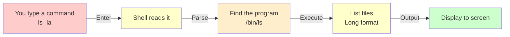

---
tags:
  - Beginner
  - Phase 0
---

# Module 4: Linux CLI Essentials

Welcome to the command line—the most powerful tool in a developer's toolkit. If you've been using a graphical interface (clicking buttons, dragging files), the terminal might seem intimidating. But it's actually faster, more powerful, and once you learn it, you'll never go back. Let's master it together.

---

## 🎯 What You Will Learn

By the end of this module, you will:

- Understand why developers prefer the terminal over graphical interfaces
- Navigate the filesystem confidently: know where you are and move around
- Manipulate files: copy, move, delete, view, and create them
- Find files and text using powerful search commands
- Understand file permissions and how to change them
- Manage running processes: see what's running, stop things, run in background
- Use pipes and redirection to chain commands together
- Work with environment variables to configure your system
- Install packages and manage software with package managers
- Write your first bash script to automate tasks
- Create reproducible project structures automatically
- Command any Linux system confidently

---

## 🧠 Concept Explained: Why Use the Terminal?

### The Analogy: Terminal as Direct Communication

Imagine you're at a restaurant:

**Graphical Interface (clicking buttons):** You point to a picture of what you want on a menu, the waiter nods, goes to the kitchen, and comes back with food. It's friendly and visual, but slow. If you want something slightly different, you have to describe it vaguely by pointing.

**Terminal (typing commands):** You directly tell the chef exactly what you want: "I need a pizza, medium, extra basil, no onions, have it in 5 minutes." It's fast, precise, and powerful. The chef can execute complex orders instantly.

**The terminal is like texting your computer directly.** Instead of:

1. Double-clicking a folder
2. Navigating through 5 directory levels
3. Looking for a file

You type one line that does all of it.

### Why Developers Love the Terminal

**Speed**: Typing `ls` is faster than clicking through folders.

**Power**: You can:

- Find all Python files containing the word "TODO" in 2 seconds
- Rename 1000 files at once
- Copy a folder to 10 different locations in parallel
- Automate entire workflows with scripts

**Reproducibility**: When you write a command, other people can run the exact same command and get the exact same result. Clicking buttons isn't reproducible.

**Remote Work**: If you SSH into a cloud server, you only have a terminal. No graphical interface.

**Scripting**: You can automate everything. Need to clean up temporary files every day? Write a script, schedule it to run automatically.

### The Terminal is Actually Safer

It sounds scary, but the terminal is actually safer than clicking:

- Typing `rm file.txt` is clear—you know exactly what will delete
- Clicking is vague—you might accidentally move something

Plus, the terminal warns you before dangerous operations.

---

## 🔍 How It Works: The Shell Environment

When you open a terminal, you're running a **shell**—a program that interprets your commands and executes them. On Ubuntu/Linux, it's usually `bash` (Bourne Again Shell).

```
Your fingers → Terminal window → Shell (bash) → Operating System
                                     ↓
                          Reads your command
                          Looks for the program
                          Executes it
```

The shell manages:

- **Current directory** (where you are right now)
- **Environment variables** (settings and paths)
- **History** (your previous commands)
- **PATH** (where to find programs)

Here's a visual of how your commands flow:



---

## 🛠️ Step-by-Step Guide

### Step 1: Understand the Prompt

When you open a terminal, you see something like:

```
user@ubuntu:~$
```

Breaking it down:

- `user` – your username
- `ubuntu` – computer name
- `~` – your current directory (~ means home directory)
- `$` – you can type here (not root; root shows `#`)

### Step 2: Find Out Where You Are

```bash
# Print working directory (where you are right now)
pwd

# Expected output (your path will be different):
# /home/user
```

Always know where you are. This is the first question to ask yourself in the terminal.

### Step 3: See What's in Your Current Directory

```bash
# List files in current directory
ls

# You might see:
# Desktop  Documents  Downloads  Music  Pictures  Public  Templates  Videos

# List files with more details (long format)
ls -l

# You'll see:
# total 48
# drwxr-xr-x 2 user user 4096 Mar 15 10:00 Desktop
# drwxr-xr-x 2 user user 4096 Mar 15 10:00 Documents
# -rw-r--r-- 1 user user 1234 Mar 15 10:00 file.txt

# Show all files including hidden ones (start with .)
ls -a

# You'll see:
# .   ..  .bashrc  .bash_profile  Desktop  Documents  file.txt

# Combine options (all files in long format)
ls -la

# This is the most useful version—use it constantly
```

!!! tip
`ls -la` is your friend. Use it whenever you're unsure what's in a directory. The `-l` shows details, `-a` shows hidden files.

### Step 4: Navigate Between Directories

```bash
# Change directory to Documents
cd Documents

# Check where you are now
pwd
# Output: /home/user/Documents

# Go back to home directory
cd ~

# Or just cd (with no arguments)
cd

# Both take you to home directory
pwd
# Output: /home/user

# Go to parent directory (one level up)
cd ..

pwd
# Output: /home

# Go back to the previous directory
cd -

pwd
# Output: /home/user/Documents (you flipped back to Documents)

# Navigate to a specific path
cd /home/user/Documents

pwd
# Output: /home/user/Documents
```

!!! note
`.` means "this directory" and `..` means "parent directory". You'll use these constantly.

### Step 5: Create Folders and Files

```bash
# Create a directory
mkdir my_project

# Verify it was created
ls

# Create nested directories (all at once)
mkdir -p my_project/src/data
# -p = create parents if needed
# Without -p, you'd get an error if my_project doesn't exist

# Navigate into your new folder
cd my_project

pwd
# Output: /home/user/my_project

# Create an empty file
touch README.md

# Create another file
touch main.py

# List what you created
ls -la
# Output:
# total 8
# drwxr-xr-x 2 user user 4096 Mar 15 10:05 .
# drwxr-xr-x 3 user user 4096 Mar 15 10:05 ..
# -rw-r--r-- 1 user user    0 Mar 15 10:05 README.md
# -rw-r--r-- 1 user user    0 Mar 15 10:05 main.py
# drwxr-xr-x 2 user user 4096 Mar 15 10:05 src
```

### Step 6: View File Contents

```bash
# Create a file with some content
echo "Hello, World!" > greeting.txt

# View the entire file
cat greeting.txt
# Output:
# Hello, World!

# View a file one page at a time (useful for large files)
less greeting.txt
# Press 'q' to quit
# Use arrow keys to scroll

# See first 10 lines of a file
head greeting.txt

# See last 5 lines
tail -n 5 greeting.txt

# Watch a file in real-time (tail -f)
# Useful for log files that update constantly
tail -f /var/log/syslog
# Press Ctrl+C to stop
```

### Step 7: Copy, Move, and Delete Files

```bash
# Copy a file
cp greeting.txt greeting_copy.txt

# Verify it was copied
ls

# Copy a folder and everything in it (recursive)
cp -r src src_backup

# Move a file (rename it)
mv greeting.txt hello.txt

# ls now shows:
# hello.txt (not greeting.txt)

# Move a file to another directory
mv hello.txt src/hello.txt

# Verify
ls src
# Output: hello.txt

# Delete a file
rm src/hello.txt

# Verify it's gone
ls src

# Delete a directory (must be empty)
rmdir src

# Delete a directory and everything in it (CAREFUL!)
rm -r src_backup
# -r = recursive delete
```

!!! danger
`rm` is permanent! There's no trash bin to recover from. Double-check before deleting, especially with `-r`.

### Step 8: Find Files

```bash
# Find all files with a certain name
find . -name "*.py"
# . = search from current directory
# -name "*.py" = find anything ending in .py

# Example output:
# ./main.py
# ./src/helper.py
# ./tests/test_main.py

# Find files modified in the last day
find . -mtime -1

# Find files larger than 10 MB
find . -size +10M

# Find and delete files matching a pattern
find . -name "*.tmp" -delete
# This finds and deletes all .tmp files
```

### Step 9: Search File Contents with grep

```bash
# Create a file with some text
cat > notes.txt << 'EOF'
TODO: Fix the login bug
The database connection is slow
TODO: Add error handling
Everything else is fine
EOF

# Find lines containing "TODO"
grep "TODO" notes.txt
# Output:
# TODO: Fix the login bug
# TODO: Add error handling

# Search recursively in a directory
grep -r "database" .
# Shows all files containing "database"

# Count matching lines
grep -c "TODO" notes.txt
# Output: 2

# Invert match (show lines NOT matching)
grep -v "TODO" notes.txt
# Output:
# The database connection is slow
# Everything else is fine

# Case-insensitive search
grep -i "todo" notes.txt
# Matches TODO, Todo, todo, etc.
```

### Step 10: Understand File Permissions

When you do `ls -l`, you see permissions like `drwxr-xr-x`. Let me explain:

```
drwxr-xr-x
├─ d = directory
├─ rwx = owner can read, write, execute
├─ r-x = group can read and execute (not write)
└─ r-x = others can read and execute (not write)
```

The numbers (755, 644) are shorthand:

- 4 = read
- 2 = write
- 1 = execute

So `755` = 7 (owner, 4+2+1) 5 (group, 4+1) 5 (others, 4+1)

```bash
# Give a file to yourself
chmod 644 myfile.txt
# 6 (owner: read+write) 4 (group: read) 4 (others: read)

# Make a script executable
chmod 755 script.sh
# 7 (owner: read+write+execute) 5 (group: read+execute) 5 (others: read+execute)

# Make a file readable only by you
chmod 600 secret.txt
# 6 (owner: read+write) 0 (group: nothing) 0 (others: nothing)

# Change owner of a file
sudo chown user:user myfile.txt
# Requires sudo because changing ownership is restricted
```

!!! note
Most files need `644`. Executable scripts and programs need `755`. Secret files need `600`.

### Step 11: Manage Running Processes

```bash
# See all running processes
ps aux
# Output shows many processes

# See only your processes
ps

# See processes interactively with resource usage
top
# Press 'q' to quit

# Run a command in the background
python3 slow_script.py &
# The & at the end means "run in background"

# The command runs while you can still type

# See background jobs
jobs
# Output:
# [1]+  Running   python3 slow_script.py &

# Bring a background job to foreground
fg %1
# %1 refers to job number 1

# Kill a process
kill 1234
# 1234 is the process ID (PID)

# Force kill a process
kill -9 1234

# Run something that keeps running even if you disconnect
nohup python3 server.py &
# nohup = no hangup
# Output goes to nohup.out

# Find a specific process
ps aux | grep python
# This searches the output of ps
```

### Step 12: Pipes and Redirection

Pipes and redirection are how you chain commands together. This is where the terminal becomes super powerful.

```bash
# Redirect output to a file (overwrite)
ls > directory_list.txt

# Check what was written
cat directory_list.txt
# Shows the output of ls

# Append to a file (don't overwrite)
ls >> directory_list.txt
# directory_list.txt now has the output twice

# Redirect error output
python3 nonexistent.py 2> errors.txt
# 2> captures error messages (stderr)
# 1> captures normal output (stdout)

# Pipe output from one command to another
ls -la | grep ".py"
# Lists all files, then filters to only .py files

# Count how many Python files
find . -name "*.py" | wc -l
# wc -l counts lines

# Sort the output
ls | sort

# Get unique lines
echo -e "apple\nbanana\napple\ncherry" | sort | uniq
# uniq removes duplicate consecutive lines
```

!!! tip
Pipes (`|`) are the magic that makes the terminal so powerful. Learn to use them.

### Step 13: Environment Variables

Environment variables are settings that programs can read. They control behavior system-wide.

```bash
# View all environment variables
env

# View a specific variable
echo $PATH
# Output shows all directories where programs are searched for

# Set a variable (just for this terminal session)
export MY_VAR="Hello"

# Use it
echo $MY_VAR
# Output: Hello

# But if you close the terminal, it's gone!
# To make it permanent, add it to ~/.bashrc

# View your shell configuration
cat ~/.bashrc

# Add a variable permanently
echo 'export MY_VAR="Hello"' >> ~/.bashrc

# Reload the configuration
source ~/.bashrc

# Now the variable persists
```

### Step 14: Install Software with apt

```bash
# Update package list (always do this first!)
sudo apt update

# Upgrade installed packages
sudo apt upgrade

# Install a package
sudo apt install python3-pip

# Check if something is installed
which python3
# Output: /usr/bin/python3

# Remove a package
sudo apt remove python3-pip

# Search for packages
apt search python | grep web
# Find packages related to python and web
```

!!! warning
`apt install` requires `sudo` because it modifies system files. Always use `sudo apt update` before installing.

### Step 15: Write Your First Bash Script

A bash script is a file containing commands that the shell executes line by line.

```bash
# Create a simple script
cat > hello.sh << 'EOF'
#!/bin/bash
# This is a bash script

# Print a message
echo "Hello from bash!"

# Create a variable
NAME="World"

# Use the variable
echo "Hello, $NAME!"

# Run a command and capture output
CURRENT_DATE=$(date)
echo "Today is: $CURRENT_DATE"

# Do some math
RESULT=$((5 + 3))
echo "5 + 3 = $RESULT"
EOF

# Make it executable
chmod +x hello.sh

# Run it
./hello.sh

# Expected output:
# Hello from bash!
# Hello, World!
# Today is: Sat Mar 15 10:30:45 UTC 2026
# 5 + 3 = 8
```

The first line `#!/bin/bash` tells the system to execute this with bash. It's called a **shebang**.

---

## 💻 Code Examples

### Example 1: Navigate and Explore

```bash
# Start at home
cd ~

# Create a test project
mkdir -p test_project/data

# Navigate in
cd test_project

# Where are we?
pwd
# Output: /home/user/test_project

# What's here?
ls -la
# Output:
# total 12
# drwxr-xr-x 3 user user 4096 Mar 15 10:35 .
# drwxr-xr-x 4 user user 4096 Mar 15 10:35 ..
# drwxr-xr-x 2 user user 4096 Mar 15 10:35 data

# Go up one level
cd ..

# Where are we now?
pwd
# Output: /home/user

# Go back into test_project
cd test_project

# Go to data subfolder
cd data

# Verify the path
pwd
# Output: /home/user/test_project/data
```

### Example 2: Work with Files

```bash
# Create some files
echo "This is a poem" > poem.txt
echo "Roses are red" >> poem.txt
echo "Violets are blue" >> poem.txt
echo "Technology is cool" >> poem.txt

# View the file
cat poem.txt
# Output:
# This is a poem
# Roses are red
# Violets are blue
# Technology is cool

# See first 2 lines
head -n 2 poem.txt
# Output:
# This is a poem
# Roses are red

# See last 2 lines
tail -n 2 poem.txt
# Output:
# Violets are blue
# Technology is cool

# Copy it
cp poem.txt poem_backup.txt

# Search in the file
grep "blue" poem.txt
# Output: Violets are blue

# Count lines
wc -l poem.txt
# Output: 4 poem.txt
```

### Example 3: Pipes and Filtering

```bash
# Create a list of names
cat > names.txt << 'EOF'
Alice
Bob
Charlie
Alice
David
EOF

# Show all names
cat names.txt
# Output:
# Alice
# Bob
# Charlie
# Alice
# David

# Show only unique names, sorted
cat names.txt | sort | uniq
# Output:
# Alice
# Bob
# Charlie
# David

# Count how many unique names
cat names.txt | sort | uniq | wc -l
# Output: 4

# Find and delete files with a pattern
touch temp1.tmp
touch temp2.tmp
touch important.txt

# Find all .tmp files
find . -name "*.tmp"
# Output:
# ./temp1.tmp
# ./temp2.tmp

# Delete them
find . -name "*.tmp" -delete

# Verify
ls
# Output: important.txt names.txt poem.txt poem_backup.txt
```

### Example 4: Writing a Useful Bash Script

```bash
# Create a script that counts files of each type
cat > analyze.sh << 'EOF'
#!/bin/bash
# This script analyzes files in the current directory

echo "=== File Analysis ==="

# Count total files
TOTAL=$(find . -type f | wc -l)
echo "Total files: $TOTAL"

# Count Python files
PY_COUNT=$(find . -name "*.py" | wc -l)
echo "Python files: $PY_COUNT"

# Count text files
TXT_COUNT=$(find . -name "*.txt" | wc -l)
echo "Text files: $TXT_COUNT"

# Find largest file
echo ""
echo "Largest file:"
find . -type f -exec ls -lh {} \; | sort -k5 -h | tail -1 | awk '{print $9, $5}'

# Show directory size
echo ""
echo "Directory size:"
du -sh .
EOF

# Make it executable
chmod +x analyze.sh

# Run it
./analyze.sh

# Expected output (based on your files):
# === File Analysis ===
# Total files: 8
# Python files: 0
# Text files: 3
#
# Largest file:
# ./poem_backup.txt 34B
#
# Directory size:
# 40K	.
```

---

## ⚠️ Common Mistakes

### Mistake 1: Forgetting Where You Are

**What Most Beginners Do:**

```bash
# You type commands thinking you're in one directory
rm file.txt

# But you're actually in a different directory!
# Oops, you deleted the wrong file
```

**The Right Way:**

```bash
# Always check where you are first
pwd

# Understand your prompt
# It usually shows your current directory

# Before any dangerous command, verify location
echo "Currently at: $(pwd)"
rm file.txt
```

!!! tip
Make it a habit: always know where you are. Type `pwd` frequently.

### Mistake 2: Using `rm` Without Checking

**What Most Beginners Do:**

```bash
# You want to delete some files
rm *.tmp     # Delete all .tmp files

# But you actually typed .tx not .tmp
rm *.tx      # You just deleted all .tx files!
```

**The Right Way:**

```bash
# Preview what will be deleted first
find . -name "*.tmp"

# Verify it's what you want, then delete
find . -name "*.tmp" -delete

# Or delete more carefully:
rm temp1.txt
rm temp2.txt
# Delete one at a time
```

!!! danger
`rm` is permanent. Always think before typing it. Consider `find` with `-delete` because it shows you what will be deleted.

### Mistake 3: Not Understanding Paths

**What Most Beginners Do:**

```bash
# You're at /home/user/myproject

# Try to access a file
cat ../readme.txt

# But you actually wanted the file in a different location
cat documents/readme.txt

# Confusion about / vs relative paths
cd /myproject      # Tries to go to root folder
cd myproject       # Goes to myproject in current directory
```

**The Right Way:**

```bash
# Always use clear paths
pwd   # Know where you are

# Go to home, then navigate
cd ~
cd myproject
cd ..

# Or use absolute paths
cd /home/user/myproject

# Use pwd to verify
pwd
```

!!! note
`/home/user` is absolute (from root). `../folder` is relative (from current). Use `pwd` to understand paths.

### Mistake 4: Ignoring the Shebang in Scripts

**What Most Beginners Do:**

```bash
# Create a script without shebang
cat > script.sh << 'EOF'
echo "Hello"
EOF

# Try to chmod and run it
chmod +x script.sh
./script.sh

# Sometimes it works, sometimes doesn't—unpredictable!
```

**The Right Way:**

```bash
# Always start with shebang
cat > script.sh << 'EOF'
#!/bin/bash
# Now it's clear this is a bash script
echo "Hello"
EOF

chmod +x script.sh
./script.sh
```

!!! tip
Every script needs a shebang. For Python: `#!/usr/bin/env python3`. For bash: `#!/bin/bash`.

### Mistake 5: Running Commands Without Understanding Output

**What Most Beginners Do:**

```bash
# You run a complex command you found online
find . -name "*.txt" -delete

# Didn't preview it first
# Now you've deleted important files!

# Or you run grep without checking the output
grep "password" . -r

# It outputs to the terminal but you don't capture it
# Better to save to a file first
```

**The Right Way:**

```bash
# Always preview commands first
find . -name "*.tmp"    # See what matches

# Then execute
find . -name "*.tmp" -delete

# For grep, save output to review
grep "error" logs.txt > errors.txt

# View and verify before deleting or acting on results
cat errors.txt
```

---

## ✅ Exercises

### Easy: Navigation and Listing

1. Open a terminal
2. Find out where you are with `pwd`
3. List files in your home directory with `ls -la`
4. Navigate to `/tmp` with `cd /tmp`
5. Create a test folder: `mkdir cli_test`
6. Navigate into it: `cd cli_test`
7. Create a file: `touch hello.txt`
8. View the directory contents: `ls -la`
9. Go back home: `cd ~`
10. Verify you're home: `pwd`

**What to verify:**

- You understand relative and absolute paths
- You can navigate freely
- You know what `ls -la` shows

### Medium: File Operations and Searching

1. Create a project folder structure:
   ```bash
   mkdir -p my_project/{src,data,tests}
   ```
2. Create several files in `src`:
   ```bash
   touch my_project/src/main.py my_project/src/helper.py my_project/src/utils.py
   ```
3. Create a text file with content:
   ```bash
   echo "TODO: Fix bug #123" > my_project/TODO.txt
   echo "TODO: Add tests" >> my_project/TODO.txt
   echo "Done: Update documentation" >> my_project/TODO.txt
   ```
4. Find all files ending in `.py`: `find my_project -name "*.py"`
5. Search for "TODO" in the entire project: `grep -r "TODO" my_project`
6. Copy the TODO file: `cp my_project/TODO.txt my_project/TODO_backup.txt`
7. Count lines in the TODO file: `wc -l my_project/TODO.txt`
8. Delete the backup: `rm my_project/TODO_backup.txt`

**What to verify:**

- You can create complex directory structures
- You can find files and grep them
- You understand filtering and pipes

### Hard: Scripting and Pipes

1. Create a script that:
   - Accepts a directory as an argument
   - Counts Python files in it
   - Finds the oldest file
   - Finds the largest file
   - Reports disk usage
2. Test your script on different directories
3. Create another script that:
   - Creates a dated backup of all .py files
   - Uses pipes to compress them
   - Reports stats about what was backed up

**What to verify:**

- You can write working bash scripts
- You understand command piping
- You can chain multiple commands together

---

## 🏗️ Mini Project: Project Setup Script

Write a bash script `init_project.sh` that automates project creation. When you run it, it should:

1. Create a project directory structure
2. Initialize a Python virtual environment
3. Create a `.gitignore` file
4. Create a `README.md` template
5. Create folder structure: `src/`, `tests/`, `data/`, `docs/`
6. Verify everything worked

### Implementation

**Step 1: Create the Script**

````bash
# Create the script
cat > init_project.sh << 'EOF'
#!/bin/bash
# Project initialization script
# Usage: ./init_project.sh project_name

# Check if project name was provided
if [ $# -eq 0 ]; then
    # No arguments provided
    echo "Usage: ./init_project.sh <project_name>"
    echo "Example: ./init_project.sh my_awesome_app"
    exit 1
fi

# Get the project name from the first argument
PROJECT_NAME=$1

# Check if directory already exists
if [ -d "$PROJECT_NAME" ]; then
    # Directory exists, warn the user
    echo "Directory $PROJECT_NAME already exists!"
    exit 1
fi

# Create the main project directory
mkdir "$PROJECT_NAME"

# Navigate into the project
cd "$PROJECT_NAME"

# Create subdirectories
mkdir -p src
mkdir -p tests
mkdir -p data
mkdir -p docs

# Create a README.md template
cat > README.md << 'READMEEOF'
# {{ PROJECT_NAME }}

## Description
Add your project description here.

## Installation

  1. Clone the repository
  2. Create virtual environment: `python3 -m venv venv`
  3. Activate: `source venv/bin/activate`
  4. Install dependencies: `pip install -r requirements.txt`

## Usage

  Run the main script:
  ```bash
  python src/main.py
````

## Testing

Run tests:

```bash
python -m pytest tests/
```

## License

MIT

READMEEOF

# Replace the placeholder in README

sed -i "s/{{ PROJECT_NAME }}/$PROJECT_NAME/g" README.md

# Create a .gitignore file for Python projects

cat > .gitignore << 'GITIGNOREEOF'

# Python virtual environment

venv/
env/
ENV/

# Python cache and compiled files

**pycache**/
_.py[cod]
_$py.class
\*.so

# IDE settings

.vscode/
.idea/
_.swp
_.swo

# macOS

.DS_Store

# Environment variables

.env
.env.local

# Temporary files

_.tmp
_.log

# OS specific

Thumbs.db

# Project data (if using real data)

data/_.csv
data/_.json

GITIGNOREEOF

# Create a requirements.txt file

touch requirements.txt

# Create a src/main.py template

cat > src/main.py << 'MAINEOF'
#!/usr/bin/env python3
"""
Main module for {{ PROJECT_NAME }}
"""

def main():
"""Main entry point"""
print(f"Welcome to {{ PROJECT_NAME }}!")

if **name** == "**main**":
main()

MAINEOF

# Replace placeholder in main.py

sed -i "s/{{ PROJECT_NAME }}/$PROJECT_NAME/g" src/main.py

# Create an empty **init**.py so src is a package

touch src/**init**.py

# Create a tests/**init**.py

touch tests/**init**.py

# Create a template test file

cat > tests/test_main.py << 'TESTEOF'
"""
Tests for main module
"""

def test_placeholder():
"""Placeholder test"""
assert True

TESTEOF

# Create Python virtual environment

python3 -m venv venv

# Activate the virtual environment and show next steps

echo ""
echo "=========================================="
echo "Project '$PROJECT_NAME' initialized!"
echo "=========================================="
echo ""
echo "Next steps:"
echo " 1. Navigate to project: cd $PROJECT_NAME"
echo " 2. Activate virtual environment: source venv/bin/activate"
echo " 3. Install dependencies: pip install -r requirements.txt"
echo " 4. Start coding: edit src/main.py"
echo ""
echo "Project structure created:"
tree -L 2 . 2>/dev/null || find . -type f | head -20

EOF

# Make the script executable

chmod +x init_project.sh

# Test it

./init_project.sh test_app

```

**Expected output:**

```

==========================================
Project 'test_app' initialized!
==========================================

Next steps:

1. Navigate to project: cd test_app
2. Activate virtual environment: source venv/bin/activate
3. Install dependencies: pip install -r requirements.txt
4. Start coding: edit src/main.py

Project structure created:
./venv
./src
./src/main.py
./src/**init**.py
./docs
./tests
./tests/**init**.py
./tests/test_main.py
./data
./README.md
./requirements.txt
./.gitignore

````

**Step 2: Verify the Structure**

```bash
# Navigate into the new project
cd test_app

# List everything
ls -la

# Check the structure
tree . 2>/dev/null || find . -type d | head -10

# View the README
cat README.md

# Verify virtual environment
ls venv/

# View main.py
cat src/main.py
````

**Step 3: Test the Virtual Environment**

```bash
# Activate the virtual environment
source venv/bin/activate

# You should see (venv) at the start of your prompt
# (venv) user@ubuntu:~/test_app$

# Check Python
which python3
# Output should point to the venv: .../test_app/venv/bin/python3

# Deactivate when done
deactivate

# You're back to normal prompt
```

### Project Structure Created

```
test_app/
├── src/
│   ├── __init__.py
│   └── main.py
├── tests/
│   ├── __init__.py
│   └── test_main.py
├── data/
├── docs/
├── venv/
├── README.md
├── requirements.txt
└── .gitignore
```

### What This Script Does

- ✅ Creates a complete project structure
- ✅ Initializes Python virtual environment automatically
- ✅ Creates template files (README, main.py, tests)
- ✅ Adds `.gitignore` for Python projects
- ✅ Makes the project immediately ready to use
- ✅ Shows helpful next steps
- ✅ Reusable for any new project

---

## 🔗 What's Next

You've now mastered the Linux terminal! Here's your path forward:

### Immediate Next Steps

1. **Use the terminal for everything**: From now on, do all your coding in the terminal
2. **Write more scripts**: Automate repetitive tasks
3. **Learn advanced tools**: grep, sed, awk, cut, tr
4. **Practice with real projects**: Use the terminal daily

### What You Can Do Now

- Navigate your filesystem confidently
- Find and manipulate files
- Automate tasks with scripts
- Search for text across files
- Manage processes and jobs
- Work on remote servers (SSH)
- Chain commands with pipes
- Install and manage software
- Create reproducible project setups

### Advanced Terminal Topics (For Later)

- **Regular expressions**: Advanced grep and sed
- **Cron jobs**: Schedule scripts to run automatically
- **Shell scripting**: Advanced bash programming
- **SSH and remote servers**: Work on cloud machines
- **systemd and init**: Manage system services
- **Package managers**: More about apt, pip, npm

### Connection to Other Modules

Remember:

- **Module 1 (Python)**: Run Python scripts from the terminal
- **Module 2 (Git)**: Use Git commands in the terminal
- **Module 3 (Docker)**: Run Docker commands in the terminal
- **Module 4 (CLI)**: Everything uses the terminal

They all work together!

---

## 📚 Summary

In this module, you learned:

1. ✅ **Why the terminal** – It's faster and more powerful than clicking
2. ✅ **Navigation** – Understand paths, move around (`cd`, `pwd`)
3. ✅ **File operations** – Create, view, copy, delete files
4. ✅ **Finding things** – Locate files and search content
5. ✅ **Permissions** – Understand and change file permissions
6. ✅ **Process management** – See what's running, stop things
7. ✅ **Piping** – Chain commands together for power
8. ✅ **Environment** – Configure your system with variables
9. ✅ **Package management** – Install software with apt
10. ✅ **Scripting** – Automate tasks with bash scripts

The terminal is your superpower. Master it, and you can do anything on a Linux system.

---

## 🔧 Command Cheat Sheet

| Command          | Function                      | Example                                  |
| ---------------- | ----------------------------- | ---------------------------------------- |
| `pwd`            | Print working directory       | `pwd` → `/home/user`                     |
| `ls`             | List files                    | `ls -la` → shows all with details        |
| `cd`             | Change directory              | `cd myproject` → navigate to folder      |
| `mkdir`          | Make directory                | `mkdir -p a/b/c` → create nested folders |
| `rmdir`          | Remove directory (empty only) | `rmdir emptydir`                         |
| `touch`          | Create empty file             | `touch newfile.txt`                      |
| `cat`            | View entire file              | `cat file.txt` → show contents           |
| `less`           | View file page by page        | `less file.txt` → press q to quit        |
| `head`           | Show first lines              | `head -n 5 file.txt` → first 5 lines     |
| `tail`           | Show last lines               | `tail -n 10 file.txt` → last 10 lines    |
| `cp`             | Copy file                     | `cp original.txt copy.txt`               |
| `cp -r`          | Copy directory recursively    | `cp -r folder/ backup/`                  |
| `mv`             | Move or rename                | `mv old.txt new.txt`                     |
| `rm`             | Delete file (permanent!)      | `rm file.txt`                            |
| `rm -r`          | Delete directory recursively  | `rm -r folder/`                          |
| `find`           | Find files by name            | `find . -name "*.py"`                    |
| `grep`           | Search file contents          | `grep "keyword" file.txt`                |
| `grep -r`        | Search recursively            | `grep -r "bug" .`                        |
| `chmod`          | Change permissions            | `chmod 755 script.sh`                    |
| `chown`          | Change owner                  | `sudo chown user:user file.txt`          |
| `ps`             | See running processes         | `ps aux`                                 |
| `ps aux \| grep` | Find specific process         | `ps aux \| grep python`                  |
| `top`            | Interactive process viewer    | `top` → press q to quit                  |
| `kill`           | Stop a process                | `kill 1234` (use PID from ps)            |
| `kill -9`        | Force stop                    | `kill -9 1234` → forcefully stops        |
| `&`              | Run in background             | `python slow.py &`                       |
| `jobs`           | See background jobs           | `jobs` → list running jobs               |
| `fg`             | Bring to foreground           | `fg %1` → bring job 1 to foreground      |
| `nohup`          | Run even if logout            | `nohup python server.py &`               |
| `\|`             | Pipe output                   | `ls \| grep python`                      |
| `>`              | Redirect to file (overwrite)  | `ls > list.txt`                          |
| `>>`             | Redirect append to file       | `echo "text" >> file.txt`                |
| `<`              | Redirect input from file      | `sort < unsorted.txt`                    |
| `env`            | Show environment variables    | `env` → list all variables               |
| `echo $VAR`      | View specific variable        | `echo $PATH`                             |
| `export`         | Set environment variable      | `export MY_VAR="value"`                  |
| `apt update`     | Update package list           | `sudo apt update`                        |
| `apt install`    | Install package               | `sudo apt install python3-pip`           |
| `apt remove`     | Remove package                | `sudo apt remove package`                |
| `which`          | Find program path             | `which python3`                          |
| `chmod +x`       | Make script executable        | `chmod +x script.sh`                     |
| `./script.sh`    | Run a script                  | `./myscript.sh`                          |
| `bash script.sh` | Run script with bash          | `bash myscript.sh`                       |
| `source`         | Load shell configuration      | `source ~/.bashrc`                       |
| `wc`             | Word/line count               | `wc -l file.txt` → count lines           |
| `sort`           | Sort lines                    | `sort file.txt`                          |
| `uniq`           | Remove duplicate lines        | `sort file.txt \| uniq`                  |
| `cut`            | Extract columns               | `cut -d, -f1 data.csv`                   |
| `tr`             | Translate characters          | `tr 'a-z' 'A-Z' < input.txt`             |
| `du`             | Disk usage                    | `du -sh folder` → human-readable size    |
| `df`             | Disk free space               | `df -h` → show all filesystems           |
| `zip`            | Create archive                | `zip -r archive.zip folder/`             |
| `unzip`          | Extract archive               | `unzip archive.zip`                      |
| `tar`            | Create/extract tar            | `tar -czf archive.tar.gz folder/`        |
| `man`            | Show command help             | `man ls` → documentation for ls          |
| `history`        | Show command history          | `history` → list recent commands         |
| `clear`          | Clear screen                  | `clear`                                  |
| `whoami`         | Current user                  | `whoami`                                 |
| `date`           | Current date/time             | `date`                                   |

---

**Congratulations! You've mastered the Linux terminal. You're now a true developer. 🎉**
