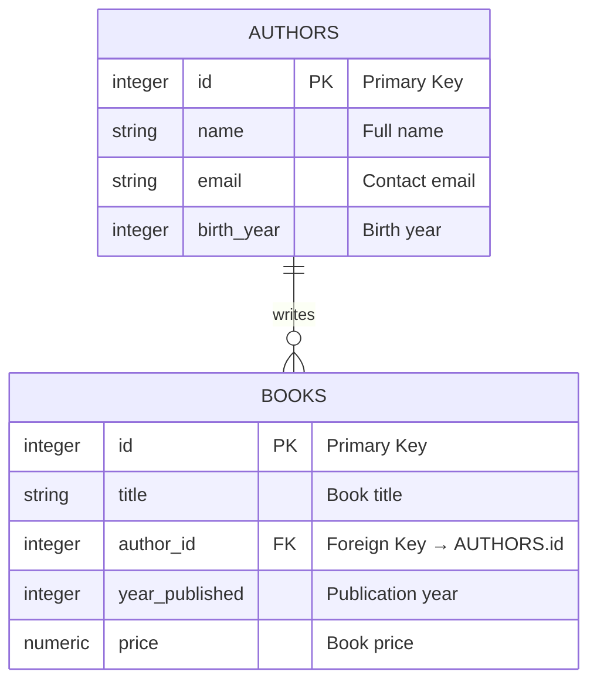

---
tags:
  - Beginner
  - Phase 0
---

# Module 5: PostgreSQL Basics

Welcome to databases—the backbone of every real application. While Python stores data in memory (lost when your program ends) and files store data as plain text, databases are built specifically to _manage, organize, and reliably access data_. In this module, you'll learn PostgreSQL, one of the most popular databases in the world.

---

## 🎯 What You Will Learn

By the end of this module, you will:

- Understand what a relational database is and why it's better than files
- Install PostgreSQL on Ubuntu and verify it's running
- Connect to PostgreSQL using the `psql` terminal tool
- Create databases, tables, and columns with purpose
- Choose the right data type for each column (INTEGER, TEXT, BOOLEAN, etc.)
- Insert, read, update, and delete data (CRUD operations)
- Filter and sort data to find exactly what you need
- Link tables together with primary and foreign keys
- Join tables to find relationships between data
- Connect your Python scripts to PostgreSQL using psycopg2
- Build a real application that stores and retrieves data persistently

---

## 🧠 Concept Explained: What Is a Database?

### The Analogy: Database as a Smart Spreadsheet

Imagine a library:

**Traditional file approach (CSV or JSON):**
You have a massive Excel spreadsheet with all books and all author information on the same sheet. If one author writes two books, you repeat their information twice. If author information has 50 fields, you repeat all 50 for each book. It wastes space and causes problems: update an author's email in one place and forget to update the other, and now you have a contradiction.

**Relational database approach:**
You have separate sheets:

- **Authors sheet**: ID, Name, Email, Birth Year
- **Books sheet**: ID, Title, Author ID, Year Published

The Author ID link connects them. One author, listed once, can have many books pointing to them. Update the email in one place, and it's updated everywhere.

### Why Databases Are Better Than Files

**Consistency**: The same data exists in only one place.

**Speed**: Databases are optimized for searching. Finding "all books by Stephen King" takes milliseconds, even with a million books.

**Reliability**: Databases protect your data. If your program crashes mid-write, databases ensure data integrity.

**Scalability**: Databases handle millions of records efficiently. Your Python list would crash.

**Security**: Databases can encrypt, backup, and control who accesses what.

### The Relational Model

A **relational database** like PostgreSQL organizes data into **tables** (like spreadsheets). Tables have:

- **Rows**: Individual records (one book, one author)
- **Columns**: Fields (title, author, year)
- **Data types**: Rules for what kind of data each column holds (text? number? date?)
- **Relationships**: Links between tables (which author wrote this book?)

---

## 🔍 How It Works: The Database Architecture

When you use PostgreSQL, here's what happens behind the scenes:

```
Your Python Script
        ↓
Connect to PostgreSQL Server
        ↓
Send SQL Commands (SELECT, INSERT, etc.)
        ↓
PostgreSQL Engine
├─ Parser (is the command valid?)
├─ Optimizer (what's the fastest way to find this data?)
└─ Executor (run the command, return results)
        ↓
PostgreSQL Disk Storage (data persisted safely)
        ↓
Results returned to your script
```

Here's an Entity-Relationship Diagram (ERD) showing our running example:



The relationship: One author can write many books, but each book has exactly one author.

---

## 🛠️ Step-by-Step Guide

### Step 1: Install PostgreSQL on Ubuntu

```bash
# Update package list
sudo apt update

# Install PostgreSQL server and client
sudo apt install postgresql postgresql-contrib

# Start the PostgreSQL service
sudo systemctl start postgresql

# Verify it's running
sudo systemctl status postgresql

# Expected output (snippet):
# ● postgresql.service - PostgreSQL RDBMS
#   Loaded: loaded (/lib/systemd/system/postgresql.service; enabled...
#   Active: active (exited) since...
```

!!! note
PostgreSQL is now running as a background service. It will start automatically every time you boot.

### Step 2: Access PostgreSQL with psql

```bash
# Connect to PostgreSQL as the default 'postgres' user
sudo -u postgres psql

# You should see the PostgreSQL prompt:
# postgres=#

# List existing databases
\l

# Expected output:
#   Name    | Owner    | Encoding | Collate | ...
# -----------+----------+----------+---------+-----
#  postgres  | postgres | UTF8     | en_US   | ...
#  template0 | postgres | UTF8     | en_US   | ...
#  template1 | postgres | UTF8     | en_US   | ...

# Quit psql
\q
```

!!! tip
Backslash commands (`\l`, `\q`, `\d`) are PostgreSQL shortcuts. SQL commands end with semicolons.

### Step 3: Create Your First Database

```bash
# Connect to PostgreSQL as postgres user
sudo -u postgres psql

# Create a new database
CREATE DATABASE library;

# List databases to verify
\l

# Connect to the new database
\c library

# You should see:
# You are now connected to database "library" as user "postgres".

# Verify you're in the right database
SELECT current_database();

# Expected output:
#  current_database
# ------------------
#  library
# (1 row)
```

### Step 4: Create Tables

```bash
# Still connected to the library database

# Create the authors table
CREATE TABLE authors (
    id SERIAL PRIMARY KEY,
    name VARCHAR(100) NOT NULL,
    email VARCHAR(100),
    birth_year INTEGER
);

# Create the books table
CREATE TABLE books (
    id SERIAL PRIMARY KEY,
    title VARCHAR(200) NOT NULL,
    author_id INTEGER NOT NULL,
    year_published INTEGER,
    price NUMERIC(8, 2),
    FOREIGN KEY (author_id) REFERENCES authors(id)
);

# List tables to verify
\dt

# Expected output:
#         List of relations
#  Schema |  Name   | Type  |  Owner
# --------+---------+-------+----------
#  public | authors | table | postgres
#  public | books   | table | postgres
# (2 rows)

# See details of the authors table
\d authors

# Expected output:
#                        Table "public.authors"
#  Column    |          Type          | Collation | Nullable | Default
# -----------+------------------------+-----------+----------+---------
#  id        | integer                |           | not null | nextval(...)
#  name      | character varying(100) |           | not null |
#  email     | character varying(100) |           |          |
#  birth_year| integer                |           |          |
# Indexes:
#     "authors_pkey" PRIMARY KEY, btree (id)
```

### Step 5: Understand Data Types

Choose the right type for each column:

```sql
-- TEXT: Long strings (no length limit)
CREATE TABLE articles (
    id SERIAL PRIMARY KEY,
    content TEXT  -- Good for long articles
);

-- VARCHAR(n): Strings with max length
CREATE TABLE users (
    id SERIAL PRIMARY KEY,
    username VARCHAR(50)  -- Named limit, good for usernames
);

-- INTEGER: Whole numbers
CREATE TABLE scores (
    id SERIAL PRIMARY KEY,
    points INTEGER  -- Always -2 billion to +2 billion
);

-- NUMERIC(precision, scale): Exact decimal numbers
CREATE TABLE products (
    id SERIAL PRIMARY KEY,
    price NUMERIC(10, 2)  -- 10 digits total, 2 after decimal
);

-- BOOLEAN: True or False
CREATE TABLE features (
    id SERIAL PRIMARY KEY,
    is_active BOOLEAN  -- Only true or false
);

-- TIMESTAMP: Date and time
CREATE TABLE events (
    id SERIAL PRIMARY KEY,
    created_at TIMESTAMP DEFAULT CURRENT_TIMESTAMP  -- Automatically set to now
);
```

### Step 6: Insert Data (CREATE)

```bash
# Still in: sudo -u postgres psql
# Still connected to: \c library

# Insert an author
INSERT INTO authors (name, email, birth_year)
VALUES ('Stephen King', 'stephen@example.com', 1947);

# Insert multiple authors
INSERT INTO authors (name, email, birth_year)
VALUES
    ('J.K. Rowling', 'jk@example.com', 1965),
    ('George R.R. Martin', 'george@example.com', 1948),
    ('Agatha Christie', 'agatha@example.com', 1890);

# Verify they were inserted
SELECT * FROM authors;

# Expected output:
#  id |          name           |       email       | birth_year
# ----+-------------------------+-------------------+------------
#   1 | Stephen King            | stephen@example.c | 1947
#   2 | J.K. Rowling            | jk@example.com    | 1965
#   3 | George R.R. Martin      | george@example.co | 1948
#   4 | Agatha Christie         | agatha@example.co | 1890
# (4 rows)

# Now insert books linked to authors
INSERT INTO books (title, author_id, year_published, price)
VALUES
    ('The Shining', 1, 1977, 12.99),
    ('It', 1, 1986, 14.99),
    ('Harry Potter and the Sorcerers Stone', 2, 1997, 11.99),
    ('Harry Potter and the Chamber of Secrets', 2, 1998, 11.99),
    ('A Game of Thrones', 3, 1996, 15.99);

# Verify
SELECT * FROM books;

# Expected output (first 2 rows shown):
#  id |                    title                    | author_id | year_published | price
# ----+--------------------------------------------+-----------+----------------+-------
#   1 | The Shining                                |         1 |           1977 | 12.99
#   2 | It                                          |         1 |           1986 | 14.99
```

### Step 7: Read Data (SELECT)

```bash
# Basic select: get all columns from all rows
SELECT * FROM authors;

# Select specific columns
SELECT name, email FROM authors;

# Give columns aliases for readability
SELECT name AS author_name, birth_year AS "Born" FROM authors;

# Count rows
SELECT COUNT(*) FROM books;

# Result: 5 books total

# Get aggregate information
SELECT
    COUNT(*) AS total_books,
    AVG(price) AS avg_price,
    MAX(price) AS most_expensive
FROM books;

# Result:
#  total_books |    avg_price    | most_expensive
# -----------+------------------+----------------
#          5 | 13.3920000000000 | 15.99
```

### Step 8: Filter Data (WHERE)

```bash
# Find books published after 1980
SELECT title, year_published FROM books
WHERE year_published > 1980;

# Result (3 books):
#                     title            | year_published
# ----------------------------------------+-------
#  It                                     | 1986
#  Harry Potter and the Sorcerers Stone   | 1997
#  Harry Potter and the Chamber of Secrets| 1998

# Find books cheaper than $13
SELECT title, price FROM books
WHERE price < 13;

# Find a specific author
SELECT * FROM authors
WHERE name = 'Stephen King';

# Use AND for multiple conditions
SELECT title, price FROM books
WHERE year_published > 1990 AND price < 15;

# Use OR for either condition
SELECT name FROM authors
WHERE birth_year < 1900 OR birth_year > 2000;

# Use IN for checking if value is in a list
SELECT title FROM books
WHERE author_id IN (1, 2);  -- Books by authors 1 or 2
```

!!! tip
Always use WHERE to reduce results before displaying. Filtering on the database is faster than filtering in Python.

### Step 9: Sort and Limit Data (ORDER BY, LIMIT)

```bash
# Sort books by price, cheapest first
SELECT title, price FROM books
ORDER BY price ASC;

# Sort by price, most expensive first
SELECT title, price FROM books
ORDER BY price DESC;

# Sort by multiple columns
SELECT * FROM books
ORDER BY author_id ASC, year_published DESC;

# Get only the first 3 results
SELECT title, price FROM books
ORDER BY price DESC
LIMIT 3;

# Skip first 2, then take 3 (useful for pagination)
SELECT title, price FROM books
ORDER BY price DESC
LIMIT 3 OFFSET 2;

# Get the cheapest book
SELECT title, price FROM books
ORDER BY price ASC
LIMIT 1;
```

### Step 10: Update Data (UPDATE)

```bash
# Change one author's email
UPDATE authors
SET email = 'newemail@example.com'
WHERE name = 'Stephen King';

# Verify
SELECT name, email FROM authors WHERE name = 'Stephen King';

# Change multiple columns at once
UPDATE books
SET price = 13.99, year_published = 2020
WHERE id = 1;

# Increase all prices by 10%
UPDATE books
SET price = price * 1.1;

# Be careful! Always use WHERE to limit what you update
-- This would update ALL rows without WHERE!
-- UPDATE books SET price = 9.99;
```

!!! danger
Always use WHERE in UPDATE statements. Without it, you change every row.

### Step 11: Delete Data (DELETE)

```bash
# Delete a specific book
DELETE FROM books
WHERE id = 5;

# Verify it's gone
SELECT COUNT(*) FROM books;  -- Should be 4 now

# Delete all books by an author
DELETE FROM books
WHERE author_id = 3;

# Delete with a condition
DELETE FROM books
WHERE price < 10;

# Count remaining books
SELECT COUNT(*) FROM books;
```

!!! danger
DELETE is permanent. There's no undo. Always test with SELECT first.

### Step 12: Primary Keys and Foreign Keys

```bash
# When you create a table with PRIMARY KEY:
CREATE TABLE employees (
    id SERIAL PRIMARY KEY,  -- Automatically unique, not null
    name VARCHAR(100) NOT NULL,
    salary INTEGER
);

# Insert employee
INSERT INTO employees (name, salary) VALUES ('Alice', 50000);
INSERT INTO employees (name, salary) VALUES ('Bob', 60000);

# Try to insert duplicate ID (will fail)
INSERT INTO employees (id, name, salary) VALUES (1, 'Charlie', 55000);
-- Error: duplicate key value violates unique constraint

# FOREIGN KEY ensures data integrity
-- In our books table:
INSERT INTO books (title, author_id, year_published, price)
VALUES ('New Book', 999, 2024, 20.00);
-- Error: insert violates foreign key constraint
-- author_id 999 doesn't exist in authors table!

# This prevents orphaned data (books with no author)
```

### Step 13: Join Tables (INNER JOIN)

This is where databases shine. Link data from multiple tables:

```bash
# Get books with author names
SELECT
    books.title,
    authors.name,
    books.year_published,
    books.price
FROM books
INNER JOIN authors ON books.author_id = authors.id;

# Result:
#                        title            |      name      | year_published | price
# -----------------------------------------+----------------+----------------+-------
#  The Shining                            | Stephen King   |           1977 | 12.99
#  It                                     | Stephen King   |           1986 | 14.99
#  Harry Potter and the Sorcerers Stone   | J.K. Rowling   |           1997 | 11.99
#  Harry Potter and the Chamber of Secrets| J.K. Rowling   |           1998 | 11.99
#  A Game of Thrones                      | George R.R. Mar|           1996 | 15.99

# Join with WHERE clause
SELECT authors.name, COUNT(*) as book_count
FROM books
INNER JOIN authors ON books.author_id = authors.id
GROUP BY authors.name;

# Result:
#      name      | book_count
# ----------------+----------
#  George R.R. Mar|         1
#  J.K. Rowling   |         2
#  Stephen King   |         2
```

---

## 💻 Code Examples

### Example 1: Complete Setup and Basic Operations

```sql
-- Create a fresh database (do this in psql)
CREATE DATABASE bookstore;

-- Connect to it
\c bookstore

-- Create authors table
CREATE TABLE authors (
    id SERIAL PRIMARY KEY,
    name VARCHAR(100) NOT NULL,
    email VARCHAR(100) UNIQUE,
    birth_year INTEGER
);

-- Create books table
CREATE TABLE books (
    id SERIAL PRIMARY KEY,
    title VARCHAR(200) NOT NULL,
    author_id INTEGER NOT NULL REFERENCES authors(id),
    year_published INTEGER,
    price NUMERIC(8, 2) CHECK (price > 0)
);

-- Insert sample data
INSERT INTO authors (name, email, birth_year) VALUES
    ('Stephen King', 'stephen@writing.com', 1947),
    ('Agatha Christie', 'agatha@mysteries.com', 1890),
    ('J.R.R. Tolkien', 'tolkien@fantasy.com', 1892);

INSERT INTO books (title, author_id, year_published, price) VALUES
    ('The Shining', 1, 1977, 12.99),
    ('Murder on the Orient Express', 2, 1934, 10.99),
    ('The Fellowship of the Ring', 3, 1954, 14.99);

-- View all books with author names
SELECT
    b.title,
    a.name AS author,
    b.year_published,
    b.price
FROM books b
INNER JOIN authors a ON b.author_id = a.id
ORDER BY b.price DESC;
```

### Example 2: Complex Queries

```sql
-- Find authors with their book count
SELECT
    a.name,
    COUNT(b.id) as total_books,
    AVG(b.price) as avg_book_price
FROM authors a
LEFT JOIN books b ON a.id = b.author_id
GROUP BY a.id, a.name
ORDER BY total_books DESC;

-- Find books published in the last 100 years
SELECT title, year_published
FROM books
WHERE year_published > (EXTRACT(YEAR FROM CURRENT_DATE) - 100)
ORDER BY year_published DESC;

-- Find books that are more expensive than average
SELECT title, price
FROM books
WHERE price > (SELECT AVG(price) FROM books)
ORDER BY price DESC;

-- Find authors who have written more than 1 book
SELECT a.name, COUNT(b.id) as book_count
FROM authors a
INNER JOIN books b ON a.id = b.author_id
GROUP BY a.id, a.name
HAVING COUNT(b.id) > 1;
```

### Example 3: Update and Delete with Verification

```sql
-- Update an author's email
UPDATE authors
SET email = 'agatha.christie@mysteries.com'
WHERE name = 'Agatha Christie';

-- Verify the update
SELECT name, email FROM authors WHERE name = 'Agatha Christie';

-- Delete old books (published before 1950)
DELETE FROM books
WHERE year_published < 1950;

-- Verify deletion
SELECT COUNT(*) as remaining_books FROM books;
-- Should show 2 books (1977 and 1954)

-- Update all book prices (add 5% due to inflation)
UPDATE books
SET price = price * 1.05;

-- Verify
SELECT title, price FROM books;
```

---

## ⚠️ Common Mistakes

### Mistake 1: Forgetting WHERE in UPDATE or DELETE

**What Most Beginners Do:**

```sql
-- You want to update one author's email
UPDATE authors SET email = 'new@example.com';

-- Oops! Updated ALL authors!
-- Now everyone has the same wrong email
```

**The Right Way:**

```sql
-- Always specify which rows to update
UPDATE authors
SET email = 'new@example.com'
WHERE name = 'Stephen King';

-- Even safer: test with SELECT first
SELECT * FROM authors WHERE name = 'Stephen King';

-- Then update only those rows
UPDATE authors
SET email = 'stephen.k@example.com'
WHERE id = 1;  -- Use id for certainty
```

!!! danger
Every UPDATE or DELETE must have a WHERE clause. Make it a habit.

### Mistake 2: Not Understanding Foreign Keys

**What Most Beginners Do:**

```sql
-- Insert a book with a non-existent author
INSERT INTO books (title, author_id, year_published, price)
VALUES ('Mystery Novel', 999, 2024, 15.99);

-- Error: foreign key constraint violation
-- author_id 999 doesn't exist in authors table!
```

**The Right Way:**

```sql
-- Always verify the author exists first
SELECT id, name FROM authors WHERE id = 1;

-- Then insert the book using a valid author_id
INSERT INTO books (title, author_id, year_published, price)
VALUES ('The Stand', 1, 1978, 13.99);

-- Use a join to verify the data
SELECT b.title, a.name FROM books b
INNER JOIN authors a ON b.author_id = a.id
WHERE b.title = 'The Stand';
```

### Mistake 3: Using SELECT \* in Production

**What Most Beginners Do:**

```sql
-- Get all columns
SELECT * FROM books;

-- But what if this table has 50 columns?
-- You're sending 50 columns over the network when you only need 3
-- Slow and wasteful
```

**The Right Way:**

```sql
-- Only request columns you need
SELECT title, price FROM books;

-- Or if you're just checking
SELECT * FROM books LIMIT 5;  -- Limit results

-- Always specify in your application code
SELECT id, title, author_id FROM books
WHERE year_published > 1990;
```

### Mistake 4: Not Using Proper Data Types

**What Most Beginners Do:**

```sql
-- Store everything as TEXT
CREATE TABLE products (
    id TEXT PRIMARY KEY,  -- Wrong! Use INTEGER or SERIAL
    name TEXT,
    price TEXT,  -- Wrong! Use NUMERIC for money
    created_at TEXT  -- Wrong! Use TIMESTAMP
);

-- Now you can't do math on price
SELECT price * 1.1 FROM products;  -- Error!
-- Can't sort by creation date properly
-- Takes up extra disk space
```

**The Right Way:**

```sql
-- Use appropriate types
CREATE TABLE products (
    id SERIAL PRIMARY KEY,  -- Correct: auto-incrementing integer
    name VARCHAR(100) NOT NULL,
    price NUMERIC(10, 2),  -- Correct: exact decimal
    created_at TIMESTAMP DEFAULT CURRENT_TIMESTAMP  -- Correct: date/time
);

-- Now everything works
SELECT price * 1.1 as price_with_tax FROM products;
SELECT * FROM products ORDER BY created_at DESC;
```

### Mistake 5: Ignoring NULL Values

**What Most Beginners Do:**

```sql
-- Don't mark columns as NOT NULL
CREATE TABLE projects (
    id SERIAL PRIMARY KEY,
    name VARCHAR(100),  -- Can be NULL
    due_date DATE  -- Can be NULL
);

-- Insert incomplete data
INSERT INTO projects (name) VALUES ('Project A');

-- Later, queries behave unexpectedly
SELECT * FROM projects WHERE due_date = NULL;  -- Returns 0 rows!
-- Should use: WHERE due_date IS NULL;
```

**The Right Way:**

```sql
-- Mark required columns as NOT NULL
CREATE TABLE projects (
    id SERIAL PRIMARY KEY,
    name VARCHAR(100) NOT NULL,  -- Must have a name
    due_date DATE NOT NULL,  -- Must have a due date
    description TEXT  -- Optional notes
);

-- Use IS NULL properly
SELECT * FROM projects WHERE description IS NULL;

-- Provide defaults for common cases
CREATE TABLE users (
    id SERIAL PRIMARY KEY,
    email VARCHAR(100) NOT NULL UNIQUE,
    created_at TIMESTAMP DEFAULT CURRENT_TIMESTAMP,  -- Automatic timestamp
    is_active BOOLEAN DEFAULT TRUE  -- Default to active
);
```

---

## ✅ Exercises

### Easy: Setup and Basic CRUD

1. Connect to PostgreSQL as the postgres user: `sudo -u postgres psql`
2. Create a database: `CREATE DATABASE practice;`
3. Connect to it: `\c practice`
4. Create a `students` table with columns: id (SERIAL PRIMARY KEY), name (VARCHAR), grade (INTEGER)
5. Insert 3 students with their grades
6. View all students: `SELECT * FROM students;`
7. Update one student's grade
8. Delete one student
9. View remaining students
10. List tables: `\dt`

**What to verify:**

- You can create and connect to databases
- You understand basic CRUD operations
- You're comfortable with the psql prompt

### Medium: Relationships and Filtering

1. Create a `courses` table: id (SERIAL PRIMARY KEY), title (VARCHAR), credits (INTEGER)
2. Create an `enrollments` table: id (SERIAL PRIMARY KEY), student_id (INTEGER FOREIGN KEY), course_id (INTEGER FOREIGN KEY)
3. Insert 2 courses
4. Insert at least 3 enrollments linking students to courses
5. Write a query that shows: Student Name, Course Title (using INNER JOIN)
6. Find all students enrolled in a specific course
7. Count how many courses each student is taking
8. Find courses with no enrollments yet
9. Update a student's name
10. Delete an enrollment

**What to verify:**

- You understand foreign key relationships
- You can write joins
- You can aggregate data with COUNT and GROUP BY

### Hard: Complex Queries and Integrity

1. Create a library system with: `authors`, `books`, `members`, `loans`
2. Books have a foreign key to authors
3. Loans have foreign keys to books and members
4. Create realistic data: 3 authors, 5 books, 3 members, 4 loan records
5. Write a query showing: Member Name, Book Title, Author Name, and Loan Date
6. Find all books currently loaned out (most recent loans)
7. Count how many books each author has written
8. Find the member who has borrowed the most books
9. Try to delete an author who has books (should fail due to foreign key)
10. Properly delete a book and its loan records, then delete the author

**What to verify:**

- You understand data integrity and constraints
- You can write complex multi-table queries
- You can troubleshoot foreign key conflicts

---

## 🏗️ Mini Project: Book Manager Application

Build a Python script that connects to PostgreSQL and provides a menu-driven interface to manage books. Users can add books, list books, and delete books—all persistently stored in the database.

### Part 1: Setup

First, install the Python PostgreSQL driver:

```bash
# Activate your venv (from Module 0)
source venv/bin/activate

# Install psycopg2
pip install psycopg2-binary

# Verify installation
python3 -c "import psycopg2; print('psycopg2 installed!')"
```

### Part 2: Create the Database

```bash
# Connect to PostgreSQL as postgres user
sudo -u postgres psql

# Create the bookstore database
CREATE DATABASE bookstore;

# Connect to it
\c bookstore

# Create the authors table
CREATE TABLE authors (
    id SERIAL PRIMARY KEY,
    name VARCHAR(100) NOT NULL UNIQUE,
    email VARCHAR(100)
);

# Create the books table
CREATE TABLE books (
    id SERIAL PRIMARY KEY,
    title VARCHAR(200) NOT NULL,
    author_id INTEGER NOT NULL REFERENCES authors(id),
    year_published INTEGER,
    price NUMERIC(8, 2)
);

# Insert sample data
INSERT INTO authors (name, email) VALUES
    ('Stephen King', 'stephen@example.com'),
    ('Agatha Christie', 'agatha@example.com'),
    ('J.K. Rowling', 'jk@example.com');

INSERT INTO books (title, author_id, year_published, price) VALUES
    ('The Shining', 1, 1977, 12.99),
    ('Murder on the Orient Express', 2, 1934, 10.99),
    ('Harry Potter and the Sorcerers Stone', 3, 1997, 11.99);

# Verify data
SELECT b.title, a.name, b.price FROM books b
INNER JOIN authors a ON b.author_id = a.id;

# Quit psql
\q
```

### Part 3: Create the Python Application

```bash
# Create the script
cat > book_manager.py << 'EOF'
#!/usr/bin/env python3
"""
Book Manager Application
Connect to PostgreSQL and manage a book collection
"""

import psycopg2  # Import PostgreSQL driver
from psycopg2 import sql, Error

class BookManager:
    """Manages books in PostgreSQL database"""

    def __init__(self):
        """Initialize database connection"""
        # Connection parameters for PostgreSQL
        self.conn = None
        self.cursor = None
        self.connect_to_database()

    def connect_to_database(self):
        """Establish connection to PostgreSQL"""
        try:
            # Connect to the bookstore database as postgres user
            self.conn = psycopg2.connect(
                host="localhost",
                database="bookstore",
                user="postgres",
                password=""  # Default postgres user has no password in many setups
            )
            # Create a cursor to execute queries
            self.cursor = self.conn.cursor()
            print("✓ Connected to PostgreSQL database!")
        except Error as e:
            # Handle connection errors
            print(f"✗ Connection error: {e}")
            exit(1)

    def list_books(self):
        """Display all books with their authors"""
        try:
            # Query: get books with author names using JOIN
            query = """
            SELECT
                b.id,
                b.title,
                a.name,
                b.year_published,
                b.price
            FROM books b
            INNER JOIN authors a ON b.author_id = a.id
            ORDER BY b.title
            """
            # Execute the query on the database
            self.cursor.execute(query)
            # Fetch all results
            books = self.cursor.fetchall()

            # Check if any books exist
            if not books:
                print("No books found in database.")
                return

            # Display formatted output
            print("\n" + "="*80)
            print(f"{'ID':<5} {'Title':<30} {'Author':<25} {'Year':<6} {'Price':<8}")
            print("="*80)
            for book_id, title, author, year, price in books:
                # Format each row nicely
                print(f"{book_id:<5} {title:<30} {author:<25} {year:<6} ${price:>6.2f}")
            print("="*80 + "\n")
        except Error as e:
            # Display error if query fails
            print(f"Error retrieving books: {e}")

    def list_authors(self):
        """Display all available authors"""
        try:
            # Query: get all authors
            query = "SELECT id, name, email FROM authors ORDER BY name"
            # Execute the query
            self.cursor.execute(query)
            # Fetch results
            authors = self.cursor.fetchall()

            # Check if any authors exist
            if not authors:
                print("No authors found.")
                return

            # Display formatted output
            print("\n" + "="*60)
            print(f"{'ID':<5} {'Name':<30} {'Email':<25}")
            print("="*60)
            for author_id, name, email in authors:
                # Format each row
                email_display = email if email else "N/A"
                print(f"{author_id:<5} {name:<30} {email_display:<25}")
            print("="*60 + "\n")
            return authors
        except Error as e:
            # Display error if query fails
            print(f"Error retrieving authors: {e}")
            return []

    def add_book(self):
        """Add a new book to the database"""
        try:
            # Show available authors first
            authors = self.list_authors()
            if not authors:
                print("Cannot add book: no authors available. Add an author first.")
                return

            # Get user input for new book
            print("Add a New Book")
            title = input("Enter book title: ").strip()

            # Validate title
            if not title:
                print("Title cannot be empty.")
                return

            # Get author selection
            try:
                author_id = int(input(f"Enter author ID (1-{len(authors)}): "))
                # Verify author exists
                if author_id not in [a[0] for a in authors]:
                    print("Invalid author ID.")
                    return
            except ValueError:
                # Handle non-integer input
                print("Author ID must be a number.")
                return

            # Get year published (optional)
            try:
                year_input = input("Enter year published (or press Enter for blank): ").strip()
                year = int(year_input) if year_input else None
            except ValueError:
                # Handle non-integer year
                print("Year must be a number or blank.")
                return

            # Get price (optional)
            try:
                price_input = input("Enter price (or press Enter for blank): ").strip()
                price = float(price_input) if price_input else None
            except ValueError:
                # Handle non-numeric price
                print("Price must be a number or blank.")
                return

            # Insert the new book into database
            insert_query = """
            INSERT INTO books (title, author_id, year_published, price)
            VALUES (%s, %s, %s, %s)
            RETURNING id
            """
            # Execute insert with parameters (prevents SQL injection)
            self.cursor.execute(insert_query, (title, author_id, year, price))
            # Get the ID of the newly created book
            new_id = self.cursor.fetchone()[0]
            # Commit the transaction to save to database
            self.conn.commit()

            # Display success message
            print(f"✓ Book added successfully! (ID: {new_id})")
        except Error as e:
            # Rollback transaction if anything fails
            self.conn.rollback()
            print(f"Error adding book: {e}")

    def delete_book(self):
        """Delete a book from the database"""
        try:
            # Show current books
            self.list_books()

            # Get book ID to delete
            try:
                book_id = int(input("Enter book ID to delete: "))
            except ValueError:
                # Handle non-integer input
                print("Book ID must be a number.")
                return

            # Verify book exists first
            verify_query = "SELECT title FROM books WHERE id = %s"
            self.cursor.execute(verify_query, (book_id,))
            # Fetch the result
            result = self.cursor.fetchone()

            # Check if book was found
            if not result:
                print(f"Book with ID {book_id} not found.")
                return

            # Confirm deletion
            book_title = result[0]
            confirm = input(f"Delete '{book_title}'? (yes/no): ").lower()

            # Check confirmation
            if confirm != 'yes':
                print("Deletion cancelled.")
                return

            # Delete the book from database
            delete_query = "DELETE FROM books WHERE id = %s"
            self.cursor.execute(delete_query, (book_id,))
            # Commit the transaction
            self.conn.commit()

            # Display success message
            print(f"✓ Book deleted successfully!")
        except Error as e:
            # Rollback on error
            self.conn.rollback()
            print(f"Error deleting book: {e}")

    def show_statistics(self):
        """Show database statistics"""
        try:
            # Count total books
            self.cursor.execute("SELECT COUNT(*) FROM books")
            total_books = self.cursor.fetchone()[0]

            # Count total authors
            self.cursor.execute("SELECT COUNT(*) FROM authors")
            total_authors = self.cursor.fetchone()[0]

            # Get average book price
            self.cursor.execute("SELECT AVG(price) FROM books")
            avg_price = self.cursor.fetchone()[0]

            # Get most expensive book
            self.cursor.execute(
                "SELECT title, price FROM books ORDER BY price DESC LIMIT 1"
            )
            most_expensive = self.cursor.fetchone()

            # Display statistics
            print("\n" + "="*50)
            print("LIBRARY STATISTICS")
            print("="*50)
            print(f"Total Books: {total_books}")
            print(f"Total Authors: {total_authors}")
            print(f"Average Book Price: ${avg_price:.2f}" if avg_price else "N/A")
            if most_expensive:
                # Display most expensive book info
                print(f"Most Expensive: {most_expensive[0]} (${most_expensive[1]:.2f})")
            print("="*50 + "\n")
        except Error as e:
            # Display error
            print(f"Error retrieving statistics: {e}")

    def show_menu(self):
        """Display main menu and handle user choice"""
        while True:
            # Print menu options
            print("\n" + "="*50)
            print("BOOK MANAGER - Main Menu")
            print("="*50)
            print("1. List all books")
            print("2. List all authors")
            print("3. Add a new book")
            print("4. Delete a book")
            print("5. Show statistics")
            print("6. Exit")
            print("="*50)

            # Get user choice
            choice = input("Enter your choice (1-6): ").strip()

            # Handle each menu choice
            if choice == '1':
                # List books
                self.list_books()
            elif choice == '2':
                # List authors
                self.list_authors()
            elif choice == '3':
                # Add new book
                self.add_book()
            elif choice == '4':
                # Delete book
                self.delete_book()
            elif choice == '5':
                # Show statistics
                self.show_statistics()
            elif choice == '6':
                # Exit program
                print("Goodbye!")
                break
            else:
                # Invalid choice
                print("Invalid choice. Please enter 1-6.")

    def close(self):
        """Close database connection"""
        # Check if cursor exists
        if self.cursor:
            # Close cursor
            self.cursor.close()
        # Check if connection exists
        if self.conn:
            # Close connection
            self.conn.close()
        print("Database connection closed.")

def main():
    """Main entry point for application"""
    # Create a BookManager instance
    manager = BookManager()

    try:
        # Show the menu and start interaction
        manager.show_menu()
    finally:
        # Always close connection when done
        manager.close()

if __name__ == "__main__":
    # Run the main function
    main()
EOF

# Make it executable
chmod +x book_manager.py

# Run it
python3 book_manager.py
```

### Part 4: Test the Application

When you run the script:

```
==================================================
BOOK MANAGER - Main Menu
==================================================
1. List all books
2. List all authors
3. Add a new book
4. Delete a book
5. Show statistics
6. Exit
==================================================
Enter your choice (1-6): 1

================================================================================
ID    Title                          Author                    Year   Price
================================================================================
1     The Shining                   Stephen King              1977   $ 12.99
2     Murder on the Orient Express  Agatha Christie          1934   $ 10.99
3     Harry Potter and the Sorcerers Stone J.K. Rowling             1997   $ 11.99
================================================================================

Enter your choice (1-6): 3
... (prompts to add a new book)

Enter your choice (1-6): 5

==================================================
LIBRARY STATISTICS
==================================================
Total Books: 3
Total Authors: 3
Average Book Price: $11.66
Most Expensive: The Shining ($12.99)
==================================================
```

---

## 🔗 What's Next

You now understand databases! Here's your path forward:

### You Can Now Do

- ✅ Design database schemas with tables and relationships
- ✅ Write SQL queries to find, insert, update, and delete data
- ✅ Create Python applications that talk to databases
- ✅ Build persistent applications (data survives after the program stops)
- ✅ Work with any PostgreSQL database

### Advanced Topics (For Later)

- **Transactions**: Ensure multiple operations all succeed or all fail
- **Indexes**: Speed up queries on large tables
- **Views**: Create virtual tables based on queries
- **Stored procedures**: Write SQL functions
- **Database optimization**: Make slow queries fast
- **Backups and recovery**: Keep data safe
- **Security**: User roles and permissions

### Connection to Other Modules

Remember:

- **Module 1 (Python)**: You can now store Python data in databases
- **Module 2 (Git)**: Version control your database schemas
- **Module 3 (Docker)**: Containerize PostgreSQL with your apps
- **Module 4 (CLI)**: Use psql and CLI tools to manage databases
- **Module 5 (PostgreSQL)**: Everything is persistent now!

All modules come together. You're building real applications.

---

## 📚 Summary

In this module, you learned:

1. ✅ **What databases are** – Structured, persistent data storage
2. ✅ **Relational model** – Tables, rows, columns, and relationships
3. ✅ **Installation** – Get PostgreSQL running on Ubuntu
4. ✅ **psql basics** – Connect and navigate databases
5. ✅ **CREATE TABLE** – Design tables with proper structure
6. ✅ **Data types** – Choose INTEGER, TEXT, NUMERIC, BOOLEAN, TIMESTAMP wisely
7. ✅ **CRUD operations** – Insert, read, update, delete data
8. ✅ **Filtering and sorting** – Find exactly what you need
9. ✅ **Keys** – Primary keys ensure uniqueness, foreign keys enforce relationships
10. ✅ **Joins** – Link data from multiple tables
11. ✅ **Python integration** – Connect your apps to PostgreSQL

Databases are the foundation of every real application. You've mastered the basics. Now you can build applications that persist data forever.

---

## 🔧 SQL Command Reference

| Command           | Purpose                     | Example                                                                  |
| ----------------- | --------------------------- | ------------------------------------------------------------------------ |
| `CREATE DATABASE` | Create new database         | `CREATE DATABASE myapp;`                                                 |
| `CREATE TABLE`    | Create new table            | `CREATE TABLE users (...);`                                              |
| `INSERT INTO`     | Add new rows                | `INSERT INTO users VALUES (...);`                                        |
| `SELECT`          | Query data                  | `SELECT * FROM users;`                                                   |
| `SELECT WHERE`    | Filter rows                 | `SELECT * FROM users WHERE age > 18;`                                    |
| `SELECT ORDER BY` | Sort results                | `SELECT * FROM users ORDER BY name;`                                     |
| `SELECT LIMIT`    | Limit results               | `SELECT * FROM users LIMIT 10;`                                          |
| `SELECT COUNT`    | Count rows                  | `SELECT COUNT(*) FROM users;`                                            |
| `SELECT AVG`      | Average values              | `SELECT AVG(price) FROM products;`                                       |
| `SELECT MAX/MIN`  | Find extremes               | `SELECT MAX(price) FROM products;`                                       |
| `SELECT GROUP BY` | Aggregate data              | `SELECT category, COUNT(*) FROM products GROUP BY category;`             |
| `UPDATE`          | Modify rows                 | `UPDATE users SET email = 'new@example.com' WHERE id = 1;`               |
| `DELETE`          | Remove rows                 | `DELETE FROM users WHERE id = 1;`                                        |
| `INNER JOIN`      | Link tables                 | `SELECT * FROM books JOIN authors ON books.author_id = authors.id;`      |
| `LEFT JOIN`       | Return unmatched rows too   | `SELECT * FROM authors LEFT JOIN books ON authors.id = books.author_id;` |
| `PRIMARY KEY`     | Ensure uniqueness           | `id SERIAL PRIMARY KEY`                                                  |
| `FOREIGN KEY`     | Link to another table       | `author_id INTEGER REFERENCES authors(id)`                               |
| `NOT NULL`        | Column required             | `name VARCHAR(100) NOT NULL`                                             |
| `UNIQUE`          | Only one value allowed      | `email VARCHAR(100) UNIQUE`                                              |
| `DEFAULT`         | Set default value           | `created_at TIMESTAMP DEFAULT CURRENT_TIMESTAMP`                         |
| `CHECK`           | Validate data               | `price NUMERIC CHECK (price > 0)`                                        |
| `ALTER TABLE`     | Modify table                | `ALTER TABLE users ADD COLUMN age INTEGER;`                              |
| `DROP TABLE`      | Delete table                | `DROP TABLE users;`                                                      |
| `DROP DATABASE`   | Delete database             | `DROP DATABASE myapp;`                                                   |
| `\l`              | List databases (psql)       | `\l`                                                                     |
| `\dt`             | List tables (psql)          | `\dt`                                                                    |
| `\d tablename`    | Show table structure (psql) | `\d users`                                                               |
| `\c dbname`       | Connect to database (psql)  | `\c myapp`                                                               |
| `\q`              | Quit psql                   | `\q`                                                                     |

---

**Congratulations! You've mastered PostgreSQL. You can now build applications that persist data forever. 🎉**
