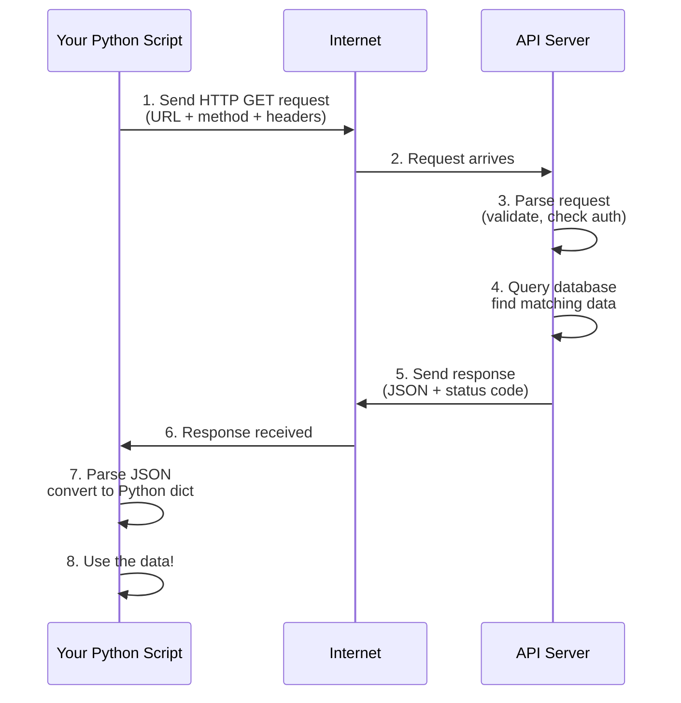

---
tags:
  - Beginner
  - Phase 1
---

# Module 1: REST APIs in Python

APIs are how programs talk to each other. If you've been building standalone Python scripts in Phase 0, you've been limited to your own data and your own computer. APIs let you access **live data from the internet**—weather, news, stock prices, social media—and use it in your programs. In this module, you'll learn how to fetch data from web APIs and use it in your applications.

---

## 🎯 What You Will Learn

By the end of this module, you will:

- Understand what an API is and why they exist
- Know how REST APIs work: endpoints, HTTP methods, status codes
- Make GET requests to fetch data from a web API
- Parse JSON responses into Python dictionaries and lists
- Use query parameters to filter and customize API requests
- Authenticate with APIs using API keys and tokens
- Handle errors gracefully when API requests fail
- Respect rate limits to avoid being blocked by the server
- Store API responses to files for later use
- Use environment variables to keep API keys secret
- Build a real application that fetches and stores live data

---

## 🧠 Concept Explained: What Is an API?

### The Analogy: API as a Restaurant Waiter

Imagine you're at a restaurant:

**Without an API (trying to access data directly):**
You walk into the kitchen, push past the chefs, open the refrigerator yourself, grab ingredients, and cook your own meal. It's chaotic. The chefs are angry. Other customers are confused.

**With an API (the proper way):**
You sit at a table and tell the waiter, "I'd like a pizza with extra basil, no onions." The waiter takes your request, goes to the kitchen, gives your specific instructions to the chef, and brings back exactly what you ordered. Clean, fast, organized.

**The API is the waiter.** You don't directly access the kitchen (the server's database). You make a request to the waiter (the API), and the API fetches exactly what you asked for and returns it.

### Why APIs Exist

**Control**: The restaurant controls what you can order. You can't ask for something impossible.

**Safety**: You don't have direct access to sensitive data. Authentication protects both you and the server.

**Speed**: APIs are optimized for common requests. Fetching "weather for London" is fast because millions of people ask for it daily.

**Scalability**: One API server can serve millions of requests from thousands of different apps.

### REST APIs Specifically

REST (Representational State Transfer) is a standard way to build APIs. It uses:

- **URLs** to specify _what_ you want (the resource)
- **HTTP methods** to specify _what you want to do_ with it (GET, POST, PUT, DELETE)
- **Status codes** to tell you if it worked (200 = success, 404 = not found, 500 = server error)
- **JSON** as the format for responses

---

## 🔍 How It Works: The API Request Cycle

Here's what happens when you request data from an API:



### The Key Components

**Endpoint**: The URL where the API lives. Example: `https://api.openweathermap.org/data/2.5/weather`

**HTTP Method**: What action you want. GET (read), POST (create), PUT (update), DELETE (remove).

**Headers**: Extra information, like your API key or the format you want (JSON).

**Query Parameters**: Filters and options. Example: `?city=London&units=metric`

**Response**: Data from the server, usually in JSON format with a status code.

**Status Code**: Three-digit number telling you if it worked:

- `200` = Success! Here's your data
- `201` = Created successfully
- `400` = Bad request (you asked for something invalid)
- `401` = Unauthorized (wrong API key or not authenticated)
- `404` = Not found (that endpoint doesn't exist)
- `429` = Too many requests (you hit the rate limit)
- `500` = Server error (the API is broken)

---

## 🛠️ Step-by-Step Guide

### Step 1: Install the requests Library

```bash
# Activate your virtual environment (from Phase 0, Module 4)
source venv/bin/activate

# Install the requests library for making API calls
pip install requests

# Verify installation
python3 -c "import requests; print('requests installed!')"
```

### Step 2: Make Your First API Request

We'll use OpenWeatherMap's free API, which requires signing up for a free API key. Alternatively, we can use JSONPlaceholder (no key required) for learning.

```python
# Import the requests library
import requests

# Make a GET request to JSONPlaceholder (no API key needed)
response = requests.get('https://jsonplaceholder.typicode.com/posts/1')

# Check the status code (should be 200 for success)
print(f"Status code: {response.status_code}")

# Get the response as JSON (Python dict)
data = response.json()

# Print the data
print(f"Post title: {data['title']}")
```

!!! note
JSONPlaceholder is a fake API for practice. It returns dummy data but teaches you real API patterns.

### Step 3: Understand JSON Responses

```python
# API responses are JSON, which Python reads as dictionaries
response = requests.get('https://jsonplaceholder.typicode.com/posts/1')
data = response.json()

# Access values using keys
print(data['title'])        # Get a single value
print(data['body'][:50])    # Get first 50 characters
print(data['userId'])       # Get user ID

# You can also print the entire response
print(data)
# Output:
# {
#   'userId': 1,
#   'id': 1,
#   'title': 'sunt aut facere repellat provident...',
#   'body': 'quia et suscipit...'
# }
```

### Step 4: Make Requests with Query Parameters

```python
# Get first 5 posts (using limit parameter)
response = requests.get(
    'https://jsonplaceholder.typicode.com/posts',
    params={
        '_limit': 5,     # Only get 5 posts
        '_sort': 'id',   # Sort by ID
        '_order': 'desc' # Descending order
    }
)

# Get the list of posts
posts = response.json()

# Print titles of all posts
for post in posts:
    print(f"- {post['title']}")

# You can also build the URL manually
url = 'https://jsonplaceholder.typicode.com/posts?_limit=5&_sort=id&_order=desc'
response = requests.get(url)
```

!!! tip
Using `params` dict is cleaner than building URLs manually. Requests handles encoding special characters.

### Step 5: Add Headers and Authentication

```python
# Many APIs require authentication via API key
# Here's the pattern for different methods:

# Method 1: API key in header (most common)
headers = {
    'Authorization': 'Bearer YOUR_API_KEY_HERE',
    'User-Agent': 'MyScript/1.0'
}
response = requests.get('https://api.example.com/data', headers=headers)

# Method 2: API key as query parameter
response = requests.get(
    'https://api.example.com/data',
    params={'apikey': 'YOUR_API_KEY_HERE'}
)

# Method 3: Basic authentication (username:password)
response = requests.get(
    'https://api.example.com/data',
    auth=('username', 'password')
)
```

### Step 6: Handle Errors and Check Status

```python
# Always check the status code before using the data
response = requests.get('https://jsonplaceholder.typicode.com/posts/999')

# Check if request succeeded
if response.status_code == 200:
    # Success! Use the data
    data = response.json()
    print(f"Got data: {data['title']}")
elif response.status_code == 404:
    # Not found
    print("Post doesn't exist")
elif response.status_code == 500:
    # Server error
    print("API is having problems")
else:
    # Something else went wrong
    print(f"Error: {response.status_code}")

# Better: use try/except for network issues
try:
    response = requests.get('https://jsonplaceholder.typicode.com/posts/1', timeout=5)
    response.raise_for_status()  # Raises an exception if status is 4xx or 5xx
    data = response.json()
except requests.exceptions.Timeout:
    print("Request took too long!")
except requests.exceptions.ConnectionError:
    print("Can't connect to the API. Check your internet.")
except requests.exceptions.HTTPError as e:
    print(f"API returned an error: {e}")
```

### Step 7: Respect Rate Limits

```python
# Rate limiting: API servers limit how many requests you can make
# To respect this, add delays between requests

import time

# Fetch 10 posts with a 1-second delay between each
for i in range(1, 11):
    # Make request
    response = requests.get(f'https://jsonplaceholder.typicode.com/posts/{i}')
    data = response.json()
    print(f"Post {i}: {data['title'][:30]}...")

    # Wait 1 second before next request
    time.sleep(1)

print("Done!")
```

!!! warning
Some APIs have strict rate limits. If you make too many requests quickly, you'll get a 429 error and your IP might be blocked. Always read the API documentation.

### Step 8: Store Data to a File

```python
# Save API responses to JSON files for later use

import json
from datetime import datetime

# Fetch data
response = requests.get('https://jsonplaceholder.typicode.com/posts/1')
data = response.json()

# Add a timestamp
data['fetched_at'] = datetime.now().isoformat()

# Save to file
with open('post.json', 'w') as f:
    json.dump(data, f, indent=2)

print("Data saved to post.json")

# Later, read it back
with open('post.json', 'r') as f:
    saved_data = json.load(f)
    print(f"Loaded: {saved_data['title']}")
```

### Step 9: Use Environment Variables for Secrets

```bash
# NEVER hardcode API keys! Use environment variables instead

# Set environment variable (in terminal)
export MY_API_KEY="your-secret-key-here"

# Or create a .env file
echo "MY_API_KEY=your-secret-key-here" > .env
```

```python
# Read from environment variable in Python
import os

# Get the API key from environment
api_key = os.getenv('MY_API_KEY')

if api_key is None:
    print("Error: MY_API_KEY environment variable not set!")
    exit(1)

# Use it in your request
headers = {'Authorization': f'Bearer {api_key}'}
response = requests.get('https://api.example.com/data', headers=headers)
```

!!! danger
Never commit API keys to Git. Add `.env` to `.gitignore`. Environment variables are the safe way.

---

## 💻 Code Examples

### Example 1: Fetch and Display Weather Data

```python
#!/usr/bin/env python3
"""
Fetch current weather from OpenWeatherMap API
Requires free API key from https://openweathermap.org/api
"""

import requests
import os
from datetime import datetime

# Get API key from environment variable
api_key = os.getenv('OPENWEATHER_API_KEY')
if not api_key:
    print("Error: Set OPENWEATHER_API_KEY environment variable")
    exit(1)

# City to fetch weather for
city = 'London'

# Build the request URL
url = 'https://api.openweathermap.org/data/2.5/weather'
params = {
    'q': city,
    'appid': api_key,
    'units': 'metric'  # Use Celsius
}

# Make the request
try:
    response = requests.get(url, params=params, timeout=5)
    response.raise_for_status()  # Check for errors
except requests.exceptions.RequestException as e:
    print(f"Failed to fetch weather: {e}")
    exit(1)

# Parse the response
weather = response.json()

# Extract relevant data
temp = weather['main']['temp']
description = weather['weather'][0]['description']
humidity = weather['main']['humidity']
wind_speed = weather['wind']['speed']

# Display formatted results
print(f"\nWeather in {city}")
print(f"Temperature: {temp}°C")
print(f"Condition: {description.title()}")
print(f"Humidity: {humidity}%")
print(f"Wind Speed: {wind_speed} m/s\n")
```

### Example 2: Fetch Multiple Pages of Data

```python
#!/usr/bin/env python3
"""
Fetch multiple pages from JSONPlaceholder
Demonstrate pagination and rate limiting
"""

import requests
import time

# List to store all posts
all_posts = []

# Fetch posts page by page
for page in range(1, 4):  # Pages 1, 2, 3
    # Build request with pagination
    response = requests.get(
        'https://jsonplaceholder.typicode.com/posts',
        params={
            '_page': page,
            '_limit': 10  # 10 posts per page
        }
    )

    # Check if successful
    if response.status_code != 200:
        print(f"Error on page {page}: {response.status_code}")
        continue

    # Get posts from this page
    posts = response.json()
    all_posts.extend(posts)

    print(f"Fetched {len(posts)} posts from page {page}")

    # Rate limiting: wait 1 second before next request
    time.sleep(1)

# Display summary
print(f"\nTotal posts fetched: {len(all_posts)}")
print(f"First post: {all_posts[0]['title'][:50]}...")
print(f"Last post: {all_posts[-1]['title'][:50]}...")
```

### Example 3: Save API Responses with Timestamps

```python
#!/usr/bin/env python3
"""
Fetch data from API and save with timestamp
Useful for building datasets from repeated API calls
"""

import requests
import json
from datetime import datetime
import os

# Create directory for data if it doesn't exist
os.makedirs('api_data', exist_ok=True)

# Fetch data from API
response = requests.get('https://jsonplaceholder.typicode.com/posts/1')
response.raise_for_status()

# Get the data
post = response.json()

# Add metadata
post['fetched_at'] = datetime.now().isoformat()
post['source'] = 'JSONPlaceholder'

# Create filename with timestamp
timestamp = datetime.now().strftime('%Y%m%d_%H%M%S')
filename = f'api_data/post_{timestamp}.json'

# Save to file
with open(filename, 'w') as f:
    json.dump(post, f, indent=2)

print(f"Saved to {filename}")

# Later, load and read the file
with open(filename, 'r') as f:
    loaded_post = json.load(f)
    print(f"\nLoaded post from {loaded_post['fetched_at']}")
    print(f"Title: {loaded_post['title'][:60]}...")
```

---

## ⚠️ Common Mistakes

### Mistake 1: Forgetting to Check Status Codes

**What Beginners Do:**

```python
# Only fetch data, don't check if it succeeded
response = requests.get('https://api.example.com/data')
data = response.json()  # Might crash here!

# If API returned an error, .json() might fail
# Or the data might be in a different format
```

**The Right Way:**

```python
# Always check status first
response = requests.get('https://api.example.com/data')

# Check if successful
if response.status_code == 200:
    data = response.json()
    print(data)
else:
    print(f"Error: {response.status_code}")
    print(response.text)  # Show what the server actually returned

# Or use raise_for_status()
response = requests.get('https://api.example.com/data')
response.raise_for_status()  # Raises exception if not 2xx
data = response.json()
```

### Mistake 2: Hardcoding API Keys

**What Beginners Do:**

```python
# NEVER DO THIS!
api_key = "abc123xyz789..."
response = requests.get(
    'https://api.example.com/data',
    headers={'Authorization': f'Bearer {api_key}'}
)

# If you commit this to Git, your key is exposed!
# Anyone can use it and hammer the API
```

**The Right Way:**

```python
# Use environment variables
import os

api_key = os.getenv('MY_API_KEY')
if not api_key:
    print("Error: MY_API_KEY not set!")
    exit(1)

response = requests.get(
    'https://api.example.com/data',
    headers={'Authorization': f'Bearer {api_key}'}
)
```

### Mistake 3: Not Handling Network Errors

**What Beginners Do:**

```python
# Code crashes if the internet is down
response = requests.get('https://api.example.com/data')
data = response.json()  # Could fail here
# Program crashes, no error message
```

**The Right Way:**

```python
# Wrap in try/except
import requests

try:
    response = requests.get(
        'https://api.example.com/data',
        timeout=5  # Don't wait forever
    )
    response.raise_for_status()  # Check for errors
    data = response.json()
    print(f"Success: {data}")
except requests.exceptions.Timeout:
    print("Request timed out. Server took too long.")
except requests.exceptions.ConnectionError:
    print("Can't connect. Check your internet connection.")
except requests.exceptions.HTTPError as e:
    print(f"HTTP error: {e}")
except Exception as e:
    print(f"Unexpected error: {e}")
```

### Mistake 4: Ignoring Rate Limits

**What Beginners Do:**

```python
# Fetch 1000 posts as fast as possible
for i in range(1, 1001):
    response = requests.get(f'https://api.example.com/posts/{i}')
    data = response.json()
    # Loop runs as fast as the internet allows
    # Server returns 429: Too Many Requests
    # Your IP gets blocked for an hour
```

**The Right Way:**

```python
# Add delays between requests
import time

# Fetch posts with politeness
for i in range(1, 21):  # Just 20, not 1000
    response = requests.get(f'https://api.example.com/posts/{i}')
    if response.status_code == 429:
        print("Rate limited. Backing off...")
        time.sleep(60)  # Wait a minute before retrying
    data = response.json()
    print(f"Post {i}: {data['title'][:50]}...")
    time.sleep(1)  # Wait 1 second between requests
```

---

## ✅ Exercises

### Easy: Make Your First API Request

1. Install the `requests` library: `pip install requests`
2. Write a script that makes a GET request to `https://jsonplaceholder.typicode.com/posts/1`
3. Check the status code and print it
4. Parse the JSON response
5. Print the post title and body
6. Save the response to a file called `post.json`
7. Verify the file was created

**Expected Output:**

```
Status: 200
Title: sunt aut facere repellat provident...
Body: quia et suscipit...
Data saved to post.json
```

**What to verify:**

- You can make API requests
- You understand status codes
- You can parse JSON
- You can save data to files

### Medium: Fetch and Filter Multiple Records

1. Create a script that fetches all posts from JSONPlaceholder (not just one)
2. Filter posts by user ID (e.g., only posts by user 2)
3. Print the titles of filtered posts only
4. Add error handling for network issues
5. Save the filtered posts to a JSON file

**Expected Output:**

```
Fetching posts from user 2...
Found 10 posts
- Post Title 1
- Post Title 2
...
Saved to user_2_posts.json
```

**What to verify:**

- You can handle multiple records
- You can filter data from API responses
- You handle errors gracefully

### Hard: Build a Data Collection Script with Rate Limiting

1. Create a script that schedules API requests
2. Fetch weather data for 5 different cities
3. Save each response to a timestamped JSON file
4. Add proper rate limiting (1 second between requests)
5. Handle all error cases (timeout, 404, 500, connection error)
6. Print a summary of how many succeeded and how many failed
7. Use environment variables for the API key (sign up for free OpenWeatherMap key)

**Expected Output:**

```
Fetching weather for London...
✓ London: 15°C
Waiting 1 second...
Fetching weather for Paris...
✓ Paris: 14°C
...
Summary: 5 successful, 0 failed
Files saved in weather_data/
```

**What to verify:**

- You can build a production-like script
- You handle all common error cases
- You respect rate limits and use environment variables

---

## 🏗️ Mini Project: Weather Data Collector

Build a Python script that fetches weather data from OpenWeatherMap every hour and stores each response in a timestamped JSON file. This project ties together everything you've learned.

### Part 1: Sign Up for Free API Key

1. Go to https://openweathermap.org/api
2. Sign up for a free account
3. Get your free API key (you'll see it in your account settings)
4. Set environment variable: `export OPENWEATHER_API_KEY="your-key-here"`

### Part 2: Create the Collector Script

```python
#!/usr/bin/env python3
"""
Weather Data Collector
Fetches weather data and stores timestamped responses
Demonstrates: API requests, error handling, file operations
"""

import requests
import json
import os
from datetime import datetime
import time

class WeatherCollector:
    """Collects and stores weather data from OpenWeatherMap API"""

    def __init__(self):
        """Initialize the collector with API key"""
        # Get API key from environment variable (never hardcode!)
        self.api_key = os.getenv('OPENWEATHER_API_KEY')
        if not self.api_key:
            raise ValueError("OPENWEATHER_API_KEY environment variable not set")

        # API base URL
        self.base_url = 'https://api.openweathermap.org/data/2.5/weather'

        # Create data directory if it doesn't exist
        self.data_dir = 'weather_data'
        os.makedirs(self.data_dir, exist_ok=True)

    def fetch_weather(self, city):
        """Fetch weather for a city"""
        try:
            # Build request with parameters
            params = {
                'q': city,
                'appid': self.api_key,
                'units': 'metric'
            }

            # Make request with timeout
            response = requests.get(self.base_url, params=params, timeout=5)

            # Check for errors
            response.raise_for_status()

            # Parse response
            data = response.json()

            # Add metadata
            data['fetched_at'] = datetime.now().isoformat()
            data['city_requested'] = city

            return data, None

        except requests.exceptions.Timeout:
            return None, "Request timed out"
        except requests.exceptions.ConnectionError:
            return None, "Connection error"
        except requests.exceptions.HTTPError as e:
            if response.status_code == 404:
                return None, f"City '{city}' not found"
            else:
                return None, f"HTTP error: {response.status_code}"
        except Exception as e:
            return None, str(e)

    def save_data(self, city, data):
        """Save data to timestamped JSON file"""
        # Create filename with timestamp
        timestamp = datetime.now().strftime('%Y%m%d_%H%M%S')
        filename = f"{city}_{timestamp}.json"
        filepath = os.path.join(self.data_dir, filename)

        # Write to file
        with open(filepath, 'w') as f:
            json.dump(data, f, indent=2)

        return filepath

    def run(self, cities, delay=1):
        """Run collector for multiple cities"""
        print(f"Collecting weather data for: {', '.join(cities)}")
        print(f"Data will be saved to: {self.data_dir}/")
        print()

        success = 0
        failed = 0

        for city in cities:
            print(f"Fetching weather for {city}...", end=' ', flush=True)

            # Fetch the data
            data, error = self.fetch_weather(city)

            if data:
                # Save to file
                filepath = self.save_data(city, data)

                # Display info
                temp = data['main']['temp']
                desc = data['weather'][0]['description']
                print(f"✓ {temp}°C, {desc} → {filepath}")
                success += 1
            else:
                # Handle error
                print(f"✗ {error}")
                failed += 1

            # Rate limiting: wait before next request
            time.sleep(delay)

        # Print summary
        print()
        print(f"Summary: {success} successful, {failed} failed")
        print(f"Total files saved: {success}")

def main():
    """Main entry point"""
    try:
        # Create collector
        collector = WeatherCollector()

        # Cities to collect data for
        cities = ['London', 'New York', 'Tokyo', 'Sydney', 'Paris']

        # Run collection
        collector.run(cities, delay=1)

    except ValueError as e:
        print(f"Error: {e}")
        exit(1)
    except Exception as e:
        print(f"Unexpected error: {e}")
        exit(1)

if __name__ == '__main__':
    main()
```

### Part 3: Test the Script

```bash
# Make it executable
chmod +x weather_collector.py

# Set your API key
export OPENWEATHER_API_KEY="your-actual-key-here"

# Run it
python3 weather_collector.py

# Expected output:
# Collecting weather data for: London, New York, Tokyo, Sydney, Paris
# Data will be saved to: weather_data/
#
# Fetching weather for London... ✓ 15°C, overcast clouds → weather_data/London_20260315_124530.json
# Fetching weather for New York... ✓ 10°C, clear sky → weather_data/New_York_20260315_124531.json
# ...
# Summary: 5 successful, 0 failed
# Total files saved: 5

# Check the created files
ls -la weather_data/
cat weather_data/London_*.json
```

---

## 🔗 What's Next

You now know how to fetch live data from APIs! Here's your path forward:

### You Can Now Do

- ✅ Fetch data from any REST API using Python
- ✅ Parse JSON responses and extract information
- ✅ Handle errors and respect rate limits
- ✅ Keep API keys secret with environment variables
- ✅ Build data collection scripts that run repeatedly

### Connection to Other Modules

Now that you can **collect** data, the next modules teach you to:

- **Module 2 (Web Scraping)**: Fetch data from websites without APIs
- **Module 3 (Database Schema)**: Design databases to store this API data
- **Module 4 (Data Cleaning)**: Process and clean the data you've collected
- **Module 5 (CSV & JSON)**: Store your data in standard formats

All of Phase 1 is about the data pipeline: collecting, cleaning, storing, analyzing.

### Advanced Topics (For Later)

- **Async requests**: Make multiple requests simultaneously
- **Caching**: Store responses locally to avoid repeated requests
- **WebHooks**: Have the API notify you when data changes
- **GraphQL**: A newer API standard beyond REST
- **Building APIs**: Create your own API for others to use

---

## 📚 Summary

In this module, you learned:

1. ✅ **What APIs are** – Programs talking to each other over the internet
2. ✅ **REST design** – URLs, HTTP methods, status codes, JSON
3. ✅ **Making requests** – Using `requests` library to fetch data
4. ✅ **Parsing responses** – Converting JSON to Python dicts
5. ✅ **Query parameters** – Filtering and customizing requests
6. ✅ **Authentication** – Using API keys and tokens securely
7. ✅ **Error handling** – Checking status codes and catching exceptions
8. ✅ **Rate limiting** – Respecting server limits with delays
9. ✅ **File storage** – Saving responses as JSON files
10. ✅ **Environment variables** – Keeping secrets out of your code

APIs are how you access the internet's data. You can now build applications that live-stream data from weather services, social media, financial data providers, and thousands of other sources.

---

## 🔧 API Reference

| Concept                | What It Does          | Example                                   |
| ---------------------- | --------------------- | ----------------------------------------- |
| **GET**                | Fetch data            | `requests.get(url)`                       |
| **POST**               | Create data           | `requests.post(url, json=data)`           |
| **PUT**                | Update data           | `requests.put(url, json=data)`            |
| **DELETE**             | Delete data           | `requests.delete(url)`                    |
| **Status 200**         | Success               | Data was returned                         |
| **Status 201**         | Created               | New data was created                      |
| **Status 400**         | Bad request           | Your request was invalid                  |
| **Status 401**         | Unauthorized          | API key missing/wrong                     |
| **Status 404**         | Not found             | Resource doesn't exist                    |
| **Status 429**         | Rate limited          | Too many requests                         |
| **Status 500**         | Server error          | API server is broken                      |
| `response.status_code` | Check if it worked    | `if response.status_code == 200:`         |
| `response.json()`      | Get JSON as dict      | `data = response.json()`                  |
| `response.text`        | Get raw response text | `text = response.text`                    |
| `response.headers`     | HTTP headers          | `response.headers['Content-Type']`        |
| `params={}`            | Query parameters      | `params={'limit': 10}`                    |
| `headers={}`           | Custom headers        | `headers={'Authorization': 'Bearer key'}` |
| `timeout=5`            | Maximum wait time     | Don't wait more than 5 seconds            |
| `raise_for_status()`   | Check for errors      | Raises exception if not success           |

---

**Congratulations! You can now fetch live data from the internet. 🎉**
