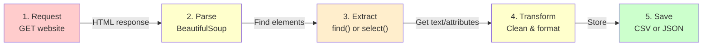

---
tags:
  - Beginner
  - Phase 1
---

# Module 2: Web Scraping

Not every website offers an API. Sometimes you need to fetch data directly from web pages. Web scraping lets you extract information from HTML—the code that creates websites. In this module, you'll learn to parse HTML, find the data you need, and respect the ethical rules of scraping.

---

## 🎯 What You Will Learn

By the end of this module, you will:

- Understand what web scraping is and when to use it vs APIs
- Know how HTML works: tags, classes, IDs, and structure
- Fetch web pages using the requests library
- Parse HTML with BeautifulSoup
- Find elements using CSS selectors and search methods
- Extract text, links, and attributes from HTML
- Handle pagination: scrape multiple pages of data
- Respect ethical scraping: robot.txt and rate limiting
- Know when to use Selenium for dynamic/JavaScript sites
- Store scraped data to CSV files
- Build a real scraper that extracts data from a website

---

## 🧠 Concept Explained: What Is Web Scraping?

### The Analogy: Scraping vs API

Imagine two ways to order books from a bookstore:

**Using an API (Module 1):**
The bookstore has a service desk with an attendant. You fill out a form ("I want all science fiction books under $15"), they process it quickly and fetch exactly what you asked for. Clean, fast, authorized.

**Using web scraping:**
The bookstore doesn't have a service desk. You go into the store yourself, walk through every shelf, read book titles and prices directly, and write them down manually. Slower, more manual, but you can get any information that's displayed.

### Why Scrape When APIs Exist?

**No API available**: Many websites don't offer APIs. If you want data from them, scraping is your only option.

**Real-time data**: Some websites update constantly. Scraping lets you fetch the latest data immediately.

**Complete data**: Maybe the API only returns partial data. Scraping gets everything.

### But Be Ethical!

Always respect the website:

- Check `robots.txt` (website's rules for bots)
- Read the Terms of Service
- Add delays between requests (don't hammer the server)
- Don't impersonate humans
- Respect copyright

If it says "no bots," don't scrape.

### HTML Basics

Websites are made of HTML (Hypertext Markup Language). It looks like this:

```html
<html>
  <body>
    <div class="container">
      <h1 id="title">Book Store</h1>
      <book>
        <title>Python Basics</title>
        <author>John Smith</author>
        <price>29.99</price>
      </book>
    </div>
  </body>
</html>
```

Key concepts:

- **Tags**: `<div>`, `<title>`, `<p>` tell the browser what content is
- **Classes**: `class="book"` groups elements for styling
- **IDs**: `id="title"` uniquely identifies an element
- **Attributes**: `href="url"` contains extra info
- **Content**: Text between opening and closing tags

---

## 🔍 How It Works: The Scraping Process



### The Key Steps

**Step 1: Fetch the HTML**

```python
response = requests.get('https://example.com')
html = response.text  # All the HTML code
```

**Step 2: Parse into a tree**
BeautifulSoup turns raw HTML into a searchable tree structure.

**Step 3: Find elements**
Use selectors to find the elements containing your data.

**Step 4: Extract information**
Get text, links, attributes from the elements.

**Step 5: Store the data**
Save to CSV, JSON, or database.

---

## 🛠️ Step-by-Step Guide

### Step 1: Install BeautifulSoup

```bash
# Activate your virtual environment
source venv/bin/activate

# Install BeautifulSoup4 and requests
pip install beautifulsoup4 requests

# Verify installation
python3 -c "from bs4 import BeautifulSoup; print('BeautifulSoup installed!')"
```

### Step 2: Fetch a Web Page

```python
# Import libraries
import requests
from bs4 import BeautifulSoup

# Fetch the page
response = requests.get('https://books.toscrape.com/')

# Check if successful
if response.status_code != 200:
    print(f"Failed to fetch page: {response.status_code}")
    exit(1)

# Get the HTML content
html = response.text

# Print first 500 characters
print(html[:500])

# Expected output shows HTML structure with <html>, <head>, <body> tags
```

### Step 3: Parse HTML with BeautifulSoup

```python
# Create a BeautifulSoup object from HTML
soup = BeautifulSoup(html, 'html.parser')

# Get the page title
title = soup.find('title')
print(f"Page title: {title.text}")
# Output: Page title: Books to Scrape

# Get all paragraph tags
paragraphs = soup.find_all('p')
print(f"Found {len(paragraphs)} paragraphs")

# Get text from the whole page
all_text = soup.get_text()
print(f"Total characters: {len(all_text)}")
```

!!! note
BeautifulSoup needs a parser. `html.parser` is built-in. For more power, install: `pip install lxml`

### Step 4: Find Elements by Tag, Class, or ID

```python
from bs4 import BeautifulSoup

soup = BeautifulSoup(html, 'html.parser')

# Find first element with tag name
first_link = soup.find('a')
print(f"First link: {first_link}")
# <a href="/">Home</a>

# Find element by ID
header = soup.find(id='main-header')
print(f"Header: {header.text}")

# Find elements by class
books = soup.find_all(class_='book')
print(f"Found {len(books)} books")

# Find all elements of a type
links = soup.find_all('a')
for link in links:
    print(f"Link: {link.get_text()}")
```

### Step 5: Extract Text and Attributes

```python
from bs4 import BeautifulSoup

soup = BeautifulSoup(html, 'html.parser')

# Get text from an element
link = soup.find('a')
text = link.get_text()  # or link.text
href = link.get('href')  # or link['href']

print(f"Text: {text}")
print(f"Link: {href}")

# Get all attributes as a dictionary
attributes = link.attrs
print(f"All attributes: {attributes}")
# {'href': '/books/page-1.html', 'class': ['nav-link']}

# Extract from multiple elements
for link in soup.find_all('a'):
    url = link.get('href')
    text = link.get_text()
    print(f"{text} -> {url}")
```

### Step 6: Use CSS Selectors for Powerful Searching

```python
from bs4 import BeautifulSoup

soup = BeautifulSoup(html, 'html.parser')

# CSS selectors are very powerful
# Find all elements with class 'book'
books = soup.select('.book')

# Find elements with ID 'main'
main = soup.select('#main')

# Find elements inside other elements
# All links inside h2 tags
links_in_headers = soup.select('h2 > a')

# Find all divs with specific class
products = soup.select('div.product')

# Find by attribute
links_with_target = soup.select('a[target="_blank"]')

for link in links_with_target:
    print(f"Opens in new tab: {link.text}")
```

### Step 7: Handle Pagination (Multiple Pages)

```python
from bs4 import BeautifulSoup
import requests
import time

# Scrape first 3 pages
base_url = 'https://books.toscrape.com'
all_books = []

for page_num in range(1, 4):
    # Build URL for each page
    if page_num == 1:
        url = f'{base_url}/'
    else:
        url = f'{base_url}/page-{page_num}.html'

    print(f"Scraping {url}...")

    # Fetch the page
    response = requests.get(url)
    soup = BeautifulSoup(response.text, 'html.parser')

    # Extract books from this page
    books = soup.find_all('article', class_='product_pod')

    for book in books:
        # Get book title
        title = book.find('h3').find('a').get_text()

        # Get price
        price = book.find('p', class_='price_color').get_text()

        # Get rating
        rating_class = book.find('p', class_='star-rating')['class'][1]

        # Store the data
        all_books.append({
            'title': title,
            'price': price,
            'rating': rating_class
        })

    # Rate limiting: wait before next request
    time.sleep(1)

print(f"\nTotal books scraped: {len(all_books)}")
for book in all_books[:5]:
    print(f"- {book['title']} ({book['price']})")
```

### Step 8: Save Data to CSV

```python
import csv

# Save books to CSV file
filename = 'books.csv'

with open(filename, 'w', newline='', encoding='utf-8') as f:
    # Create CSV writer
    writer = csv.DictWriter(f, fieldnames=['title', 'price', 'rating'])

    # Write header row
    writer.writeheader()

    # Write data rows
    for book in all_books:
        writer.writerow(book)

print(f"Saved {len(all_books)} books to {filename}")

# Read the CSV to verify
with open(filename, 'r', encoding='utf-8') as f:
    reader = csv.DictReader(f)
    for row in reader:
        print(f"- {row['title']}: {row['price']}")
```

### Step 9: Understand robots.txt and Ethics

```python
# Always check if scraping is allowed
import requests

# Check the website's robots.txt
response = requests.get('https://books.toscrape.com/robots.txt')
print(response.text)

# books.toscrape.com is designed for learning, so scraping is OK!
# Many other sites forbid it. Read the robots.txt and Terms of Service.
```

---

## 💻 Code Examples

### Example 1: Scrape Book Prices from books.toscrape.com

```python
#!/usr/bin/env python3
"""
Scrape books from books.toscrape.com
Extract title, price, and availability
Save to CSV
"""

import requests
from bs4 import BeautifulSoup
import csv

class BookScraper:
    """Scrapes book data from books.toscrape.com"""

    def __init__(self):
        # Base URL for the website
        self.base_url = 'https://books.toscrape.com'
        # List to store books
        self.books = []

    def scrape_page(self, page_url):
        """Scrape a single page of books"""
        try:
            # Fetch the page
            response = requests.get(page_url, timeout=5)
            response.raise_for_status()

            # Parse HTML
            soup = BeautifulSoup(response.text, 'html.parser')

            # Find all books on the page
            book_elements = soup.find_all('article', class_='product_pod')

            # Extract data from each book
            for book in book_elements:
                # Get book title
                title_elem = book.find('h3').find('a')
                title = title_elem.get_text()

                # Get book link
                link = title_elem.get('href')

                # Get price (remove £ and convert)
                price_elem = book.find('p', class_='price_color')
                price_text = price_elem.get_text()
                price = float(price_text.replace('£', ''))

                # Get availability
                avail_elem = book.find('p', class_='instock availability')
                availability = avail_elem.get_text().strip()

                # Get rating
                rating_elem = book.find('p', class_='star-rating')
                rating = rating_elem['class'][1]

                # Store the book
                self.books.append({
                    'title': title,
                    'price': price,
                    'availability': availability,
                    'rating': rating,
                    'url': link if link.startswith('http') else f"{self.base_url}/{link}"
                })

            return len(book_elements)

        except requests.exceptions.RequestException as e:
            print(f"Error fetching {page_url}: {e}")
            return 0

    def run(self, num_pages=3):
        """Scrape multiple pages"""
        print(f"Scraping {num_pages} pages from {self.base_url}...\n")

        for page_num in range(1, num_pages + 1):
            # Build URL for this page
            if page_num == 1:
                url = f'{self.base_url}/'
            else:
                url = f'{self.base_url}/page-{page_num}.html'

            print(f"Page {page_num}...", end=' ', flush=True)

            # Scrape the page
            count = self.scrape_page(url)
            print(f"({count} books)")

            # Rate limiting: wait 1 second between pages
            import time
            time.sleep(1)

        print(f"\nTotal books scraped: {len(self.books)}")

    def find_cheapest(self, n=5):
        """Find n cheapest books"""
        # Sort by price
        sorted_books = sorted(self.books, key=lambda b: b['price'])
        return sorted_books[:n]

    def save_to_csv(self, filename='books.csv'):
        """Save all books to CSV"""
        with open(filename, 'w', newline='', encoding='utf-8') as f:
            # Create writer with field names
            fieldnames = ['title', 'price', 'availability', 'rating', 'url']
            writer = csv.DictWriter(f, fieldnames=fieldnames)

            # Write header and data
            writer.writeheader()
            writer.writerows(self.books)

        print(f"\nSaved to {filename}")

def main():
    """Main entry point"""
    # Create scraper
    scraper = BookScraper()

    # Scrape 3 pages
    scraper.run(num_pages=3)

    # Find and display cheapest books
    print("\nTop 5 Cheapest Books:")
    print("=" * 60)
    for i, book in enumerate(scraper.find_cheapest(5), 1):
        print(f"{i}. {book['title']}")
        print(f"   Price: £{book['price']:.2f}")
        print(f"   Rating: {book['rating']}")
        print()

    # Save all data to CSV
    scraper.save_to_csv('books_scraped.csv')

if __name__ == '__main__':
    main()
```

### Example 2: Extract All Links from a Page

```python
#!/usr/bin/env python3
"""
Extract and display all links from a webpage
Useful for understanding site structure
"""

import requests
from bs4 import BeautifulSoup

def scrape_links(url):
    """Extract all links from a page"""
    # Fetch the page
    response = requests.get(url, timeout=5)
    response.raise_for_status()

    # Parse HTML
    soup = BeautifulSoup(response.text, 'html.parser')

    # Find all links
    links = soup.find_all('a')

    print(f"Found {len(links)} links on {url}\n")

    # Display each link
    for i, link in enumerate(links, 1):
        text = link.get_text(strip=True)
        href = link.get('href', '#')

        # Only show links with meaningful text
        if text:
            print(f"{i}. {text[:50]}")
            print(f"   → {href}")
            print()

# Scrape the main page
scrape_links('https://books.toscrape.com/')

# Expected output:
# Found 47 links on https://books.toscrape.com/
#
# 1. All products
#    → /
# 2. Books
#    → /books/
# ... (more links)
```

---

## ⚠️ Common Mistakes

### Mistake 1: Not Checking robots.txt or T&S

**What Beginners Do:**

```python
# Start scraping without checking if it's allowed
response = requests.get('https://linkedin.com/')
soup = BeautifulSoup(response.text, 'html.parser')
# Scrape LinkedIn's data

# LinkedIn explicitly forbids scraping in their ToS
# Your IP gets banned
# You might face legal consequences
```

**The Right Way:**

```python
# Always check before scraping
import requests

# Check robots.txt
try:
    robots = requests.get('https://example.com/robots.txt', timeout=5)
    print(robots.text)
    # If it says "Disallow: /", don't scrape
except:
    pass

# Read their Terms of Service
# If it says "no automated access," don't scrape

# books.toscrape.com is designed for learning, so it's OK to scrape
response = requests.get('https://books.toscrape.com/')
soup = BeautifulSoup(response.text, 'html.parser')
```

### Mistake 2: Not Handling Pagination Correctly

**What Beginners Do:**

```python
# Scrape only one page assuming it has all data
response = requests.get('https://books.toscrape.com/')
soup = BeautifulSoup(response.text, 'html.parser')
books = soup.find_all('article')
# Only gets 20 books, but there are 1000 on the site!
```

**The Right Way:**

```python
# Check for pagination links
response = requests.get('https://books.toscrape.com/')
soup = BeautifulSoup(response.text, 'html.parser')

# Find the "Next" link
next_button = soup.find('li', class_='next')
if next_button:
    next_url = next_button.find('a').get('href')
    print(f"More pages available at: {next_url}")

# Loop through all pages
base_url = 'https://books.toscrape.com'
all_books = []
current_url = '/'

while current_url:
    response = requests.get(base_url + current_url)
    soup = BeautifulSoup(response.text, 'html.parser')

    # Scrape books from this page
    books = soup.find_all('article')
    all_books.extend(books)

    # Find next page
    next_button = soup.find('li', class_='next')
    current_url = next_button.find('a').get('href') if next_button else None

    # Rate limiting
    time.sleep(1)

print(f"Total books: {len(all_books)}")
```

### Mistake 3: Making Too Many Requests Too Quickly

**What Beginners Do:**

```python
# Scrape as fast as possible
for page in range(1, 101):
    response = requests.get(f'https://example.com/page/{page}')
    soup = BeautifulSoup(response.text, 'html.parser')
    # Loop executes as fast as internet allows
    # Server returns 429: Too Many Requests
    # Your IP gets rate-limited or blocked
```

**The Right Way:**

```python
# Add delays between requests
import time

for page in range(1, 21):  # Just 20, not 100
    response = requests.get(f'https://example.com/page/{page}')
    soup = BeautifulSoup(response.text, 'html.parser')

    print(f"Scraped page {page}")

    # Wait before next request (be polite!)
    time.sleep(1)  # 1 second between requests

# Or use a random delay
import random
time.sleep(random.uniform(0.5, 2))  # Wait 0.5-2 seconds randomly
```

---

## ✅ Exercises

### Easy: Parse HTML and Extract Data

1. Create a script that fetches `https://books.toscrape.com/`
2. Use BeautifulSoup to parse the HTML
3. Find all book titles using `find_all('h3')`
4. Print the first 5 book titles
5. Find one book price using `find('p', class_='price_color')`

**Expected Output:**

```
Title: A Light in the Attic
Title: Tango with Django
Title: His Dark Materials...
... (more titles)
Price of first book: £51.77
```

**What to verify:**

- You understand HTML structure
- You can parse with BeautifulSoup
- You can find and extract text

### Medium: Scrape One Full Page to CSV

1. Write a script that scrapes the first page of books.toscrape.com
2. Extract for each book: title, price, rating
3. Store in a list of dictionaries
4. Save to `books.csv`
5. Read the CSV back and print the top 3 most expensive books

**Expected Output:**

```
Scraping page 1...
Found 20 books
Saving to books.csv...

Most Expensive:
1. A Light in the Attic - £51.77
2. Tango with Django - £48.87
3. His Dark Materials (Northern Lights) - £34.53
```

**What to verify:**

- You can scrape a complete page
- You can save to CSV
- You can process the scraped data

### Hard: Scrape Multiple Pages with Rate Limiting

1. Create a PageScraper class with methods to:
   - Scrape a specific page
   - Handle pagination automatically
   - Add 1-second delays between requests
   - Calculate and display statistics
2. Scrape 3 pages of books.toscrape.com
3. Find the average book price
4. Find the most common rating
5. Save all data to CSV
6. Handle all errors gracefully

**Expected Output:**

```
Scraping books.toscrape.com...
Page 1 (20 books)
Page 2 (20 books)
Page 3 (20 books)

Statistics:
Total books: 60
Average price: £25.50
Most common rating: Three
Data saved to books_all.csv
```

**What to verify:**

- You can automate pagination
- You respect rate limiting
- You calculate statistics
- You handle errors properly

---

## 🏗️ Mini Project: Book Scraper with Analysis

Build a complete scraper that collects books from books.toscrape.com, analyzes them, and produces reports.

### Create the Script

```python
#!/usr/bin/env python3
"""
Advanced Book Scraper
Scrapes books.toscrape.com, analyzes data, produces reports
Demonstrates: scraping, pagination, error handling, CSV output
"""

import requests
from bs4 import BeautifulSoup
import csv
import time
from collections import Counter

class AdvancedBookScraper:
    """Scrapes and analyzes book data"""

    def __init__(self):
        # Configuration
        self.base_url = 'https://books.toscrape.com'
        self.books = []
        self.request_count = 0

    def scrape_page(self, page_url):
        """Scrape a single page, return book count"""
        try:
            # Fetch page with timeout
            response = requests.get(page_url, timeout=5)
            response.raise_for_status()

            # Parse HTML
            soup = BeautifulSoup(response.text, 'html.parser')

            # Find all book articles
            book_articles = soup.find_all('article', class_='product_pod')

            # Extract data from each book
            for article in book_articles:
                # Title
                title = article.find('h3').find('a').get_text()

                # Price: remove £ and convert to float
                price_text = article.find('p', class_='price_color').get_text()
                price = float(price_text.replace('£', ''))

                # Rating: get from class name
                rating_elem = article.find('p', class_='star-rating')
                rating = rating_elem['class'][1]

                # Availability
                avail = article.find('p', class_='instock availability').get_text().strip()

                # Add to books list
                self.books.append({
                    'title': title,
                    'price': price,
                    'rating': rating,
                    'availability': avail
                })

            # Track requests
            self.request_count += 1
            return len(book_articles)

        except Exception as e:
            print(f"Error scraping {page_url}: {e}")
            return 0

    def run_scrape(self, num_pages=3):
        """Scrape multiple pages with rate limiting"""
        print(f"Scraping {num_pages} pages...\n")

        for page_num in range(1, num_pages + 1):
            # Build URL
            if page_num == 1:
                url = f'{self.base_url}/'
            else:
                url = f'{self.base_url}/page-{page_num}.html'

            # Scrape page
            print(f"Page {page_num}...", end=' ', flush=True)
            book_count = self.scrape_page(url)
            print(f"({book_count} books)")

            # Rate limiting (be nice to the server!)
            time.sleep(1)

        print(f"\nTotal books scraped: {len(self.books)}\n")

    def analyze(self):
        """Analyze scraped data"""
        if not self.books:
            print("No books scraped!")
            return

        # Extract ratings and prices
        ratings = [b['rating'] for b in self.books]
        prices = [b['price'] for b in self.books]

        # Calculate statistics
        avg_price = sum(prices) / len(prices)
        min_price = min(prices)
        max_price = max(prices)

        # Most common rating
        rating_counts = Counter(ratings)
        most_common_rating = rating_counts.most_common(1)[0][0]

        # Print analysis
        print("=" * 60)
        print("BOOK ANALYSIS")
        print("=" * 60)
        print(f"Total books: {len(self.books)}")
        print(f"Average price: £{avg_price:.2f}")
        print(f"Price range: £{min_price:.2f} - £{max_price:.2f}")
        print(f"Most common rating: {most_common_rating}")
        print(f"Rating distribution:")
        for rating, count in sorted(rating_counts.items()):
            print(f"  {rating}: {count} books ({100*count/len(self.books):.0f}%)")
        print("=" * 60)

    def save_csv(self, filename='books_scraped.csv'):
        """Save data to CSV"""
        with open(filename, 'w', newline='', encoding='utf-8') as f:
            fields = ['title', 'price', 'rating', 'availability']
            writer = csv.DictWriter(f, fieldnames=fields)
            writer.writeheader()
            writer.writerows(self.books)
        print(f"Saved {len(self.books)} books to {filename}")

def main():
    """Main entry point"""
    # Create scraper
    scraper = AdvancedBookScraper()

    # Run the scrape
    scraper.run_scrape(num_pages=3)

    # Analyze results
    scraper.analyze()

    # Save to CSV
    print()
    scraper.save_csv()

    # Find cheapest books
    print("\nTop 5 Cheapest Books:")
    for book in sorted(scraper.books, key=lambda b: b['price'])[:5]:
        print(f"  £{book['price']:.2f} - {book['title'][:40]}")

if __name__ == '__main__':
    main()
```

### Run It

```bash
# Make executable
chmod +x book_scraper.py

# Run
python3 book_scraper.py

# Expected output:
# Scraping 3 pages...
#
# Page 1... (20 books)
# Page 2... (20 books)
# Page 3... (20 books)
#
# Total books scraped: 60
#
# ============================================================
# BOOK ANALYSIS
# ============================================================
# Total books: 60
# Average price: £25.50
# Price range: £10.26 - £51.77
# Most common rating: Three
# Rating distribution:
#   One: 3 books (5%)
#   Two: 8 books (13%)
#   Three: 18 books (30%)
#   Four: 20 books (33%)
#   Five: 11 books (18%)
# ============================================================
#
# Saved 60 books to books_scraped.csv
#
# Top 5 Cheapest Books:
#   £10.26 - Slow States of Collapse
#   £10.94 - Rip it Up and Start Again
#   £10.99 - The Supposed Dance
#   £10.99 - Under the Frog
#   £11.07 - Soumission
```

---

## 🔗 What's Next

You can now scrape web pages and extract data! Here's what comes next:

### Connection to Other Modules

- **Module 3 (Database Schema)**: Design a database to store all this scraped book data
- **Module 4 (Data Cleaning)**: The scraped data might be messy—clean it
- **Module 5 (CSV & JSON)**: Save and exchange scraped data

You can combine Module 1 (APIs) and Module 2 (Scraping) to collect data from anywhere.

### Advanced Topics (For Later)

- **Selenium**: Scraping JavaScript-rendered websites
- **Splash**: Headless browser for dynamic scraping
- **Scrapy**: Full-featured scraping framework for large projects
- **Data pipelines**: Process scraped data automatically

---

## 📚 Summary

In this module, you learned:

1. ✅ **What web scraping is** – Extracting data from HTML websites
2. ✅ **HTML basics** – Tags, classes, attributes, structure
3. ✅ **BeautifulSoup** – Parse HTML into searchable trees
4. ✅ **Finding elements** – By tag, class, ID, CSS selectors
5. ✅ **Extracting data** – Text, links, attributes
6. ✅ **Pagination** – Scraping multiple pages automatically
7. ✅ **Ethics and limits** – robots.txt, rate limiting, respect
8. ✅ **Error handling** – Timeouts, bad responses, missing elements
9. ✅ **CSV storage** – Save scraped data permanently
10. ✅ **Real scraping** – books.toscrape.com example

Web scraping gives you access to data that doesn't have APIs. Use it responsibly.

---

## 🔧 BeautifulSoup Cheat Sheet

| Method         | Purpose             | Example                      |
| -------------- | ------------------- | ---------------------------- |
| `find()`       | Find first element  | `find('div', class_='box')`  |
| `find_all()`   | Find all matching   | `find_all('p')`              |
| `select()`     | CSS selector        | `select('.book > a')`        |
| `select_one()` | First CSS match     | `select_one('#main')`        |
| `.get_text()`  | Get all text        | `title = element.get_text()` |
| `.text`        | Same as get_text()  | `element.text`               |
| `.get()`       | Get attribute       | `link.get('href')`           |
| `.attrs`       | All attributes dict | `element.attrs`              |
| `parent`       | Parent element      | `element.parent`             |
| `children`     | Child elements      | `list(element.children)`     |
| `descendants`  | All descendants     | `list(element.descendants)`  |
| `next_sibling` | Next element        | `element.next_sibling`       |
| `string`       | Direct text content | `element.string`             |

---

**Congratulations! You can now scrape web pages and extract data. 🎉**
