---
tags:
  - Beginner
  - Phase 1
---

# Module 3: Database Schema Design

Before you write any SQL, you need to think. A schema is the blueprint of your database—the design document that says what data you'll store, how it's organized, and how pieces connect. Bad schema design is like building a house without a floor plan: you end up with rooms in weird places and walls that don't align. Good schema design takes time upfront but saves hours of refactoring later.

---

## 🎯 What You Will Learn

By the end of this module, you will:

- Understand what a database schema is and why design matters
- Think about data before writing any SQL
- Identify entities, attributes, and relationships
- Understand one-to-many and many-to-many relationships
- Learn normalization: what it is and why it prevents data corruption
- Design schemas that eliminate data duplication
- Write CREATE TABLE statements with proper constraints
- Use foreign keys to maintain data integrity
- Create junction tables for many-to-many relationships
- Understand indexing and when to use it
- Know how to evolve a schema safely with migrations
- Design a schema for real-world scraped and API data

---

## 🧠 Concept Explained: What Is a Schema?

### The Analogy: Schema as Building Blueprint

Imagine designing an apartment complex:

**Without a blueprint (no schema):**
You start building. Halfway through, you realize you need 200 units but you only have room for 50. You built some as studios, some as one-bedrooms, with no consistent layout. Now electrical wiring runs through some bathrooms. Plumbing doesn't connect properly. It's chaos and expensive to fix.

**With a blueprint (good schema):**
Before building anything, you decide: "We'll have 100 one-bedroom units. All bathrooms on the east wall. Main pipes run north-south." Now everything is consistent, efficient, and easy to maintain.

### Why Schema Design Matters

**Prevents data corruption**: Good schemas make it impossible to enter bad data.

**Saves space**: Proper structure prevents duplication.

**Improves speed**: Well-designed schemas are fast to query.

**Reduces bugs**: Data consistency means fewer surprises.

**Makes changes easy**: Good schemas adapt when requirements change.

### The Three Questions

Before designing anything, ask:

1. **What entities do I have?** (books, authors, users, posts)
2. **What attributes does each have?** (title, price, publication_date)
3. **How do they relate?** (one author, many books)

---

## 🔍 How It Works: Schema Design Process

```mermaid
graph LR
    A["1. Identify<br/>Entities"] -->|What exists?| B["2. List<br/>Attributes"]
    B -->|What properties?| C["3. Define<br/>Relationships"]
    C -->|How connected?| D["4. Normalize<br/>Fix redundancy"]
    D -->|Remove duplication| E["5. Add<br/>Constraints"]
    E -->|Ensure quality| F["6. Create<br/>ERD"]
    F -->|Visualize| G["7. Write<br/>SQL"]

    style A fill:#ffcccc
    style B fill:#ffeecc
    style C fill:#ffffcc
    style D fill:#eeffcc
    style E fill:#eeffcc
    style F fill:#ccffcc
    style G fill:#ccffee
```



### Real Example: Book Store

**Step 1: Identify Entities**

- Authors (people who write books)
- Books (publications)
- Categories (fiction, science, history)

**Step 2: List Attributes**

- Author: name, birth_date, nationality
- Book: title, publication_date, price, isbn
- Category: name, description

**Step 3: Define Relationships**

- One Author → Many Books (one-to-many)
- One Category → Many Books (one-to-many)
- Many Books → Many Categories (many-to-many)

**Step 4-7: Design and Implement**
This is what we'll do in the guide section.

---

## 🛠️ Step-by-Step Guide

### Step 1: Identify Your Entities

Start by listing what real-world things you're storing:

**For a book store:**

- Authors
- Books
- Categories
- Customers
- Orders
- Reviews

**For weather API data:**

- Locations (cities)
- Weather measurements (temp, humidity, pressure)
- Timestamps (when the measurement was taken)

Write these down. They'll become your tables.

### Step 2: List Attributes for Each Entity

What information do you need about each entity?

**Authors table:**

- id (unique identifier)
- name (author's name)
- birth_year (when they were born)
- country (nationality)
- biography (long description)

**Books table:**

- id (unique identifier)
- title (book name)
- isbn (international number)
- publication_date (when published)
- price (selling price)
- pages (number of pages)

### Step 3: Identify Relationships

How do entities connect?

```
Author          Book
  ↓               ↓
  One Author ←→ Many Books

This is ONE-TO-MANY
```

```
Category        Book
  ↓              ↓
  One Category ←→ Many Books

But also:
  One Book ←→ Many Categories

This is MANY-TO-MANY
```

### Step 4: Understand Normalization

Normalization is the process of organizing data to prevent duplication and corruption.

#### First Normal Form (1NF): No Repeated Groups

**WRONG:**

```
Book
├─ title: "Python 101"
├─ authors: "John Smith, Mary Johnson, Bob Lee"  ← Multiple values!
└─ price: 29.99
```

**RIGHT:**

```
Book
├─ id: 1
├─ title: "Python 101"
└─ price: 29.99

Author
├─ id: 1
├─ name: "John Smith"

BookAuthor  (junction table)
├─ book_id: 1
└─ author_id: 1
```

#### Second Normal Form (2NF): No Partial Dependencies

**WRONG:**

```
BookStore
├─ id: 1
├─ book_title: "Python 101"          ← belongs to book, not store
├─ book_price: 29.99                 ← belongs to book, not store
├─ store_name: "City Books"
└─ store_city: "London"
```

**RIGHT:**

```
Book
├─ id: 1
├─ title: "Python 101"
└─ price: 29.99

Store
├─ id: 1
├─ name: "City Books"
└─ city: "London"

Inventory
├─ book_id: 1
├─ store_id: 1
└─ quantity: 5
```

#### Third Normal Form (3NF): No Transitive Dependencies

**WRONG:**

```
Author
├─ id: 1
├─ name: "John Smith"
├─ country: "UK"
├─ country_code: "GB"      ← Depends on country, not author
└─ capital: "London"        ← Depends on country, not author
```

**RIGHT:**

```
Author
├─ id: 1
├─ name: "John Smith"
└─ country_id: 1           ← Just a reference

Country
├─ id: 1
├─ name: "UK"
├─ code: "GB"
└─ capital: "London"
```

### Step 5: Plan for Many-to-Many Relationships

When multiple books can have multiple categories, you need a junction table:

```
Category          Book
{               {
  id: 1           id: 1
  name: Sci-Fi    title: Python 101
}                 author_id: 1
                }

        ↓

BookCategory (junction table)
{
  id: 1
  book_id: 1
  category_id: 1
}

One row per combination!
```

### Step 6: Add Constraints

Constraints protect data quality:

```sql
-- NOT NULL: Column must have a value
CREATE TABLE authors (
    id SERIAL PRIMARY KEY,
    name VARCHAR(100) NOT NULL,  -- Can't be empty
    email VARCHAR(100)            -- Can be empty
);

-- UNIQUE: Only one of this value allowed
CREATE TABLE authors (
    id SERIAL PRIMARY KEY,
    email VARCHAR(100) UNIQUE,   -- One email per author
    name VARCHAR(100) NOT NULL
);

-- CHECK: Value must match a condition
CREATE TABLE books (
    id SERIAL PRIMARY KEY,
    title VARCHAR(200) NOT NULL,
    price NUMERIC(8, 2) CHECK (price > 0)  -- Price must be positive
);

-- DEFAULT: Use this value if none provided
CREATE TABLE books (
    id SERIAL PRIMARY KEY,
    title VARCHAR(200) NOT NULL,
    created_at TIMESTAMP DEFAULT CURRENT_TIMESTAMP  -- Auto timestamp
);

-- FOREIGN KEY: Reference another table
CREATE TABLE books (
    id SERIAL PRIMARY KEY,
    title VARCHAR(200) NOT NULL,
    author_id INTEGER NOT NULL REFERENCES authors(id)  -- Must be valid author
);
```

### Step 7: Create Foreign Key Relationships

Foreign keys link tables together:

```sql
-- Author table (referenced table)
CREATE TABLE authors (
    id SERIAL PRIMARY KEY,
    name VARCHAR(100) NOT NULL
);

-- Book table (referencing table)
CREATE TABLE books (
    id SERIAL PRIMARY KEY,
    title VARCHAR(200) NOT NULL,
    author_id INTEGER NOT NULL,           -- The foreign key column
    FOREIGN KEY (author_id)               -- Declaration
        REFERENCES authors(id)            -- References authors table
        ON DELETE CASCADE                 -- Delete books if author deleted
);
```

### Step 8: Design Junction Tables for Many-to-Many

```sql
-- Categories table
CREATE TABLE categories (
    id SERIAL PRIMARY KEY,
    name VARCHAR(100) NOT NULL UNIQUE
);

-- Books table
CREATE TABLE books (
    id SERIAL PRIMARY KEY,
    title VARCHAR(200) NOT NULL,
    author_id INTEGER NOT NULL REFERENCES authors(id)
);

-- Junction table (connects books to categories)
CREATE TABLE book_categories (
    id SERIAL PRIMARY KEY,
    book_id INTEGER NOT NULL REFERENCES books(id) ON DELETE CASCADE,
    category_id INTEGER NOT NULL REFERENCES categories(id),
    UNIQUE(book_id, category_id)  -- Prevent duplicate associations
);
```

### Step 9: Plan for Indexes

Indexes speed up queries on frequently searched columns:

```sql
-- Without index: must search every row
SELECT * FROM books WHERE title = 'Python 101';  -- Slow with 1 million books

-- With index: much faster
CREATE INDEX idx_books_title ON books(title);
SELECT * FROM books WHERE title = 'Python 101';  -- Fast!

-- Index foreign keys for faster joins
CREATE INDEX idx_books_author_id ON books(author_id);

-- But indexes slow down inserts/updates. Use selectively!
```

### Step 10: Document Your Schema

Write comments explaining your design:

```sql
-- Books database schema
-- Stores books, authors, and their relationships

-- Authors of books
CREATE TABLE authors (
    id SERIAL PRIMARY KEY,
    name VARCHAR(100) NOT NULL,
    birth_year INTEGER,
    country VARCHAR(50)
);

-- Books published
-- Foreign key to authors for data integrity
CREATE TABLE books (
    id SERIAL PRIMARY KEY,
    title VARCHAR(200) NOT NULL,
    author_id INTEGER NOT NULL REFERENCES authors(id),
    isbn VARCHAR(13) UNIQUE,
    publication_date DATE,
    price NUMERIC(8, 2) CHECK (price >= 0)
);
```

---

## 💻 Code Examples

### Example 1: Complete Book Store Schema

```sql
-- Full book store schema with all relationships

-- Authors: People who write books
CREATE TABLE authors (
    id SERIAL PRIMARY KEY,
    name VARCHAR(100) NOT NULL,
    birth_year INTEGER,
    nationality VARCHAR(50),
    biography TEXT
);

-- Categories: Genre classifications
CREATE TABLE categories (
    id SERIAL PRIMARY KEY,
    name VARCHAR(100) NOT NULL UNIQUE,
    description TEXT
);

-- Books: Published works
CREATE TABLE books (
    id SERIAL PRIMARY KEY,
    title VARCHAR(200) NOT NULL,
    author_id INTEGER NOT NULL REFERENCES authors(id),
    isbn VARCHAR(13) UNIQUE,
    publication_date DATE,
    price NUMERIC(8, 2) CHECK (price >= 0),
    pages INTEGER,
    description TEXT,
    created_at TIMESTAMP DEFAULT CURRENT_TIMESTAMP
);

-- Book-Category junction table: Many-to-many relationship
-- One book can be in many categories
-- One category can contain many books
CREATE TABLE book_categories (
    id SERIAL PRIMARY KEY,
    book_id INTEGER NOT NULL REFERENCES books(id) ON DELETE CASCADE,
    category_id INTEGER NOT NULL REFERENCES categories(id),
    UNIQUE(book_id, category_id)  -- Prevent duplicate associations
);

-- Speed up common queries
CREATE INDEX idx_books_author_id ON books(author_id);
CREATE INDEX idx_books_isbn ON books(isbn);
CREATE INDEX idx_book_categories_book_id ON book_categories(book_id);
CREATE INDEX idx_book_categories_category_id ON book_categories(category_id);

-- Sample data
INSERT INTO authors (name, birth_year, nationality) VALUES
    ('Stephen King', 1947, 'USA'),
    ('J.K. Rowling', 1965, 'UK');

INSERT INTO categories (name) VALUES
    ('Fiction'),
    ('Fantasy'),
    ('Mystery');

INSERT INTO books (title, author_id, isbn, publication_date, price, pages) VALUES
    ('The Shining', 1, '9780385333312', '1977-01-28', 12.99, 447),
    ('Harry Potter and the Sorcerers Stone', 2, '9780439708180', '1997-06-26', 11.99, 309);

INSERT INTO book_categories (book_id, category_id) VALUES
    (1, 1),  -- The Shining is Fiction
    (1, 3),  -- The Shining is Mystery
    (2, 1),  -- Harry Potter is Fiction
    (2, 2);  -- Harry Potter is Fantasy
```

### Example 2: Weather API Data Schema

```sql
-- Schema for storing weather API responses

-- Locations: Cities and places
CREATE TABLE locations (
    id SERIAL PRIMARY KEY,
    city VARCHAR(100) NOT NULL,
    country VARCHAR(50),
    latitude NUMERIC(9, 6),
    longitude NUMERIC(9, 6),
    timezone VARCHAR(50),
    UNIQUE(city, country)
);

-- Weather measurements: Temperature, humidity, etc.
CREATE TABLE weather_measurements (
    id SERIAL PRIMARY KEY,
    location_id INTEGER NOT NULL REFERENCES locations(id),
    temperature NUMERIC(5, 2),      -- Celsius
    feels_like NUMERIC(5, 2),
    humidity INTEGER,                -- 0-100
    pressure INTEGER,                -- hPa
    wind_speed NUMERIC(5, 2),       -- m/s
    description VARCHAR(100),        -- "Cloudy", "Rainy", etc.
    measured_at TIMESTAMP NOT NULL,  -- When this was measured
    created_at TIMESTAMP DEFAULT CURRENT_TIMESTAMP
);

-- Speed up lookups
CREATE INDEX idx_weather_location_id ON weather_measurements(location_id);
CREATE INDEX idx_weather_measured_at ON weather_measurements(measured_at);
CREATE INDEX idx_locations_city ON locations(city);
```

### Example 3: Social Media Schema

```sql
-- Schema for a simple social media app

-- Users
CREATE TABLE users (
    id SERIAL PRIMARY KEY,
    username VARCHAR(50) NOT NULL UNIQUE,
    email VARCHAR(100) NOT NULL UNIQUE,
    full_name VARCHAR(100),
    bio TEXT,
    created_at TIMESTAMP DEFAULT CURRENT_TIMESTAMP
);

-- Posts: Users share content
CREATE TABLE posts (
    id SERIAL PRIMARY KEY,
    user_id INTEGER NOT NULL REFERENCES users(id),
    content TEXT NOT NULL,
    created_at TIMESTAMP DEFAULT CURRENT_TIMESTAMP,
    updated_at TIMESTAMP DEFAULT CURRENT_TIMESTAMP
);

-- Comments: Reply to posts
CREATE TABLE comments (
    id SERIAL PRIMARY KEY,
    post_id INTEGER NOT NULL REFERENCES posts(id) ON DELETE CASCADE,
    user_id INTEGER NOT NULL REFERENCES users(id),
    comment_text TEXT NOT NULL,
    created_at TIMESTAMP DEFAULT CURRENT_TIMESTAMP
);

-- Likes: Users can like posts and comments
CREATE TABLE likes (
    id SERIAL PRIMARY KEY,
    user_id INTEGER NOT NULL REFERENCES users(id),
    post_id INTEGER REFERENCES posts(id) ON DELETE CASCADE,
    comment_id INTEGER REFERENCES comments(id) ON DELETE CASCADE,
    created_at TIMESTAMP DEFAULT CURRENT_TIMESTAMP,
    -- A row can like a post OR a comment, not both
    CHECK ((post_id IS NOT NULL AND comment_id IS NULL) OR (post_id IS NULL AND comment_id IS NOT NULL))
);

-- Followers: Many-to-many relationship
-- One user can follow many users
-- One user can be followed by many users
CREATE TABLE follows (
    id SERIAL PRIMARY KEY,
    follower_id INTEGER NOT NULL REFERENCES users(id),
    following_id INTEGER NOT NULL REFERENCES users(id),
    created_at TIMESTAMP DEFAULT CURRENT_TIMESTAMP,
    UNIQUE(follower_id, following_id),  -- Can't follow someone twice
    CHECK (follower_id != following_id)  -- Can't follow yourself!
);

CREATE INDEX idx_posts_user_id ON posts(user_id);
CREATE INDEX idx_comments_post_id ON comments(post_id);
CREATE INDEX idx_likes_user_id ON likes(user_id);
CREATE INDEX idx_follows_follower_id ON follows(follower_id);
CREATE INDEX idx_follows_following_id ON follows(following_id);
```

---

## ⚠️ Common Mistakes

### Mistake 1: Storing Related Data in One Table

**WRONG:**

```sql
-- Duplicates author info for every book!
CREATE TABLE books_bad (
    id INTEGER,
    title TEXT,
    author_name TEXT,        -- Repeated!
    author_birth_year INTEGER,  -- Repeated!
    price NUMERIC
);

INSERT INTO books_bad VALUES
    (1, 'The Shining', 'Stephen King', 1947, 12.99),
    (2, 'It', 'Stephen King', 1947, 14.99),    -- Same author info again!
    (3, 'Carrie', 'Stephen King', 1947, 10.99);  -- And again!

-- Problem: Update author's birth year in one place, it's wrong everywhere else
-- Problem: Wastes disk space with repetition
```

**RIGHT:**

```sql
-- Separate tables, no duplication
CREATE TABLE authors (
    id SERIAL PRIMARY KEY,
    name TEXT,
    birth_year INTEGER
);

CREATE TABLE books (
    id SERIAL PRIMARY KEY,
    title TEXT,
    author_id INTEGER REFERENCES authors(id),
    price NUMERIC
);

INSERT INTO authors VALUES (1, 'Stephen King', 1947);
INSERT INTO books VALUES
    (1, 'The Shining', 1, 12.99),
    (2, 'It', 1, 14.99),
    (3, 'Carrie', 1, 10.99);

-- Update author once, it's correct everywhere
-- Saves space: author info stored once, not repeated
```

### Mistake 2: Forgetting Foreign Key Constraints

**WRONG:**

```sql
-- No constraints on author_id
CREATE TABLE books (
    id INTEGER,
    title TEXT,
    author_id INTEGER  -- Could be any number!
);

INSERT INTO books VALUES (1, 'Python 101', 999);  -- Author 999 doesn't exist!
-- Database allows it. Corruption! Data has no integrity.
```

**RIGHT:**

```sql
-- Author must exist
CREATE TABLE books (
    id SERIAL PRIMARY KEY,
    title TEXT,
    author_id INTEGER NOT NULL REFERENCES authors(id)
);

INSERT INTO books VALUES (1, 'Python 101', 999);  -- Error! Author 999 doesn't exist
-- Good! Database prevented the bad data.
```

### Mistake 3: Not Using Many-to-Many Junction Tables

**WRONG:**

```sql
-- Storing multiple values in one column
CREATE TABLE books (
    id INTEGER,
    title TEXT,
    categories TEXT  -- Multiple values!
);

INSERT INTO books VALUES (1, 'Python 101', 'Programming,Education');
-- Hard to query: "Find all books in Education category"
-- Can't enforce that Education exists
```

**RIGHT:**

```sql
-- Proper many-to-many with junction table
CREATE TABLE categories (
    id SERIAL PRIMARY KEY,
    name TEXT
);

CREATE TABLE book_categories (
    id SERIAL PRIMARY KEY,
    book_id INTEGER REFERENCES books(id),
    category_id INTEGER REFERENCES categories(id)
);

INSERT INTO categories VALUES (1, 'Programming'), (2, 'Education');
INSERT INTO book_categories VALUES
    (1, 1, 1),  -- Book 1, Category 1 (Programming)
    (2, 1, 2);  -- Book 1, Category 2 (Education)

-- Easy to query: SELECT * FROM books JOIN book_categories WHERE category_id = 2
-- Data is consistent: categories actually exist
```

---

## ✅ Exercises

### Easy: Design a Simple Schema

Design (don't code yet) a schema for a movie database:

1. Movies have a title, release_date, and director
2. Directors have a name and birth_year
3. One director can direct many movies
4. Movies have actors (many-to-many)
5. Actors have a name

Draw or write out:

- What tables you need
- What columns for each
- What relationships exist

**Expected Answer:**

```
Tables:
- directors (id, name,  birth_year)
- movies (id, title, release_date, director_id)
- actors (id, name)
- movie_actors (id, movie_id, actor_id)

Relationships:
- directors → movies (one-to-many)
- movies ↔ actors (many-to-many via movie_actors)
```

### Medium: Normalize a Bad Schema

You're given this current (bad) schema:

```sql
CREATE TABLE employee_records (
    id INTEGER,
    name TEXT,
    salary NUMERIC,
    department_name TEXT,
    department_location TEXT,
    manager_name TEXT,
    manager_salary NUMERIC,
    project_names TEXT,  -- Multiple project names here!
    start_date DATE
);
```

Identify:

1. What data is repeated?
2. What many-to-many relationships exist?
3. What should be separate tables?

Redesign it properly.

**Expected Answer:**

```
Tables:
- employees (id, name, salary, department_id, manager_id, start_date)
- departments (id, name, location)
- projects (id, name)
- employee_projects (id, employee_id, project_id)
```

### Hard: Design for Scraped Book Data

You scraped books.toscrape.com and got data like:

```
Title: A Light in the Attic
Author: Unknown
Price: £51.77
Category: Poetry
Rating: Three
Availability: In stock

Title: Tango with Django
Author: Unknown
Price: £48.87
Category: Programming
...
```

Design a complete schema to store this data:

1. What tables do you need?
2. What constraints are important?
3. How do books relate to categories?
4. What columns should have indexes?
5. Write the CREATE TABLE statements

**Expected Answer:**
A normalized schema with authors, books, categories, ratings, and book_categories tables with proper foreign keys and constraints.

---

## 🏗️ Mini Project: Weather Data Schema

Design and implement a PostgreSQL schema for storing weather API data from Module 1.

### Requirements

1. Store locations (cities)
2. Store weather measurements (temperature, humidity, pressure, wind)
3. Each measurement is linked to a location and timestamp
4. Support querying: "What was the weather in London at a specific time?"
5. Support querying: "What locations have we measured?"

### Create the Schema

```sql
-- Weather tracking database

-- Locations table: Cities and places
CREATE TABLE locations (
    id SERIAL PRIMARY KEY,
    name VARCHAR(100) NOT NULL,        -- City name
    country VARCHAR(50),                -- Country
    latitude NUMERIC(9, 6),
    longitude NUMERIC(9, 6),
    timezone VARCHAR(50),
    last_updated TIMESTAMP,             -- When last fetched
    UNIQUE(name, country)
);

-- Weather measurements table
CREATE TABLE weather_measurements (
    id SERIAL PRIMARY KEY,
    location_id INTEGER NOT NULL,
    temperature NUMERIC(5, 2),          -- In Celsius
    feels_like NUMERIC(5, 2),
    humidity INTEGER CHECK (humidity >= 0 AND humidity <= 100),
    pressure INTEGER,                   -- In hPa
    wind_speed NUMERIC(5, 2),
    wind_direction INTEGER,             -- 0-360 degrees
    description VARCHAR(100),           -- "Clear sky", "Cloudy", etc.
    clouds INTEGER CHECK (clouds >= 0 AND clouds <= 100),
    precipitation NUMERIC(5, 2),        -- Rainfall in mm
    measured_at TIMESTAMP NOT NULL,     -- When measurement was taken
    created_at TIMESTAMP DEFAULT CURRENT_TIMESTAMP,

    FOREIGN KEY (location_id) REFERENCES locations(id) ON DELETE CASCADE
);

-- Indexes for fast queries
CREATE INDEX idx_location_name ON locations(name);
CREATE INDEX idx_weather_location ON weather_measurements(location_id);
CREATE INDEX idx_weather_measured_at ON weather_measurements(measured_at);
CREATE INDEX idx_weather_location_time ON weather_measurements(location_id, measured_at);

-- Insert sample locations
INSERT INTO locations (name, country, latitude, longitude, timezone) VALUES
    ('London', 'UK', 51.5074, -0.1278, 'Europe/London'),
    ('Paris', 'France', 48.8566, 2.3522, 'Europe/Paris'),
    ('Tokyo', 'Japan', 35.6762, 139.6503, 'Asia/Tokyo');

-- Sample weather data
INSERT INTO weather_measurements (location_id, temperature, feels_like, humidity, pressure, wind_speed, description, measured_at) VALUES
    (1, 15.2, 14.5, 72, 1013, 4.5, 'Partly cloudy', CURRENT_TIMESTAMP),
    (2, 14.8, 14.0, 68, 1012, 3.2, 'Mostly clear', CURRENT_TIMESTAMP),
    (3, 22.5, 22.0, 55, 1010, 2.1, 'Clear sky', CURRENT_TIMESTAMP);

-- Query: Recent weather for a specific city
SELECT
    l.name,
    w.temperature,
    w.humidity,
    w.description,
    w.measured_at
FROM weather_measurements w
JOIN locations l ON w.location_id = l.id
WHERE l.name = 'London'
ORDER BY w.measured_at DESC
LIMIT 10;
```

### Verify It Works

```sql
-- List all locations
SELECT name, country FROM locations;

-- Get latest weather for all cities
SELECT
    l.name,
    w.temperature,
    w.measured_at
FROM weather_measurements w
JOIN locations l ON w.location_id = l.id
WHERE w.measured_at = (
    SELECT MAX(measured_at)
    FROM weather_measurements
    WHERE location_id = l.id
);

-- Find coldest recent measurement
SELECT
    l.name,
    w.temperature,
    w.measured_at
FROM weather_measurements w
JOIN locations l ON w.location_id = l.id
WHERE w.measured_at > CURRENT_TIMESTAMP - INTERVAL '24 hours'
ORDER BY w.temperature ASC
LIMIT 1;
```

---

## 🔗 What's Next

You now know how to design databases! Next modules:

- **Module 4 (Data Cleaning)**: The data you collect will be messy. Clean it!
- **Module 5 (CSV & JSON)**: Format data for storage
- **Phase 2**: Build applications that use these schemas

A good schema design is an investment that pays dividends.

---

## 📚 Summary

In this module, you learned:

1. ✅ **What a schema is** – The blueprint of your database
2. ✅ **Entities and attributes** – What you store and its properties
3. ✅ **Relationships** – One-to-many and many-to-many
4. ✅ **Normalization** – Eliminate duplication and corruption
5. ✅ **Constraints** – Enforce data quality
6. ✅ **Foreign keys** – Maintain referential integrity
7. ✅ **Junction tables** – Handle many-to-many relationships
8. ✅ **Indexes** – Speed up common queries
9. ✅ **Design process** – Think before coding
10. ✅ **Real examples** – Books, weather, social media

Good database design is an art and a skill. Practice it every time.

---

**Congratulations! You can now design databases like a professional. 🎉**

