---
tags:
  - Beginner
  - Phase 1
---

# Module 4: Data Cleaning & Normalization

Real-world data is messy. The data you scraped in Module 2 probably had inconsistencies. The API responses from Module 1 might have unexpected values. Your job now is to clean it—to transform raw, chaotic data into something reliable and ready for analysis.

This is where pandas comes in. Pandas is a Python library that lets you load, explore, and transform data with ease. You'll spend 50% of real data science work here: cleaning.

---

## 🎯 What You Will Learn

By the end of this module, you will:

- Understand why real-world data is always dirty
- Load data from CSV files using pandas
- Explore data to identify problems
- Handle missing values (empty cells)
- Fix incorrect data types
- Remove duplicate rows
- Clean inconsistent string data (whitespace, capitalization)
- Normalize and standardize values
- Before-and-after comparison of data
- Combine and merge datasets
- Save cleaned data back to CSV

---

## 🧠 Concept Explained: What Is "Dirty" Data?

### The Analogy: Data as Laundry

**Dirty laundry (raw data):**

- Clothes are everywhere—piled on the floor, some muddy, some wet
- Socks don't match
- Stains on shirts
- Tags cut off so you don't know the size

**Clean laundry (processed data):**

- Each piece folded, organized by type
- Matched pairs
- Stains removed
- Labels intact

Your job is to be the laundry service: take messy input and produce clean, organized output.

### Types of Dirty Data

**Missing values:** Cells with no data

```
Name       Age
John       30
Sarah
Bob        25
```

Sarah's age is missing!

**Wrong data types:** Numbers stored as text, dates stored wrong

```
Price (should be number)
$29.99
$15.50
₹500
```

**Inconsistent formatting:** Same data written differently

```
City
new york
New York
NEW YORK
new_york
```

**Duplicates:** Same row appears multiple times

```
ID  Name   Email
1   John   john@email.com
2   Sarah  sarah@email.com
1   John   john@email.com  ← Duplicate!
```

**Typos and mistakes:** Human entry errors

```
Product
Pythno 101     ← Typo: should be "Python"
Python 101
Pyton 101      ← Another typo
```

**Whitespace issues:** Extra spaces

```
Author
"John Smith"    ← Extra space
"John Smith  "  ← Trailing space
" John Smith"   ← Leading space
```

---

## 🔍 How It Works: Data Cleaning Pipeline

```mermaid
graph LR
    A["Load Raw<br/>Data"] -->|CSV or JSON| B["Explore<br/>Data"]
    B -->|Identify<br/>Problems| C["Handle<br/>Missing"]
    C -->|Fill or Drop| D["Fix<br/>Types"]
    D -->|Convert columns| E["Remove<br/>Duplicates"]
    E -->|Keep unique| F["Clean<br/>Strings"]
    F -->|Fix formatting| G["Normalize<br/>Values"]
    G -->|Standardize| H["Save<br/>Clean Data"]

    style A fill:#ffcccc
    style B fill:#ffeecc
    style C fill:#ffffcc
    style D fill:#eeffcc
    style E fill:#eeffcc
    style F fill:#ccffee
    style G fill:#ccffee
    style H fill:#ccffcc
```



Each step removes a category of problems. By the time you're done, your data is reliable.

---

## 🛠️ Step-by-Step Guide

### Step 1: Install and Import Pandas

First, install pandas (if not already done):

```bash
pip install pandas numpy
```

Then import in your Python file:

```python
import pandas as pd
import numpy as np
```

### Step 2: Load Your Data

```python
# Load a CSV file into a DataFrame (a table)
df = pd.read_csv('books.csv')

# See the first few rows
print(df.head())

# See basic info
print(df.info())

# See descriptive statistics
print(df.describe())
```

### Step 3: Identify Missing Values

```python
# Check how many missing values per column
print(df.isnull().sum())

# Visualize missing data
print(df.isnull())

# Get rows with any missing values
print(df[df.isnull().any(axis=1)])
```

### Step 4: Handle Missing Values

You have two main options:

**Drop rows with missing values:**

```python
# Remove any row with a missing value
df_clean = df.dropna()

# Remove rows where specific column is missing
df_clean = df.dropna(subset=['price'])
```

**Fill missing values:**

```python
# Fill with a constant
df['rating'] = df['rating'].fillna(0)

# Fill with mean (average)
df['price'] = df['price'].fillna(df['price'].mean())

# Fill forward (use previous value)
df['category'] = df['category'].fillna(method='ffill')
```

### Step 5: Fix Data Types

```python
# Check current types
print(df.dtypes)

# Convert columns to proper types
df['price'] = df['price'].astype(float)
df['rating'] = df['rating'].astype(int)
df['date'] = pd.to_datetime(df['date'])  # Convert to date
```

### Step 6: Remove Duplicates

```python
# Check for duplicate rows
print(df.duplicated().sum())

# Remove duplicate rows
df = df.drop_duplicates()

# Remove duplicates based on specific columns
df = df.drop_duplicates(subset=['isbn'])
```

### Step 7: Clean String Data

```python
# Remove leading/trailing whitespace
df['title'] = df['title'].str.strip()

# Convert to lowercase
df['category'] = df['category'].str.lower()

# Remove punctuation
df['title'] = df['title'].str.replace('[.,!?;:]', '', regex=True)

# Replace text
df['availability'] = df['availability'].str.replace('Out of Stock', 'unavailable')
```

### Step 8: Standardize Values

```python
# Map inconsistent values to standard ones
rating_map = {
    'Five': 5,
    'Five Stars': 5,
    '5 Stars': 5,
    'Four': 4,
    '★★★★': 4
}
df['rating'] = df['rating'].map(rating_map)
```

### Step 9: Validate and Report

```python
# Check data quality after cleaning
print(f"Rows: {len(df)}")
print(f"Columns: {len(df.columns)}")
print(f"Missing values: {df.isnull().sum().sum()}")
print(f"Duplicates: {df.duplicated().sum()}")
```

### Step 10: Save Cleaned Data

```python
# Save to CSV
df.to_csv('books_clean.csv', index=False)

# Save to JSON
df.to_json('books_clean.json')
```

---

## 💻 Code Examples

### Example 1: Simple Book Data Cleaning

```python
import pandas as pd
import numpy as np

# Create sample dirty data matching Module 2 scraping
data = {
    'title': [
        '  A Light in the Attic',  # Extra space at start
        'Tango with Django',
        'Tango with Django',        # Duplicate row
        ' PYTHON 101 ',             # Wrong case and spaces
        'The Great Gatsby'
    ],
    'price': [
        '£51.77',
        '$48.87',
        '$48.87',                   # Duplicate
        '29.99',
        np.nan                      # Missing value
    ],
    'rating': [
        'Three',
        'Two',
        'Two',
        'Five',
        'Four'
    ]
}

df = pd.DataFrame(data)

print("=== BEFORE CLEANING ===")
print(df)
print(f"\nDuplicate rows: {df.duplicated().sum()}")
print(f"Missing values:\n{df.isnull().sum()}")

# CLEAN THE DATA

# 1. Remove leading/trailing spaces from strings
df['title'] = df['title'].str.strip()
df['title'] = df['title'].str.title()  # Title case

# 2. Remove duplicate rows
df = df.drop_duplicates()

# 3. Clean price: remove currency symbols and convert to float
df['price'] = df['price'].str.replace('£', '').str.replace('$', '')
df['price'] = df['price'].astype(float)

# 4. Convert rating text to numbers
rating_map = {
    'One': 1,
    'Two': 2,
    'Three': 3,
    'Four': 4,
    'Five': 5
}
df['rating'] = df['rating'].map(rating_map)

# 5. Handle missing price: fill with median
df['price'] = df['price'].fillna(df['price'].median())

print("\n=== AFTER CLEANING ===")
print(df)
print(f"\nDuplicate rows: {df.duplicated().sum()}")
print(f"Missing values:\n{df.isnull().sum()}")

# Save cleaned data
df.to_csv('books_cleaned.csv', index=False)
print("\nCleaned data saved to books_cleaned.csv")
```

**Output:**

```
=== BEFORE CLEANING ===
                    title    price rating
0   A Light in the Attic     £51.77  Three
1      Tango with Django     $48.87    Two
2      Tango with Django     $48.87    Two
3           PYTHON 101       29.99  Five
4        The Great Gatsby      NaN  Four

Duplicate rows: 1
Missing values:
title     0
price     1
rating    0

=== AFTER CLEANING ===
                  title    price  rating
0 A Light In The Attic     51.77       3
1    Tango With Django     48.87       2
2         Python 101       29.99       5
3      The Great Gatsby     39.93       4

Duplicate rows: 0
Missing values:
title      0
price      0
rating     0
```

### Example 2: Weather Data Cleaning

```python
import pandas as pd
import numpy as np

# Dirty weather data from API responses
data = {
    'city': [
        'london',
        'LONDON',
        'London',
        'Paris',
        'paris ',
        None
    ],
    'temperature': [
        '15.5',
        15.5,
        'N/A',
        '12.3',
        np.nan,
        18.2
    ],
    'humidity': [
        '72%',
        72,
        75,
        '68%',
        70,
        80
    ],
    'timestamp': [
        '2024-01-15',
        '2024-01-15',
        '2024-01-15',
        '01/15/2024',
        '2024-01-15',
        '2024-01-15'
    ]
}

df = pd.DataFrame(data)

print("BEFORE CLEANING:")
print(df)
print(f"\nMissing: {df.isnull().sum().sum()}")

# CLEAN

# 1. Remove rows where city is missing (critical field)
df = df.dropna(subset=['city'])

# 2. Standardize city names: lowercase, strip spaces
df['city'] = df['city'].str.lower().str.strip()

# 3. Convert temperature: remove 'N/A', convert to float
df['temperature'] = df['temperature'].replace('N/A', np.nan)
df['temperature'] = pd.to_numeric(df['temperature'], errors='coerce')

# 4. Handle missing temperatures: fill with mean
df['temperature'] = df['temperature'].fillna(df['temperature'].mean())

# 5. Clean humidity: remove % symbol, convert to int
df['humidity'] = df['humidity'].astype(str).str.replace('%', '')
df['humidity'] = df['humidity'].astype(int)

# 6. Convert timestamp to datetime (handles different formats)
df['timestamp'] = pd.to_datetime(df['timestamp'])

print("\nAFTER CLEANING:")
print(df)
print(f"\nMissing: {df.isnull().sum().sum()}")
print(f"\nData types:\n{df.dtypes}")
```

### Example 3: Merge and Combine Datasets

```python
import pandas as pd

# Data from Module 1 (weather API data via CSV)
weather_df = pd.read_csv('weather_data.csv')

# Data from Module 2 (books from scraping via CSV)
books_df = pd.read_csv('books_data.csv')

# Both have dirty data. Clean each separately.

# Clean weather: standardize temperature format
weather_df['temperature'] = weather_df['temperature'].astype(float)
weather_df['city'] = weather_df['city'].str.lower().str.strip()

# Clean books: standardize price
books_df['price'] = books_df['price'].str.replace('£', '').astype(float)
books_df['title'] = books_df['title'].str.strip()

# If they share a common column (e.g., 'location'), merge them
merged_df = pd.merge(
    weather_df,
    books_df,
    left_on='city',
    right_on='location',
    how='inner'
)

print(merged_df)

# Save combined dataset
merged_df.to_csv('weather_and_books_combined.csv', index=False)
```

---

## ⚠️ Common Mistakes

### Mistake 1: Not Checking Data Before Cleaning

**WRONG:**

```python
# Directly clean without exploring
df['price'] = df['price'].astype(float)  # Crashes if 'price' has text!
```

**RIGHT:**

```python
# Explore first
print(df.dtypes)           # What types are we dealing with?
print(df.head(10))         # Sample the data
print(df.isnull().sum())   # Where are problems?
print(df['price'].unique())  # What values exist?

# Then clean with knowledge
df['price'] = df['price'].astype(float)  # Now we know it's safe
```

### Mistake 2: Losing Original Data

**WRONG:**

```python
# Dropping rows without thinking
df = df.dropna()  # Might lose 50% of data!
```

**RIGHT:**

```python
# Check first, then decide
print(f"Rows before: {len(df)}")
print(f"Rows with missing values: {df.isnull().any(axis=1).sum()}")

# Drop only rows missing critical columns
df = df.dropna(subset=['price', 'title'])
# Or fill less critical columns
df['rating'] = df['rating'].fillna(df['rating'].mean())

print(f"Rows after: {len(df)}")
```

### Mistake 3: Forgetting About Case Sensitivity

**WRONG:**

```python
df['city'] = df['city'].map({
    'london': 'London',
    'LONDON': 'London',
    'London': 'London'
})
# Tedious and error-prone!
```

**RIGHT:**

```python
# Standardize to one format first
df['city'] = df['city'].str.lower()

# Now you have consistent data to work with
```

---

## ✅ Exercises

### Easy: Load and Explore

Create a CSV file with 5 rows of book data (with some intentional dirty data):

- Title (with extra spaces)
- Price (as currency strings like "$19.99")
- Rating (as text like "Four")

Load it with pandas and:

1. Display the first 3 rows
2. Check data types
3. Check for missing values
4. Display basic statistics

**Expected:**

```python
df = pd.read_csv('books.csv')
print(df.head(3))
print(df.info())
print(df.isnull().sum())
print(df.describe())
```

### Medium: Basic Cleaning

Using the dirty book data from Easy:

1. Remove leading/trailing spaces from titles
2. Convert price from "$29.99" format to float
3. Convert rating from "Four" to 4 (integer)
4. Check for and remove duplicate rows
5. Save to a new CSV file

**Expected:**

```python
df['title'] = df['title'].str.strip()
df['price'] = df['price'].str.replace('$', '').astype(float)
df['rating'] = df['rating'].map({'One': 1, 'Two': 2, ...})
df = df.drop_duplicates()
df.to_csv('books_clean.csv', index=False)
```

### Hard: Complete Pipeline

Create intentionally dirty data with:

- Multiple types of problems (missing values, duplicates, wrong types, inconsistent formatting)
- At least 20 rows
- Use a real dataset (e.g., from books.toscrape.com or a weather API)

Create a cleaning script that:

1. Loads the dirty data
2. Explores it (prints before stats)
3. Cleans it systematically
4. Validates it (prints after stats)
5. Saves the clean version
6. Compares: "Removed X duplicates, filled Y missing values, fixed Z data types"

**Expected Output:**

```
BEFORE: 25 rows, 3 columns, 8 missing values, 3 duplicates
After cleaning: 22 rows, 3 columns, 0 missing values, 0 duplicates
Removed 3 duplicates
Filled 8 missing values with mean
Fixed 2 data types
```

---

## 🏗️ Mini Project: Clean the Book Data

Take the books you scraped in Module 2 from books.toscrape.com and clean the data thoroughly.

### Step 1: Create Dirty Data

If you ran Module 2, you have a CSV of scraped books. If not, here's intentionally messy sample data:

```python
import pandas as pd

# Create deliberately dirty data similar to what you'd scrape
dirty_data = {
    'title': [
        '  A Light in the Attic',      # Leading space
        'Tango with Django',
        'PYTHON 101',                  # All caps
        'Tango with Django',           # Duplicate
        '  The Great Gatsby',
        'Programming in Python',
        None,                          # Missing title
        'Data Science Handbook',
        '  PYTHON 101  ',              # Duplicate (different case/spaces)
        'Web Development 101'
    ],
    'price': [
        '£51.77',                      # Currency symbol
        '48.87',
        '$29.99',
        '48.87',
        '12.99',
        np.nan,                        # Missing price
        '35.50',
        '₹500',                        # Different currency
        '29.99',
        '45.00'
    ],
    'rating': [
        'Three',
        'Two',
        'Five',
        'Two',
        'Four',
        'Three',
        '4',                           # Number instead of word
        'Five',
        'Five',
        'Excellent'                    # Non-standard text
    ],
    'availability': [
        'In stock',
        'in stock',
        'OUT OF STOCK',                # Inconsistent case
        'in stock',
        'Available',                   # Different word
        'in stock',
        np.nan,
        'in stock',
        'in stock',
        'in stock'
    ]
}

df = pd.DataFrame(dirty_data)
df.to_csv('books_dirty.csv', index=False)
```

### Step 2: Analyze the Dirty Data

```python
import pandas as pd
import numpy as np

# Load the dirty data
df = pd.read_csv('books_dirty.csv')

print("=" * 50)
print("BEFORE CLEANING - Data Quality Report")
print("=" * 50)

print(f"\nShape: {df.shape[0]} rows × {df.shape[1]} columns")

print(f"\nMissing values by column:")
print(df.isnull().sum())

print(f"\nDuplicate rows: {df.duplicated().sum()}")

print(f"\nData types:")
print(df.dtypes)

print(f"\nSample data:")
print(df.head(10))

print(f"\nUnique values in 'rating':")
print(df['rating'].unique())

print(f"\nUnique values in 'availability':")
print(df['availability'].unique())
```

### Step 3: Clean the Data

```python
# Clean the data

# 1. Remove rows where title is missing (critical field)
df = df.dropna(subset=['title'])

# 2. Clean titles: strip spaces, title case
df['title'] = df['title'].str.strip()
df['title'] = df['title'].str.title()

# 3. Remove duplicate rows (after normalizing titles)
df = df.drop_duplicates()

# 4. Clean prices: remove currency, convert to float
# First, handle missing values
df['price'] = df['price'].fillna(df[df['price'].notna()]['price'].median())

# Remove currency symbols
df['price'] = df['price'].astype(str).str.replace('£', '').str.replace('$', '').str.replace('₹', '')
df['price'] = df['price'].astype(float)

# 5. Standardize ratings to integers
def clean_rating(rating):
    """Convert various rating formats to integers 1-5"""
    if pd.isna(rating):
        return np.nan

    rating_str = str(rating).lower().strip()

    # Handle text ratings
    rating_map = {
        'one': 1, 'two': 2, 'three': 3, 'four': 4, 'five': 5,
        'excellent': 5, 'good': 4, 'ok': 3, 'bad': 2, 'terrible': 1
    }

    if rating_str in rating_map:
        return rating_map[rating_str]

    # Handle numeric strings
    try:
        val = int(float(rating_str))
        return min(5, max(1, val))  # Clamp to 1-5
    except:
        return np.nan

df['rating'] = df['rating'].apply(clean_rating)

# 6. Standardize availability to consistent format
availability_map = {
    'in stock': 'In Stock',
    'available': 'In Stock',
    'out of stock': 'Out of Stock'
}

df['availability'] = df['availability'].str.lower()
df['availability'] = df['availability'].map(availability_map)

print("\n" + "=" * 50)
print("AFTER CLEANING - Data Quality Report")
print("=" * 50)

print(f"\nShape: {df.shape[0]} rows × {df.shape[1]} columns")

print(f"\nMissing values by column:")
print(df.isnull().sum())

print(f"\nDuplicate rows: {df.duplicated().sum()}")

print(f"\nData types:")
print(df.dtypes)

print(f"\nSample data:")
print(df.head(10))

print(f"\nUnique values in 'rating':")
print(df['rating'].unique())

print(f"\nUnique values in 'availability':")
print(df['availability'].unique())

# Save the clean data
df.to_csv('books_clean.csv', index=False)
print(f"\n✅ Cleaned data saved to books_clean.csv")
```

### Step 4: Generate Comparison Report

```python
# Compare before and after
print("\n" + "=" * 50)
print("CLEANING SUMMARY")
print("=" * 50)

# You'll need to reload to compare
df_dirty = pd.read_csv('books_dirty.csv')
df_clean = pd.read_csv('books_clean.csv')

print(f"\nRows removed: {len(df_dirty) - len(df_clean)}")
print(f"  - Duplicates: {df_dirty.duplicated().sum()}")
print(f"  - Missing title: {df_dirty['title'].isna().sum()}")

print(f"\nData quality improvements:")
print(f"  - Before: {df_dirty.isnull().sum().sum()} missing values")
print(f"  - After:  {df_clean.isnull().sum().sum()} missing values")
print(f"  - Removed: {df_dirty.isnull().sum().sum() - df_clean.isnull().sum().sum()}")

print(f"\nPrice column:")
print(f"  - Before: {df_dirty['price'].dtype} with {df_dirty['price'].isna().sum()} missing")
print(f"  - After:  {df_clean['price'].dtype} with {df_clean['price'].isna().sum()} missing")

print(f"\nRating standardization:")
print(f"  - Before unique: {df_dirty['rating'].nunique()} different formats")
print(f"  - After unique:  {df_clean['rating'].nunique()} standard integers")
```

**Expected Output:**

```
==================================================
BEFORE CLEANING - Data Quality Report
==================================================

Shape: 10 rows × 4 columns

Missing values by column:
title          1
price          1
rating         0
availability   0

Duplicate rows: 2

[...]

==================================================
AFTER CLEANING - Data Quality Report
==================================================

Shape: 7 rows × 4 columns

Missing values by column:
title          0
price          0
rating         0
availability   0

Duplicate rows: 0

==================================================
CLEANING SUMMARY
==================================================

Rows removed: 3
  - Duplicates: 2
  - Missing title: 1

Data quality improvements:
  - Before: 2 missing values
  - After: 0 missing values
  - Removed: 2

Price column:
  - Before: object with 1 missing
  - After: float64 with 0 missing

Rating standardization:
  - Before unique: 5 different formats
  - After unique: 4 standard integers
```

---

## 🔗 What's Next

You now have clean, reliable data! Next step:

- **Module 5 (CSV & JSON)**: Store your cleaned data in different formats
- **Phase 2**: Build applications using clean data
- **Advanced**: Learn SQL for database cleaning at scale

Clean data is the foundation of everything. Never skip this step.

---

## 📚 Summary

In this module, you learned:

1. ✅ **Why data is dirty** – Real-world data has problems
2. ✅ **Load data** – Use pandas to read CSVs
3. ✅ **Explore data** – Identify problems before fixing
4. ✅ **Handle missing** – Drop or fill empty cells
5. ✅ **Fix types** – Convert to correct data types
6. ✅ **Remove duplicates** – Keep data unique
7. ✅ **Clean strings** – Remove spaces, fix capitalization
8. ✅ **Standardize** – Map inconsistent to consistent values
9. ✅ **Validate** – Check improvement before/after
10. ✅ **Save** – Export clean data for next steps

Data cleaning is an iterative process. You'll often clean, discover new problems, and clean again.

---

**Congratulations! Your data is now ready for analysis. 🎉**
