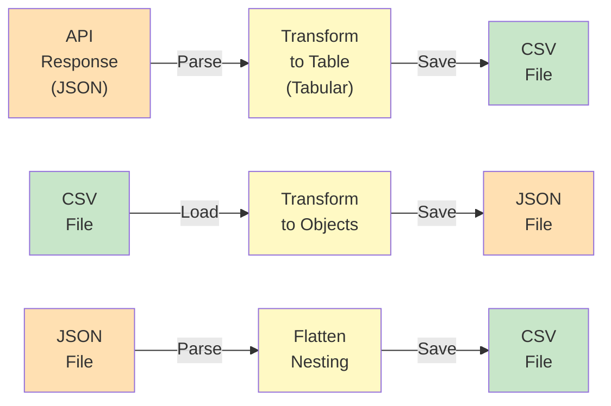

---
tags:
  - Beginner
  - Phase 1
---

# Module 5: CSV & JSON Files

You've collected data from APIs and scraped websites. You've cleaned it thoroughly. Now comes the final step: storing it reliably in a format that's easy to share, archive, and process later.

Two formats dominate: **CSV** (for tabular data) and **JSON** (for structured/nested data). You'll learn when to use each, how to read and write them, and how to convert between them. This is how real data moves through pipelines.

---

## 🎯 What You Will Learn

By the end of this module, you will:

- Understand CSV and JSON formats and when to use each
- Read and write CSV files using Python's csv module
- Read and write JSON files using Python's json module
- Use pandas to work with both formats
- Handle different encodings (UTF-8, ASCII, etc.)
- Flatten nested JSON data
- Merge CSV and JSON data
- Validate data before saving
- Convert between CSV and JSON
- Handle large files efficiently
- Build a command-line tool that filters and exports data

---

## 🧠 Concept Explained: CSV vs JSON

### The Analogy: Different Containers for Different Cargo

**CSV (Comma-Separated Values):**
Like a spreadsheet warehouse. Perfect for organized, rectangular data.

```
Name,Age,City
John,30,London
Sarah,28,Paris
Bob,35,Tokyo
```

**JSON (JavaScript Object Notation):**
Like a flexible storage with labeled boxes. Perfect for nested, hierarchical data.

```json
{
  "user": {
    "name": "John",
    "age": 30,
    "address": {
      "city": "London",
      "zip": "SW1A1AA"
    }
  }
}
```

### When to Use Each

**Use CSV when:**

- Data is tabular (rows and columns)
- All records have the same structure
- You need to import into Excel/spreadsheets
- You want simplicity and speed

**Use JSON when:**

- Data is nested or hierarchical
- Records have different structures
- You're working with APIs (they return JSON)
- You need to embed complex data

---

## 🔍 How It Works: Data Format Pipeline



Most real applications flow: API → JSON → CSV → Database or Analysis.

---

## 🛠️ Step-by-Step Guide

### Step 1: Understand CSV Format

CSV is just text with commas between values:

```
Header1,Header2,Header3
Value1,Value2,Value3
Value4,Value5,Value6
```

Problems with CSV:

- Values with commas must be quoted: `"Smith, John"`
- Newlines in values must be quoted
- No support for nested data
- No standard way to handle types (everything is text)

### Step 2: Read CSV Files

```python
# Method 1: csv module (built-in)
import csv

with open('books.csv', 'r') as f:
    reader = csv.DictReader(f)  # Each row becomes a dictionary
    for row in reader:
        print(row['title'], row['price'])

# Method 2: csv.reader (list of lists)
with open('books.csv', 'r') as f:
    reader = csv.reader(f)
    for row in reader:
        print(row[0], row[1])

# Method 3: pandas (easiest)
import pandas as pd
df = pd.read_csv('books.csv')
print(df)
```

### Step 3: Write CSV Files

```python
import csv

data = [
    {'title': 'Python 101', 'price': 29.99, 'rating': 5},
    {'title': 'Web Dev Basics', 'price': 19.99, 'rating': 4},
]

# Write with DictWriter
with open('output.csv', 'w', newline='') as f:
    fieldnames = ['title', 'price', 'rating']
    writer = csv.DictWriter(f, fieldnames=fieldnames)

    writer.writeheader()  # Write the header row
    writer.writerows(data)  # Write all data rows
```

### Step 4: Understand JSON Format

JSON is hierarchical with objects and arrays:

```json
{
  "book": {
    "title": "Python 101",
    "price": 29.99,
    "author": {
      "name": "John Smith",
      "email": "john@example.com"
    },
    "reviews": [
      { "rating": 5, "comment": "Great!" },
      { "rating": 4, "comment": "Good" }
    ]
  }
}
```

### Step 5: Read JSON Files

```python
import json

# Read JSON file
with open('books.json', 'r') as f:
    data = json.load(f)  # Load entire file
    print(data['title'])

# Read line-by-line (for large files with one JSON object per line)
with open('books_lines.json', 'r') as f:
    for line in f:
        data = json.loads(line)  # Parse single line
        print(data['title'])
```

### Step 6: Write JSON Files

```python
import json

data = {
    'title': 'Python 101',
    'price': 29.99,
    'author': {
        'name': 'John Smith'
    }
}

# Write JSON file
with open('output.json', 'w') as f:
    json.dump(data, f, indent=2)  # indent=2 for pretty formatting
```

### Step 7: Convert CSV to JSON

```python
import csv
import json

# Read CSV and convert to JSON
rows = []
with open('books.csv', 'r') as f:
    reader = csv.DictReader(f)
    for row in reader:
        rows.append(row)

# Write as JSON (array of objects)
with open('books.json', 'w') as f:
    json.dump(rows, f, indent=2)
```

### Step 8: Flatten Nested JSON to CSV

```python
import json
import csv
import pandas as pd

# Nested API response
with open('weather_response.json', 'r') as f:
    data = json.load(f)

# Flatten nested structure
flattened = []
for location in data['locations']:
    for measurement in location['measurements']:
        flattened.append({
            'city': location['city'],
            'country': location['country'],
            'temperature': measurement['temp'],
            'humidity': measurement['humidity'],
            'timestamp': measurement['time']
        })

# Save flattened data to CSV
df = pd.DataFrame(flattened)
df.to_csv('weather_flat.csv', index=False)
```

### Step 9: Validate Data

```python
import json

# Validate JSON before saving
def is_valid_json(data):
    """Check if data can be serialized to JSON"""
    try:
        json.dumps(data)
        return True
    except (TypeError, ValueError):
        return False

# Check before writing
if is_valid_json(my_data):
    with open('output.json', 'w') as f:
        json.dump(my_data, f)
else:
    print("Data contains non-JSON-serializable types!")
```

### Step 10: Handle Encoding

```python
import csv
import json

# CSV with UTF-8 encoding (supports special characters)
with open('data.csv', 'w', encoding='utf-8', newline='') as f:
    writer = csv.writer(f)
    writer.writerow(['Name', 'City'])
    writer.writerow(['José', 'São Paulo'])  # UTF-8 handles accents
    writer.writerow(['李明', '北京'])  # UTF-8 handles Chinese

# JSON always uses UTF-8
with open('data.json', 'w', encoding='utf-8') as f:
    json.dump({'name': 'José'}, f, ensure_ascii=False)  # Preserve non-ASCII
```

---

## 💻 Code Examples

### Example 1: Simple Save and Load

```python
import csv
import json

# Save book data to CSV
books = [
    {'title': 'Python 101', 'author': 'John Smith', 'price': 29.99},
    {'title': 'Web Dev', 'author': 'Sarah Jones', 'price': 24.99},
    {'title': 'Data Science', 'author': 'Bob Lee', 'price': 34.99}
]

# Write CSV
with open('books.csv', 'w', newline='', encoding='utf-8') as f:
    writer = csv.DictWriter(f, fieldnames=['title', 'author', 'price'])
    writer.writeheader()
    writer.writerows(books)

print("✅ Saved to books.csv")

# Save same data as JSON
with open('books.json', 'w', encoding='utf-8') as f:
    json.dump(books, f, indent=2)

print("✅ Saved to books.json")

# Load CSV
print("\n=== Loading from CSV ===")
with open('books.csv', 'r', encoding='utf-8') as f:
    reader = csv.DictReader(f)
    for row in reader:
        print(f"{row['title']} by {row['author']}: ${row['price']}")

# Load JSON
print("\n=== Loading from JSON ===")
with open('books.json', 'r', encoding='utf-8') as f:
    books_data = json.load(f)
    for book in books_data:
        print(f"{book['title']} by {book['author']}: ${book['price']}")
```

**Output:**

```
✅ Saved to books.csv
✅ Saved to books.json

=== Loading from CSV ===
Python 101 by John Smith: $29.99
Web Dev by Sarah Jones: $24.99
Data Science by Bob Lee: $34.99

=== Loading from JSON ===
Python 101 by John Smith: $29.99
Web Dev by Sarah Jones: $24.99
Data Science by Bob Lee: $34.99
```

### Example 2: Convert API Response to CSV

```python
import json
import csv

# API response (from Module 1)
api_response = {
    "list": [
        {
            "main": {"temp": 15.5, "humidity": 72},
            "weather": [{"description": "clear sky"}],
            "dt_txt": "2024-01-15 12:00:00"
        },
        {
            "main": {"temp": 14.2, "humidity": 75},
            "weather": [{"description": "cloudy"}],
            "dt_txt": "2024-01-15 15:00:00"
        }
    ]
}

# Flatten and extract relevant data
measurements = []
for item in api_response['list']:
    measurements.append({
        'timestamp': item['dt_txt'],
        'temperature': item['main']['temp'],
        'humidity': item['main']['humidity'],
        'description': item['weather'][0]['description']
    })

# Save to CSV
with open('weather_data.csv', 'w', newline='', encoding='utf-8') as f:
    fieldnames = ['timestamp', 'temperature', 'humidity', 'description']
    writer = csv.DictWriter(f, fieldnames=fieldnames)
    writer.writeheader()
    writer.writerows(measurements)

print(f"✅ Saved {len(measurements)} measurements to weather_data.csv")

# Verify
with open('weather_data.csv', 'r', encoding='utf-8') as f:
    print("\nData saved:")
    print(f.read())
```

### Example 3: Filter JSON and Export to CSV

```python
import json
import csv

# JSON data from scraping (Module 2)
with open('books.json', 'r', encoding='utf-8') as f:
    books = json.load(f)

# Filter: only books under £20
cheap_books = [book for book in books if book['price'] < 20]

print(f"Found {len(cheap_books)} books under £20")

# Export filtered data to CSV
with open('cheap_books.csv', 'w', newline='', encoding='utf-8') as f:
    fieldnames = ['title', 'author', 'price', 'rating']
    writer = csv.DictWriter(f, fieldnames=fieldnames)
    writer.writeheader()
    writer.writerows(cheap_books)

print("✅ Exported to cheap_books.csv")
```

### Example 4: Merge CSV Files

```python
import csv
import json

# Two CSV files from different sources
# File 1: books.csv (from scraping)
# File 2: ratings.csv (from another source)

books = []
with open('books.csv', 'r', encoding='utf-8') as f:
    reader = csv.DictReader(f)
    books = list(reader)

ratings = {}
with open('ratings.csv', 'r', encoding='utf-8') as f:
    reader = csv.DictReader(f)
    for row in reader:
        ratings[row['isbn']] = row['rating']

# Merge by matching ISBN
merged = []
for book in books:
    if book['isbn'] in ratings:
        book['rating'] = ratings[book['isbn']]
    merged.append(book)

# Save merged data
with open('books_with_ratings.json', 'w', encoding='utf-8') as f:
    json.dump(merged, f, indent=2)

print(f"✅ Merged {len(merged)} books with ratings")
```

---

## ⚠️ Common Mistakes

### Mistake 1: Forgetting CSV Escaping

**WRONG:**

```python
writer.writerow(['Smith, John', 'City'])  # Comma in value!
# Output: Smith, John,City
# Looks like 2 values instead of 2 values: 'Smith, John' and 'City'
```

**RIGHT:**

```python
# Use DictWriter or csv.writer (handles escaping automatically)
import csv
with open('output.csv', 'w', newline='') as f:
    writer = csv.writer(f)
    writer.writerow(['Smith, John', 'City'])
# Output: "Smith, John",City
# Correct: values are quoted properly
```

### Mistake 2: Not Handling Encoding

**WRONG:**

```python
# Default encoding might not support special characters
with open('data.json', 'w') as f:  # No encoding specified!
    json.dump({'name': 'José'}, f)
# Might crash or corrupt special characters
```

**RIGHT:**

```python
# Always specify UTF-8 for international data
with open('data.json', 'w', encoding='utf-8') as f:
    json.dump({'name': 'José'}, f, ensure_ascii=False)
# Works perfectly with accents, Chinese, etc.
```

### Mistake 3: Not Handling Large Files

**WRONG:**

```python
# Loading entire large file into memory
with open('huge_file.json', 'r') as f:
    data = json.load(f)  # Loads entire 1GB file into RAM!
```

**RIGHT:**

```python
# Process line by line (if file has one JSON object per line)
with open('huge_file.json', 'r') as f:
    for line in f:
        data = json.loads(line)  # Process one record at a time
        process(data)
```

---

## ✅ Exercises

### Easy: Save and Load

Create a Python script that:

1. Creates a list of dictionaries (people with name, age, city)
2. Saves to both CSV and JSON
3. Loads from both files
4. Prints the data

**Expected:**

```python
data = [
    {'name': 'John', 'age': 30, 'city': 'London'},
    {'name': 'Sarah', 'age': 28, 'city': 'Paris'}
]
# Save and load both formats
```

### Medium: Convert and Filter

Use the books CSV from Module 2:

1. Load the CSV file
2. Filter for books under £15
3. Save filtered books as JSON
4. Load the JSON and verify

**Expected:**
Filter by price, save as JSON, demonstrate format conversion

### Hard: Build a Data Pipeline

Create a command-line tool:

1. Load data from a source (CSV or JSON)
2. Filter by user input (e.g., "Find books over £20" or "Show weather above 15°C")
3. Save filtered results to both CSV and JSON
4. Print statistics (count, average, min, max)

**Expected:**

```
$ python filter_data.py --file books.json --filter "price < 15" --output cheap_books
Found 5 items matching criteria
Saved to: cheap_books.csv, cheap_books.json
Min price: £5.99, Max price: £14.99, Average: £10.22
```

---

## 🏗️ Mini Project: Data Processing Tool

Build a command-line tool that takes scraped book data and processes it with filters and format conversion.

### Step 1: Prepare Sample Data

```python
import json

# Sample data from book scraping (Module 2)
books = [
    {
        'title': 'A Light in the Attic',
        'author': 'Unknown',
        'price': 51.77,
        'rating': 3,
        'category': 'Poetry',
        'availability': 'In Stock'
    },
    {
        'title': 'Tango with Django',
        'author': 'Unknown',
        'price': 48.87,
        'rating': 2,
        'category': 'Programming',
        'availability': 'In Stock'
    },
    {
        'title': 'Python 101',
        'author': 'John Smith',
        'price': 29.99,
        'rating': 5,
        'category': 'Programming',
        'availability': 'In Stock'
    },
    {
        'title': 'Data Science Handbook',
        'author': 'Sarah Jones',
        'price': 45.50,
        'rating': 4,
        'category': 'Data Science',
        'availability': 'Out of Stock'
    }
]

# Save as both CSV and JSON
import csv

# Save as CSV
with open('books.csv', 'w', newline='', encoding='utf-8') as f:
    fieldnames = ['title', 'author', 'price', 'rating', 'category', 'availability']
    writer = csv.DictWriter(f, fieldnames=fieldnames)
    writer.writeheader()
    writer.writerows(books)

# Save as JSON
with open('books.json', 'w', encoding='utf-8') as f:
    json.dump(books, f, indent=2)

print("✅ Created sample data files")
```

### Step 2: Build the Filter Tool

```python
import json
import csv
import argparse

def load_data(filename):
    """Load data from CSV or JSON"""
    if filename.endswith('.csv'):
        with open(filename, 'r', encoding='utf-8') as f:
            reader = csv.DictReader(f)
            return list(reader)
    elif filename.endswith('.json'):
        with open(filename, 'r', encoding='utf-8') as f:
            return json.load(f)
    else:
        raise ValueError("File must be .csv or .json")

def filter_data(data, field, operator, value):
    """Filter data by field and condition"""
    filtered = []

    for item in data:
        item_value = item.get(field)

        # Convert to appropriate type
        try:
            item_value = float(item_value)
            value = float(value)
        except (ValueError, TypeError):
            pass  # Keep as string

        # Apply operator
        if operator == '<' and item_value < value:
            filtered.append(item)
        elif operator == '>' and item_value > value:
            filtered.append(item)
        elif operator == '==' and item_value == value:
            filtered.append(item)
        elif operator == '!=' and item_value != value:
            filtered.append(item)

    return filtered

def save_data(data, filename):
    """Save data to CSV or JSON"""
    if filename.endswith('.csv'):
        if not data:
            print("No data to save")
            return

        with open(filename, 'w', newline='', encoding='utf-8') as f:
            writer = csv.DictWriter(f, fieldnames=data[0].keys())
            writer.writeheader()
            writer.writerows(data)

    elif filename.endswith('.json'):
        with open(filename, 'w', encoding='utf-8') as f:
            json.dump(data, f, indent=2)

def main():
    parser = argparse.ArgumentParser(description='Filter and convert book data')
    parser.add_argument('--input', required=True, help='Input file (.csv or .json)')
    parser.add_argument('--field', required=True, help='Field to filter on')
    parser.add_argument('--operator', required=True, choices=['<', '>', '==', '!='])
    parser.add_argument('--value', required=True, help='Value to compare')
    parser.add_argument('--output-csv', help='Output CSV file')
    parser.add_argument('--output-json', help='Output JSON file')

    args = parser.parse_args()

    # Load data
    print(f"📖 Loading {args.input}...")
    data = load_data(args.input)
    print(f"   Found {len(data)} items")

    # Filter data
    print(f"🔍 Filtering where {args.field} {args.operator} {args.value}...")
    filtered = filter_data(data, args.field, args.operator, args.value)
    print(f"   Found {len(filtered)} matching items")

    # Calculate statistics
    if filtered and args.field != 'category' and args.field != 'availability':
        values = []
        for item in filtered:
            try:
                values.append(float(item.get(args.field, 0)))
            except:
                pass

        if values:
            print(f"   Min: {min(values):.2f}")
            print(f"   Max: {max(values):.2f}")
            print(f"   Average: {sum(values)/len(values):.2f}")

    # Save output
    if args.output_csv:
        print(f"💾 Saving to {args.output_csv}...")
        save_data(filtered, args.output_csv)
        print(f"   ✅ Saved {len(filtered)} items")

    if args.output_json:
        print(f"💾 Saving to {args.output_json}...")
        save_data(filtered, args.output_json)
        print(f"   ✅ Saved {len(filtered)} items")

if __name__ == '__main__':
    main()
```

### Step 3: Usage Examples

```bash
# Filter books with price less than 40
python filter_tool.py \
    --input books.json \
    --field price \
    --operator '<' \
    --value 40 \
    --output-csv cheap_books.csv \
    --output-json cheap_books.json

# Filter programming books
python filter_tool.py \
    --input books.csv \
    --field category \
    --operator '==' \
    --value Programming \
    --output-json programming_books.json

# Filter highly rated books
python filter_tool.py \
    --input books.json \
    --field rating \
    --operator '>' \
    --value 3 \
    --output-csv rated_books.csv
```

### Step 4: Verify Output

```python
# Test the tool
import json
import csv

print("=== Books Under £40 ===")
with open('cheap_books.json', 'r') as f:
    data = json.load(f)
    print(f"Found {len(data)} books")
    for book in data:
        print(f"  - {book['title']}: £{book['price']}")
```

---

## 🔗 What's Next

You now have the complete data pipeline:

1. ✅ **Collect** (Module 1: APIs)
2. ✅ **Scrape** (Module 2: Web Scraping)
3. ✅ **Design** (Module 3: Schema)
4. ✅ **Clean** (Module 4: Data Cleaning)
5. ✅ **Store** (Module 5: CSV & JSON)

Next phases will build applications on top of this pipeline!

---

## 📚 Summary

In this module, you learned:

1. ✅ **CSV format** – Tabular, simple, Excel-friendly
2. ✅ **JSON format** – Hierarchical, nested, API-friendly
3. ✅ **CSV I/O** – Read and write using csv module
4. ✅ **JSON I/O** – Read and write using json module
5. ✅ **Pandas** – Easy loading and saving
6. ✅ **Convert** – Between CSV and JSON formats
7. ✅ **Flatten** – Nested JSON to tabular CSV
8. ✅ **Encoding** – Handle international characters properly
9. ✅ **Validation** – Check data before saving
10. ✅ **Pipelines** – Build complete data processing workflows

CSV and JSON are everywhere. Master both.

---

**Congratulations! You complete Phase 1. You can now collect, scrape, design, clean, and store data. 🎉**
