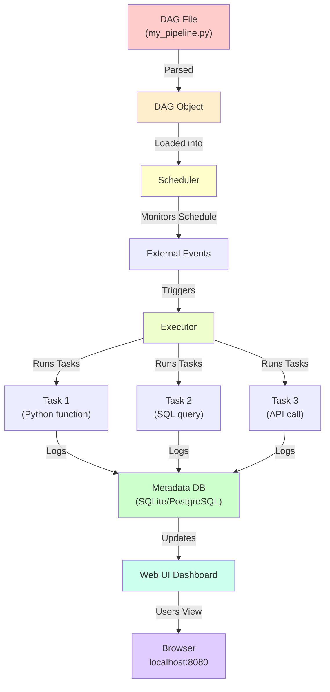

---
tags:
  - Beginner
  - Phase 2
---

# Module 1: Apache Airflow

You've built data pipelines in Python: fetch data from APIs, scrape websites, clean with pandas, store in databases. But there's a problem: you have to manually run your scripts. What if you need data every day at 3am? What if a step fails? What if multiple tasks need to run in sequence, and you want to see what's happening?

**Airflow solves this.** It's a tool that automatically runs your scripts on a schedule, manages dependencies between tasks, retries when things fail, and gives you a dashboard to monitor everything. Airflow is the **factory manager** deciding what runs when and handling all the chaos.

---

## 🎯 What You Will Learn

By the end of this module, you will:

- Understand what a data pipeline is and why we automate it
- Know the key Airflow concepts: DAG, Task, Operator, Scheduler, Executor
- Install Airflow locally in standalone mode
- Navigate the Airflow Web UI
- Write your first DAG in Python
- Define task dependencies (task1 >> task2)
- Schedule DAGs with cron expressions
- Pass data between tasks with XCom
- Implement retries and error handling
- Read task logs in the UI
- Build a working DAG that fetches weather, cleans it, and stores it in PostgreSQL

---

## 🧠 Concept Explained: What Is Airflow?

### The Analogy: Airflow as a Factory Manager

Imagine a clothing factory with multiple machines and workers:

**Without Airflow (manual pipeline):**

- You manually tell Machine A to run at 3am
- You watch the output, then manually tell Machine B to start
- If Machine A breaks, you have to manually restart it
- If you want to run again at 4am, you manually start everything again
- You have no record of what happened or why

**With Airflow:**

- You tell Airflow: "Every day at 3am, run Machine A (if it breaks, retry 3 times), then run Machine B, then run C"
- Airflow wakes up at 3am and triggers everything
- If Machine A fails, Airflow automatically retries
- You have a dashboard showing exactly what ran, when, how long it took, and any errors
- The factory runs 24/7 without you being there

Airflow is the factory manager. It knows the schedule, the dependencies, and handles all the orchestration.

### The Four Problems Airflow Solves

**Problem 1: Manual Scheduling**
Solution: Airflow runs tasks on a schedule (daily, hourly, every 5 minutes)

**Problem 2: Dependencies**
Solution: Airflow enforces "task 2 can't start until task 1 succeeds"

**Problem 3: Failures**
Solution: Airflow retries failed tasks automatically

**Problem 4: Observability**
Solution: Airflow logs everything and provides a dashboard to see what's happening

---

## 🔍 How It Works: Airflow Architecture



### The Key Concepts

**DAG (Directed Acyclic Graph):**
A DAG is a Python file that describes your pipeline. "Directed" means tasks have a direction (A → B → C). "Acyclic" means no loops (you can't have A → B → A).

**Task:**
A single unit of work. Examples: "fetch weather data", "clean data", "write to database".

**Operator:**
The type of task. Examples: PythonOperator (run Python code), BashOperator (run shell commands), PostgresOperator (run SQL).

**Scheduler:**
The master process that wakes up every minute, looks at all DAGs, and decides what tasks to run now.

**Executor:**
The mechanism that actually runs tasks. SequentialExecutor runs one at a time. LocalExecutor runs multiple in parallel.

**Web UI:**
A dashboard at http://localhost:8080 showing all DAGs, their status, logs, and timings.

---

## 🛠️ Step-by-Step Guide

### Step 1: Install Airflow

```bash
# Create a virtual environment (from Phase 0)
python3 -m venv airflow_env
source airflow_env/bin/activate  # On Windows: airflow_env\Scripts\activate

# Install Airflow standalone (easiest for learning)
pip install 'apache-airflow==2.7.0'

# Initialize Airflow (creates database and directories)
airflow db init

# Create a default admin user
airflow users create \
  --username admin \
  --firstname Admin \
  --lastname User \
  --role Admin \
  --email admin@example.com \
  --password admin

# Start the web server
airflow webserver -p 8080

# In another terminal, start the scheduler
airflow scheduler
```

### Step 2: Understand the Airflow Directory Structure

```
~/airflow/
├── dags/                 # Your DAG files go here
├── logs/                 # Task logs
├── airflow.cfg          # Configuration file
└── airflow.db           # SQLite database (metadata)
```

### Step 3: Write Your First DAG

A DAG is just a Python file with a function for each task. Create `~/airflow/dags/my_first_dag.py`:

```python
# Step 1: Import required libraries
from datetime import datetime, timedelta
from airflow import DAG
from airflow.operators.python import PythonOperator

# Step 2: Define tasks as Python functions
def say_hello():
    """A simple task that prints hello"""
    print("Hello from Airflow!")

def say_goodbye():
    """Another simple task"""
    print("Goodbye from Airflow!")

# Step 3: Define the DAG
default_args = {
    'owner': 'me',  # Who owns this DAG?
    'retries': 1,  # How many times to retry if it fails
    'retry_delay': timedelta(minutes=1)  # Wait 1 minute between retries
}

dag = DAG(
    'my_first_dag',  # Unique identifier for this DAG
    default_args=default_args,
    description='My first Airflow pipeline',
    schedule_interval='@daily',  # Run every day
    start_date=datetime(2024, 1, 1),
    catchup=False  # Don't run missed schedules from the past
)

# Step 4: Define tasks using the DAG
task_hello = PythonOperator(
    task_id='hello_task',  # Unique task name
    python_callable=say_hello,  # Function to run
    dag=dag  # Which DAG does this belong to?
)

task_goodbye = PythonOperator(
    task_id='goodbye_task',
    python_callable=say_goodbye,
    dag=dag
)

# Step 5: Define dependencies
# hello_task must complete before goodbye_task starts
task_hello >> task_goodbye
```

### Step 4: View Your DAG in the Web UI

1. Open http://localhost:8080 in your browser
2. Login with admin / admin
3. Click on "my_first_dag" to see it
4. Click "Graph" to see the dependency diagram

### Step 5: Trigger Your DAG

Click the play button (►) next to "my_first_dag". Airflow will:

1. Create a new "run" of the DAG
2. Queue the first task (hello_task)
3. Run it and log the output
4. Automatically start the second task
5. Mark the DAG as successful when all tasks complete

### Step 6: Schedule Your DAG

In the DAG definition, change the schedule:

```python
schedule_interval='@daily'        # Run every day at midnight
schedule_interval='@hourly'       # Run every hour
schedule_interval='0 3 * * *'     # Run at 3am daily (cron syntax)
schedule_interval='*/5 * * * *'   # Run every 5 minutes
schedule_interval=None            # Manual triggers only
```

### Step 7: Pass Data Between Tasks with XCom

XCom (cross-communication) lets tasks share data:

```python
def fetch_weather():
    """Return data that other tasks need"""
    weather_data = {'temp': 15, 'humidity': 72}
    # When you return data, Airflow automatically saves it to XCom
    return weather_data

def process_weather(**context):
    """Receive data from previous task"""
    # Get the returned value from fetch_weather
    weather = context['task_instance'].xcom_pull(task_ids='fetch_task')
    print(f"Processing weather: {weather}")

# Define tasks
task1 = PythonOperator(
    task_id='fetch_task',
    python_callable=fetch_weather,
    dag=dag
)

task2 = PythonOperator(
    task_id='process_task',
    python_callable=process_weather,
    dag=dag
)

# Set dependency
task1 >> task2
```

### Step 8: Handle Errors with Retries

```python
default_args = {
    'owner': 'me',
    'retries': 3,  # Retry 3 times if it fails
    'retry_delay': timedelta(minutes=5),  # Wait 5 minutes between retries
    'retry_exponential_backoff': True,  # Double wait time each retry
    'max_retry_delay': timedelta(minutes=30),  # Max wait time
}
```

### Step 9: Read Task Logs

In the Web UI:

1. Click on a DAG run
2. Click on a task in the graph
3. Click "Log" to see what the task did
4. Logs are also saved to `~/airflow/logs/`

---

## 💻 Code Examples

### Example 1: Simple Data Pipeline

```python
from datetime import datetime, timedelta
from airflow import DAG
from airflow.operators.python import PythonOperator
import requests
import json

# Task 1: Fetch weather from API (Module 1-1 concepts)
def fetch_weather():
    """Fetch weather data from API and return it"""
    # Use free API endpoint
    api_url = "https://api.open-meteo.com/v1/forecast"
    params = {
        "latitude": 51.5074,  # London
        "longitude": -0.1278,
        "current": "temperature_2m,humidity"
    }

    try:
        response = requests.get(api_url, params=params)
        response.raise_for_status()
        weather_data = response.json()  # Parse JSON response

        # Extract just the current conditions
        current = weather_data['current']
        return {
            'temp': current['temperature_2m'],
            'humidity': current['humidity'],
            'timestamp': datetime.now().isoformat()
        }
    except Exception as e:
        print(f"Error fetching weather: {e}")
        raise

# Task 2: Clean the data (Module 1-4 concepts)
def clean_weather_data(**context):
    """Get weather from previous task and validate it"""
    # Pull data from XCom (shared by fetch_weather task)
    weather = context['task_instance'].xcom_pull(task_ids='fetch_weather')

    # Validate data ranges
    if weather['temp'] < -50 or weather['temp'] > 50:
        raise ValueError(f"Invalid temperature: {weather['temp']}")

    if not (0 <= weather['humidity'] <= 100):
        raise ValueError(f"Invalid humidity: {weather['humidity']}")

    print(f"✓ Data is valid: {weather}")
    return weather

# Task 3: Store in database (Module 0-5 concepts)
def store_in_postgres(**context):
    """Store clean weather data in PostgreSQL"""
    import psycopg2
    from datetime import datetime

    # Get cleaned data from previous task
    weather = context['task_instance'].xcom_pull(task_ids='clean_weather')

    try:
        # Connect to PostgreSQL
        conn = psycopg2.connect(
            host='localhost',
            database='weather_db',
            user='postgres',
            password='postgres'
        )
        cursor = conn.cursor()

        # Insert into database
        cursor.execute("""
            INSERT INTO weather_measurements (temperature, humidity, measured_at)
            VALUES (%s, %s, %s)
        """, (weather['temp'], weather['humidity'], weather['timestamp']))

        conn.commit()
        cursor.close()
        conn.close()

        print(f"✓ Stored in database: {weather}")
    except Exception as e:
        print(f"Error writing to database: {e}")
        raise

# Define the DAG
default_args = {
    'owner': 'data-team',
    'retries': 2,
    'retry_delay': timedelta(minutes=5),
    'start_date': datetime(2024, 1, 1)
}

dag = DAG(
    'weather_pipeline',
    default_args=default_args,
    description='Fetch weather → Clean → Store in PostgreSQL',
    schedule_interval='0 * * * *',  # Run every hour at minute 0
    catchup=False
)

# Define tasks
task_fetch = PythonOperator(
    task_id='fetch_weather',
    python_callable=fetch_weather,
    dag=dag
)

task_clean = PythonOperator(
    task_id='clean_weather',
    python_callable=clean_weather_data,
    dag=dag
)

task_store = PythonOperator(
    task_id='store_postgres',
    python_callable=store_in_postgres,
    dag=dag
)

# Define pipeline: fetch → clean → store
task_fetch >> task_clean >> task_store
```

### Example 2: DAG with Conditional Branching

```python
from airflow.operators.python import BranchPythonOperator
from airflow.operators.dummy import DummyOperator

def check_temperature(**context):
    """Check if temperature is hot or cold"""
    weather = context['task_instance'].xcom_pull(task_ids='fetch_weather')
    temp = weather['temp']

    # Return which task to run next
    if temp > 20:
        return 'hot_message'  # Task ID
    else:
        return 'cold_message'  # Task ID

task_fetch = PythonOperator(
    task_id='fetch_weather',
    python_callable=fetch_weather,
    dag=dag
)

def hot_task():
    print("It's hot! Stay hydrated!")

def cold_task():
    print("It's cold! Wear a coat!")

task_hot = PythonOperator(
    task_id='hot_message',
    python_callable=hot_task,
    dag=dag
)

task_cold = PythonOperator(
    task_id='cold_message',
    python_callable=cold_task,
    dag=dag
)

task_branch = BranchPythonOperator(
    task_id='check_temp',
    python_callable=check_temperature,
    dag=dag
)

# Branch based on temperature
task_fetch >> task_branch >> [task_hot, task_cold]
```

### Example 3: Dynamic Task Generation

```python
from airflow.operators.python import PythonOperator

def fetch_city_weather(city_name, **context):
    """Fetch weather for a specific city"""
    # Use open-meteo API
    api_url = "https://api.open-meteo.com/v1/forecast"

    # Mapping of cities to coordinates
    cities = {
        'london': {'lat': 51.5074, 'lon': -0.1278},
        'paris': {'lat': 48.8566, 'lon': 2.3522},
        'tokyo': {'lat': 35.6762, 'lon': 139.6503}
    }

    if city_name not in cities:
        raise ValueError(f"Unknown city: {city_name}")

    coords = cities[city_name]
    params = {
        'latitude': coords['lat'],
        'longitude': coords['lon'],
        'current': 'temperature_2m'
    }

    response = requests.get(api_url, params=params)
    data = response.json()

    return {
        'city': city_name,
        'temp': data['current']['temperature_2m']
    }

# Create tasks dynamically for each city
cities = ['london', 'paris', 'tokyo']
fetch_tasks = []

for city in cities:
    # Create a task for each city
    task = PythonOperator(
        task_id=f'fetch_{city}',
        python_callable=fetch_city_weather,
        op_kwargs={'city_name': city},  # Pass the city name to the function
        dag=dag
    )
    fetch_tasks.append(task)

# All city fetch tasks run in parallel
# (no dependencies between them)
```

---

## ⚠️ Common Mistakes

### Mistake 1: Hardcoded File Paths

**WRONG:**

```python
def save_data():
    """Uses hardcoded path that only works on one computer"""
    with open('/Users/john/Downloads/data.csv', 'w') as f:
        # ... save data
    # This path doesn't exist on other computers!
```

**RIGHT:**

```python
import os
from pathlib import Path

def save_data():
    """Uses relative path that works anywhere"""
    # Get the directory where the DAG is located
    dag_dir = Path(__file__).parent
    output_file = dag_dir / 'data.csv'

    with open(output_file, 'w') as f:
        # ... save data
    # This works on any computer
```

### Mistake 2: Not Setting Dependencies

**WRONG:**

```python
# These tasks will run in parallel, even though B needs A's data!
task_a = PythonOperator(task_id='task_a', ...)
task_b = PythonOperator(task_id='task_b', ...)

# No dependency defined!
# task_b might start before task_a finishes
```

**RIGHT:**

```python
task_a = PythonOperator(task_id='task_a', ...)
task_b = PythonOperator(task_id='task_b', ...)

# Explicitly set dependency
task_a >> task_b  # task_b waits for task_a
```

### Mistake 3: Not Handling Retries

**WRONG:**

```python
def fetch_api():
    """If API is temporarily down, the task fails forever"""
    response = requests.get('https://api.example.com/data')
    # If API is down, requests.get() raises an exception
    # Task fails, no retry ever happens
    return response.json()

# No retry configuration!
task = PythonOperator(task_id='fetch', python_callable=fetch_api, dag=dag)
```

**RIGHT:**

```python
def fetch_api():
    """Explicitly handle transient errors"""
    max_retries = 3
    for attempt in range(max_retries):
        try:
            response = requests.get('https://api.example.com/data')
            return response.json()
        except requests.exceptions.RequestException as e:
            if attempt < max_retries - 1:
                time.sleep(2 ** attempt)  # Exponential backoff
                continue
            else:
                raise  # Give up on last attempt

default_args = {
    'retries': 3,  # Airflow will retry 3 times
    'retry_delay': timedelta(minutes=1)
}
```

---

## ✅ Exercises

### Easy: First DAG

Create a DAG called `hello_world_dag` that:

1. Runs a task that prints "Task 1 started"
2. Runs a task that prints "Task 2 running"
3. Sets task 1 as a dependency for task 2
4. Schedules it to run @daily

Expected: Two tasks, ordered correctly, runs on schedule.

### Medium: DAG with Data Passing

Create a DAG called `data_pipeline` that:

1. Fetches a number (return 42)
2. Multiplies it by 2
3. Adds 10
4. Prints the result
5. Uses XCom to pass data between tasks

Expected: "Transform 42 → 84 → 94"

### Hard: Multi-Step Weather Pipeline

Create a real weather DAG that:

1. Fetches weather from Open-Meteo API for 3 cities
2. Validates the data (temperature must be in -50 to 50 range)
3. Stores results to a CSV file with timestamp
4. Has retry logic (retry 2 times on failure)
5. Scheduled to run every hour

Expected: Weather data for London, Paris, Tokyo stored hourly.

---

## 🏗️ Mini Project: Daily Book Scraper DAG

Build an Airflow DAG that scrapes books.toscrape.com daily, stores results to CSV, and logs statistics.

### Requirements

1. Create a DAG called `daily_book_scraper`
2. **Task 1:** Scrape books.toscrape.com (first 2 pages only)
3. **Task 2:** Clean scraped data
4. **Task 3:** Save to CSV with today's date
5. **Task 4:** Count how many books were scraped and log it
6. **Task 5:** Upload CSV to a shared drive (or just log a message)
7. Schedule to run daily at 6am
8. Add 2 retries with 5-minute delay on failure

### Step 1: Define Task Functions

```python
import requests
from bs4 import BeautifulSoup
from airflow import DAG
from airflow.operators.python import PythonOperator
from datetime import datetime, timedelta
import csv
from pathlib import Path

def scrape_books(**context):
    """Scrape books from books.toscrape.com"""
    base_url = "http://books.toscrape.com/catalogue/page-{}.html"
    books = []

    # Scrape 2 pages
    for page_num in range(1, 3):
        url = base_url.format(page_num)

        try:
            response = requests.get(url)
            response.raise_for_status()

            soup = BeautifulSoup(response.content, 'html.parser')

            # Find all book containers
            for book_elem in soup.find_all('article', class_='product_pod'):
                try:
                    # Extract fields
                    title = book_elem.find('h3').find('a').get('title')
                    price_text = book_elem.find('p', class_='price_color').text.strip()
                    price = float(price_text[1:])  # Remove currency symbol

                    rating_text = book_elem.find('p', class_='star-rating').get('class')[1]
                    rating_map = {'One': 1, 'Two': 2, 'Three': 3, 'Four': 4, 'Five': 5}
                    rating = rating_map.get(rating_text, 0)

                    availability = book_elem.find('p', class_='instock availability').text.strip()

                    books.append({
                        'title': title,
                        'price': price,
                        'rating': rating,
                        'availability': availability
                    })

                except Exception as e:
                    print(f"Error parsing book: {e}")
                    continue

        except Exception as e:
            print(f"Error scraping page {page_num}: {e}")
            continue

    print(f"✓ Scraped {len(books)} books")
    return books

def clean_books(**context):
    """Clean and validate scraped books"""
    # Get books from previous task
    books = context['task_instance'].xcom_pull(task_ids='scrape_task')

    # Remove duplicates (by title)
    seen = set()
    clean_books = []

    for book in books:
        if book['title'] not in seen:
            seen.add(book['title'])
            clean_books.append(book)

    print(f"✓ Cleaned {len(clean_books)} books (removed {len(books) - len(clean_books)} duplicates)")
    return clean_books

def save_to_csv(**context):
    """Save cleaned books to CSV with today's date"""
    books = context['task_instance'].xcom_pull(task_ids='clean_task')

    # Create filename with date
    today = datetime.now().strftime('%Y-%m-%d')
    output_file = Path(f'/tmp/books_{today}.csv')

    # Write CSV
    with open(output_file, 'w', newline='', encoding='utf-8') as f:
        fieldnames = ['title', 'price', 'rating', 'availability']
        writer = csv.DictWriter(f, fieldnames=fieldnames)

        writer.writeheader()
        writer.writerows(books)

    print(f"✓ Saved to {output_file}")
    return str(output_file)

def log_statistics(**context):
    """Count and log statistics about the scrape"""
    books = context['task_instance'].xcom_pull(task_ids='clean_task')
    output_file = context['task_instance'].xcom_pull(task_ids='save_task')

    total = len(books)
    avg_price = sum(b['price'] for b in books) / total if total > 0 else 0
    avg_rating = sum(b['rating'] for b in books) / total if total > 0 else 0

    message = f"""
    📊 DAILY BOOK SCRAPE REPORT
    ════════════════════════════
    Date: {datetime.now().strftime('%Y-%m-%d %H:%M:%S')}
    Total Books: {total}
    Average Price: £{avg_price:.2f}
    Average Rating: {avg_rating:.1f}/5
    Output File: {output_file}
    ════════════════════════════
    """

    print(message)
    return message

# Define the DAG
default_args = {
    'owner': 'data-team',
    'retries': 2,
    'retry_delay': timedelta(minutes=5),
    'start_date': datetime(2024, 1, 1)
}

dag = DAG(
    'daily_book_scraper',
    default_args=default_args,
    description='Scrape books.toscrape.com daily',
    schedule_interval='0 6 * * *',  # 6am every day
    catchup=False
)

# Define tasks
task_scrape = PythonOperator(
    task_id='scrape_task',
    python_callable=scrape_books,
    dag=dag
)

task_clean = PythonOperator(
    task_id='clean_task',
    python_callable=clean_books,
    dag=dag
)

task_save = PythonOperator(
    task_id='save_task',
    python_callable=save_to_csv,
    dag=dag
)

task_stats = PythonOperator(
    task_id='stats_task',
    python_callable=log_statistics,
    dag=dag
)

# Define pipeline
task_scrape >> task_clean >> task_save >> task_stats
```

---

## 🔗 What's Next

Airflow runs your tasks, but your tasks need to be smart:

- **Module 2-2 (dbt)**: Transform data in SQL
- **Module 2-3 (Validation)**: Ensure data quality
- **Module 2-4 (Database ETL)**: Proper data loading
- **Module 2-5 (Orchestration)**: Advanced patterns

Airflow is the conductor. Data quality is the symphony.

---

## 📚 Summary

In this module, you learned:

1. ✅ **What Airflow is** – Automated pipeline orchestration
2. ✅ **DAGs, Tasks, Operators** – Core concepts
3. ✅ **Installation** – Running locally in standalone mode
4. ✅ **Web UI** – Monitoring and triggering pipelines
5. ✅ **DAG syntax** – Writing pipelines in Python
6. ✅ **Dependencies** – task1 >> task2 ordering
7. ✅ **Scheduling** – Cron expressions and timing
8. ✅ **XCom** – Passing data between tasks
9. ✅ **Retries** – Automatic failure handling
10. ✅ **Logging** – Finding and reading task logs

Airflow turns chaos into order. Welcome to automation!

---

**Congratulations! Your pipelines now run automatically. 🎉**
j) ## 🔗 What's Next (link to next module)

3. CODE QUALITY
   - Every code block must be complete and runnable as-is.
   - Every single line must have an inline comment.
   - Use Python unless the module is specifically about another tool.
   - Show expected output after each code block in a separate
     code block labeled `# Expected output`.

4. DIAGRAMS
   - Include at least one Mermaid diagram OR ASCII diagram.
   - Diagrams must show data flow, not just boxes with names.

5. ADMONITIONS — use MkDocs Material admonitions:
   - !!! tip for shortcuts and best practices
   - !!! warning for things that often break
   - !!! note for important context
   - !!! danger for things that can cause data loss or bugs

6. CROSS-LINKS
   - Reference earlier modules when building on prior concepts.
   - Example: "Remember virtual environments from Module 1?"

7. LENGTH
   - Do not summarise. Be thorough.
   - Each section should be detailed enough that a beginner
     can follow without searching anything else.
     ============================================================
     PROMPT END
     -->

!!! note "Module content coming soon"
Use the AI prompt in the comment above to generate the full
content for this module. Paste it into Claude, ChatGPT, or
any AI assistant.
