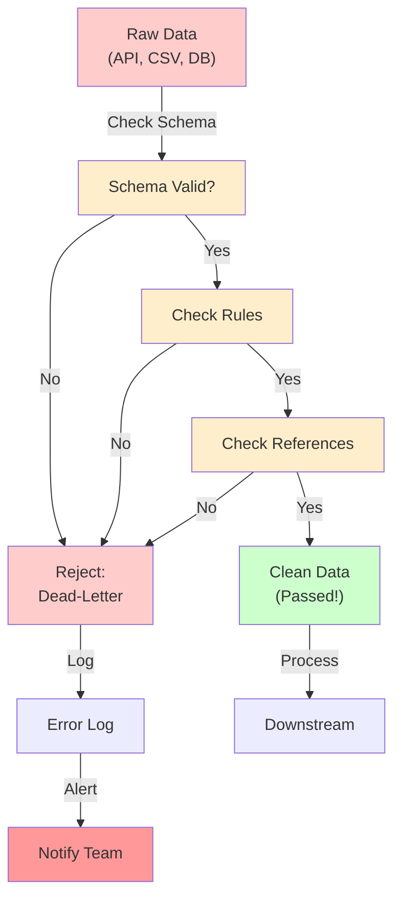

---
tags:
  - Beginner
  - Phase 2
---

# Module 3: Data Validation & Error Handling

You've built pipelines that fetch data, transform it, and load it. But what if the data is bad? What if a customer's age is -5? What if an email has no "@"? What if a book price is NULL when it shouldn't be?

**Bad data destroys pipelines downstream.** Your analytics team queries bad data and makes wrong decisions. Your machine learning model trains on garbage and produces predictions nobody trusts.

This module is about **validation**: checking that data meets expectations before it enters your pipeline, and handling errors gracefully when things go wrong.

---

## 🎯 What You Will Learn

By the end of this module, you will:

- Understand why data validation matters
- Use pydantic to validate individual records
- Write schema validation rules
- Validate entire pandas DataFrames
- Understand error handling in pipelines
- Implement dead-letter queues for bad records
- Alert on validation failures
- Design idempotent pipelines
- Create a validation layer in your DAGs
- Handle and log different error types
- Build resilient systems that fail gracefully

---

## 🧠 Concept Explained: Why Validation Matters

### The Analogy: Quality Control at a Restaurant

**Without validation:**
You accept any ingredient delivered by suppliers.

- Rotten tomatoes go into the kitchen
- Expired milk is used in sauces
- Glass ends up in food

Customers get sick. Lawsuits. Restaurant closes.

**With validation:**
You inspect every ingredient when it arrives.

- Tomatoes: check for ripeness, mold, damage
- Milk: check expiration date and smell
- Packages: inspect for breakage

Bad ingredients are rejected immediately. Food is safe.

### Three Layers of Validation

**Layer 1: Schema Validation**
"Does this record match the expected shape?"

```
Expected: {'name': string, 'age': number, 'email': string}
Got:      {'name': 'John', 'age': 'twenty-five', 'email': 'john@example.com'}
→ FAIL: age should be a number, not string
```

**Layer 2: Rule Validation**
"Do the values make sense?"

```
Expected: age must be 0-150
Got: age = -5
→ FAIL: negative age makes no sense
```

**Layer 3: Referential Validation**
"Do related records exist?"

```
Expected: book.author_id must exist in authors table
Got: book.author_id = 999 (but only authors 1-50 exist)
→ FAIL: author doesn't exist
```

---

## 🔍 How It Works: Validation Pipeline



Each layer filters out bad data before it can cause damage downstream.

---

## 🛠️ Step-by-Step Guide

### Step 1: Install Validation Libraries

```bash
pip install pydantic pandas great-expectations python-dotenv
```

### Step 2: Define Schema with Pydantic

```python
from pydantic import BaseModel, Field, EmailStr, validator
from typing import Optional
from datetime import datetime

# Define what a valid book looks like
class BookData(BaseModel):
    """Schema for book records"""

    book_id: int = Field(..., gt=0)  # Must be greater than 0
    title: str = Field(..., min_length=1, max_length=200)  # Required, 1-200 chars
    author_id: int = Field(..., gt=0)
    price: float = Field(..., ge=0, le=10000)  # 0 to 10,000
    rating: Optional[int] = Field(None, ge=1, le=5)  # 1-5 or None
    isbn: Optional[str] = None
    created_at: datetime

    @validator('title')
    def title_not_empty(cls, v):
        """Custom validation: title can't be just spaces"""
        if not v.strip():
            raise ValueError('Title cannot be empty or only spaces')
        return v.strip()

    @validator('price')
    def price_realistic(cls, v):
        """Custom validation: price should be realistic"""
        if v < 0.01:
            raise ValueError('Price must be at least 0.01')
        return v

    class Config:
        json_schema_extra = {
            "example": {
                "book_id": 1,
                "title": "Python 101",
                "author_id": 5,
                "price": 29.99,
                "rating": 5,
                "isbn": "978-1234567890",
                "created_at": "2024-01-15T10:30:00"
            }
        }
```

### Step 3: Validate Individual Records

```python
from pydantic import ValidationError
import json

def validate_book(record: dict) -> tuple[bool, dict]:
    """
    Validate a single book record.
    Returns: (is_valid, result_dict)
    """
    try:
        # Try to create BookData from record
        # If validation fails, pydantic raises ValidationError
        validated = BookData(**record)

        return True, validated.dict()

    except ValidationError as e:
        # Capture all validation errors
        errors = []
        for error in e.errors():
            errors.append({
                'field': error['loc'][0],
                'error': error['msg'],
                'type': error['type']
            })

        return False, {
            'original_record': record,
            'errors': errors
        }

# Test the validator
test_record = {
    'book_id': 1,
    'title': 'Python 101',
    'author_id': 5,
    'price': 29.99,
    'rating': 5,
    'created_at': '2024-01-15T10:30:00'
}

is_valid, result = validate_book(test_record)
print(f"Valid: {is_valid}")
print(f"Result: {result}")
```

### Step 4: Validate Pandas DataFrames

```python
import pandas as pd
from pandera import Column, Schema, Check, In

# Define expected schema
schema = Schema({
    'book_id': Column(int, checks=Check.greater_than(0)),
    'title': Column(str, checks=Check.str_length(1, 200)),
    'author_id': Column(int, checks=Check.greater_than(0)),
    'price': Column(float, checks=[
        Check.greater_than_or_equal_to(0),
        Check.less_than_or_equal_to(10000)
    ]),
    'rating': Column(int, checks=Check.isin([1,2,3,4,5]), nullable=True)
})

def validate_dataframe(df: pd.DataFrame) -> tuple[bool, str]:
    """Validate entire DataFrame against schema"""
    try:
        # Validate DataFrame
        schema.validate(df, lazy=True)  # Check all errors, don't fail on first
        return True, f"✓ {len(df)} rows are valid"

    except Exception as e:
        return False, f"✗ Validation failed: {str(e)}"

# Test with DataFrame
df = pd.DataFrame([
    {'book_id': 1, 'title': 'Python 101', 'author_id': 5, 'price': 29.99, 'rating': 5},
    {'book_id': 2, 'title': 'Web Dev', 'author_id': 3, 'price': 24.99, 'rating': 4}
])

is_valid, message = validate_dataframe(df)
print(message)
```

### Step 5: Implement Dead-Letter Queue

```python
import json
from pathlib import Path
from datetime import datetime

class DeadLetterQueue:
    """Store rejected records separately for later investigation"""

    def __init__(self, filepath: str = 'rejected_records.json'):
        self.filepath = Path(filepath)
        # Initialize file if it doesn't exist
        if not self.filepath.exists():
            self.filepath.write_text(json.dumps([]))

    def add_rejected_record(self, record: dict, errors: list, source: str):
        """Log a rejected record"""
        rejected = {
            'timestamp': datetime.now().isoformat(),
            'source': source,
            'record': record,
            'errors': errors
        }

        # Read existing rejected records
        existing = json.loads(self.filepath.read_text())
        existing.append(rejected)

        # Write back
        self.filepath.write_text(json.dumps(existing, indent=2))

        print(f"❌ Record rejected and logged to {self.filepath}")

    def get_rejected_count(self) -> int:
        """Count rejected records"""
        records = json.loads(self.filepath.read_text())
        return len(records)

# Usage
dlq = DeadLetterQueue()

# Validate and handle rejections
bad_record = {
    'book_id': -1,  # Invalid!
    'title': 'Bad Book',
    'author_id': 5,
    'price': 29.99,
    'created_at': '2024-01-15T10:30:00'
}

is_valid, result = validate_book(bad_record)
if not is_valid:
    dlq.add_rejected_record(
        record=result['original_record'],
        errors=result['errors'],
        source='books_api'
    )
```

### Step 6: Error Handling in Pipelines

```python
import logging
from typing import List

# Set up logging
logging.basicConfig(
    level=logging.INFO,
    format='%(asctime)s - %(name)s - %(levelname)s - %(message)s'
)
logger = logging.getLogger(__name__)

def process_books_batch(records: List[dict]) -> dict:
    """
    Process batch of book records with comprehensive error handling.
    Returns statistics about processing.
    """
    valid_records = []
    rejected_records = []

    processed = 0
    errors_encountered = 0

    dlq = DeadLetterQueue()

    for i, record in enumerate(records):
        try:
            # Attempt validation
            is_valid, result = validate_book(record)

            if is_valid:
                valid_records.append(result)
                processed += 1
                logger.info(f"Record {i+1}/{len(records)}: Valid")
            else:
                # Validation failed
                rejected_records.append(result)
                dlq.add_rejected_record(
                    record=result['original_record'],
                    errors=result['errors'],
                    source='batch_import'
                )
                errors_encountered += 1
                logger.warning(f"Record {i+1} rejected: {result['errors']}")

        except Exception as e:
            # Unexpected error (not validation)
            errors_encountered += 1
            logger.error(f"Record {i+1} processing failed: {str(e)}", exc_info=True)
            dlq.add_rejected_record(
                record=record,
                errors=[{'error': str(e), 'type': 'unexpected_error'}],
                source='batch_import'
            )

    # Print summary
    success_rate = (processed / len(records) * 100) if records else 0
    logger.info(f"""
    Processing Complete:
    - Total records: {len(records)}
    - Valid: {processed}
    - Rejected: {errors_encountered}
    - Success rate: {success_rate:.1f}%
    """)

    return {
        'total': len(records),
        'valid': processed,
        'rejected': errors_encountered,
        'valid_records': valid_records,
        'rejected_records': rejected_records
    }
```

### Step 7: Idempotent Pipeline Design

```python
def idempotent_load_to_database(records: List[dict], connection_string: str):
    """
    Idempotent load: running twice produces same result.
    Uses UPSERT (insert or update based on primary key).
    """
    import psycopg2
    from psycopg2.extras import execute_values

    conn = psycopg2.connect(connection_string)
    cursor = conn.cursor()

    try:
        # UPSERT: insert if not exists, update if exists
        # Using book_id as primary key
        query = """
        INSERT INTO books (book_id, title, author_id, price, rating, created_at)
        VALUES %s
        ON CONFLICT (book_id) DO UPDATE SET
            title = EXCLUDED.title,
            author_id = EXCLUDED.author_id,
            price = EXCLUDED.price,
            rating = EXCLUDED.rating
        """

        # Convert records to tuples
        values = [
            (r['book_id'], r['title'], r['author_id'], r['price'], r['rating'], r['created_at'])
            for r in records
        ]

        execute_values(cursor, query, values)
        conn.commit()

        logger.info(f"✓ Loaded {len(records)} records (idempotent upsert)")
        return True

    except Exception as e:
        conn.rollback()
        logger.error(f"✗ Failed to load: {str(e)}")
        return False

    finally:
        cursor.close()
        conn.close()
```

---

## 💻 Code Examples

### Example 1: Complete Validation Pipeline in Airflow

```python
from airflow import DAG
from airflow.operators.python import PythonOperator
from datetime import datetime, timedelta
import requests
import json
from pydantic import BaseModel, ValidationError

class BookRecord(BaseModel):
    book_id: int
    title: str
    price: float
    rating: int = None

def fetch_books_from_api(**context):
    """Fetch books from API"""
    response = requests.get('https://api.example.com/books')
    books = response.json()
    return books

def validate_books(**context):
    """Validate fetched books"""
    books = context['task_instance'].xcom_pull(task_ids='fetch_books')

    valid = []
    rejected = []

    for book in books:
        try:
            validated = BookRecord(**book)
            valid.append(validated.dict())
        except ValidationError as e:
            rejected.append({
                'record': book,
                'errors': e.errors()
            })

    # If too many rejections, alert
    rejection_rate = len(rejected) / len(books) if books else 0
    if rejection_rate > 0.1:  # More than 10% rejected
        raise ValueError(f"Too many rejections ({rejection_rate*100:.1f}%)")

    return {'valid': valid, 'rejected': rejected}

def load_valid_books(**context):
    """Load only valid books to database"""
    result = context['task_instance'].xcom_pull(task_ids='validate_books')
    valid_books = result['valid']

    # Load to database
    print(f"Loading {len(valid_books)} valid books")
    # ... database loading code ...

    return len(valid_books)

# Define DAG
dag = DAG(
    'validated_book_pipeline',
    schedule_interval='@daily',
    default_args={'retries': 1}
)

task_fetch = PythonOperator(task_id='fetch_books', python_callable=fetch_books_from_api, dag=dag)
task_validate = PythonOperator(task_id='validate_books', python_callable=validate_books, dag=dag)
task_load = PythonOperator(task_id='load_books', python_callable=load_valid_books, dag=dag)

task_fetch >> task_validate >> task_load
```

### Example 2: DataFrame Validation with Pandera

```python
import pandas as pd
from pandera import Column, Schema, Check, In

# Create schema
book_schema = Schema({
    'book_id': Column(int, Check.greater_than(0), unique=True),
    'title': Column(str, Check.str_length(1, 500)),
    'author_id': Column(int, Check.greater_than(0)),
    'price': Column(float, Check.in_range(0, 10000)),
    'rating': Column(int, Check.isin([1,2,3,4,5]), nullable=True)
})

# Test data with intentional errors
df_with_errors = pd.DataFrame([
    {'book_id': 1, 'title': 'Python 101', 'author_id': 1, 'price': 29.99, 'rating': 5},
    {'book_id': -1, 'title': 'Bad ID', 'author_id': 2, 'price': 24.99, 'rating': 4},  # Bad: negative ID
    {'book_id': 3, 'title': '', 'author_id': 3, 'price': 19.99, 'rating': 3},  # Bad: empty title
    {'book_id': 4, 'title': 'Web Dev', 'author_id': 4, 'price': 34.99, 'rating': 6},  # Bad: rating > 5
])

try:
    # Validate with lazy=True to collect all errors
    validated_df = book_schema.validate(df_with_errors, lazy=True)
    print("✓ All rows passed validation")
except Exception as e:
    print(f"✗ Validation errors found:")
    print(e)

    # Fix the data
    df_clean = df_with_errors[
        (df_with_errors['book_id'] > 0) &
        (df_with_errors['title'].str.len() > 0) &
        (df_with_errors['rating'] <= 5)
    ].reset_index(drop=True)

    # Validate again
    try:
        validated_df = book_schema.validate(df_clean)
        print(f"✓ {len(validated_df)} rows passed after cleaning")
    except Exception as e2:
        print(f"✗ Still has errors: {e2}")
```

---

## ⚠️ Common Mistakes

### Mistake 1: Ignoring Validation Errors

**WRONG:**

```python
# Try to load, but ignore if validation fails
try:
    for record in records:
        validated = BookRecord(**record)
        load_to_db(validated)
except ValidationError:
    pass  # Silently ignore!
# Bad data sneaks into database!
```

**RIGHT:**

```python
# Track and log all validation failures
valid = []
invalid = []

for record in records:
    try:
        validated = BookRecord(**record)
        valid.append(validated)
    except ValidationError as e:
        invalid.append({'record': record, 'error': e})
        logger.warning(f"Invalid: {record} - {e}")

# Only load valid records
if invalid:
    logger.error(f"{len(invalid)} records failed validation!")
    # Decide: fail pipeline or continue with valid only?

load_to_db(valid)
```

### Mistake 2: Overly Strict Validation

**WRONG:**

```python
# Require every field
class BookData(BaseModel):
    book_id: int  # Required
    title: str    # Required
    author_id: int  # Required
    price: float  # Required
    rating: int  # Required
    description: str  # Required
    pages: int  # Required
    publication_date: date  # Required

# Almost no records pass because APIs rarely have all fields!
```

**RIGHT:**

```python
# Make optional fields truly optional
class BookData(BaseModel):
    book_id: int  # Required: core identifier
    title: str  # Required: core data
    author_id: int  # Required: core relationship
    price: float  # Required: core business logic
    rating: Optional[int] = None  # Optional: nice-to-have
    description: Optional[str] = None  # Optional
    pages: Optional[int] = None  # Optional
    publication_date: Optional[date] = None  # Optional
```

### Mistake 3: Not Testing Edge Cases

**WRONG:**

```python
# Simple validation only
@validator('price')
def price_positive(cls, v):
    return v > 0  # Only checks positive

# Edge cases slip through:
# - price = 0.00001 (should it be allowed?)
# - price = 999999 (unrealistic)
# - price with 10 decimal places (database truncates)
```

**RIGHT:**

```python
@validator('price')
def price_realistic(cls, v):
    # Check realistic range
    if not (0.01 <= v <= 10000):
        raise ValueError('Price must be 0.01 to 10,000')

    # Check decimal precision
    if len(str(v).split('.')[-1]) > 2:
        raise ValueError('Price can have max 2 decimal places')

    return v

# Test edge cases
test_cases = [
    0,  # Too low
    0.001,  # Too low precision
    0.01,  # Valid
    10000,  # Valid
    10000.01,  # Too high
    -5,  # Negative
]
```

---

## ✅ Exercises

### Easy: Simple Pydantic Validation

Create a pydantic model for a customer:

- name (string, required, 1-100 chars)
- email (valid email, required)
- age (int, 0-150)
- country (string, optional)

Test with valid and invalid data.

### Medium: DataFrame Validation

Create a DataFrame with intentional errors:

- Duplicate IDs
- Missing required columns
- Out-of-range values

Use pandera to validate and fix the data.

### Hard: Complete Pipeline with Dead-Letter Queue

Build a pipeline that:

1. Loads CSV data
2. Validates each row with pydantic
3. Stores valid rows in `valid_records.json`
4. Stores invalid rows in `rejected_records.json` with error reasons
5. Logs statistics (99.5% valid, 0.5% rejected)

Expected output: Clean data and separate error log.

---

## 🏗️ Mini Project: Validate and Clean Book Data

Build a validation system for the books scraper from Module 2-1.

### Requirements

1. Create pydantic model for books:
   - book_id (int, > 0)
   - title (str, 1-500 chars)
   - author_id (int, > 0)
   - price (float, 0.01-10000)
   - rating (int, 1-5, optional)
   - isbn (str, optional)

2. Load books CSV from Module 2
3. Validate each row
4. Track valid/rejected
5. Save valid to `books_validated.csv`
6. Save rejected to `books_rejected.json` with reasons

### Implementation

```python
from pydantic import BaseModel, Field, validator
import pandas as pd
import json
from pathlib import Path
from datetime import datetime

# Step 1: Define book schema
class BookSchema(BaseModel):
    book_id: int = Field(..., gt=0)
    title: str = Field(..., min_length=1, max_length=500)
    author_id: int = Field(..., gt=0)
    price: float = Field(..., ge=0.01, le=10000)
    rating: int = Field(None, ge=1, le=5)
    isbn: str = None

    @validator('title')
    def title_strip(cls, v):
        return v.strip()

    @validator('price')
    def price_two_decimals(cls, v):
        if len(str(v).split('.')[-1]) > 2:
            raise ValueError('Price max 2 decimal places')
        return v

# Step 2: Validate books
def validate_books_batch(df: pd.DataFrame) -> tuple[pd.DataFrame, list]:
    """Validate book DataFrame"""
    valid_rows = []
    rejected_rows = []

    for idx, row in df.iterrows():
        try:
            validated = BookSchema(**row.to_dict())
            valid_rows.append(validated.dict())
        except Exception as e:
            rejected_rows.append({
                'row_index': idx,
                'data': row.to_dict(),
                'errors': str(e)
            })

    valid_df = pd.DataFrame(valid_rows) if valid_rows else pd.DataFrame()
    return valid_df, rejected_rows

# Step 3: Run
df = pd.read_csv('books.csv')
valid_df, rejected = validate_books_batch(df)

# Save valid
valid_df.to_csv('books_validated.csv', index=False)

# Save rejected
with open('books_rejected.json', 'w') as f:
    json.dump(rejected, f, indent=2)

# Report
print(f"""
Validation Complete:
- Total: {len(df)}
- Valid: {len(valid_df)}
- Rejected: {len(rejected)}
- Success rate: {len(valid_df)/len(df)*100:.1f}%
""")
```

---

## 🔗 What's Next

Clean data is ready for loading!

- **Module 2-4 (Database ETL)**: Load validated data properly
- **Module 2-5 (Orchestration)**: Tie validation into Airflow pipelines

Validation is not optional. It's the guardian of data quality.

---

## 📚 Summary

In this module, you learned:

1. ✅ **Why validation matters** – Prevents bad data
2. ✅ **Pydantic schemas** – Define valid data shape
3. ✅ **Field validation** – Check ranges and formats
4. ✅ **Custom validators** – Complex business rules
5. ✅ **DataFrame validation** – Pandera for pandas
6. ✅ **Error handling** – Try/except patterns
7. ✅ **Dead-letter queues** – Store rejected records
8. ✅ **Logging** – Track what happens
9. ✅ **Idempotency** – Safe to run twice
10. ✅ **Complete pipeline** – Fetch → Validate → Load

Validation is where data quality starts. Make it a habit.

---

**Congratulations! Your pipelines now validate data before it enters the system. 🎉**
j) ## 🔗 What's Next (link to next module)

3. CODE QUALITY
   - Every code block must be complete and runnable as-is.
   - Every single line must have an inline comment.
   - Use Python unless the module is specifically about another tool.
   - Show expected output after each code block in a separate
     code block labeled `# Expected output`.

4. DIAGRAMS
   - Include at least one Mermaid diagram OR ASCII diagram.
   - Diagrams must show data flow, not just boxes with names.

5. ADMONITIONS — use MkDocs Material admonitions:
   - !!! tip for shortcuts and best practices
   - !!! warning for things that often break
   - !!! note for important context
   - !!! danger for things that can cause data loss or bugs

6. CROSS-LINKS
   - Reference earlier modules when building on prior concepts.
   - Example: "Remember virtual environments from Module 1?"

7. LENGTH
   - Do not summarise. Be thorough.
   - Each section should be detailed enough that a beginner
     can follow without searching anything else.
     ============================================================
     PROMPT END
     -->

!!! note "Module content coming soon"
Use the AI prompt in the comment above to generate the full
content for this module. Paste it into Claude, ChatGPT, or
any AI assistant.
