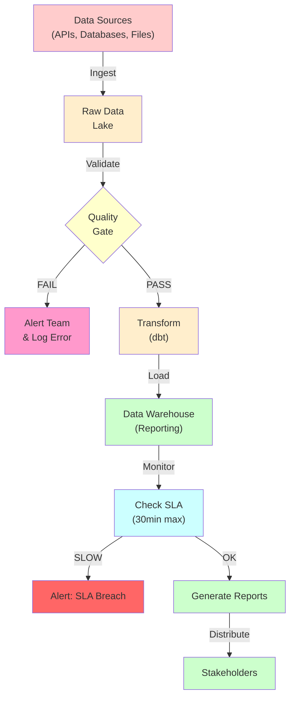

---
tags:
  - Beginner
  - Phase 2
---

# Module 5: Workflow Orchestration

You've learned to build pipelines. Now you'll learn to orchestrate them like a conductor leads musicians. This module teaches how professional companies run thousands of data pipelines: scheduling, monitoring, error handling, and alerting. You'll design end-to-end architectures and understand when to use Airflow vs alternatives.

---

## 🎯 What You Will Learn

By the end of this module, you will:

- Understand orchestration vs choreography
- Design production data architectures
- Use sensors to wait for conditions
- Implement retry strategies
- Create dynamic DAGs for flexible pipelines
- Add monitoring and alerting
- Build idempotent workflows
- Handle backfill and replay scenarios
- Choose between orchestrators (Airflow vs Prefect vs Dagster)
- Scale from development to production
- Design data quality gates
- Understand SLAs and alert thresholds

---

## 🧠 Concept Explained: Orchestration vs Choreography

### Orchestra Analogy

Imagine running a concert with 100 musicians.

**Choreography (no conductor):**

- Each musician follows a written score independently
- No one knows what others are doing
- If violins start late, everything falls apart
- Hard to fix mistakes in real time

**Orchestration (with conductor):**

- Conductor watches everyone
- Tells violins "wait for cellos"
- Fixes timing issues in real time
- Coordinates complex sequences
- Adapts to problems

**In data pipelines:**

**Without Orchestration:**

- Task A runs on a cron job (runs every hour automatically)
- Task B runs on a separate cron job
- If A fails, B still runs with bad data
- You have to manually check logs for errors

**With Orchestration (Airflow):**

- Airflow starts Task A
- Airflow waits for A to succeed
- THEN Airflow starts Task B
- If A fails, Airflow stops Task B
- Airflow notifies you automatically

### The Problem Orchestration Solves

Without orchestration, you might run 50 jobs like this:

```
Task 1: Fetch weather data           → cron job at 1 AM
Task 2: Clean weather data            → cron job at 1:15 AM
Task 3: Calculate daily averages      → cron job at 1:30 AM
Task 4: Load to database              → cron job at 2 AM
Task 5: Generate report               → cron job at 2:15 AM
Task 6: Email report                  → cron job at 2:30 AM
```

**Problems:**

- If Task 1 takes 30 minutes instead of 5, Task 2 starts with incomplete data
- If Task 4 fails, Task 5 still runs (and generates wrong reports)
- No central place to see what's running vs what failed
- If you need to re-run Step 3, you have to manually trigger it

**With orchestration (Airflow DAGs):**

- Task 1 → Task 2 → Task 3 → Task 4 → Task 5 → Task 6
- Each task waits for previous to succeed
- If Task 4 fails, Tasks 5 and 6 don't run
- Airflow Web UI shows everything
- Click one button to re-run from any step

---

## 🔍 How It Works: Production Orchestration Architecture



Each component has monitoring and can fail gracefully.

---

## 🛠️ Step-by-Step Guide

### Step 1: Define Your Workflow Requirements

Ask yourself:

1. **What needs to run?** (list all tasks)
2. **In what order?** (dependencies)
3. **When should it run?** (schedule/frequency)
4. **What can fail?** (vulnerabilities)
5. **What should happen when it fails?** (retry? alert?)
6. **How do we know it succeeded?** (completion checks)
7. **What's acceptable delay?** (SLA - Service Level Agreement)

### Step 2: Design Your DAG Structure

```
Example: Daily book analytics pipeline

START
  ├─ fetch_books (from API)
  ├─ fetch_authors (from database)
  ├─ fetch_reviews (from another database)
  └─ wait for all above to succeed
      └─ validate_data
          ├─ check_null_values
          ├─ check_duplicates
          └─ check_business_rules
              └─ wait for all checks
                  └─ transform (dbt)
                      └─ load_to_warehouse
                          ├─ run_tests
                          └─ generate_reports
                              └─ send_email
                                  └─ SUCCESS
```

### Step 3: Identify Where to Add Sensors

Sensors are "waiters" - they check conditions.

```python
# Wait for file to appear (FileSensor)
wait_for_data = FileSensor(
    task_id='wait_for_data',
    filepath='/data/daily/books.csv',
    poke_interval=60,  # Check every 60 seconds
    timeout=3600  # Give up after 1 hour
)

# Wait for API to be available (HttpSensor)
wait_for_api = HttpSensor(
    task_id='wait_for_api',
    endpoint='https://api.example.com/health',
    http_conn_id='api_connection',
    poke_interval=30  # Check every 30 seconds
)

# Wait for database to have new data (SqlSensor)
wait_for_new_data = SqlSensor(
    task_id='wait_for_new_data',
    conn_id='postgres_default',
    sql="SELECT COUNT(*) FROM books WHERE created_at > {{ yesterday_ds }}",
    expected_value=0  # Wait until count > 0
)
```

### Step 4: Add Retry Logic

```python
# Configure retries for each task
from airflow.models import Variable

fetch_data = PythonOperator(
    task_id='fetch_data',
    python_callable=fetch_books_data,
    retries=3,  # Try up to 3 times
    retry_delay=timedelta(minutes=5),  # Wait 5 min between retries
    retry_exponential_backoff=True,  # Wait longer each time: 5, 10, 20 min
    max_retry_delay=timedelta(hours=1)  # Don't wait more than 1 hour
)
```

### Step 5: Set SLA and Alerts

```python
# Define SLA: task must complete within 30 minutes
fetch_data = PythonOperator(
    task_id='fetch_data',
    python_callable=fetch_books_data,
    sla=timedelta(minutes=30),  # Alert if not done in 30 min
    pool='default_pool',  # Limit concurrent execution
    pool_slots=1  # Use 1 slot from pool
)

# DAG-level SLA
dag = DAG(
    'daily_pipeline',
    schedule_interval='0 1 * * *',  # 1 AM daily
    dag_sla=timedelta(minutes=60)  # Entire DAG must finish within 60 min
)
```

### Step 6: Configure Monitoring

```python
# Email on failure
dag = DAG(
    'daily_pipeline',
    schedule_interval='0 1 * * *',
    owner='data-team',
    email=['data-team@company.com'],
    email_on_failure=True,
    email_on_retry=True
)

# Slack notification
from airflow.providers.slack.operators.slack_webhook import SlackWebhookOperator

notify_slack = SlackWebhookOperator(
    task_id='notify_slack',
    http_conn_id='slack_webhook',
    message='Pipeline complete!'
)
```

### Step 7: Build Idempotent Tasks

Every task must be safe to run multiple times:

```python
# ✓ IDEMPOTENT - safe to run twice
def load_books_idempotent(df):
    """Upsert: insert if new, update if exists"""
    df.to_sql('books', engine, if_exists='append', index=False)
    # ON CONFLICT in database handles duplicates

# ✗ NOT IDEMPOTENT - running twice creates problems
def load_books_broken(df):
    """Insert: running twice = duplicate records"""
    conn.execute("INSERT INTO books VALUES (...)")
    # No conflict handling
```

### Step 8: Handle Backfill and Replay

```python
# DAG configured to allow backfill (re-processing old data)
dag = DAG(
    'daily_pipeline',
    schedule_interval='0 1 * * *',
    start_date=datetime(2020, 1, 1),  # Can backfill to this date
    catchup=False  # Don't auto-backfill when DAG is first deployed
)

# Run in Airflow CLI:
# airflow dags backfill daily_pipeline -s 2024-01-01 -e 2024-01-31
# This re-processes all days in January
```

---

## 💻 Code Examples

### Example 1: Complete Production DAG with All Features

```python
from airflow import DAG
from airflow.operators.python import PythonOperator
from airflow.operators.dummy import DummyOperator
from airflow.sensors.file import FileSensor
from airflow.sensors.http import HttpSensor
from airflow.utils.dates import days_ago
from datetime import datetime, timedelta
import logging

# Logger for debugging
logger = logging.getLogger(__name__)

# Define configuration
DAG_ID = 'production_books_pipeline'
OWNER = 'data-eng-team'
EMAIL = ['alerts@company.com']

# Functions for tasks
def check_api_health():
    """Check if API is accessible"""
    import requests
    try:
        response = requests.get('https://api.example.com/health', timeout=5)
        if response.status_code == 200:
            logger.info("✓ API is healthy")
            return True
        else:
            # If API returns error, let task fail so DAG stops
            raise Exception(f"API unhealthy: {response.status_code}")
    except Exception as e:
        logger.error(f"API health check failed: {e}")
        raise

def extract_books():
    """Fetch books from API"""
    import requests
    logger.info("Starting books extraction...")

    # Fetch data from API
    response = requests.get('https://api.example.com/books')
    books = response.json()

    # Save to file for next task to use
    import json
    with open('/tmp/books_raw.json', 'w') as f:
        json.dump(books, f)

    logger.info(f"✓ Extracted {len(books)} books")
    return len(books)

def validate_books():
    """Validate extracted data"""
    import json
    import pandas as pd
    from pydantic import BaseModel, validator

    logger.info("Starting validation...")

    # Load raw data
    with open('/tmp/books_raw.json', 'r') as f:
        books = json.load(f)

    # Define validation schema
    class BookData(BaseModel):
        book_id: int
        title: str
        author: str
        price: float  # Must be a number

        @validator('price')
        def price_must_be_positive(cls, v):
            if v <= 0:
                raise ValueError('Price must be > 0')
            return v

    # Validate each record
    valid_books = []
    invalid_count = 0

    for book in books:
        try:
            validated = BookData(**book)
            valid_books.append(validated.dict())
        except Exception as e:
            logger.warning(f"Invalid book: {book} - {e}")
            invalid_count += 1

    # Save valid data
    df = pd.DataFrame(valid_books)
    df.to_csv('/tmp/books_valid.csv', index=False)

    logger.info(f"✓ Validated {len(valid_books)} books (rejected {invalid_count})")

    # Fail if too many invalid
    if invalid_count > len(valid_books):
        raise Exception(f"Invalid rate too high: {invalid_count}/{len(books)}")

def transform_books():
    """Run dbt transformations"""
    import subprocess
    import os

    logger.info("Starting dbt transformation...")

    # Run dbt from Airflow
    result = subprocess.run(
        ['dbt', 'run'],
        cwd='/home/user/books_dbt_project',  # DBT project directory
        capture_output=True,
        text=True
    )

    if result.returncode != 0:
        logger.error(f"dbt failed: {result.stderr}")
        raise Exception("dbt transformation failed")

    logger.info("✓ dbt transformation complete")
    logger.info(result.stdout)

def load_to_warehouse():
    """Load transformed data to warehouse"""
    from sqlalchemy import create_engine
    import pandas as pd
    import os
    from dotenv import load_dotenv

    load_dotenv()

    logger.info("Loading to warehouse...")

    # Connect to database
    db_url = f"postgresql://{os.getenv('DB_USER')}:{os.getenv('DB_PASSWORD')}@{os.getenv('DB_HOST')}/{os.getenv('DB_NAME')}"
    engine = create_engine(db_url)

    # Load data
    df = pd.read_csv('/tmp/books_valid.csv')

    # Upsert to database
    try:
        with engine.begin() as conn:
            # ON CONFLICT handles duplicates (idempotent)
            df.to_sql('books_loaded', conn, if_exists='append', index=False)

        logger.info(f"✓ Loaded {len(df)} books to warehouse")
    except Exception as e:
        logger.error(f"Load failed: {e}")
        raise

    finally:
        engine.dispose()

def generate_report():
    """Generate daily analytics report"""
    import pandas as pd
    from sqlalchemy import create_engine, text
    import os
    from dotenv import load_dotenv

    load_dotenv()

    logger.info("Generating report...")

    # Query data from warehouse
    db_url = f"postgresql://{os.getenv('DB_USER')}:{os.getenv('DB_PASSWORD')}@{os.getenv('DB_HOST')}/{os.getenv('DB_NAME')}"
    engine = create_engine(db_url)

    query = """
    SELECT
        COUNT(*) as total_books,
        AVG(price) as avg_price,
        MAX(price) as max_price,
        DATE(NOW()) as report_date
    FROM books_loaded
    """

    report = pd.read_sql_query(query, engine)

    # Save report
    report.to_csv('/tmp/daily_report.csv', index=False)
    logger.info(f"✓ Report: {len(report)} rows")

    engine.dispose()

def send_alert_on_failure(context):
    """Send alert when pipeline fails"""
    import requests

    logger.error("Pipeline failed! Sending alert...")

    # Send to Slack
    message = f"""
    ❌ Pipeline Failure
    DAG: {context['dag'].dag_id}
    Task: {context['task'].task_id}
    Time: {context['execution_date']}
    """

    requests.post(
        'https://hooks.slack.com/services/YOUR_WEBHOOK',
        json={'text': message}
    )

# Define DAG
dag = DAG(
    DAG_ID,
    owner=OWNER,
    email=EMAIL,
    email_on_failure=True,  # Email alerts on failure
    email_on_retry=False,  # Don't email on retry
    start_date=days_ago(30),  # Can backfill 30 days
    schedule_interval='0 1 * * *',  # Run daily at 1 AM
    catchup=False,  # Don't auto-backfill on first deploy
    tags=['production', 'daily']
)

# Define tasks

# Step 1: Check if API is accessible
wait_for_api = HttpSensor(
    task_id='wait_for_api',
    endpoint='https://api.example.com/health',
    http_conn_id='api_connection',
    poke_interval=30,  # Check every 30 seconds
    timeout=1800,  # Give up after 30 minutes
    dag=dag,
    sla=timedelta(minutes=5)  # Must complete within 5 min
)

# Step 2: Extract books
extract = PythonOperator(
    task_id='extract_books',
    python_callable=extract_books,
    retries=2,  # Retry up to 2 times
    retry_delay=timedelta(minutes=5),  # Wait 5 min between retries
    dag=dag,
    sla=timedelta(minutes=10)  # Must complete within 10 min
)

# Step 3: Validate data
validate = PythonOperator(
    task_id='validate_books',
    python_callable=validate_books,
    retries=1,
    dag=dag,
    sla=timedelta(minutes=5)
)

# Step 4: Transform with dbt
transform = PythonOperator(
    task_id='transform_books',
    python_callable=transform_books,
    retries=1,
    dag=dag,
    sla=timedelta(minutes=15)  # dbt might take longer
)

# Step 5: Load to warehouse
load = PythonOperator(
    task_id='load_to_warehouse',
    python_callable=load_to_warehouse,
    retries=2,  # Retries are important for loading
    dag=dag,
    sla=timedelta(minutes=5)
)

# Step 6: Generate report
report = PythonOperator(
    task_id='generate_report',
    python_callable=generate_report,
    dag=dag,
    sla=timedelta(minutes=5)
)

# Step 7: Mark success
end = DummyOperator(
    task_id='pipeline_complete',
    dag=dag
)

# Define dependencies (execution order)
wait_for_api >> extract >> validate >> transform >> load >> report >> end
```

### Example 2: Dynamic DAG for Multiple Regions

```python
from airflow import DAG
from airflow.operators.python import PythonOperator
from datetime import datetime, timedelta

# Configuration: regions to process
REGIONS = ['north', 'south', 'east', 'west']

# Base DAG definition
dag = DAG(
    'dynamic_regional_pipeline',
    start_date=datetime(2024, 1, 1),
    schedule_interval='0 2 * * *',  # 2 AM daily
    catchup=False
)

# Create tasks dynamically for each region
extract_tasks = {}
load_tasks = {}

for region in REGIONS:
    # Create extraction task for this region
    extract_task = PythonOperator(
        task_id=f'extract_{region}',
        python_callable=extract_regional_data,
        op_kwargs={'region': region},  # Pass region as parameter
        dag=dag
    )
    extract_tasks[region] = extract_task

    # Create load task for this region
    load_task = PythonOperator(
        task_id=f'load_{region}',
        python_callable=load_regional_data,
        op_kwargs={'region': region},
        dag=dag
    )
    load_tasks[region] = load_task

    # Set dependency: extract → validate → load
    extract_task >> load_task

# Run analysis after all regions complete
analyze = PythonOperator(
    task_id='analyze_all_regions',
    python_callable=analyze_regional_data,
    dag=dag
)

# Set final dependencies: all loads must complete before analysis
for region in REGIONS:
    load_tasks[region] >> analyze

def extract_regional_data(region):
    """Extract data for specific region"""
    print(f"Extracting {region} data...")
    # Implementation here

def load_regional_data(region):
    """Load region data to database"""
    print(f"Loading {region} data...")
    # Implementation here

def analyze_regional_data():
    """Analyze all regions"""
    print("Analyzing all regions...")
    # Implementation here
```

### Example 3: DAG with XCom (Task Communication)

```python
from airflow import DAG
from airflow.operators.python import PythonOperator
from datetime import datetime, timedelta

dag = DAG(
    'data_pipeline_with_communication',
    start_date=datetime(2024, 1, 1),
    schedule_interval='0 1 * * *',
    catchup=False
)

def fetch_data(**context):
    """Fetch data and push to XCom"""
    import requests

    # Fetch books
    response = requests.get('https://api.example.com/books')
    books = response.json()

    # Count books
    book_count = len(books)

    # Push to XCom so next task can access it
    context['task_instance'].xcom_push(
        key='book_count',
        value=book_count
    )

    context['task_instance'].xcom_push(
        key='books_data',
        value=books
    )

    return book_count  # Also return for logging

def process_data(**context):
    """Receive data from previous task via XCom"""

    # Pull value from XCom
    book_count = context['task_instance'].xcom_pull(
        task_ids='fetch_data',
        key='book_count'
    )

    # Also pull raw data
    books = context['task_instance'].xcom_pull(
        task_ids='fetch_data',
        key='books_data'
    )

    print(f"Processing {book_count} books from previous task")
    print(f"First book: {books[0] if books else 'No data'}")

    # Process books...
    return len(books)

def load_data(**context):
    """Receive processed count"""

    # Pull value from previous task
    processed_count = context['task_instance'].xcom_pull(
        task_ids='process_data'
    )

    print(f"Loading {processed_count} processed books")

# Create task instances
fetch = PythonOperator(
    task_id='fetch_data',
    python_callable=fetch_data,
    provide_context=True,
    dag=dag
)

process = PythonOperator(
    task_id='process_data',
    python_callable=process_data,
    provide_context=True,
    dag=dag
)

load = PythonOperator(
    task_id='load_data',
    python_callable=load_data,
    provide_context=True,
    dag=dag
)

# Dependencies
fetch >> process >> load
```

---

## ⚠️ Common Mistakes

### Mistake 1: No Retry Logic

**WRONG:**

```python
task = PythonOperator(
    task_id='fetch_data',
    python_callable=fetch_books  # API fails temporarily?
    # No retries - entire pipeline fails
)
```

**RIGHT:**

```python
task = PythonOperator(
    task_id='fetch_data',
    python_callable=fetch_books,
    retries=3,  # Try 3 times
    retry_delay=timedelta(minutes=5),  # Wait between tries
    retry_exponential_backoff=True  # Wait longer each time
)
```

### Mistake 2: Tasks Not Idempotent

**WRONG:**

```python
def load_books():
    """Running twice = duplicate records"""
    with engine.connect() as conn:
        conn.execute("INSERT INTO books VALUES (...)")
    # No way to handle re-runs
```

**RIGHT:**

```python
def load_books():
    """Safe to run twice"""
    df = read_data()
    # ON CONFLICT in database handles duplicates
    df.to_sql('books', engine, if_exists='append')
```

### Mistake 3: DAG Too Complex with Long Runtime

**WRONG:**

```python
# This DAG has 100 tasks in a linear chain
task1 >> task2 >> task3 >> ... >> task100
# Takes 2 hours to complete
# If any task fails after 110 minutes, massive waste
```

**RIGHT:**

```python
# Parallelize independent tasks
extract_books >> validate  # independent
extract_authors >> validate  # independent
extract_reviews >> validate  # independent
# All fetch in parallel, then validate, then merge
```

---

## ✅ Exercises

### Easy: Add Retries to Your DAG

Take the daily_book_scraper DAG from Module 5-1 and add:

- 2 retries on fetch task
- 5-minute delay between retries
- Email alert on final failure

### Medium: Create a Multi-Step Recovery

Build a DAG that:

1. Fetches data (with retries)
2. If fetch fails after 3 retries, fetch from backup source
3. If backup also fails, send alert and stop

### Hard: Design Production Monitoring

Create a DAG with:

1. Main pipeline tasks
2. SLA set to 30 minutes per task
3. Monitoring task that checks if any SLAs were breached
4. Alert task that sends Slack + email if problem found

---

## 🏗️ Mini Project: Extended Production Pipeline with Monitoring

Build the books pipeline from Module 2-1 with all production features.

### Requirements

1. **Sensors:**
   - HTTP sensor waiting for API to be healthy
   - File sensor waiting for daily data file

2. **Error Handling:**
   - Retries with exponential backoff
   - Task-level SLAs
   - DAG-level SLA

3. **Communication:**
   - XCom to pass record count between tasks
   - Email on failure

4. **Monitoring:**
   - Log every step
   - Track pipeline runtime
   - Alert if SLA breached

5. **Idempotency:**
   - All tasks safe to re-run

### Implementation

```python
from airflow import DAG
from airflow.operators.python import PythonOperator
from airflow.sensors.http import HttpSensor
from airflow.sensors.file import FileSensor
from airflow.operators.dummy import DummyOperator
from datetime import datetime, timedelta
import logging
import json
import pandas as pd
import requests
from sqlalchemy import create_engine, text
import os
from dotenv import load_dotenv

# Load environment
load_dotenv()
logger = logging.getLogger(__name__)

# Database config
DB_URL = f"postgresql+psycopg2://{os.getenv('DB_USER')}:{os.getenv('DB_PASSWORD')}@{os.getenv('DB_HOST')}:{os.getenv('DB_PORT')}/{os.getenv('DB_NAME')}"

# DAG configuration
dag_config = {
    'owner': 'data-team',
    'email': ['data-team@company.com'],
    'email_on_failure': True,
    'email_on_retry': False,
    'start_date': datetime(2024, 1, 1),
    'catchup': False,
    'tags': ['production', 'books']
}

dag = DAG(
    'production_books_pipeline_extended',
    schedule_interval='0 1 * * *',  # 1 AM daily
    dag_sla=timedelta(hours=1),  # Entire DAG must finish within 1 hour
    **dag_config
)

# Task functions
def check_api_available():
    """Check if API endpoint is responding"""
    logger.info("Checking API availability...")
    try:
        response = requests.get('https://books-api.example.com/health', timeout=5)
        response.raise_for_status()
        logger.info("✓ API is available")
    except Exception as e:
        logger.error(f"✗ API not available: {e}")
        raise

def scrape_books(**context):
    """Scrape books from website"""
    logger.info("Starting book scraping...")

    # Scrape books (using requests/BeautifulSoup from Module 1-2)
    response = requests.get('https://www.example.com/books')
    # Parse and extract books...
    books = [
        {'book_id': 1, 'title': 'Python 101', 'author': 'John', 'price': 29.99},
        {'book_id': 2, 'title': 'Web Dev', 'author': 'Sarah', 'price': 24.99}
    ]

    # Save to file
    with open('/tmp/books_raw.json', 'w') as f:
        json.dump(books, f)

    # Push count to XCom for next task
    context['task_instance'].xcom_push(
        key='scraped_count',
        value=len(books)
    )

    logger.info(f"✓ Scraped {len(books)} books")

def validate_books_data(**context):
    """Validate scraped books"""
    logger.info("Validating books data...")

    # Get count from previous task
    scraped_count = context['task_instance'].xcom_pull(
        task_ids='scrape_books',
        key='scraped_count'
    )

    logger.info(f"Validating {scraped_count} books...")

    # Load and validate
    with open('/tmp/books_raw.json', 'r') as f:
        books = json.load(f)

    from pydantic import BaseModel, validator

    class BookData(BaseModel):
        book_id: int
        title: str
        author: str
        price: float

        @validator('price')
        def price_positive(cls, v):
            if v <= 0:
                raise ValueError('Price must be positive')
            return v

    valid_books = []
    invalid = 0

    for book in books:
        try:
            BookData(**book)
            valid_books.append(book)
        except Exception as e:
            logger.warning(f"Invalid book: {book}")
            invalid += 1

    # Save valid books
    df = pd.DataFrame(valid_books)
    df.to_csv('/tmp/books_valid.csv', index=False)

    # Push count to XCom
    context['task_instance'].xcom_push(
        key='valid_count',
        value=len(valid_books)
    )

    logger.info(f"✓ Validated {len(valid_books)} books (rejected {invalid})")

    if invalid > len(valid_books):  # More than 50% invalid
        raise Exception("Data quality too low")

def clean_books_data(**context):
    """Clean books data using pandas"""
    logger.info("Cleaning books data...")

    # Load validated data
    df = pd.read_csv('/tmp/books_valid.csv')

    # Remove duplicates
    df = df.drop_duplicates(subset=['book_id'], keep='first')

    # Clean strings
    df['title'] = df['title'].str.strip().str.title()
    df['author'] = df['author'].str.strip()

    # Add timestamp
    df['loaded_at'] = pd.Timestamp.now()

    # Save cleaned
    df.to_csv('/tmp/books_clean.csv', index=False)

    # Push count
    context['task_instance'].xcom_push(
        key='clean_count',
        value=len(df)
    )

    logger.info(f"✓ Cleaned {len(df)} books")

def store_in_database(**context):
    """Store books in PostgreSQL with idempotent upsert"""
    logger.info("Storing books in database...")

    # Get count from XCom
    clean_count = context['task_instance'].xcom_pull(
        task_ids='clean_books_data',
        key='clean_count'
    )

    logger.info(f"Storing {clean_count} books to PostgreSQL...")

    # Load cleaned data
    df = pd.read_csv('/tmp/books_clean.csv')

    # Connect to database
    engine = create_engine(DB_URL)

    try:
        # Upsert: insert or update on conflict
        with engine.begin() as conn:
            for idx, row in df.iterrows():
                query = text("""
                INSERT INTO books (book_id, title, author, price, loaded_at)
                VALUES (:book_id, :title, :author, :price, :loaded_at)
                ON CONFLICT (book_id) DO UPDATE SET
                    title = EXCLUDED.title,
                    author = EXCLUDED.author,
                    price = EXCLUDED.price,
                    loaded_at = EXCLUDED.loaded_at
                """)

                conn.execute(query, {
                    'book_id': row['book_id'],
                    'title': row['title'],
                    'author': row['author'],
                    'price': row['price'],
                    'loaded_at': row['loaded_at']
                })

        logger.info(f"✓ Stored {len(df)} books in database")

    finally:
        engine.dispose()

def generate_dailyreport(**context):
    """Generate daily analytics report"""
    logger.info("Generating daily report...")

    # Connect and query
    engine = create_engine(DB_URL)

    query = text("""
    SELECT
        COUNT(*) as total_books,
        AVG(price) as avg_price,
        MAX(price) as max_price,
        DATE(NOW()) as report_date
    FROM books
    WHERE loaded_at::date = CURRENT_DATE
    """)

    with engine.connect() as conn:
        result = conn.execute(query)
        report = result.fetchone()

    logger.info(f"✓ Report: {report}")

    engine.dispose()

def pipeline_complete(**context):
    """Log pipeline completion"""
    logger.info("=" * 50)
    logger.info("✓ Production pipeline complete!")
    logger.info(f"Execution time: {(context['end_date'] - context['start_date']).total_seconds()}s")
    logger.info("=" * 50)

# Create tasks

# Sensor: Wait for API
wait_api = HttpSensor(
    task_id='wait_for_api',
    endpoint='https://books-api.example.com/health',
    http_conn_id='api_conn',
    poke_interval=30,  # Check every 30 seconds
    timeout=1800,  # Give up after 30 minutes
    sla=timedelta(minutes=5),
    dag=dag
)

# Sensor: Wait for data file
wait_file = FileSensor(
    task_id='wait_for_data_file',
    filepath='/data/daily/books_list.txt',
    poke_interval=60,
    timeout=3600,
    sla=timedelta(minutes=10),
    dag=dag
)

# Task: Scrape books
scrape = PythonOperator(
    task_id='scrape_books',
    python_callable=scrape_books,
    provide_context=True,
    retries=2,
    retry_delay=timedelta(minutes=5),
    retry_exponential_backoff=True,
    sla=timedelta(minutes=10),
    dag=dag
)

# Task: Validate
validate = PythonOperator(
    task_id='validate_books_data',
    python_callable=validate_books_data,
    provide_context=True,
    retries=1,
    sla=timedelta(minutes=5),
    dag=dag
)

# Task: Clean
clean = PythonOperator(
    task_id='clean_books_data',
    python_callable=clean_books_data,
    provide_context=True,
    sla=timedelta(minutes=5),
    dag=dag
)

# Task: Store
store = PythonOperator(
    task_id='store_in_database',
    python_callable=store_in_database,
    provide_context=True,
    retries=3,  # More retries for database operations
    retry_delay=timedelta(minutes=5),
    sla=timedelta(minutes=10),
    dag=dag
)

# Task: Report
report = PythonOperator(
    task_id='generate_daily_report',
    python_callable=generate_dailyreport,
    sla=timedelta(minutes=5),
    dag=dag
)

# Task: Complete
complete = DummyOperator(
    task_id='pipeline_complete',
    dag=dag
)

# Define dependencies
wait_api >> scrape
wait_file >> scrape
scrape >> validate >> clean >> store >> report >> complete
```

---

## 🔗 Production Concepts: Beyond Airflow

### Alternative Orchestrators

You now know Airflow well. But companies choose based on their needs:

**Prefect (prefect.io)**

- Newer than Airflow (cleaner Python syntax)
- Better error handling (flow runs return exceptions)
- Better UI (easier to see what failed)
- Easier to test locally

**Dagster (dagster.io)**

- Asset-focused (think about outputs, not tasks)
- Strong typing and data contracts
- Best for ML pipelines
- Steeper learning curve

**Dask**

- For distributed computing across clusters
- When you need scale but Airflow orchestration is overkill
- Scientific computing focus

### When to Use Each

```
Small company, simple pipelines
  → Airflow (or Cron jobs)
        ↓
Large company, many pipelines
  → Airflow (mature, battle-tested)
        ↓
Don't like Airflow's UI
  → Prefect (better UX)
        ↓
Building ML systems
  → Dagster (asset tracking)
        ↓
Need distributed data processing
  → Dask + Airflow
```

---

## 📚 Summary

In this module, you learned:

1. ✅ **Orchestration vs choreography** – Why you need it
2. ✅ **DAG design** – Planning workflows
3. ✅ **Sensors** – Waiting for conditions
4. ✅ **Retries** – Handling temporary failures
5. ✅ **SLAs** – Performance expectations
6. ✅ **Monitoring** – Alerts and logging
7. ✅ **Idempotency** – Safe to re-run
8. ✅ **XCom** – Task communication
9. ✅ **Dynamic DAGs** – Flexible pipelines
10. ✅ **Production architecture** – End-to-end design
11. ✅ **Alternatives** – When to use Prefect/Dagster

---

**Congratulations! You've mastered data pipeline orchestration. You can now build production-grade data systems. 🎉**

This is the foundation of modern data engineering. Everything from here is specialization: ML ops, analytics, real-time streaming, or anything else you choose.
j) ## 🔗 What's Next (link to next module)

3. CODE QUALITY
   - Every code block must be complete and runnable as-is.
   - Every single line must have an inline comment.
   - Use Python unless the module is specifically about another tool.
   - Show expected output after each code block in a separate
     code block labeled `# Expected output`.

4. DIAGRAMS
   - Include at least one Mermaid diagram OR ASCII diagram.
   - Diagrams must show data flow, not just boxes with names.

5. ADMONITIONS — use MkDocs Material admonitions:
   - !!! tip for shortcuts and best practices
   - !!! warning for things that often break
   - !!! note for important context
   - !!! danger for things that can cause data loss or bugs

6. CROSS-LINKS
   - Reference earlier modules when building on prior concepts.
   - Example: "Remember virtual environments from Module 1?"

7. LENGTH
   - Do not summarise. Be thorough.
   - Each section should be detailed enough that a beginner
     can follow without searching anything else.
     ============================================================
     PROMPT END
     -->

!!! note "Module content coming soon"
Use the AI prompt in the comment above to generate the full
content for this module. Paste it into Claude, ChatGPT, or
any AI assistant.
