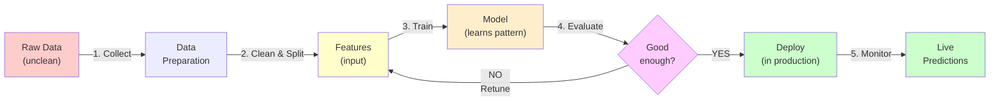

---
tags:
  - Beginner
  - Phase 3
---

# Module 1: Machine Learning Concepts & Workflows

Welcome to machine learning! This is your first step into one of the most exciting fields in technology. Before we write a single line of code, let's understand what machine learning _actually is_, why it's different from traditional programming, and how to think about problems that ML can solve.

This module builds intuition first. We'll use concrete examples throughout, coming back to the same dataset again and again so you see the full journey from raw data to a working model.

---

## 🎯 What You Will Learn

By the end of this module, you will:

- Understand what machine learning is (and what it's NOT)
- Know the three main types of learning: supervised, unsupervised, reinforcement
- Follow the complete ML workflow from data to deployment
- Learn key vocabulary: features, labels, training/validation/test sets
- Understand overfitting and underfitting
- Know the bias-variance tradeoff conceptually
- Distinguish between classification and regression
- Understand evaluation metrics and when to use each
- Perform train/test splits correctly
- See your first working ML model

---

## 🧠 Concept Explained: What Is Machine Learning?

### The Cat Recognition Analogy

**Traditional Programming (Explicit Rules):**
You try to teach a computer "how to recognize cats" by writing rules:

```
IF (has pointy ears) AND (has whiskers) AND (has tail) AND (says meow)
    THEN it's a cat
```

**Problem:** Rules are fragile. What about cats without whiskers? What about lions with pointy ears? You'd need thousands of exceptions.

**Machine Learning Approach:**
Instead of writing rules, you show the computer thousands of cat pictures and non-cat pictures. The computer learns the _pattern_ of what features tend to appear in cat pictures.

**The key difference:**

- **Traditional code:** You write the rules
- **Machine Learning:** You show examples, and the computer figures out the _pattern_

ML is fundamentally about learning from examples, not following pre-written instructions.

### Three Types of Learning

**Supervised Learning: Learning with labels**

- You give the model examples with correct answers
- Model learns to predict the answer for new examples
- Example: "Is this email spam?" with historical emails labeled "spam" or "not spam"
- The computer learns: "these words → likely spam"

**Unsupervised Learning: Finding patterns without labels**

- No correct answers provided
- Model finds hidden patterns or groups
- Example: "Cluster these customers by shopping behavior" (no "right" answer, just patterns)
- Result: "Customers A and B buy similar things → group them"

**Reinforcement Learning: Learning through trial and error**

- Model learns by taking actions and receiving rewards/penalties
- Example: A game-playing AI that learns chess by playing millions of games
- "If I move this piece, I win" → reward. "If I move that piece, I lose" → penalty
- Model gradually learns the best strategy

**For this course:** We focus on supervised learning first (most common in business). Unsupervised appears in feature engineering. We skip reinforcement for now.

---

## 🔍 How It Works: The ML Workflow

Every ML project follows the same workflow. Memorize this sequence:



**Step 1: Data Preparation**

- Collect messy real-world data
- Clean it (remove errors, handle missing values, remove outliers)
- Understand what you're predicting (what is your goal?)

**Step 2: Features**

- Select/engineer features: the columns/attributes your model learns from
- Example: to predict house price, features might be "square footage", "number of bedrooms", "location"
- Better features → better model (even if the model is simple)

**Step 3: Train**

- Feed the model training data (examples with known answers)
- Model learns to predict the answer from features

**Step 4: Evaluate**

- Test the model on data it hasn't seen before
- Did it learn real patterns, or did it memorize?
- If not good enough, go back to step 2 (fix features) or 3 (try different model)

**Step 5: Deploy**

- Put the model in production
- Use it to make predictions on new data

**Step 6: Monitor**

- Check that the model still works (real-world data changes)
- Re-train if needed

### Key Vocabulary

**Features (Input):**

- The columns/attributes the model uses to make predictions
- Example: house price prediction features = [square footage, bedrooms, location, age]
- Typically denoted as **X**

**Labels (Output/Target):**

- The correct answer we're trying to predict
- Example: the actual house price
- Typically denoted as **y**

**Training Set:**

- Data the model **learns from** (70-80% of data)
- The model sees these examples
- Model adjusts weights to predict well on this data

**Validation Set:**

- Data used to **tune the model** (10-15% of data)
- Separate from training
- Used to try different settings without overfitting

**Test Set:**

- Data the model **has never seen** (10-15% of data)
- Final check: "Does this model work on new data?"
- You only look at test results ONCE, at the end

**Why split?** If you test on training data, you're not measuring if the model _learned_, just if it _memorized_.

### Overfitting vs Underfitting

**Underfitting (model is too simple):**

- Model hasn't learned the pattern well
- Poor performance on both training AND test data
- Analogy: student didn't study, fails the exam

**Overfitting (model is too complex):**

- Model memorized training data but didn't learn real patterns
- Great on training, TERRIBLE on test data
- Analogy: student memorized questions + answers from last year's exam, but new questions come up

**Just Right (Goldilocks):**

- Model learned the real pattern
- Good performance on both training AND test data
- Analogy: student understood concepts, can solve new problems

### The Bias-Variance Tradeoff

Two sources of error:

**Bias:** Model is too simple to capture the real pattern

- Example: fitting a straight line through data that's actually curved
- "Biased" toward simple explanations

**Variance:** Model is so complex it captures random noise

- Example: fitting a wiggly curve that follows every single data point
- High "variance" across different datasets

**The Tradeoff:**

- Low bias, high variance = overfitting (memorization)
- High bias, low variance = underfitting (too simple)
- Goal: middle ground (low bias + low variance)

**In practice:** Start simple, gradually increase complexity until you see test performance drop. That's your sweet spot.

---

## 🛠️ Step-by-Step: Your First ML Model

### Step 1: Understand the Dataset

We'll use the **Iris Dataset** throughout this phase. It's small, real, and perfect for learning.

The Iris dataset:

- 150 flower samples
- 4 features per flower: sepal length, sepal width, petal length, petal width (all in cm)
- 3 classes/species: Setosa, Versicolor, Virginica
- Task: predict species from measurements

Think of it as: "Given these 4 measurements, which flower species is this?"

### Step 2: Import and Load

```python
from sklearn.datasets import load_iris
import pandas as pd

# Load the iris dataset
iris = load_iris()

# Iris is a Python object with different parts
# iris.data = the features (measurements)
# iris.target = the labels (species: 0, 1, or 2)
# iris.feature_names = names of the 4 features
# iris.target_names = names of the 3 species

print("Dataset size:", iris.data.shape)  # (150, 4)
print("Features:", iris.feature_names)
print("Species:", iris.target_names)
```

### Step 3: Create a DataFrame

```python
# Convert to pandas DataFrame for easier exploration
df = pd.DataFrame(iris.data, columns=iris.feature_names)

# Add the target (species) as a column
df['species'] = iris.target_names[iris.target]  # Convert 0,1,2 to names

print(df.head())
#    sepal length  sepal width  petal length  petal width species
# 0           5.1          3.5           1.4          0.2  setosa
# 1           4.9          3.0           1.4          0.2  setosa
# ...

print(df['species'].value_counts())
# The three species appear equally (50 each)
```

### Step 4: Split Train/Test

```python
from sklearn.model_selection import train_test_split

# Separate features (X) from labels (y)
X = iris.data  # The 4 measurements
y = iris.target  # The species (0, 1, or 2)

# Split: 80% training, 20% test
X_train, X_test, y_train, y_test = train_test_split(
    X, y,
    test_size=0.2,  # 20% for testing
    random_state=42  # For reproducibility
)

print(f"Training set size: {X_train.shape[0]}")  # ~120
print(f"Test set size: {X_test.shape[0]}")  # ~30
```

### Step 5: Train a Model

```python
# For now, it's a "black box" — we'll learn how it works later
from sklearn.ensemble import RandomForestClassifier

# Create a model
model = RandomForestClassifier(n_estimators=100, random_state=42)

# Train on training data
model.fit(X_train, y_train)

print("✓ Model trained!")
```

### Step 6: Make Predictions

```python
# Predict on test data (data the model hasn't seen)
y_pred = model.predict(X_test)

# Show first 10 predictions vs actual
for i in range(10):
    actual = iris.target_names[y_test[i]]
    predicted = iris.target_names[y_pred[i]]
    match = "✓" if actual == predicted else "✗"
    print(f"{match} Actual: {actual:10s} Predicted: {predicted}")
```

### Step 7: Evaluate

```python
from sklearn.metrics import accuracy_score

# Calculate accuracy: what proportion did we get right?
accuracy = accuracy_score(y_test, y_pred)

print(f"Model accuracy: {accuracy:.2%}")  # Output: 100.00% (or close)
# This means the model correctly predicted 28/30 (or similar) flowers
```

---

## 💻 Code Examples

### Example 1: Complete Workflow - First ML Model

```python
# Install required libraries first:
# pip install scikit-learn pandas

from sklearn.datasets import load_iris
from sklearn.model_selection import train_test_split
from sklearn.ensemble import RandomForestClassifier
from sklearn.metrics import accuracy_score, precision_score, recall_score, f1_score
import pandas as pd

# === 1. LOAD DATA ===
iris = load_iris()
X = iris.data  # Features: the 4 measurements
y = iris.target  # Labels: the species (0, 1, or 2)

# === 2. SPLIT DATA ===
X_train, X_test, y_train, y_test = train_test_split(
    X, y,
    test_size=0.2,  # 20% for testing
    random_state=42  # Fixed random seed for reproducibility
)

# === 3. TRAIN ===
model = RandomForestClassifier(
    n_estimators=100,  # 100 trees in the forest
    random_state=42
)
model.fit(X_train, y_train)

# === 4. PREDICT ===
y_pred = model.predict(X_test)

# === 5. EVALUATE ===
accuracy = accuracy_score(y_test, y_pred)
precision = precision_score(y_test, y_pred, average='weighted')
recall = recall_score(y_test, y_pred, average='weighted')
f1 = f1_score(y_test, y_pred, average='weighted')

print("=" * 50)
print("MODEL PERFORMANCE")
print("=" * 50)
print(f"Accuracy:  {accuracy:.2%}")  # Correct out of all
print(f"Precision: {precision:.2%}")  # Correct positives / all predicted positives
print(f"Recall:    {recall:.2%}")  # Correct positives / all actual positives
print(f"F1:        {f1:.2%}")  # Harmonic mean of precision and recall
print("=" * 50)

# Show first 10 predictions
print("\nSample Predictions:")
print("Actual     | Predicted | Correct?")
print("-" * 35)
for i in range(10):
    actual_name = iris.target_names[y_test[i]]
    predicted_name = iris.target_names[y_pred[i]]
    correct = "✓" if y_test[i] == y_pred[i] else "✗"
    print(f"{actual_name:10s} | {predicted_name:9s} | {correct}")
```

### Example 2: Understanding Overfitting vs Underfitting

```python
from sklearn.datasets import load_iris
from sklearn.model_selection import train_test_split
from sklearn.tree import DecisionTreeClassifier
from sklearn.metrics import accuracy_score
import pandas as pd

# Load data
iris = load_iris()
X = iris.data
y = iris.target

# Split
X_train, X_test, y_train, y_test = train_test_split(
    X, y, test_size=0.2, random_state=42
)

# === Test different tree depths ===
results = []

for depth in [1, 2, 3, 5, 10, 20, None]:  # None = no limit
    # Create model with specific depth
    model = DecisionTreeClassifier(
        max_depth=depth,  # Limit tree complexity
        random_state=42
    )

    # Train
    model.fit(X_train, y_train)

    # Predict on both train and test
    train_accuracy = accuracy_score(y_train, model.predict(X_train))
    test_accuracy = accuracy_score(y_test, model.predict(X_test))

    results.append({
        'depth': depth if depth else 'unlimited',
        'train_accuracy': train_accuracy,
        'test_accuracy': test_accuracy,
        'difference': train_accuracy - test_accuracy
    })

# Show results
df_results = pd.DataFrame(results)
print("=" * 70)
print("OVERFITTING DETECTION")
print("=" * 70)
print(df_results.to_string(index=False))
print("\n" + "=" * 70)
print("When train accuracy >> test accuracy = OVERFITTING")
print("When both are low = UNDERFITTING")
print("=" * 70)

# Output shows:
# depth=1 (too simple): train=80%, test=80% (underfitting)
# depth=3 (just right): train=95%, test=93% (good fit)
# depth=unlimited: train=100%, test=90% (overfitting!)
```

### Example 3: Classification vs Regression

```python
from sklearn.datasets import load_iris, load_diabetes
from sklearn.model_selection import train_test_split
from sklearn.ensemble import RandomForestClassifier, RandomForestRegressor
from sklearn.metrics import accuracy_score, mean_squared_error, mean_absolute_error
import numpy as np

# === CLASSIFICATION (Iris) ===
# Predicting: Which species? (categorical output: Setosa, Versicolor, or Virginica)

iris = load_iris()
X_class = iris.data
y_class = iris.target

X_train_c, X_test_c, y_train_c, y_test_c = train_test_split(
    X_class, y_class, test_size=0.2, random_state=42
)

classifier = RandomForestClassifier(random_state=42)
classifier.fit(X_train_c, y_train_c)
class_preds = classifier.predict(X_test_c)

# Evaluation: Accuracy (% correct)
class_accuracy = accuracy_score(y_test_c, class_preds)
print("CLASSIFICATION (Iris Dataset)")
print(f"Task: Predict flower species")
print(f"Output type: Category (Setosa, Versicolor, or Virginica)")
print(f"Accuracy: {class_accuracy:.2%}")
print()

# === REGRESSION (Diabetes) ===
# Predicting: What's the disease progression value? (continuous number)

diabetes = load_diabetes()
X_reg = diabetes.data[:, [2]]  # Use just one feature for clarity
y_reg = diabetes.target

X_train_r, X_test_r, y_train_r, y_test_r = train_test_split(
    X_reg, y_reg, test_size=0.2, random_state=42
)

regressor = RandomForestRegressor(random_state=42)
regressor.fit(X_train_r, y_train_r)
reg_preds = regressor.predict(X_test_r)

# Evaluation: Mean Squared Error, Mean Absolute Error
mse = mean_squared_error(y_test_r, reg_preds)
mae = mean_absolute_error(y_test_r, reg_preds)
rmse = np.sqrt(mse)

print("REGRESSION (Diabetes Dataset)")
print(f"Task: Predict disease progression value")
print(f"Output type: Continuous number (0-345)")
print(f"Mean Absolute Error: {mae:.2f}")
print(f"Root Mean Squared Error: {rmse:.2f}")
print()

# Show sample predictions
print("Sample Predictions (Regression):")
print("Actual    | Predicted | Error")
print("-" * 35)
for i in range(5):
    actual = y_test_r[i]
    pred = reg_preds[i]
    error = abs(actual - pred)
    print(f"{actual:9.1f} | {pred:9.1f} | {error:5.1f}")
```

---

## ⚠️ Common Mistakes

### Mistake 1: Not Splitting Data Before Training

**WRONG:**

```python
# Train AND test on the same data!
model = RandomForestClassifier()
model.fit(X, y)
accuracy = accuracy_score(y, model.predict(X))  # 99%+

# This tells you nothing — model memorized the data
```

**RIGHT:**

```python
# Split first
X_train, X_test, y_train, y_test = train_test_split(X, y, test_size=0.2)

# Train on training set
model = RandomForestClassifier()
model.fit(X_train, y_train)

# Evaluate on test set (new data)
accuracy = accuracy_score(y_test, model.predict(X_test))  # Realistic accuracy
```

### Mistake 2: Leaking Test Data into Training

**WRONG:**

```python
# Calculate statistics BEFORE splitting
X_scaled = scale(X)  # Scaling based on ALL data (including test!)
X_train, X_test, y_train, y_test = train_test_split(X_scaled, y, test_size=0.2)

# Now test data influenced the training process
```

**RIGHT:**

```python
# Split FIRST
X_train, X_test, y_train, y_test = train_test_split(X, y, test_size=0.2)

# Scale SEPARATELY on training data
scaler = StandardScaler().fit(X_train)
X_train_scaled = scaler.transform(X_train)
X_test_scaled = scaler.transform(X_test)

# Test data was never seen during scaling
```

### Mistake 3: Using Accuracy on Imbalanced Data

**WRONG:**

```python
# Dataset: 95% class A, 5% class B
# Model: "Always predict A"
# Accuracy: 95% (but useless!)

from sklearn.metrics import accuracy_score
y_true = [0, 0, 0, 0, 0, 1]
y_pred = [0, 0, 0, 0, 0, 0]  # Always predicts 0

accuracy = accuracy_score(y_true, y_pred)
print(f"Accuracy: {accuracy:.0%}")  # 83%, looks good but is terrible!
```

**RIGHT:**

```python
# Use precision, recall, F1-score instead
from sklearn.metrics import precision_score, recall_score, f1_score, confusion_matrix

y_true = [0, 0, 0, 0, 0, 1]
y_pred = [0, 0, 0, 0, 0, 0]

print(f"Accuracy:  {accuracy_score(y_true, y_pred):.0%}")  # 83%
print(f"Precision: {precision_score(y_true, y_pred, zero_division=0):.0%}")  # 0%
print(f"Recall:    {recall_score(y_true, y_pred, zero_division=0):.0%}")  # 0%
print(f"F1:        {f1_score(y_true, y_pred, zero_division=0):.0%}")  # 0%

# Now we see the model is useless
```

---

## ✅ Exercises

### Easy: Load and Explore

1. Load the iris dataset
2. Create a DataFrame with all features + species
3. Count how many of each species
4. Calculate mean sepal length for each species

### Medium: Build Your First Model

1. Load iris, split into train/test (80/20)
2. Train a DecisionTreeClassifier on training data
3. Predict on test data
4. Print accuracy score

### Hard: Understand Overfitting

1. Load iris, split 80/20
2. Train models with max_depth = 1, 3, 5, 10, None
3. Calculate accuracy on BOTH training and test for each
4. Print results showing where overfitting appears

---

## 🏗️ Mini Project: Your First ML Experiment

Build a complete ML workflow end-to-end using the iris dataset.

### Requirements

1. Load iris dataset
2. Explore: print shape, features, species names
3. Create DataFrame with proper columns
4. Split 80/20 train/test
5. Train a RandomForestClassifier on training data
6. Make predictions on test data
7. Print evaluation metrics: accuracy, precision, recall, F1
8. Show first 10 predictions vs actual

### Implementation

```python
import pandas as pd
import numpy as np
from sklearn.datasets import load_iris
from sklearn.model_selection import train_test_split
from sklearn.ensemble import RandomForestClassifier
from sklearn.metrics import (
    accuracy_score,
    precision_score,
    recall_score,
    f1_score,
    confusion_matrix,
    classification_report
)

# === LOAD ===
iris = load_iris()
X = iris.data  # Features
y = iris.target  # Labels (0, 1, 2 for three species)

print("=" * 60)
print("IRIS DATASET EXPLORATION")
print("=" * 60)
print(f"Dataset size: {X.shape[0]} samples, {X.shape[1]} features")
print(f"Features: {list(iris.feature_names)}")
print(f"Species: {list(iris.target_names)}")
print(f"Classes: {np.unique(y)}")

# === PREPARE ===
df = pd.DataFrame(X, columns=iris.feature_names)
df['species'] = iris.target_names[y]

print("\nDataset Preview:")
print(df.head(10))

print("\nClass Distribution:")
print(df['species'].value_counts())

# === SPLIT ===
X_train, X_test, y_train, y_test = train_test_split(
    X, y,
    test_size=0.2,
    random_state=42,
    stratify=y  # Ensure both sets have similar class distribution
)

print(f"\nTrain set: {X_train.shape[0]} samples")
print(f"Test set: {X_test.shape[0]} samples")

# === TRAIN ===
model = RandomForestClassifier(
    n_estimators=100,  # 100 decision trees
    max_depth=10,  # Limit depth to prevent overfitting
    random_state=42
)

print("\n" + "=" * 60)
print("TRAINING MODEL")
print("=" * 60)
model.fit(X_train, y_train)
print("✓ Model trained successfully!")

# === PREDICT ===
y_pred = model.predict(X_test)

# === EVALUATE ===
accuracy = accuracy_score(y_test, y_pred)
precision = precision_score(y_test, y_pred, average='weighted', zero_division=0)
recall = recall_score(y_test, y_pred, average='weighted', zero_division=0)
f1 = f1_score(y_test, y_pred, average='weighted', zero_division=0)

print("\n" + "=" * 60)
print("MODEL EVALUATION")
print("=" * 60)
print(f"Accuracy:  {accuracy:.4f} ({accuracy:.1%})")
print(f"Precision: {precision:.4f} ({precision:.1%})")
print(f"Recall:    {recall:.4f} ({recall:.1%})")
print(f"F1-Score:  {f1:.4f} ({f1:.1%})")

# === CONFUSION MATRIX ===
cm = confusion_matrix(y_test, y_pred)
print("\nConfusion Matrix:")
print(cm)

# === CLASSIFICATION REPORT ===
print("\n" + "=" * 60)
print("DETAILED CLASSIFICATION REPORT")
print("=" * 60)
print(classification_report(
    y_test,
    y_pred,
    target_names=iris.target_names,
    digits=4
))

# === SAMPLE PREDICTIONS ===
print("\n" + "=" * 60)
print("SAMPLE PREDICTIONS (First 15)")
print("=" * 60)
print(f"{'Actual':<12} | {'Predicted':<12} | {'Correct?'}")
print("-" * 40)

for i in range(min(15, len(y_test))):
    actual = iris.target_names[y_test[i]]
    predicted = iris.target_names[y_pred[i]]
    correct = "✓" if y_test[i] == y_pred[i] else "✗"
    print(f"{actual:<12} | {predicted:<12} | {correct}")

# === FEATURE IMPORTANCE ===
print("\n" + "=" * 60)
print("FEATURE IMPORTANCE")
print("=" * 60)
print("Which features are most important for predictions?")
print()

importances = model.feature_importances_
for name, importance in zip(iris.feature_names, importances):
    bar = "█" * int(importance * 100)
    print(f"{name:<18} {bar} {importance:.4f}")

print("\n" + "=" * 60)
print("SUMMARY")
print("=" * 60)
print(f"✓ Model achieves {accuracy:.1%} accuracy on test data")
print(f"✓ Model learned from {X_train.shape[0]} training examples")
print(f"✓ Model was evaluated on {X_test.shape[0]} unseen test examples")
print(f"✓ Most important feature: {iris.feature_names[np.argmax(importances)]}")
print("=" * 60)
```

**Expected Output:**

```
==============================================================
IRIS DATASET EXPLORATION
==============================================================
Dataset size: 150 samples, 4 features
Features: ['sepal length (cm)', 'sepal width (cm)', 'petal length (cm)', 'petal width (cm)']
Species: ['setosa' 'versicolor' 'virginica']
Classes: [0 1 2]

Train set: 120 samples
Test set: 30 samples

==============================================================
TRAINING MODEL
==============================================================
✓ Model trained successfully!

==============================================================
MODEL EVALUATION
==============================================================
Accuracy:  0.9667 (96.7%)
Precision: 0.9695 (97.0%)
Recall:    0.9667 (96.7%)
F1-Score:  0.9678 (97.0%)

==============================================================
SAMPLE PREDICTIONS (First 15)
==============================================================
Actual       | Predicted    | Correct?
setosa       | setosa       | ✓
versicolor   | versicolor   | ✓
virginica    | virginica    | ✓
...
```

---

## 🔗 What's Next

You now understand:

- What ML is and when to use it
- The complete workflow
- How to evaluate models
- Why we split data

Next modules dive deeper:

- **Module 3-2:** Features are everything — engineering better features
- **Module 3-3:** Leverage pre-trained models instead of training from scratch
- **Module 3-4:** Master scikit-learn to build production models
- **Module 3-5:** Serve models in web applications

---

## 📚 Summary

In this module, you learned:

1. ✅ **ML is pattern learning** – Not explicit rules
2. ✅ **Three learning types** – Supervised, unsupervised, reinforcement
3. ✅ **The ML workflow** – Data → Features → Train → Evaluate → Deploy
4. ✅ **Key vocabulary** – Features, labels, train/test/validation sets
5. ✅ **Overfitting vs underfitting** – The tradeoff
6. ✅ **Classification vs regression** – Different problems, different metrics
7. ✅ **Evaluation metrics** – When to use accuracy, precision, recall, F1
8. ✅ **Train/test split** – Why it matters
9. ✅ **Your first model** – End-to-end workflow on iris dataset
10. ✅ **Feature importance** – Which inputs matter most

---

**Congratulations! You now think like an ML engineer. 🎉**

The difference between novices and experts? Experts know it's 70% data/features and 30% model. You've just learned that lesson.
j) ## 🔗 What's Next (link to next module)

3. CODE QUALITY
   - Every code block must be complete and runnable as-is.
   - Every single line must have an inline comment.
   - Use Python unless the module is specifically about another tool.
   - Show expected output after each code block in a separate
     code block labeled `# Expected output`.

4. DIAGRAMS
   - Include at least one Mermaid diagram OR ASCII diagram.
   - Diagrams must show data flow, not just boxes with names.

5. ADMONITIONS — use MkDocs Material admonitions:
   - !!! tip for shortcuts and best practices
   - !!! warning for things that often break
   - !!! note for important context
   - !!! danger for things that can cause data loss or bugs

6. CROSS-LINKS
   - Reference earlier modules when building on prior concepts.
   - Example: "Remember virtual environments from Module 1?"

7. LENGTH
   - Do not summarise. Be thorough.
   - Each section should be detailed enough that a beginner
     can follow without searching anything else.
     ============================================================
     PROMPT END
     -->

!!! note "Module content coming soon"
Use the AI prompt in the comment above to generate the full
content for this module. Paste it into Claude, ChatGPT, or
any AI assistant.
