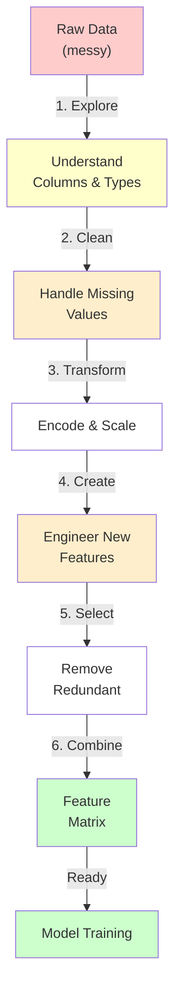

---
tags:
  - Beginner
  - Phase 3
---

# Module 2: Feature Engineering

You've built your first ML model. It worked, but it was on clean, prepped data. In the real world, you'll spend 80% of your time engineering features and cleaning data, and 20% building models.

Here's the truth: **A simple model with great features beats a complex model with bad features.** This module teaches you to build great features.

---

## 🎯 What You Will Learn

By the end of this module, you will:

- Understand what features are and why they matter more than models
- Identify and handle different feature types (numerical, categorical, text, datetime)
- Encode categorical variables correctly
- Scale and normalize numerical features
- Handle missing values strategically
- Create new features from existing ones
- Identify and remove redundant features
- Build feature pipelines with sklearn
- Work with messy real-world data

---

## 🧠 Concept Explained: Why Features Matter

### The Garbage In, Garbage Out Analogy

Imagine you're a chef:

**Bad ingredients (bad features):**

- Even the best cooking technique can't save rotten food
- Expert technique on trash inputs = trash output

**Good ingredients (good features):**

- Fresh, quality ingredients
- Even a simple cooking method produces excellent food

**In ML:**

- Model = cooking technique
- Features = ingredients
- A simple model with perfect features often beats a complex model with messy features

### Feature vs Model Complexity

```
Simple Model + Excellent Features   = Great Results (90% accuracy)
Complex Model + Messy Features      = Mediocre Results (75% accuracy)
```

Why? Because a complex model amplifies bad features. The model tries so hard to make sense of bad inputs that it overfits.

### What Is a Feature?

A feature is:

- A column in your data
- An input to your model
- Information about something you're trying to predict

**Example: Predicting house price**

- Features: [square footage, bedrooms, location, age, renovated?]
- Label: price

**Good features clearly relate to the label:**

- Square footage → strongly affects price
- Color of the front door → weakly affects price (ignore)

---

## 🔍 How It Works: Feature Engineering Pipeline



Each step improves feature quality.

---

## 🛠️ Step-by-Step Guide

### Step 1: Identify Feature Types

Every column in your data falls into one of these categories:

**Numerical (numbers):**

- Age: 25, 30, 45
- Salary: 50000, 75000, 120000
- How many things: 5, 10, 200
- Operations: addition, comparison, averages make sense

**Categorical (groups):**

- City: "New York", "Boston", "Denver"
- Gender: "Male", "Female"
- Status: "Active", "Inactive", "Pending"
- Operations: comparison ("equal", "not equal") make sense, but "average" doesn't

**Text (unstructured words):**

- Reviews: "This product is amazing!"
- Descriptions: "A blue cotton shirt with buttons"
- Comments: "Very disappointed with quality"
- Special handling needed (embeddings, TF-IDF, etc.)

**Datetime (dates and times):**

- Dates: 2024-01-15, 2024-12-31
- Can be decomposed: day-of-week, month, is-weekend?
- Can be converted to features: days-since-event, days-until-deadline

### Step 2: Handle Missing Values

**Identify missing values:**

```python
# Which columns have missing data?
print(df.isnull().sum())

# Output might be:
# age           5
# salary       10
# city          0
# reviews      50
# date          2
```

**Strategy 1: Drop (if very few missing)**

```python
# Remove rows where age is missing
df = df.dropna(subset=['age'])
```

**Strategy 2: Impute with statistics (numerical)**

```python
# Replace missing with mean, median, or mode
df['age'] = df['age'].fillna(df['age'].mean())

# Forward fill (for time series)
df['value'] = df['value'].fillna(method='ffill')
```

**Strategy 3: Impute with mode (categorical)**

```python
# Replace missing with most common value
df['city'] = df['city'].fillna(df['city'].mode()[0])
```

**Strategy 4: Create "missing" category**

```python
# Missing is information: "we don't know"
df['city'] = df['city'].fillna('Unknown')
```

### Step 3: Encode Categorical Variables

**The Problem:**
Most ML models need numbers. They can't understand text like "Male" and "Female".

**Solution 1: Label Encoding (for ordinal data)**

Used when categories have order: Low → Medium → High

```python
from sklearn.preprocessing import LabelEncoder

# Encode: Low=0, Medium=1, High=2
le = LabelEncoder()
df['size_encoded'] = le.fit_transform(df['size'])
```

**Problem:** Model might think Medium (1) is between Low (0) and High (2), which is true here. But if you use it for colors (Red, Blue, Green), the model thinks Blue (1) is between Red (0) and Green (2), which is false.

**Solution 2: One-Hot Encoding (for nominal data)**

Used when categories have NO order: Red, Blue, Green (none is "bigger")

```python
from sklearn.preprocessing import OneHotEncoder

# Result:
# color_red  color_blue  color_green
#    1          0           0
#    0          1           0
#    0          0           1

# Each category gets its own binary column
encoder = OneHotEncoder(sparse_output=False)
colors_encoded = encoder.fit_transform(df[['color']])
```

### Step 4: Scale Numerical Features

**Why scale?**

- Some features are 0-1, others are 1000-50000
- Models assume all features are equally important by default
- Scaling puts them on the same scale

**StandardScaler (most common):**

```python
from sklearn.preprocessing import StandardScaler

# Each value becomes: (value - mean) / std_dev
# Result: mean=0, std_dev=1
scaler = StandardScaler()
df['age_scaled'] = scaler.fit_transform(df[['age']])
```

**MinMaxScaler:**

```python
from sklearn.preprocessing import MinMaxScaler

# Each value becomes: (value - min) / (max - min)
# Result: all values between 0 and 1
scaler = MinMaxScaler()
df['age_scaled'] = scaler.fit_transform(df[['age']])
```

### Step 5: Create New Features

Extract information from existing columns.

**From datetime:**

```python
# Extract day of week from date
df['day_of_week'] = df['date'].dt.dayofweek

# Extract month
df['month'] = df['date'].dt.month

# Is it a weekend?
df['is_weekend'] = df['date'].dt.dayofweek >= 5
```

**From numerical:**

```python
# Create age groups
df['age_group'] = pd.cut(df['age'], bins=[0, 18, 30, 50, 100],
                         labels=['child', 'young', 'adult', 'senior'])

# BMI from height and weight
df['bmi'] = df['weight'] / (df['height'] ** 2)

# Log scale (for skewed data)
df['log_salary'] = np.log(df['salary'])
```

**From categorical:**

```python
# Count occurrences
city_counts = df['city'].value_counts()
df['city_population'] = df['city'].map(city_counts)
```

### Step 6: Remove Redundant Features

**Drop features that are highly correlated:**

```python
# Calculate correlation matrix
correlation = df[numerical_columns].corr()

# Find highly correlated pairs (corr > 0.9)
# Keep one, drop the other
```

**Drop features with no variance:**

```python
# If all values are the same, it's useless
# Example: column with "Active" repeated 1000 times
```

---

## 💻 Code Examples

### Example 1: Complete Feature Engineering with Titanic Dataset

```python
import pandas as pd
import numpy as np
from sklearn.preprocessing import OneHotEncoder, StandardScaler
from sklearn.impute import SimpleImputer
from sklearn.compose import ColumnTransformer
from sklearn.pipeline import Pipeline

# Load Titanic dataset
from seaborn import load_dataset
df = load_dataset('titanic')

print("=" * 60)
print("ORIGINAL DATASET")
print("=" * 60)
print(f"Shape: {df.shape}")
print(f"\nColumns: {df.columns.tolist()}")
print(f"\nData types:\n{df.dtypes}")
print(f"\nMissing values:\n{df.isnull().sum()}")
print(f"\nFirst 5 rows:")
print(df.head())

# === 1. EXPLORE ===
print("\n" + "=" * 60)
print("EXPLORATION")
print("=" * 60)

# Which columns should we use?
# survived - target (predict this)
# pclass, sex, age, sibsp, parch, fare - features (use these)
# name, ticket, cabin, embarked - drop (too sparse)

# === 2. HANDLE MISSING VALUES ===
print("\nHandling missing values...")

# For age: fill with median (numerical)
df['age'].fillna(df['age'].median(), inplace=True)

# For embarked: fill with mode (categorical)
df['embarked'].fillna(df['embarked'].mode()[0], inplace=True)

print("✓ Missing values handled")

# === 3. SELECT FEATURES ===
# Separate features and target
X = df[['pclass', 'sex', 'age', 'sibsp', 'parch', 'fare', 'embarked']]
y = df['survived']

print(f"\nFeatures shape: {X.shape}")
print(f"Target shape: {y.shape}")

# === 4. IDENTIFY FEATURE TYPES ===
numerical_features = ['pclass', 'age', 'sibsp', 'parch', 'fare']
categorical_features = ['sex', 'embarked']

print(f"\nNumerical features: {numerical_features}")
print(f"Categorical features: {categorical_features}")

# === 5. CREATE PREPROCESSING PIPELINE ===
# This chains transformations: missing → scaling for numbers,
#                             missing → encoding for categories

preprocessor = ColumnTransformer(
    transformers=[
        ('num', Pipeline(steps=[
            ('impute', SimpleImputer(strategy='median')),
            ('scale', StandardScaler())
        ]), numerical_features),

        ('cat', Pipeline(steps=[
            ('impute', SimpleImputer(strategy='constant', fill_value='unknown')),
            ('onehot', OneHotEncoder(drop='first', sparse_output=False))
        ]), categorical_features)
    ]
)

# === 6. FIT AND TRANSFORM ===
print("\n" + "=" * 60)
print("FEATURE ENGINEERING")
print("=" * 60)

X_processed = preprocessor.fit_transform(X)

print(f"Processed features shape: {X_processed.shape}")
print(f"Original: {X.shape[0]} rows × {X.shape[1]} features")
print(f"Processed: {X_processed.shape[0]} rows × {X_processed.shape[1]} features")
print("(More features due to one-hot encoding of categories)")

# === 7. CREATE FEATURE NAMES ===
# For interpretability
feature_names = (
    numerical_features +
    list(preprocessor.named_transformers_['cat']
         .named_steps['onehot']
         .get_feature_names_out(categorical_features))
)

print(f"\nFinal feature names:")
for i, name in enumerate(feature_names):
    print(f"  {i}: {name}")

# === 8. EXAMINE TRANSFORMED DATA ===
df_processed = pd.DataFrame(X_processed, columns=feature_names)

print(f"\nTransformed data preview:")
print(df_processed.head())

print("\n✓ Feature engineering complete!")
print(f"Ready for model training with {X_processed.shape[1]} features")
```

### Example 2: Feature Creation and Correlation Analysis

```python
import pandas as pd
import numpy as np
from sklearn.preprocessing import StandardScaler
import seaborn as sns
import matplotlib.pyplot as plt

# Create a sample dataset
np.random.seed(42)
df = pd.DataFrame({
    'age': np.random.randint(18, 80, 1000),
    'salary': np.random.randint(30000, 200000, 1000),
    'years_experience': np.random.randint(0, 50, 1000),
    'hire_date': pd.date_range('2010-01-01', periods=1000, freq='D'),
})

print("=" * 60)
print("ORIGINAL FEATURES")
print("=" * 60)
print(df.head())

# === CREATE NEW FEATURES ===
print("\n" + "=" * 60)
print("ENGINEERING NEW FEATURES")
print("=" * 60)

# From datetime
df['hire_year'] = df['hire_date'].dt.year
df['hire_month'] = df['hire_date'].dt.month
df['is_recent_hire'] = (df['hire_date'].dt.year >= 2023).astype(int)

# From numerical
df['salary_per_year_exp'] = df['salary'] / (df['years_experience'] + 1)
df['log_salary'] = np.log(df['salary'])
df['age_group'] = pd.cut(df['age'], bins=[0, 30, 50, 100],
                         labels=['young', 'mid', 'senior']).astype('category').cat.codes

# Ratio features
df['salary_to_age_ratio'] = df['salary'] / df['age']

print("New features created:")
print(df.head())

# === CORRELATION ANALYSIS ===
print("\n" + "=" * 60)
print("FEATURE CORRELATION")
print("=" * 60)

# Calculate correlations with salary
correlations = df[['years_experience', 'age', 'salary_per_year_exp',
                   'log_salary', 'age_group', 'salary_to_age_ratio']].corrwith(df['salary'])

print("\nCorrelation with salary (target):")
print(correlations.sort_values(ascending=False))

# Identify highly correlated pairs (would be redundant)
print("\nHighly correlated features (might be redundant):")
correlation_matrix = df[['age', 'years_experience', 'salary', 'salary_per_year_exp']].corr()

for i in range(len(correlation_matrix.columns)):
    for j in range(i+1, len(correlation_matrix.columns)):
        corr_value = abs(correlation_matrix.iloc[i, j])
        if corr_value > 0.8:
            col1 = correlation_matrix.columns[i]
            col2 = correlation_matrix.columns[j]
            print(f"  {col1} <-> {col2}: {corr_value:.3f} (redundant!)")

print("\n✓ Feature engineering insights complete")
```

### Example 3: Full Pipeline with sklearn

```python
import pandas as pd
import numpy as np
from sklearn.preprocessing import StandardScaler, OneHotEncoder
from sklearn.compose import ColumnTransformer
from sklearn.pipeline import Pipeline
from seaborn import load_dataset
from sklearn.model_selection import train_test_split
from sklearn.ensemble import RandomForestClassifier
from sklearn.metrics import accuracy_score

# Load data
df = load_dataset('titanic')

# Prepare
X = df[['pclass', 'sex', 'age', 'fare', 'embarked']]
y = df['survived']

# Handle missing
X['age'].fillna(X['age'].median(), inplace=True)
X['embarked'].fillna(X['embarked'].mode()[0], inplace=True)

# Define features
numerical = ['pclass', 'age', 'fare']
categorical = ['sex', 'embarked']

# === BUILD COMPLETE PIPELINE ===
# This combines feature preprocessing + model training

pipeline = Pipeline(steps=[
    # Step 1: Preprocess features
    ('preprocessor', ColumnTransformer(
        transformers=[
            ('num', StandardScaler(), numerical),
            ('cat', OneHotEncoder(drop='first'), categorical)
        ]
    )),

    # Step 2: Train model
    ('classifier', RandomForestClassifier(n_estimators=100, random_state=42))
])

# Split data
X_train, X_test, y_train, y_test = train_test_split(
    X, y, test_size=0.2, random_state=42
)

# Train (pipeline automatically handles everything)
print("Training pipeline...")
pipeline.fit(X_train, y_train)

# Predict (pipeline automatically preprocesses before predicting)
y_pred = pipeline.predict(X_test)

# Evaluate
accuracy = accuracy_score(y_test, y_pred)
print(f"✓ Pipeline accuracy: {accuracy:.2%}")
print("\nOne pipeline, all steps handled automatically!")
```

---

## ⚠️ Common Mistakes

### Mistake 1: Fitting Scaler on Test Data

**WRONG:**

```python
# Fit scaler on ALL data (including test!)
scaler = StandardScaler().fit(X)
X_scaled = scaler.transform(X)

# Now split
X_train, X_test, y_train, y_test = train_test_split(X_scaled, y, test_size=0.2)

# Test data influenced the scaling → data leakage
```

**RIGHT:**

```python
# Split FIRST
X_train, X_test, y_train, y_test = train_test_split(X, y, test_size=0.2)

# Fit scaler ONLY on training data
scaler = StandardScaler().fit(X_train)

# Scale both the same way
X_train_scaled = scaler.transform(X_train)
X_test_scaled = scaler.transform(X_test)

# Test data was never seen during scaling
```

### Mistake 2: Creating Features from Test Data

**WRONG:**

```python
# Create feature based on statistics from ALL data
mean_age = df['age'].mean()  # Includes test data!
df['age_group'] = df['age'] > mean_age

# Test data influenced feature creation
```

**RIGHT:**

```python
# Calculate statistics from training data ONLY
mean_age = X_train['age'].mean()

# Apply same feature to both train and test
X_train['age_group'] = X_train['age'] > mean_age
X_test['age_group'] = X_test['age'] > mean_age

# Consistent, no leakage
```

### Mistake 3: One-Hot Encoding High-Cardinality Features

**WRONG:**

```python
# City column has 10,000 unique values
# One-hot encoding creates 10,000 new columns!

df = pd.get_dummies(df, columns=['city'])
# Result: 10,000 new features (memory explosion, overfitting)
```

**RIGHT:**

```python
# For high-cardinality: use label encoding or grouping

# Option 1: Group rare categories
df['city_grouped'] = df['city'].apply(
    lambda x: x if df['city'].value_counts()[x] > 100 else 'other'
)

# Option 2: Use label encoder (OK for tree models)
from sklearn.preprocessing import LabelEncoder
le = LabelEncoder()
df['city_encoded'] = le.fit_transform(df['city'])
```

---

## ✅ Exercises

### Easy: Explore and Clean

1. Load Titanic dataset
2. Check for missing values
3. Fill missing age with median
4. Fill missing embarked with mode
5. Print summary (shape, missing count after cleaning)

### Medium: Full Feature Engineering

1. Load Titanic
2. Handle missing values
3. Create binary feature "is_female" from sex
4. Scale age and fare
5. One-hot encode embarked
6. Create combined feature matrix

### Hard: Automated Pipeline

1. Load Titanic
2. Create sklearn Pipeline with:
   - StandardScaler for numerical
   - OneHotEncoder for categorical
   - RandomForestClassifier for model
3. Train on 80% data
4. Evaluate on 20% test data
5. Print accuracy

---

## 🏗️ Mini Project: Titanic Feature Engineering

Build a complete feature engineering workflow for the Titanic dataset.

### Requirements

1. Load Titanic dataset
2. Identify feature types
3. Handle all missing values appropriately
4. Create at least 3 new features
5. Encode categorical variables
6. Scale numerical features
7. Remove redundant features
8. Output a clean feature matrix ready for modeling

### Implementation

```python
import pandas as pd
import numpy as np
from sklearn.preprocessing import OneHotEncoder, StandardScaler
from sklearn.compose import ColumnTransformer
from sklearn.pipeline import Pipeline
from sklearn.impute import SimpleImputer
from seaborn import load_dataset

print("=" * 70)
print("TITANIC FEATURE ENGINEERING PROJECT")
print("=" * 70)

# === LOAD ===
df = load_dataset('titanic')

print(f"\nDataset shape: {df.shape}")
print(f"Columns: {list(df.columns)}")

# === EXPLORE ===
print("\n" + "=" * 70)
print("DATA EXPLORATION")
print("=" * 70)

print("\nData types:")
print(df.dtypes)

print("\nMissing values:")
print(df.isnull().sum())

print("\nBasic statistics:")
print(df.describe())

# === SELECT FEATURES ===
# Drop name, ticket, cabin, deck (sparse/identifiers)
# Keep: pclass, sex, age, sibsp, parch, fare, embarked, survived (target)

X = df[['pclass', 'sex', 'age', 'sibsp', 'parch', 'fare', 'embarked']].copy()
y = df['survived'].copy()

print(f"\nSelected {X.shape[1]} features, target: survived")

# === CREATE NEW FEATURES ===
print("\n" + "=" * 70)
print("FEATURE ENGINEERING")
print("=" * 70)

# Feature 1: Family size
X['family_size'] = X['sibsp'] + X['parch']

# Feature 2: Is alone?
X['is_alone'] = (X['family_size'] == 0).astype(int)

# Feature 3: Fare per person
X['fare_per_person'] = X['fare'] / (X['family_size'] + 1)

print("✓ Created synthetic features:")
print(f"  - family_size: {X['family_size'].describe().to_dict()}")
print(f"  - is_alone: {X['is_alone'].value_counts().to_dict()}")
print(f"  - fare_per_person")

# === IDENTIFY FEATURE TYPES ===
numerical_features = ['pclass', 'age', 'sibsp', 'parch', 'fare',
                      'family_size', 'fare_per_person']
categorical_features = ['sex', 'embarked']

print(f"\nNumerical features ({len(numerical_features)}): {numerical_features}")
print(f"Categorical features ({len(categorical_features)}): {categorical_features}")

# === PREPROCESSING PIPELINE ===
preprocessor = ColumnTransformer(
    transformers=[
        ('num', Pipeline(steps=[
            ('impute', SimpleImputer(strategy='median')),
            ('scale', StandardScaler())
        ]), numerical_features),

        ('cat', Pipeline(steps=[
            ('impute', SimpleImputer(strategy='constant', fill_value='unknown')),
            ('onehot', OneHotEncoder(drop='first', sparse_output=False))
        ]), categorical_features)
    ]
)

# === FIT AND TRANSFORM ===
print("\n" + "=" * 70)
print("TRANSFORMING FEATURES")
print("=" * 70)

X_processed = preprocessor.fit_transform(X)

print(f"\nBefore processing:")
print(f"  Shape: {X.shape}")
print(f"  Features: {X.shape[1]}")

print(f"\nAfter processing:")
print(f"  Shape: {X_processed.shape}")
print(f"  Features: {X_processed.shape[1]} (increased due to one-hot encoding)")

# === CREATE FEATURE NAMES ===
feature_names = (
    numerical_features +
    list(preprocessor.named_transformers_['cat']
         .named_steps['onehot']
         .get_feature_names_out(categorical_features))
)

print(f"\nFinal feature names (total: {len(feature_names)}):")
for i, name in enumerate(feature_names[:10]):
    print(f"  {i}: {name}")
if len(feature_names) > 10:
    print(f"  ... and {len(feature_names) - 10} more")

# === CORRELATION ANALYSIS ===
print("\n" + "=" * 70)
print("CORRELATION ANALYSIS")
print("=" * 70)

# Numerical features correlation
numerical_data = df[numerical_features + ['survived']].copy()
numerical_data['fare_per_person'] = numerical_data['fare'] / (numerical_data['sibsp'] + numerical_data['parch'] + 1)

corr_with_target = numerical_data.corr()['survived'].sort_values(ascending=False)

print("\nCorrelation with survival (target):")
for feat, corr in corr_with_target.items():
    bar = "█" * int(abs(corr) * 40)
    print(f"  {feat:20s} {corr:+.3f} {bar}")

# === FINAL SUMMARY ===
print("\n" + "=" * 70)
print("SUMMARY")
print("=" * 70)

print(f"\n✓ Loaded {df.shape[0]} passenger records")
print(f"✓ Handled missing values (age, embarked)")
print(f"✓ Created 3 synthetic features")
print(f"✓ Encoded categorical variables (sex, embarked)")
print(f"✓ Scaled numerical features")
print(f"✓ Final feature matrix: {X_processed.shape}")
print(f"✓ Ready for model training!")

# === SAMPLE OUTPUT ===
df_final = pd.DataFrame(X_processed, columns=feature_names)
print(f"\nSample of processed features:")
print(df_final.head())

print("\n" + "=" * 70)
```

---

## 🔗 What's Next

You now understand:

- Feature types and how to handle them
- Preprocessing pipelines
- Feature creation and selection
- The impact on model performance

Next module:

- **Module 3-3:** Leverage pre-trained models through transfer learning and embeddings

---

## 📚 Summary

In this module, you learned:

1. ✅ **Features matter more than models** – Garbage in, garbage out
2. ✅ **Feature types** – Numerical, categorical, text, datetime
3. ✅ **Handle missing values** – Drop, impute, or create category
4. ✅ **Encode categories** – Label encoding vs one-hot encoding
5. ✅ **Scale numerical** – StandardScaler, MinMaxScaler
6. ✅ **Feature creation** – Extract from dates, create ratios
7. ✅ **Remove redundant** – Drop correlated/low-variance features
8. ✅ **Pipelines** – Chain all steps together
9. ✅ **Real data** – Titanic dataset walkthrough

---

**Congratulations! You're now a feature engineering expert. 🎉**

Top ML engineers spend 70% of time on features. You've just invested in that skill.
j) ## 🔗 What's Next (link to next module)

3. CODE QUALITY
   - Every code block must be complete and runnable as-is.
   - Every single line must have an inline comment.
   - Use Python unless the module is specifically about another tool.
   - Show expected output after each code block in a separate
     code block labeled `# Expected output`.

4. DIAGRAMS
   - Include at least one Mermaid diagram OR ASCII diagram.
   - Diagrams must show data flow, not just boxes with names.

5. ADMONITIONS — use MkDocs Material admonitions:
   - !!! tip for shortcuts and best practices
   - !!! warning for things that often break
   - !!! note for important context
   - !!! danger for things that can cause data loss or bugs

6. CROSS-LINKS
   - Reference earlier modules when building on prior concepts.
   - Example: "Remember virtual environments from Module 1?"

7. LENGTH
   - Do not summarise. Be thorough.
   - Each section should be detailed enough that a beginner
     can follow without searching anything else.
     ============================================================
     PROMPT END
     -->

!!! note "Module content coming soon"
Use the AI prompt in the comment above to generate the full
content for this module. Paste it into Claude, ChatGPT, or
any AI assistant.
