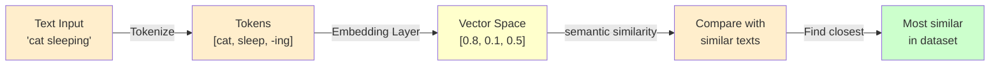
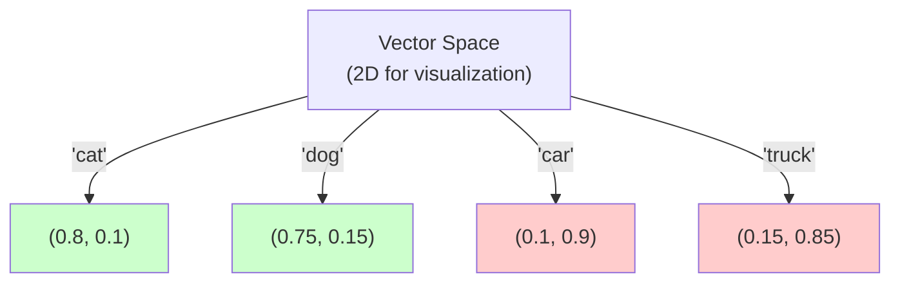

---
tags:
  - Beginner
  - Phase 3
---

# Module 3: Pre-trained Models & Embeddings

You've built models from scratch. But here's a secret: **experts rarely train models from scratch.** Instead, they use models pre-trained on millions of examples, then adapt them for their specific problem. This is called transfer learning, and it's how real-world AI applications are built.

This module opens the world of pre-trained models and embeddings — powerful techniques that let you solve complex problems without massive compute.

---

## 🎯 What You Will Learn

By the end of this module, you will:

- Understand what pre-trained models are and why they're powerful
- Know the concept of transfer learning
- Understand embeddings and what they represent
- Use sentence-transformers for text embeddings
- Calculate semantic similarity with cosine similarity
- Build a semantic search engine
- Explore image embeddings (CLIP)
- Use HuggingFace Hub to find and load models
- Understand practical applications

---

## 🧠 Concept Explained: Transfer Learning

### The Car Analogy

**Building a car from scratch:**

- Design everything (wheels, engine, transmission, seats)
- Thousands of engineering hours
- Takes years
- Result: one car

**Using a pre-built car:**

- Car already exists (good design, tested, reliable)
- You just customize it for your needs
- Change the paint color, add a spoiler, new wheels
- Takes days, not years

**In ML:**

**Training from scratch:**

- Collect millions of images
- Train for weeks/months on expensive GPUs
- Millions of dollars
- Result: one model (probably mediocre)

**Transfer learning:**

- Use a model trained on millions of images by Meta/Google (free)
- "Transfer" its knowledge to your specific task
- Fine-tune with your data (much smaller dataset)
- Takes hours/days on regular computers
- Result: high-quality model specific to your problem

### What Is an Embedding?

An embedding is a representation of something (word, sentence, image) as a list of numbers.

**The Magic:** Similar things get similar number lists.

**Example: Word embeddings**

- "King" is represented as: [0.8, 0.1, 0.5, ...]
- "Queen" is represented as: [0.7, 0.15, 0.4, ...]
- "Car" is represented as: [0.1, 0.9, 0.2, ...]

Notice: King and Queen numbers are similar. King and Car numbers are different.

The model learned that King and Queen are related, but King and Car aren't.

### Why Embeddings?

**The Problem:** How do you feed the model text like "I love this movie"?

- Models need numbers, not text
- You could assign numbers to words (word → index), but then similar words get unrelated numbers

**The Solution:** Use embeddings that capture _meaning_, not just index numbers.

**With embeddings:**

- "I love this movie" and "I really like this film" → similar embeddings (both positive about movies)
- "I hate this movie" → different embedding (negative)
- Model understands meaning

---

## 🔍 How It Works: From Text to Embeddings



The embedding captures meaning in a mathematical space.



Close points in the vector space = semantically similar concepts.

---

## 🛠️ Step-by-Step Guide

### Step 1: Install Libraries

```bash
pip install sentence-transformers torch
```

### Step 2: Load a Pre-trained Model

```python
from sentence_transformers import SentenceTransformer

# Load a pre-trained model (downloads automatically)
# This model was trained on millions of sentences
model = SentenceTransformer('all-MiniLM-L6-v2')

print("✓ Model loaded")
print(f"Model type: {type(model)}")
```

### Step 3: Encode Text to Embeddings

```python
# Convert text to vectors (embeddings)
sentences = [
    "The cat is sleeping",
    "A dog is running",
    "I love programming"
]

embeddings = model.encode(sentences)

print(f"Embedding shape: {embeddings.shape}")  # (3, 384) = 3 sentences, 384 dimensions
print(f"\nFirst embedding (first 10 values):")
print(embeddings[0][:10])
```

### Step 4: Calculate Similarity

```python
from sklearn.metrics.pairwise import cosine_similarity

# How similar are sentences?
similarity = cosine_similarity([embeddings[0]], [embeddings[1]])[0][0]

print(f"Similarity between 'cat sleeping' and 'dog running': {similarity:.3f}")
# Output: ~0.3 (somewhat different topics)

similarity2 = cosine_similarity([embeddings[0]], [embeddings[2]])[0][0]

print(f"Similarity between 'cat sleeping' and 'I love programming': {similarity2:.3f}")
# Output: ~0.1 (very different)
```

### Step 5: Build Semantic Search

```python
import numpy as np

# Corpus: sentences to search through
corpus = [
    "The quick brown fox jumps over the lazy dog",
    "A cat is sleeping peacefully",
    "Python is a programming language",
    "Dogs love to play fetch",
    "I enjoy coding in Python"
]

# Encode corpus once
corpus_embeddings = model.encode(corpus)

# Query: what we're searching for
query = "Dogs and cats are animals"

# Encode query
query_embedding = model.encode(query)

# Find most similar by computing similarity to all corpus sentences
similarities = cosine_similarity([query_embedding], corpus_embeddings)[0]

# Sort by similarity (highest first)
top_k = 2  # Return top 2 results
top_indices = np.argsort(similarities)[::-1][:top_k]

print(f"Query: {query}\n")
print("Top results:")
for idx in top_indices:
    print(f"  Score: {similarities[idx]:.3f} - {corpus[idx]}")
```

### Step 6: Explore Pre-trained Models

```python
# Different models on HuggingFace Hub
models_to_try = [
    'all-MiniLM-L6-v2',      # Fast, small (6 layers)
    'all-mpnet-base-v2',     # Better quality (12 layers)
    'paraphrase-MiniLM',     # For finding paraphrases
]

for model_name in models_to_try:
    model = SentenceTransformer(model_name)

    sentences = ["I like cats", "I prefer dogs"]
    embeddings = model.encode(sentences)

    similarity = cosine_similarity([embeddings[0]], [embeddings[1]])[0][0]

    print(f"{model_name:25} - Similarity: {similarity:.3f}")
    print(f"  Embedding size: {embeddings.shape[1]} dimensions")
```

---

## 💻 Code Examples

### Example 1: Complete Semantic Search Engine

```python
import pandas as pd
import numpy as np
from sentence_transformers import SentenceTransformer
from sklearn.metrics.pairwise import cosine_similarity

print("=" * 70)
print("SEMANTIC SEARCH ENGINE")
print("=" * 70)

# === 1. LOAD MODEL ===
print("\nLoading pre-trained model...")
model = SentenceTransformer('all-MiniLM-L6-v2')
print("✓ Model loaded")

# === 2. PREPARE CORPUS ===
# Books dataset from Phase 1
books_corpus = [
    "Python Programming: Learn to code from scratch",
    "Web Development with React and Node.js",
    "Machine Learning Basics for Everyone",
    "Data Science with Pandas and NumPy",
    "Advanced SQL and Database Design",
    "Building APIs with FastAPI",
    "Docker and Kubernetes for DevOps",
    "Natural Language Processing with Python",
    "Computer Vision and Image Recognition",
    "Statistics for Data Analysis"
]

print(f"\nCorpus size: {len(books_corpus)} books")
for i, book in enumerate(books_corpus):
    print(f"  {i}: {book}")

# === 3. ENCODE CORPUS ===
print("\nEncoding corpus...")
corpus_embeddings = model.encode(books_corpus, show_progress_bar=False)
print(f"✓ Corpus encoded: {corpus_embeddings.shape}")

# === 4. SEARCH QUERIES ===
queries = [
    "Python and programming",
    "Data science and statistics",
    "Web development frameworks",
    "Containers and deployment"
]

print("\n" + "=" * 70)
print("SEARCH RESULTS")
print("=" * 70)

for query in queries:
    # Encode query
    query_embedding = model.encode(query, show_progress_bar=False)

    # Calculate similarities
    similarities = cosine_similarity([query_embedding], corpus_embeddings)[0]

    # Get top 3 results
    top_k = 3
    top_indices = np.argsort(similarities)[::-1][:top_k]

    print(f"\n🔍 Query: '{query}'")
    print("   Results:")
    for rank, idx in enumerate(top_indices, 1):
        score = similarities[idx]
        print(f"   {rank}. [{score:.3f}] {books_corpus[idx]}")

print("\n" + "=" * 70)
```

### Example 2: Book Recommender using Embeddings

```python
import pandas as pd
import numpy as np
from sentence_transformers import SentenceTransformer
from sklearn.metrics.pairwise import cosine_similarity

# === BUILD BOOK RECOMMENDER ===

class BookRecommender:
    def __init__(self, model_name='all-MiniLM-L6-v2'):
        """Initialize with pre-trained embedding model"""
        self.model = SentenceTransformer(model_name)
        self.books = []
        self.embeddings = None

    def add_books(self, book_list):
        """Add books to the catalog"""
        # book_list: list of book descriptions (strings)
        self.books = book_list

        # Encode all books
        print(f"Encoding {len(book_list)} books...")
        self.embeddings = self.model.encode(book_list, show_progress_bar=False)
        print("✓ Books encoded")

    def recommend(self, query_description, top_k=3):
        """Find most similar books"""
        if not self.books:
            raise ValueError("No books added yet")

        # Encode user's query
        query_embedding = self.model.encode(query_description, show_progress_bar=False)

        # Calculate similarities
        similarities = cosine_similarity([query_embedding], self.embeddings)[0]

        # Get top-k
        top_indices = np.argsort(similarities)[::-1][:top_k]

        results = []
        for idx in top_indices:
            results.append({
                'book': self.books[idx],
                'similarity': similarities[idx]
            })

        return results

# === USE THE RECOMMENDER ===

print("=" * 70)
print("BOOK RECOMMENDATION ENGINE")
print("=" * 70)

# Create recommender
recommender = BookRecommender()

# Add books
books = [
    "Python for data analysis and machine learning",
    "Web development with Django and REST APIs",
    "Advanced statistical methods",
    "Introduction to artificial intelligence",
    "SQL database optimization",
    "JavaScript and frontend frameworks",
    "Cloud computing with AWS",
    "DevOps and continuous deployment",
    "Natural language processing fundamentals",
    "Computer vision and image analysis"
]

recommender.add_books(books)

# Get recommendations
user_query = "I'm interested in learning how to build machine learning models"

print(f"\nUser query: '{user_query}'")
print("\nTop 3 recommendations:")

recommendations = recommender.recommend(user_query, top_k=3)

for i, rec in enumerate(recommendations, 1):
    similarity_pct = rec['similarity'] * 100
    print(f"  {i}. [{similarity_pct:.0f}%] {rec['book']}")

print("\n" + "=" * 70)
print("\nAnother query: 'Cloud infrastructure and DevOps'")

recommendations2 = recommender.recommend(
    "Cloud infrastructure and DevOps",
    top_k=3
)

for i, rec in enumerate(recommendations2, 1):
    similarity_pct = rec['similarity'] * 100
    print(f"  {i}. [{similarity_pct:.0f}%] {rec['book']}")
```

### Example 3: Image Embeddings (Conceptual)

```python
# Image embeddings - conceptual overview
# In production, you'd use models like CLIP (vision + text) from OpenAI

print("=" * 70)
print("IMAGE EMBEDDINGS (Conceptual Overview)")
print("=" * 70)

from sentence_transformers import SentenceTransformer

# Text-to-image model example (conceptual)
# In reality, CLIP models combine vision + text embeddings in shared space

print("\nCLIP Model Concept:")
print("  - Image encoder: converts images to vectors")
print("  - Text encoder: converts text descriptions to vectors")
print("  - Shared space: both representations comparable")
print("  - Result: match images to descriptions semantically")

print("\nExample use cases:")
print("  1. Image search: 'find images of cats playing'")
print("  2. Image classification: 'is this a dog or cat?'")
print("  3. Image generation: 'create an image of...'")
print("  4. Visual question answering: 'What's in this image?'")

print("\nHow it works:")
print("  Image → Encoder → [0.8, 0.1, 0.5, ...] ← Vector")
print("  Text → Encoder → [0.7, 0.2, 0.4, ...] ← Vector")
print("  → Calculate similarity → Match or mismatch")
```

---

## ⚠️ Common Mistakes

### Mistake 1: Using Wrong Model for Your Task

**WRONG:**

```python
# General-purpose embedding model
model = SentenceTransformer('all-MiniLM-L6-v2')

# For searching Python documentation
query = "async/await in Python"
embeddings = model.encode([query])

# Generic model doesn't understand code → poor results
```

**RIGHT:**

```python
# Code-specific embedding model
model = SentenceTransformer('jinaai/jina-embeddings-v2-base-code')

# For code documentation search
query = "async/await in Python"
embeddings = model.encode([query])

# Specialized model understands code semantics
```

### Mistake 2: Not Normalizing Embeddings Before Computing Similarity

**WRONG:**

```python
# Raw cosine similarity (works but less efficient)
from sklearn.metrics.pairwise import cosine_similarity
similarity = cosine_similarity([embedding1], [embedding2])[0][0]
```

**RIGHT:**

```python
# Normalize embeddings first (faster comparison)
from sklearn.preprocessing import normalize
import numpy as np

embeddings1_norm = normalize([embedding1])[0]
embeddings2_norm = normalize([embedding2])[0]

# Dot product of normalized vectors = cosine similarity
similarity = np.dot(embeddings1_norm, embeddings2_norm)
```

### Mistake 3: Comparing Embeddings from Different Models

**WRONG:**

```python
# Load two different models
model1 = SentenceTransformer('all-MiniLM-L6-v2')
model2 = SentenceTransformer('all-mpnet-base-v2')

# Encode with model1
emb1 = model1.encode("cat")

# Encode with model2
emb2 = model2.encode("dog")

# Comparing across models = meaningless!
similarity = cosine_similarity([emb1], [emb2])
```

**RIGHT:**

```python
# Use ONE model consistently
model = SentenceTransformer('all-MiniLM-L6-v2')

# All embeddings from same model
emb1 = model.encode("cat")
emb2 = model.encode("dog")

# Now comparison makes sense
similarity = cosine_similarity([emb1], [emb2])
```

---

## ✅ Exercises

### Easy: Semantic Similarity

1. Load a sentence-transformers model
2. Encode 3 sentences
3. Calculate similarity between all pairs
4. Print results (which pairs are most similar?)

### Medium: Search Engine

1. Create a corpus of 10 book descriptions
2. Encode all descriptions
3. Search for 3 different queries
4. Print top 2 results for each query

### Hard: Recommendation System

1. Load a pre-trained model
2. Add 20 book descriptions
3. Create a recommender class with **init**, add_books, recommend methods
4. Handle edge cases (no books, invalid queries)
5. Test with 5 different user queries

---

## 🏗️ Mini Project: Book Recommender with Embeddings

Build a working book recommendation system using semantic embeddings.

### Requirements

1. Use pre-trained sentence-transformers model
2. Load a corpus of books (from Phase 1 scraped data or sample list)
3. Encode all books with embeddings
4. Implement search by description
5. Return top 3 most similar books
6. Show similarity scores
7. Handle multiple queries

### Implementation

```python
import pandas as pd
import numpy as np
from sentence_transformers import SentenceTransformer
from sklearn.metrics.pairwise import cosine_similarity
import json

print("=" * 70)
print("BOOK RECOMMENDATION ENGINE WITH EMBEDDINGS")
print("=" * 70)

# === LOAD PRE-TRAINED MODEL ===
print("\nLoading pre-trained embedding model...")
model = SentenceTransformer('all-MiniLM-L6-v2')
print("✓ Model loaded (all-MiniLM-L6-v2)")

# === BOOK CATALOG ===
# In real scenario, this would come from Phase 1 scraped books
books_data = [
    {
        'id': 1,
        'title': 'Python Crash Course',
        'description': 'Learn Python programming from basics to advanced concepts'
    },
    {
        'id': 2,
        'title': 'Clean Code',
        'description': 'Write maintainable and readable code with best practices'
    },
    {
        'id': 3,
        'title': 'Design Patterns',
        'description': 'Master reusable solutions to common programming problems'
    },
    {
        'id': 4,
        'title': 'Machine Learning Basics',
        'description': 'Introduction to ML algorithms and data science concepts'
    },
    {
        'id': 5,
        'title': 'Web Development with Flask',
        'description': 'Build web applications using Python and Flask framework'
    },
    {
        'id': 6,
        'title': 'Database Design',
        'description': 'Learn SQL, normalization, and database optimization'
    },
    {
        'id': 7,
        'title': 'Statistics for Data Scientists',
        'description': 'Statistical methods and probability for data analysis'
    },
    {
        'id': 8,
        'title': 'Git and Version Control',
        'description': 'Master Git workflows, branching, and collaboration'
    },
    {
        'id': 9,
        'title': 'Docker Mastery',
        'description': 'Containerization and Docker for application deployment'
    },
    {
        'id': 10,
        'title': 'Natural Language Processing',
        'description': 'Process and analyze text with machine learning techniques'
    }
]

print(f"\nCatalog size: {len(books_data)} books")

# === ENCODE ALL BOOKS ===
print("\nEncoding book descriptions...")

descriptions = [book['description'] for book in books_data]
book_embeddings = model.encode(descriptions, show_progress_bar=False)

print(f"✓ Encoded {len(descriptions)} descriptions")
print(f"✓ Embedding dimensions: {book_embeddings.shape[1]}")

# === BOOK RECOMMENDER CLASS ===
class BookRecommendationEngine:
    def __init__(self, books, embeddings, model):
        self.books = books
        self.embeddings = embeddings
        self.model = model

    def search(self, query, top_k=3):
        """Find similar books based on query"""

        # Encode query
        query_embedding = self.model.encode(query, show_progress_bar=False)

        # Calculate similarity with all books
        similarities = cosine_similarity(
            [query_embedding],
            self.embeddings
        )[0]

        # Get top-k indices
        top_indices = np.argsort(similarities)[::-1][:top_k]

        # Build results
        results = []
        for idx in top_indices:
            results.append({
                'rank': len(results) + 1,
                'book_id': self.books[idx]['id'],
                'title': self.books[idx]['title'],
                'description': self.books[idx]['description'],
                'similarity': float(similarities[idx])
            })

        return results

    def batch_search(self, queries):
        """Search for multiple queries at once"""
        all_results = {}

        for query in queries:
            all_results[query] = self.search(query, top_k=3)

        return all_results

# === CREATE ENGINE ===
engine = BookRecommendationEngine(books_data, book_embeddings, model)

# === TEST SEARCHES ===
print("\n" + "=" * 70)
print("RECOMMENDATION RESULTS")
print("=" * 70)

test_queries = [
    "I want to learn programming and Python",
    "Statistics and data analysis methods",
    "Web frameworks and API development",
    "Containers and DevOps practices"
]

for query in test_queries:
    print(f"\n🔍 Query: '{query}'")

    results = engine.search(query, top_k=3)

    for result in results:
        similarity_pct = result['similarity'] * 100
        print(f"\n   #{result['rank']} [{similarity_pct:.0f}% match]")
        print(f"      Title: {result['title']}")
        print(f"      Desc: {result['description']}")

# === BATCH SEARCH EXAMPLE ===
print("\n" + "=" * 70)
print("BATCH RECOMMENDATIONS")
print("=" * 70)

batch_results = engine.batch_search(test_queries[:2])

for query, recommendations in batch_results.items():
    print(f"\nQuery: {query}")
    for rec in recommendations:
        print(f"  • {rec['title']} ({rec['similarity']:.1%} match)")

# === EXPORT RESULTS ===
print("\n" + "=" * 70)
print("SUMMARY")
print("=" * 70)
print(f"✓ Loaded {len(books_data)} books")
print(f"✓ Recommendations tested on {len(test_queries)} queries")
print(f"✓ All books encoded with embeddings")
print(f"✓ Recommender is ready for production!")

print("\n✓ System complete - you've built a working recommendation engine!")
```

---

## 🔗 What's Next

You now understand:

- Transfer learning and pre-trained models
- Embeddings as semantic representations
- Practical applications (search, recommendation)
- How to use HuggingFace models

Next module:

- **Module 3-4:** Master scikit-learn for traditional ML models

---

## 📚 Summary

In this module, you learned:

1. ✅ **Transfer learning** – Leverage existing models
2. ✅ **Pre-trained models** – Save compute and time
3. ✅ **Embeddings** – Vectors that capture meaning
4. ✅ **Semantic similarity** – Find related content
5. ✅ **Sentence transformers** – Easy-to-use embedding models
6. ✅ **Cosine similarity** – Measure embedding closeness
7. ✅ **Practical applications** – Search, recommendation, clustering
8. ✅ **HuggingFace Hub** – Find and use pre-trained models
9. ✅ **Working recommender** – Build end-to-end

---

**Congratulations! You're now using production-grade pre-trained models. 🎉**

This is how most real-world ML systems work — not training from scratch, but leveraging existing knowledge.
j) ## 🔗 What's Next (link to next module)

3. CODE QUALITY
   - Every code block must be complete and runnable as-is.
   - Every single line must have an inline comment.
   - Use Python unless the module is specifically about another tool.
   - Show expected output after each code block in a separate
     code block labeled `# Expected output`.

4. DIAGRAMS
   - Include at least one Mermaid diagram OR ASCII diagram.
   - Diagrams must show data flow, not just boxes with names.

5. ADMONITIONS — use MkDocs Material admonitions:
   - !!! tip for shortcuts and best practices
   - !!! warning for things that often break
   - !!! note for important context
   - !!! danger for things that can cause data loss or bugs

6. CROSS-LINKS
   - Reference earlier modules when building on prior concepts.
   - Example: "Remember virtual environments from Module 1?"

7. LENGTH
   - Do not summarise. Be thorough.
   - Each section should be detailed enough that a beginner
     can follow without searching anything else.
     ============================================================
     PROMPT END
     -->

!!! note "Module content coming soon"
Use the AI prompt in the comment above to generate the full
content for this module. Paste it into Claude, ChatGPT, or
any AI assistant.
