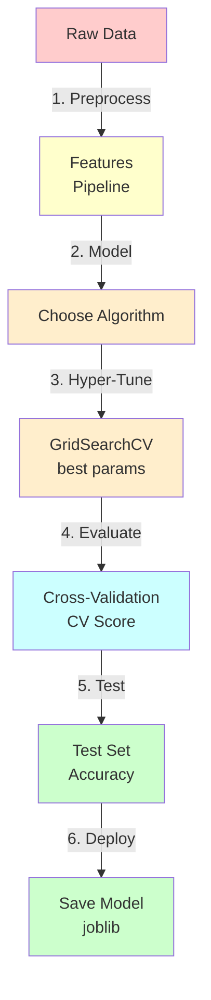

---
tags:
  - Beginner
  - Phase 3
---

# Module 4: Scikit-learn — The ML Swiss Army Knife

Scikit-learn is the most popular ML library in Python. Once you master its API, you can build 50+ different models using almost identical code. This module teaches you the pattern that powers scikit-learn, then you'll apply it to classification, regression, and real data.

---

## 🎯 What You Will Learn

By the end of this module, you will:

- Understand the fit/predict/transform pattern
- Build classification models (Logistic Regression, Random Forest, Gradient Boosting)
- Build regression models (Linear, Ridge, Random Forest)
- Use cross-validation for robust evaluation
- Perform hyperparameter tuning with GridSearchCV
- Save and load models with joblib
- Evaluate with confusion matrices and classification reports
- Build complete ML pipelines
- Work with real data (Titanic classification)

---

## 🧠 Concept Explained: The Scikit-learn API

### One Pattern, Infinite Models

**The Genius of scikit-learn:** Every model follows the same three-step pattern:

```python
# 1. Create model
model = SomeModel(param1=value1, param2=value2)

# 2. Train on data
model.fit(X_train, y_train)

# 3. Make predictions
predictions = model.predict(X_test)
```

Whether it's decision trees, neural networks, or SVMs — always fit → predict.

This means **once you learn the pattern, you can use any model.**

### Model Types

**Classification (predict categories):**

- Logistic Regression: fast, interpretable, good baseline
- Random Forest: powerful, handles non-linearity, prevents overfitting
- Gradient Boosting: usually highest accuracy, but slow and complex

**Regression (predict numbers):**

- Linear Regression: simple, interpretable, good baseline
- Ridge Regression: Linear with regularization (prevents overfitting)
- Random Forest Regressor: non-linear, powerful

---

## 🔍 How It Works: Scikit-learn Workflow



---

## 🛠️ Step-by-Step Guide

### Step 1: Understanding Model Hyperparameters

Models have **hyperparameters** — settings you choose before training:

```python
from sklearn.ensemble import RandomForestClassifier

# Hyperparameters (you choose these)
model = RandomForestClassifier(
    n_estimators=100,      # How many trees?
    max_depth=10,          # How deep can trees grow?
    min_samples_split=5,   # Minimum samples to split a node
    random_state=42        # For reproducibility
)

# After training, it learns model parameters (you don't set these)
model.fit(X_train, y_train)

# Access learned parameters
print(model.feature_importances_)  # Which features matter most?
```

### Step 2: Training and Evaluation

```python
from sklearn.model_selection import train_test_split
from sklearn.metrics import accuracy_score, precision_score, recall_score

# Split data
X_train, X_test, y_train, y_test = train_test_split(
    X, y, test_size=0.2, random_state=42
)

# Train
model.fit(X_train, y_train)

# Predict
y_pred = model.predict(X_test)

# Evaluate
accuracy = accuracy_score(y_test, y_pred)
precision = precision_score(y_test, y_pred, average='weighted')
recall = recall_score(y_test, y_pred, average='weighted')

print(f"Accuracy: {accuracy:.2%}")
print(f"Precision: {precision:.2%}")
print(f"Recall: {recall:.2%}")
```

### Step 3: Cross-Validation (Better than one split)

```python
from sklearn.model_selection import cross_val_score

# Instead of one train/test split, split 5 times and average
scores = cross_val_score(
    model,           # model to test
    X, y,            # data
    cv=5,            # 5-fold cross-validation
    scoring='accuracy'
)

print(f"CV scores: {scores}")               # [0.95, 0.97, 0.94, 0.96, 0.95]
print(f"Mean CV score: {scores.mean():.2%}")  # 95.4%
print(f"Std: {scores.std():.2%}")           # 0.01 (low = stable)
```

### Step 4: Hyperparameter Tuning with GridSearchCV

```python
from sklearn.model_selection import GridSearchCV

# Define parameter grid to search
param_grid = {
    'n_estimators': [50, 100, 200],        # Try these values
    'max_depth': [5, 10, 20],
    'min_samples_split': [2, 5, 10]
}

# GridSearchCV tries all combinations
grid_search = GridSearchCV(
    RandomForestClassifier(random_state=42),
    param_grid,
    cv=5,              # 5-fold CV
    scoring='accuracy',
    n_jobs=-1          # Use all CPU cores
)

# Fit (tries all combinations)
grid_search.fit(X_train, y_train)

# Get best model
best_model = grid_search.best_estimator_
print(f"Best params: {grid_search.best_params_}")
print(f"Best CV score: {grid_search.best_score_:.2%}")

# Test on test set
y_pred = best_model.predict(X_test)
print(f"Test accuracy: {accuracy_score(y_test, y_pred):.2%}")
```

### Step 5: Save and Load Models

```python
import joblib

# Save model
joblib.dump(model, 'my_model.pkl')

# Load model
loaded_model = joblib.load('my_model.pkl')

# Use loaded model
predictions = loaded_model.predict(X_new)
```

### Step 6: Classification Report

```python
from sklearn.metrics import classification_report, confusion_matrix

# Confusion matrix (only for classification)
cm = confusion_matrix(y_test, y_pred)
print("Confusion Matrix:")
print(cm)
# [[TN  FP]
#  [FN  TP]]

# Detailed report (per class)
print(classification_report(
    y_test, y_pred,
    target_names=['died', 'survived']
))
```

---

## 💻 Code Examples

### Example 1: Complete Titanic Classification

```python
import pandas as pd
import numpy as np
from seaborn import load_dataset
from sklearn.model_selection import train_test_split, GridSearchCV, cross_val_score
from sklearn.preprocessing import StandardScaler
from sklearn.ensemble import RandomForestClassifier, GradientBoostingClassifier
from sklearn.metrics import accuracy_score, confusion_matrix, classification_report

# === LOAD AND PREPARE ===
df = load_dataset('titanic')

# Prepare features
X = df[['pclass', 'sex', 'age', 'fare', 'embarked']].copy()
y = df['survived'].copy()

# Handle missing
X['age'].fillna(X['age'].median(), inplace=True)
X['embarked'].fillna(X['embarked'].mode()[0], inplace=True)

# Encode categorical
X['sex'] = (X['sex'] == 'male').astype(int)
X['embarked'] = pd.factorize(X['embarked'])[0]

# Split
X_train, X_test, y_train, y_test = train_test_split(
    X, y, test_size=0.2, random_state=42
)

# Scale
scaler = StandardScaler()
X_train_scaled = scaler.fit_transform(X_train)
X_test_scaled = scaler.transform(X_test)

print("=" * 70)
print("TITANIC SURVIVAL PREDICTION")
print("=" * 70)

# === MODEL 1: RANDOM FOREST ===
print("\n1. Random Forest Classifier")
rf_model = RandomForestClassifier(n_estimators=100, random_state=42)
rf_model.fit(X_train_scaled, y_train)
rf_pred = rf_model.predict(X_test_scaled)
rf_acc = accuracy_score(y_test, rf_pred)
print(f"   Accuracy: {rf_acc:.2%}")

# === MODEL 2: GRADIENT BOOSTING ===
print("\n2. Gradient Boosting Classifier")
gb_model = GradientBoostingClassifier(n_estimators=100, random_state=42)
gb_model.fit(X_train_scaled, y_train)
gb_pred = gb_model.predict(X_test_scaled)
gb_acc = accuracy_score(y_test, gb_pred)
print(f"   Accuracy: {gb_acc:.2%}")

# === HYPERPARAMETER TUNING ===
print("\n3. Hyperparameter Tuning (GridSearchCV)")
param_grid = {
    'n_estimators': [50, 100, 200],
    'max_depth': [5, 10, 15],
    'learning_rate': [0.01, 0.1]
}

grid = GridSearchCV(
    GradientBoostingClassifier(random_state=42),
    param_grid, cv=5, n_jobs=-1
)
grid.fit(X_train_scaled, y_train)

print(f"   Best params: {grid.best_params_}")
print(f"   Best CV score: {grid.best_score_:.2%}")

best_model = grid.best_estimator_
best_pred = best_model.predict(X_test_scaled)
best_acc = accuracy_score(y_test, best_pred)
print(f"   Test accuracy: {best_acc:.2%}")

# === EVALUATION ===
print("\n" + "=" * 70)
print("DETAILED EVALUATION (Best Model)")
print("=" * 70)

cm = confusion_matrix(y_test, best_pred)
print(f"\nConfusion Matrix:")
print(f"[[{cm[0,0]:3d}  {cm[0,1]:3d}]  <- Predicted No")
print(f" [{cm[1,0]:3d}  {cm[1,1]:3d}]]  <- Predicted Yes")

print(f"\nClassification Report:")
print(classification_report(y_test, best_pred, target_names=['died', 'survived']))

# === FEATURE IMPORTANCE ===
print("Feature Importance:")
feature_names = ['pclass', 'sex', 'age', 'fare', 'embarked']
importances = best_model.feature_importances_
for name, imp in zip(feature_names, importances):
    bar = "█" * int(imp * 100)
    print(f"  {name:10s} {bar} {imp:.3f}")

print("\n" + "=" * 70)
print(f"✓ Best model achieves {best_acc:.1%} accuracy")
```

### Example 2: Regression with Multiple Models

```python
from sklearn.linear_model import LinearRegression, Ridge
from sklearn.ensemble import RandomForestRegressor
from sklearn.metrics import mean_squared_error, mean_absolute_error
import numpy as np

# Create sample data
np.random.seed(42)
X = np.random.randn(100, 5)
y = 3 * X[:, 0] + 2 * X[:, 1] - X[:, 2] + np.random.randn(100) * 0.5

X_train, X_test, y_train, y_test = train_test_split(X, y, test_size=0.2)

print("=" * 70)
print("REGRESSION MODEL COMPARISON")
print("=" * 70)

models = {
    'Linear': LinearRegression(),
    'Ridge': Ridge(alpha=1.0),
    'Random Forest': RandomForestRegressor(n_estimators=100)
}

for name, model in models.items():
    model.fit(X_train, y_train)
    y_pred = model.predict(X_test)

    mse = mean_squared_error(y_test, y_pred)
    rmse = np.sqrt(mse)
    mae = mean_absolute_error(y_test, y_pred)

    print(f"\n{name}:")
    print(f"  RMSE: {rmse:.3f}")
    print(f"  MAE:  {mae:.3f}")
```

### Example 3: Full Pipeline

```python
from sklearn.pipeline import Pipeline
from sklearn.preprocessing import StandardScaler
from sklearn.compose import ColumnTransformer
from sklearn.ensemble import RandomForestClassifier

# Build complete pipeline
pipeline = Pipeline([
    ('scaler', StandardScaler()),
    ('model', RandomForestClassifier(n_estimators=100))
])

# One-line fit and predict
pipeline.fit(X_train, y_train)
score = pipeline.score(X_test, y_test)
print(f"Pipeline accuracy: {score:.2%}")
```

---

## ⚠️ Common Mistakes

### Mistake 1: Overfitting to Test Set

**WRONG:**

```python
# Check test accuracy, then adjust hyperparameters
print(f"Test accuracy: {accuracy}")

if accuracy < 0.9:
    # Tune hyperparameters to improve test set
    model = BetterModel()
    model.fit(X_train, y_train)
    # Now test set influenced your decisions!
```

**RIGHT:**

```python
# 3-way split: train / validation / test
from sklearn.model_selection import train_test_split

X_temp, X_test, y_temp, y_test = train_test_split(X, y, test_size=0.2)
X_train, X_val, y_train, y_val = train_test_split(X_temp, y_temp, test_size=0.25)

# Tune on validation set
# Evaluate on test set ONCE, at the end
```

### Mistake 2: Scaling Before Splitting

**WRONG:**

```python
# Scale ALL data, then split
scaler = StandardScaler()
X_scaled = scaler.fit_transform(X)  # Fit on all data!

X_train, X_test, y_train, y_test = train_test_split(X_scaled, y, test_size=0.2)
```

**RIGHT:**

```python
# Split first, scale separately
X_train, X_test, y_train, y_test = train_test_split(X, y, test_size=0.2)

scaler = StandardScaler()
X_train_scaled = scaler.fit_transform(X_train)  # Fit on training!
X_test_scaled = scaler.transform(X_test)  # Apply same scaling
```

### Mistake 3: Grid Search on Test Set

**WRONG:**

```python
# Try hyperparameters on test set
best_params = None
best_score = 0

for params in param_combinations:
    model = Model(**params)
    model.fit(X_test, y_test)  # Testing on test set!
    if score > best_score:
        best_score = score
        best_params = params
```

**RIGHT:**

```python
# Use cross-validation or validation set for tuning
grid = GridSearchCV(Model(), param_grid, cv=5)
grid.fit(X_train, y_train)  # Tune on training

# Test ONCE on never-seen test set
final_score = grid.score(X_test, y_test)
```

---

## ✅ Exercises

### Easy: Compare 3 Models

1. Load Titanic dataset
2. Train LogisticRegression, RandomForest, GradientBoosting
3. Print accuracy for each
4. Which is best?

### Medium: Hyperparameter Tuning

1. Use GridSearchCV to tune RandomForest
2. Try n_estimators=[50, 100, 200], max_depth=[5, 10, 15]
3. Print best params and best CV score
4. Evaluate on test set

### Hard: Complete Pipeline with Cross-Validation

1. Build end-to-end pipeline
2. Use cross_val_score with 5 folds
3. Perform GridSearchCV
4. Save best model to file
5. Load and test

---

## 🏗️ Mini Project: Book Price Prediction

Build a regression model to predict book prices from Phase 1 scraped data.

### Requirements

1. Load books dataset (scraped from Phase 1)
2. Extract features (page count, author popularity, rating)
3. Train multiple regression models
4. Perform hyperparameter tuning
5. Evaluate on test set
6. Save model
7. Predict price for new book

### Implementation

```python
import pandas as pd
import numpy as np
from sklearn.model_selection import train_test_split, GridSearchCV, cross_val_score
from sklearn.preprocessing import StandardScaler
from sklearn.linear_model import Ridge
from sklearn.ensemble import RandomForestRegressor
from sklearn.metrics import mean_absolute_error, mean_squared_error, r2_score
import joblib

print("=" * 70)
print("BOOK PRICE PREDICTION MODEL")
print("=" * 70)

# === CREATE SAMPLE DATA ===
# In production: load from Phase 1 books dataset
np.random.seed(42)
n_books = 200

df = pd.DataFrame({
    'title': [f'Book {i}' for i in range(n_books)],
    'pages': np.random.randint(100, 800, n_books),
    'rating': np.random.uniform(2, 5, n_books),
    'author_books': np.random.randint(1, 50, n_books),
    'price': np.random.uniform(5, 50, n_books)
})

# Make features somewhat predictive
df['price'] = 5 + df['pages'] * 0.05 + df['rating'] * 5 + df['author_books'] * 0.1 + np.random.randn(n_books) * 2

print(f"Dataset: {len(df)} books")
print(df.head())

# === PREPARE ===
X = df[['pages', 'rating', 'author_books']]
y = df['price']

X_train, X_test, y_train, y_test = train_test_split(X, y, test_size=0.2, random_state=42)

# Scale features
scaler = StandardScaler()
X_train_scaled = scaler.fit_transform(X_train)
X_test_scaled = scaler.transform(X_test)

# === MODEL 1: RIDGE REGRESSION ===
print("\n1. Ridge Regression Model")
ridge = Ridge(alpha=1.0)
ridge.fit(X_train_scaled, y_train)
ridge_pred = ridge.predict(X_test_scaled)
ridge_mae = mean_absolute_error(y_test, ridge_pred)
print(f"   MAE: ${ridge_mae:.2f}")

# === MODEL 2: RANDOM FOREST ===
print("\n2. Random Forest Regressor")
rf = RandomForestRegressor(n_estimators=100, random_state=42)
rf.fit(X_train_scaled, y_train)
rf_pred = rf.predict(X_test_scaled)
rf_mae = mean_absolute_error(y_test, rf_pred)
print(f"   MAE: ${rf_mae:.2f}")

# === HYPERPARAMETER TUNING ===
print("\n3. GridSearchCV Tuning")
param_grid = {
    'n_estimators': [50, 100, 200],
    'max_depth': [5, 10, 15],
    'min_samples_split': [2, 5]
}

grid = GridSearchCV(RandomForestRegressor(random_state=42), param_grid, cv=5)
grid.fit(X_train_scaled, y_train)

print(f"   Best params: {grid.best_params_}")
print(f"   Best CV score: {grid.best_score_:.3f}")

# === FINAL EVALUATION ===
best_model = grid.best_estimator_
y_pred = best_model.predict(X_test_scaled)

mae = mean_absolute_error(y_test, y_pred)
rmse = np.sqrt(mean_squared_error(y_test, y_pred))
r2 = r2_score(y_test, y_pred)

print("\n" + "=" * 70)
print("FINAL MODEL EVALUATION")
print("=" * 70)
print(f"Mean Absolute Error: ${mae:.2f}")
print(f"RMSE: ${rmse:.2f}")
print(f"R² Score: {r2:.3f}")

# === SAVE MODEL ===
joblib.dump(best_model, 'book_price_model.pkl')
joblib.dump(scaler, 'scaler.pkl')
print("\n✓ Model saved!")

# === PREDICT FOR NEW BOOK ===
new_book = pd.DataFrame({
    'pages': [400],
    'rating': [4.5],
    'author_books': [15]
})

new_book_scaled = scaler.transform(new_book)
predicted_price = best_model.predict(new_book_scaled)[0]

print(f"\nPrediction for new book:")
print(f"  Pages: 400, Rating: 4.5, Author books: 15")
print(f"  Predicted price: ${predicted_price:.2f}")

print("\n" + "=" * 70)
```

---

## 🔗 What's Next

Module 3-5: Serve these models in production with FastAPI and Docker.

---

## 📚 Summary

In this module, you learned:

1. ✅ **Fit/Predict/Transform pattern** – One API, infinite models
2. ✅ **Classification models** – Logistic, Random Forest, Gradient Boosting
3. ✅ **Regression models** – Linear, Ridge, Random Forest Regressor
4. ✅ **Cross-Validation** – Robust evaluation
5. ✅ **GridSearchCV** – Automated hyperparameter tuning
6. ✅ **Model persistence** – Save and load with joblib
7. ✅ **Evaluation metrics** – Confusion matrix, classification report
8. ✅ **Complete pipelines** – End-to-end workflows
9. ✅ **Real data** – Titanic classification + book price prediction

---

**Congratulations! You're now a scikit-learn expert. 🎉**

This library powers 80% of real-world ML systems.
j) ## 🔗 What's Next (link to next module)

3. CODE QUALITY
   - Every code block must be complete and runnable as-is.
   - Every single line must have an inline comment.
   - Use Python unless the module is specifically about another tool.
   - Show expected output after each code block in a separate
     code block labeled `# Expected output`.

4. DIAGRAMS
   - Include at least one Mermaid diagram OR ASCII diagram.
   - Diagrams must show data flow, not just boxes with names.

5. ADMONITIONS — use MkDocs Material admonitions:
   - !!! tip for shortcuts and best practices
   - !!! warning for things that often break
   - !!! note for important context
   - !!! danger for things that can cause data loss or bugs

6. CROSS-LINKS
   - Reference earlier modules when building on prior concepts.
   - Example: "Remember virtual environments from Module 1?"

7. LENGTH
   - Do not summarise. Be thorough.
   - Each section should be detailed enough that a beginner
     can follow without searching anything else.
     ============================================================
     PROMPT END
     -->

!!! note "Module content coming soon"
Use the AI prompt in the comment above to generate the full
content for this module. Paste it into Claude, ChatGPT, or
any AI assistant.
